# 面向初学者的 ES6 第 5 部分(数组助手方法)

> 原文：<https://dev.to/2nit/es6-for-beginners-part-5-array-helper-methods-2103>

这是 ES6 教程的第五部分，由我们的 dev Bartosz 创建。所有之前的部分你都可以在这里找到:)。

在过去，我们必须访问外部库才能使用大多数这些方法。它们非常受欢迎，因此决定进入 ES6 标准。现在我们有 7 个**数组助手方法**可用。

1.  为每一个
2.  地图
3.  过滤器
4.  发现
5.  每个
6.  一些
7.  减少

通过了解它们各自的功能，你会发现你可以更轻松地处理数据收集，而且绝大多数的 web 应用程序都是如此，你猜对了处理数据收集。但是在我们开始之前，我想提一件非常重要的事情。所有这些方法的主题都是避免手动循环。这些方法的全部目标是远离 for 循环。好了，说的够多了，该是第一个了， **forEach** 。

## forEach

因为这是第一种方法，所以我会花最多的时间。考虑到所有方法都以非常相似的方式工作，接下来的方法将在较短的时间内讨论。

首先，我们将最后一次为循环编写一个普通而简单的**，它将控制所有的数组值。**

[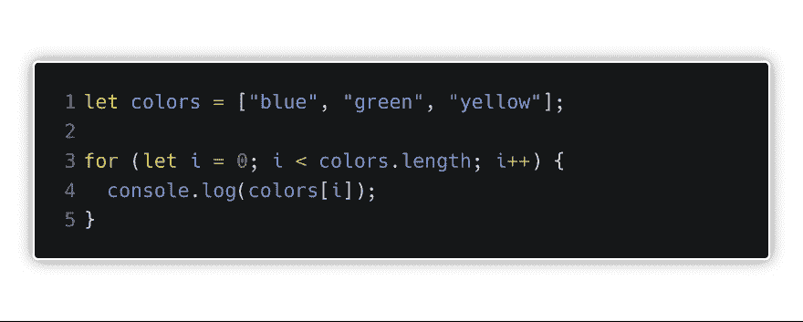](https://res.cloudinary.com/practicaldev/image/fetch/s--D06DyB3E--/c_limit%2Cf_auto%2Cfl_progressive%2Cq_auto%2Cw_880/https://thepracticaldev.s3.amazonaws.com/i/eiqjmylga10if1io67v0.png)

当然，我们得到了数组中所有的颜色。
然后，让我们做同样的事情，只使用来自 ES6、 **forEach** 的消息。

[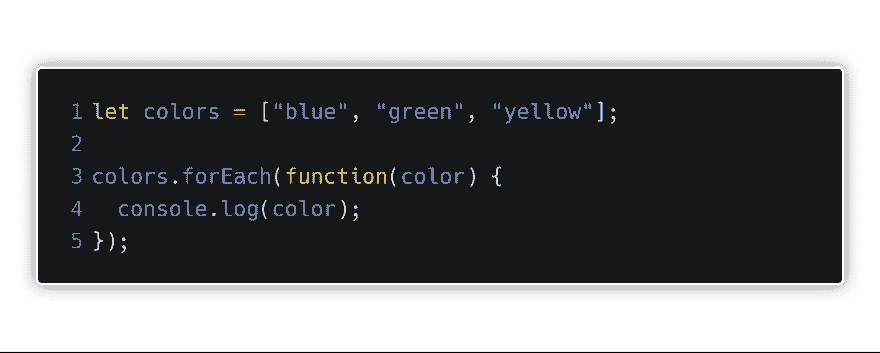](https://res.cloudinary.com/practicaldev/image/fetch/s--DBdAhDp2--/c_limit%2Cf_auto%2Cfl_progressive%2Cq_auto%2Cw_880/https://thepracticaldev.s3.amazonaws.com/i/ae2zt25pl06f9ykuiaky.png)

[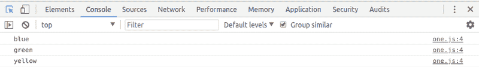](https://res.cloudinary.com/practicaldev/image/fetch/s--mgFrDJnd--/c_limit%2Cf_auto%2Cfl_progressive%2Cq_auto%2Cw_880/https://www.2n.pl/ckeditor_assets/pictures/96/content_es6-2.png)

好的，我们收到了同样的。这是成功的一半。另一半是了解这里到底发生了什么，并不复杂。
在数组上调用的 **forEach** 方法带参数，这个参数就是**迭代器函数**。每次执行函数体中的代码时，都会调用该函数。然后，我们的**迭代器函数**也接受一个参数，在我们的例子中是 **color** ，它从数组的第一个值开始，直到最后一个值，都有一个相等的值。按照惯例，这个参数应该具有数组名称的单数形式。
此外，为了运行代码，我们可以在同一级别的其他地方创建**迭代器函数**，并简单地将其传递给 **forEach** 方法。它看起来像这样。

[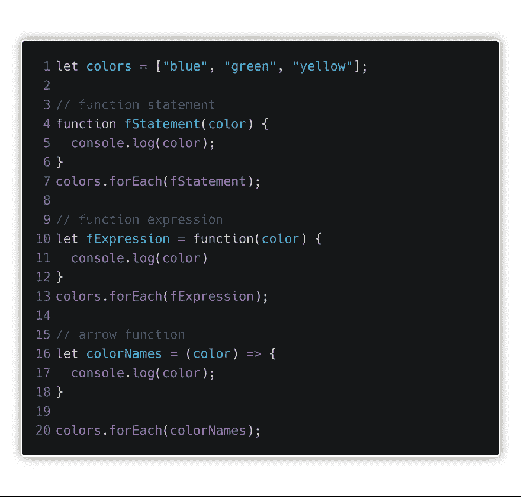](https://res.cloudinary.com/practicaldev/image/fetch/s--2aV26dVf--/c_limit%2Cf_auto%2Cfl_progressive%2Cq_auto%2Cw_880/https://thepracticaldev.s3.amazonaws.com/i/u0pe174x39vyxsfrxd80.png)

[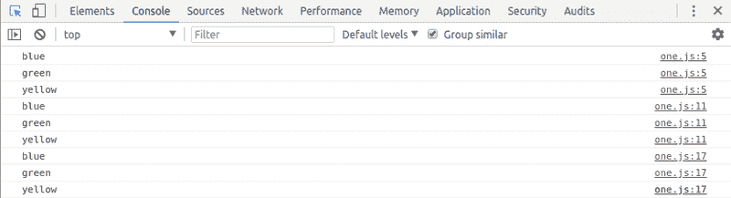](https://res.cloudinary.com/practicaldev/image/fetch/s--9FF4D0PE--/c_limit%2Cf_auto%2Cfl_progressive%2Cq_auto%2Cw_880/https://www.2n.pl/ckeditor_assets/pictures/97/content_es6-3.png)

如你所见，我们已经传递了函数语句、函数表达式和箭头函数。

在使用 **forEach** 方法时，你需要记住的主要事情是，它会改变我们正在迭代的数组。在我们的例子中，如果我们想在数组的每个元素后添加字符串“color ”,会怎么样呢？然后，我们只需将每个保存颜色值的变量与“color”字符串连接起来。因为我们不返回任何东西，而只是修改已经存在的数组，所以在 **forEach** 方法中不需要 return 语句。

## 地图

这个方法和 forEach 有什么不同？主要是在我们完成之后，我们会得到一个新的数组。

[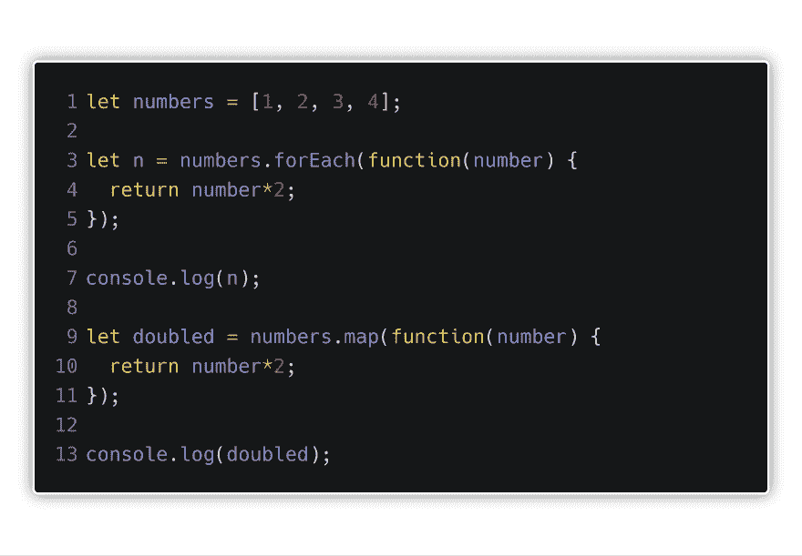](https://res.cloudinary.com/practicaldev/image/fetch/s--LUhvDFXC--/c_limit%2Cf_auto%2Cfl_progressive%2Cq_auto%2Cw_880/https://thepracticaldev.s3.amazonaws.com/i/gb5tyrmeurqa2cz29ohh.png)

[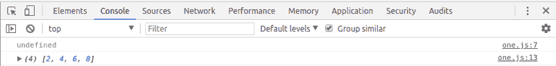](https://res.cloudinary.com/practicaldev/image/fetch/s--63VWjx2Y--/c_limit%2Cf_auto%2Cfl_progressive%2Cq_auto%2Cw_880/https://www.2n.pl/ckeditor_assets/pictures/98/content_es6-4.png)

在上面的例子中，我想同时演示两件事。首先，如你所见，我们使用 **map** 方法的方式与 **forEach** 方法相同。其次，也是更重要的，所以我重复一遍，使用**映射**方法，我们创建了一个全新的数组。当我们想保留数组的旧版本时，这个函数会经常用到。例如，如果数组有一些数字，在一个地方我们希望它们被 2 除，在第二个地方我们希望它们被 3 除。通过使用映射方法，我们保留了旧版本的数组。因为我们正在创建新的数组，所以我们需要在 map 方法中包含 return 语句。

## 滤镜

另一种迭代数组的方法。但是，它用于严格定义的情况。让我们假设我们有一个装满对象的数组。如下例所示。由于这个方法，我们将能够过滤我们迭代的结果。使用 filter 方法要记住的主要事情是，它需要 return 语句，并且只返回满足的条件。

[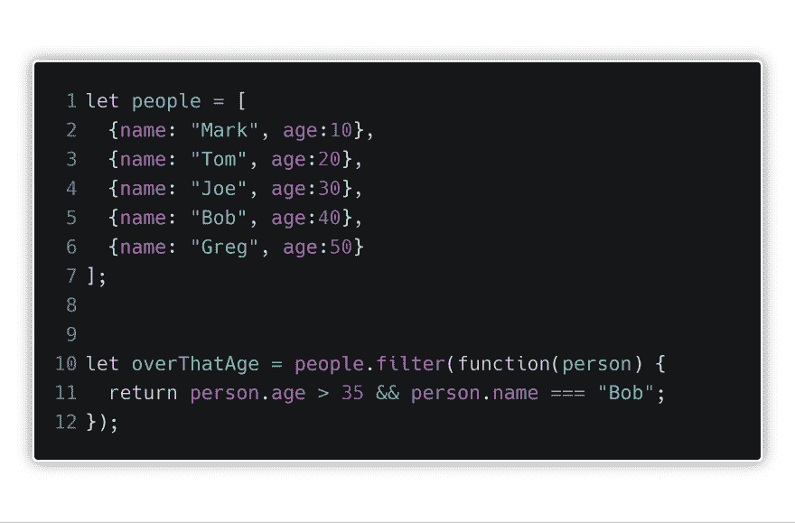](https://res.cloudinary.com/practicaldev/image/fetch/s--5D3bxzmO--/c_limit%2Cf_auto%2Cfl_progressive%2Cq_auto%2Cw_880/https://thepracticaldev.s3.amazonaws.com/i/thijr7utramrc2ce1651.png)

[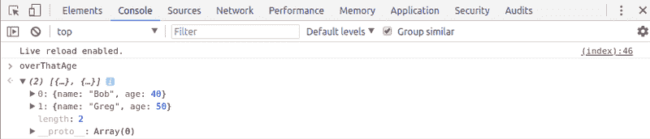](https://res.cloudinary.com/practicaldev/image/fetch/s--yrvbxGLv--/c_limit%2Cf_auto%2Cfl_progressive%2Cq_auto%2Cw_880/https://www.2n.pl/ckeditor_assets/pictures/99/content_es6-5.png)

如你所见，我们快速有效地获得了感兴趣主题的数据。当使用 **filter** 方法时，我们甚至不需要使用 if 语句。此外，我们不必将自己局限于一个条件。如果我们想添加一个条件，使名字等于“**汤姆**”，我们就这样做。

## 找到

**find** helper 方法的目的是遍历一个数组。只要在数组中找到符合给定条件的元素，助手就会返回该记录。这在我们有一个大规模数据库的情况下非常有用，比如说有唯一的 id。因为 id 是唯一的，并且只迭代数据库的一部分比我们可以使用的任何东西都要快，所以找到一个方法，在满足条件时强制迭代停止(我们找到了一个 id)。

[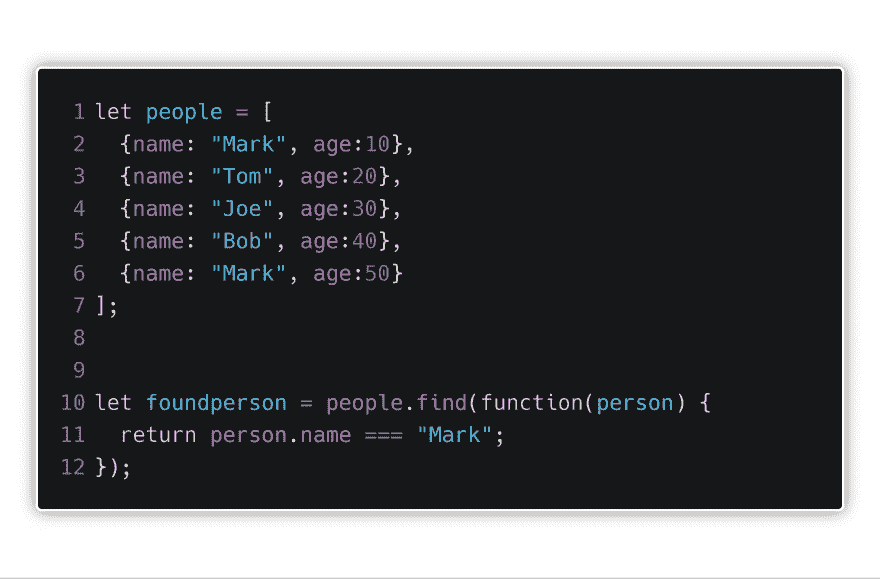](https://res.cloudinary.com/practicaldev/image/fetch/s--0oH_8yAo--/c_limit%2Cf_auto%2Cfl_progressive%2Cq_auto%2Cw_880/https://thepracticaldev.s3.amazonaws.com/i/9d8hymk6flyqo21v21l8.png)

[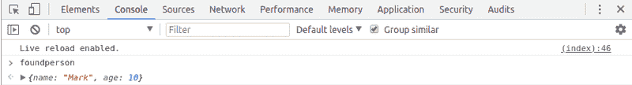](https://res.cloudinary.com/practicaldev/image/fetch/s--uJQRuKM4--/c_limit%2Cf_auto%2Cfl_progressive%2Cq_auto%2Cw_880/https://www.2n.pl/ckeditor_assets/pictures/100/content_es6-6.png)

我们对上一个例子中的数组做了一点改动，用另一个**标记**替换了**格雷格**。正如您在这里看到的，使用该方法的方式是相同的。使用 **find** 方法时，唯一需要记住的是，当 JavaScript 引擎遇到第一个返回 true 的值时，它将停止进一步迭代。所以最末尾的第二个**标记**不会包含在返回值中。此外，返回了整个对象，而不是像在 **filter** 方法中那样是一个数组。

## 每一个/一些

[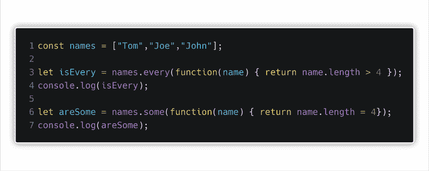](https://res.cloudinary.com/practicaldev/image/fetch/s--6F6e5BHr--/c_limit%2Cf_auto%2Cfl_progressive%2Cq_auto%2Cw_880/https://thepracticaldev.s3.amazonaws.com/i/2uxyuai6lr4yjkvk491e.png)

[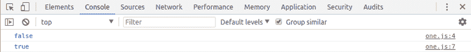](https://res.cloudinary.com/practicaldev/image/fetch/s--UTsC4MgN--/c_limit%2Cf_auto%2Cfl_progressive%2Cq_auto%2Cw_880/https://www.2n.pl/ckeditor_assets/pictures/101/content_es6-7.png)

如您所见，每个方法和某些方法返回的值都是布尔型的。对于每个方法，如果所有内容都符合条件，则值为 true。到了 **some** 方法，一个值会和条件匹配就够了。你可能已经知道了，我们用它来检查我们检查的条件是否会返回 true。

## 减少

[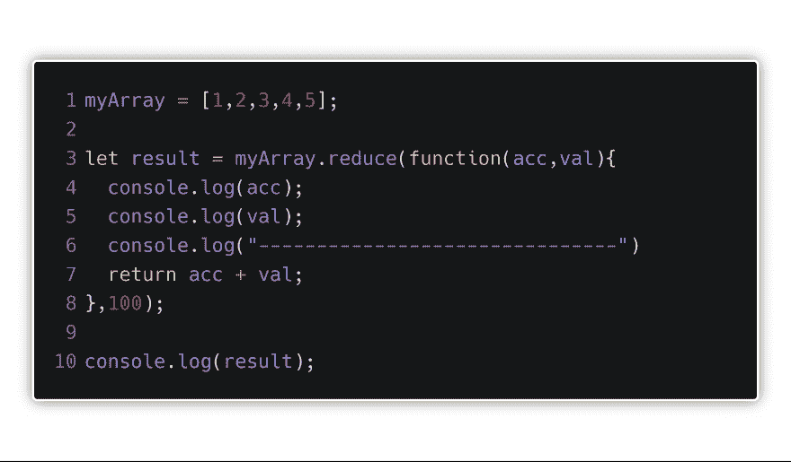](https://res.cloudinary.com/practicaldev/image/fetch/s--4twRTlpY--/c_limit%2Cf_auto%2Cfl_progressive%2Cq_auto%2Cw_880/https://thepracticaldev.s3.amazonaws.com/i/k3jqh6tetab4waysdrmj.png)

[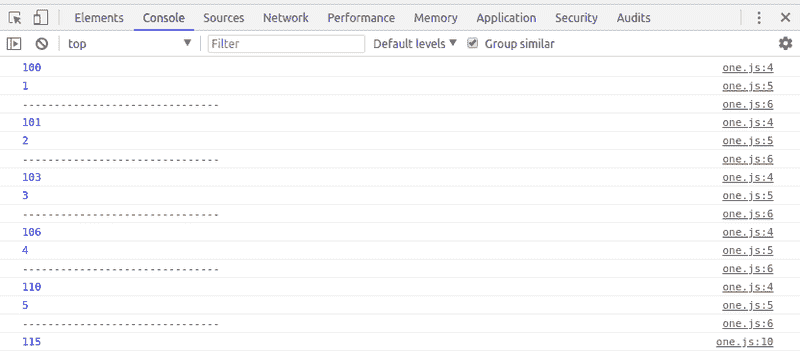](https://res.cloudinary.com/practicaldev/image/fetch/s--yTlE1-qF--/c_limit%2Cf_auto%2Cfl_progressive%2Cq_auto%2Cw_880/https://www.2n.pl/ckeditor_assets/pictures/102/content_es6-8.png)

解释 reduce 的最好方式是一个向数组中添加值的例子。 **reduce** 方法有两个参数。第一个是前面例子中的**迭代器函数**。第二个是我们可以设置的初始值。正如你在上面的例子中看到的，我们将初始值设置为 **100** ，并将所有元素添加到其中。

最后，我想再说一点。不难看出，旧语法是用来创建函数的。在这里，我鼓励每个人尝试并替换一切，以便一切都按照 ES6 标准工作。

在下一篇文章中，我们会发现什么是析构，敬请期待。:)