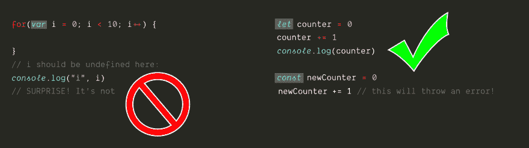
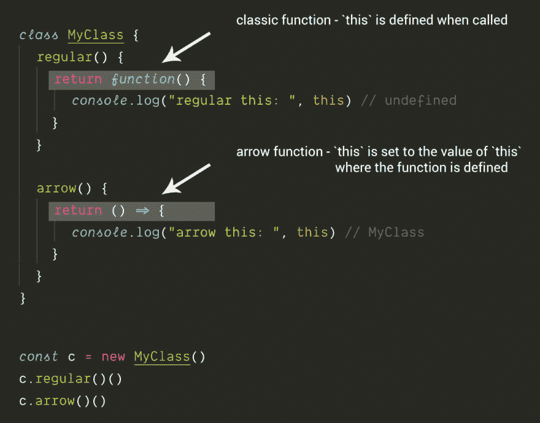
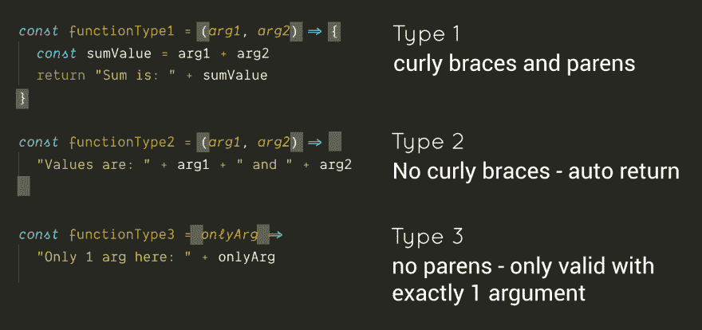
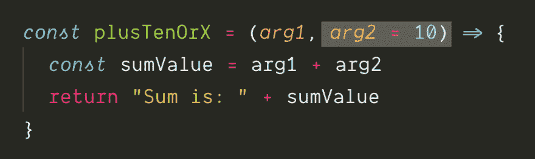
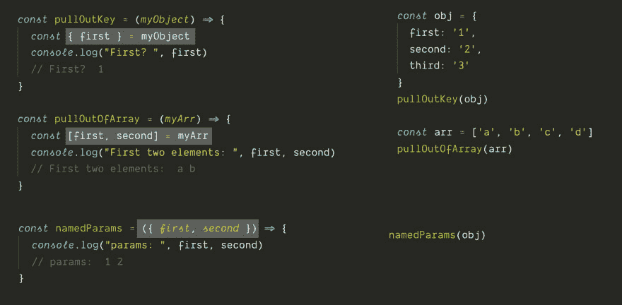
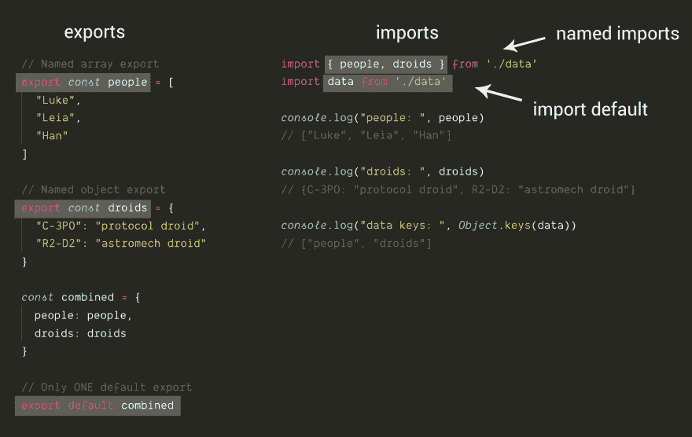
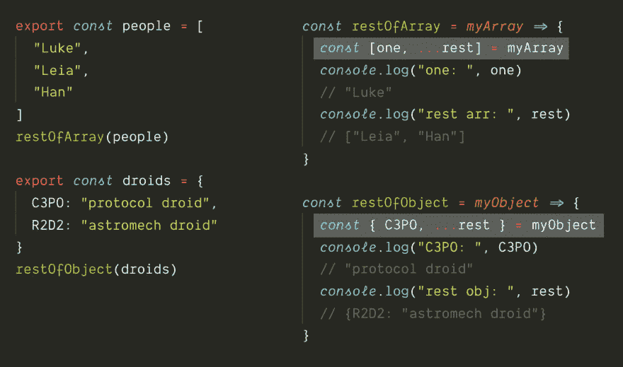
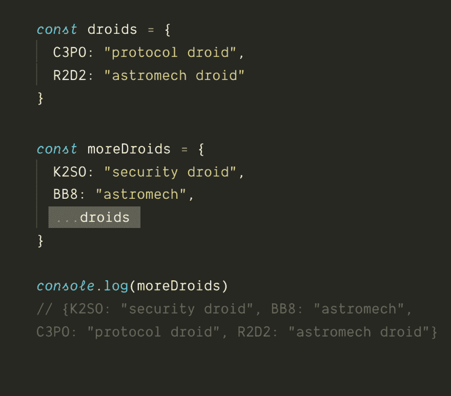
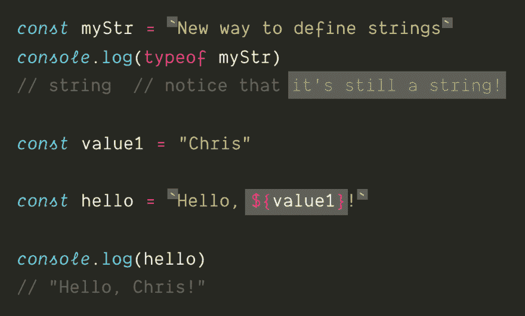
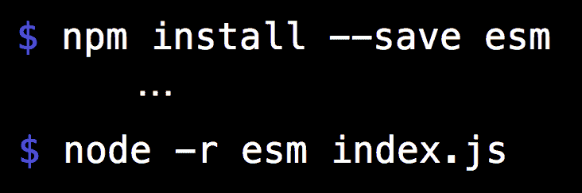

# ES6 迷你速成班:如何编写现代 JavaScript

> 原文：<https://dev.to/chrisachard/es6-mini-crash-course-javascript-can-actually-be-fun-to-write-3b9l>

*这最初是作为 Twitter 帖子发布的:[https://twitter.com/chrisachard/status/1169223691122749440](https://twitter.com/chrisachard/status/1169223691122749440)T3】*

想像心智健全的人一样写 javascript？

🔥这是专为你准备的迷你速成班🔥

ES6+ JavaScript 实际上写起来很有趣！

(结尾的 codesandbox 链接)

# 1。

var 死了。不要用 var。😐

(为什么？词法范围)

如果变量会改变，使用`let`

如果变量不变，使用`const`

# 2。

箭头功能自动绑定`this`

所以在 95%的情况下，它会是你认为它应该是什么样的

# 3。

如果您关闭箭头函数的{}，它会自动返回

如果只有一个参数，可以不使用参数周围的()

不同的语法可能有点混乱，但是你很快就会习惯

# 4。

现在，您可以为函数参数定义默认值。

超级得心应手！🎉

# 5。

通过析构赋值，你可以从对象或数组中取出特定的值

也常用在函数签名中——现在你可以有命名参数了！🎉🎉

# 6。

导出和导入模块有了新的语法

您可以从一个模块中导出单个默认值和任意数量的命名值

(注意使用析构赋值来导入命名值！)

# 7。

用三个点`...`获得对象或数组中的“剩余”值

(又名`rest`操作员)

# 8。

三个点也可以用来将一个对象或数组扩展成一个新的对象或数组

这被称为`spread`操作符

(是——三个点既是`rest`又是`spread`。它们是不同的，尽管概念上是相似的)

# 9。

现在反斜线可以用来包装字符串，被称为“模板文字”

在反斜线内，你可以使用`${}`来做字符串插值！

这比说:`"Hello " + name + "!"`要容易得多

# 10。

现在大多数浏览器都支持这些特性！🎉

(IE 除外😐)

除了 ES6 模块之外，大部分都可以在 node 中工作，但是有一种方法可以解决这个问题👇

# 11。

好吧，但是为什么 ES6+ JS 更好？

*   let/const 范围正确
*   ()=> {}正确绑定`this`
*   析构赋值，...休息和伸展节省了大量的打字时间

简而言之:它消除了黑客攻击，做了你认为应该做的事情，更少的输入意味着更少的错误。

呜！🎉

# 12。

以下是 codesandbox 链接，您可以浏览:

var/let/const
https://codesandbox.io/s/es6-var-let-const-xz50k?fontsize=14

箭头功能
[https://codesandbox.io/s/es6-arrow-function-gye29?fontsize=14](https://codesandbox.io/s/es6-arrow-function-gye29?fontsize=14)

析构赋值
[https://code sandbox . io/s/es6-析构赋值-3cv3b？fontsize=14](https://codesandbox.io/s/es6-destructuring-assignment-3cv3b?fontsize=14)

进口/出口
[https://codesandbox.io/s/es6-import-export-2q3px?fontsize=14](https://codesandbox.io/s/es6-import-export-2q3px?fontsize=14)

rest/spread & template literals
[https://code sandbox . io/s/es6-rest-spread-template-literals-puli 0？fontsize=14](https://codesandbox.io/s/es6-rest-spread-template-literals-puli0?fontsize=14)

这个迷你速成班写起来很有趣！我希望你喜欢读它😁

如果您喜欢，您可以通过以下方式找到更多信息:

*   在推特上关注我: [@chrisachard](https://twitter.com/chrisachard)
*   加盟快讯:[chrisachard.com](https://chrisachard.com/)

感谢阅读！