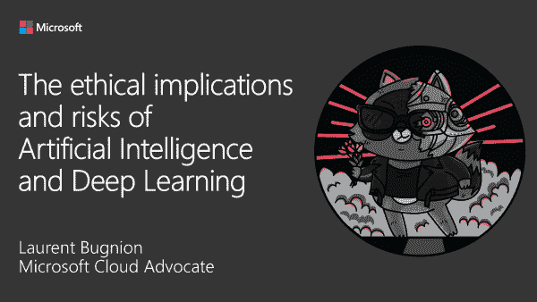

# 人工智能中的伦理，视频录制的演讲

> 原文：<https://dev.to/azure/ethics-in-artificial-intelligence-a-talk-recorded-in-video-bdm>

在过去的几周里，我真的很高兴谈论一个让我关注了很长时间的话题，自从我开始阅读科幻小说并面临先进技术总是带到舞台前面的道德冲突以来。

> 为了在这个演讲的更多部分以及我准备的其他演讲发表时得到通知，[请订阅我的 YouTube 频道。](http://gslb.ch/d94b)

在演讲中，我提到了一个简单的例子:想象一辆自动驾驶汽车必须决定它是应该左转杀死一个人，还是右转杀死我们 10 个人。现在想象左边的那个人是个孩子。一台机器怎么能做出这种决定？早些时候，这种道德问题只是一个理论问题(例如参见艾萨克·阿西莫夫的机器人定律)。但是现在我们需要以一种更加实际的方式来思考这些问题。我们现在拥有运行人工智能模型的数据和能力，我们必须处理各种伦理问题。

我们目前面临的主要问题是数据中的偏差。这个演讲详细解释了什么是偏见，以及它是如何潜入人工智能模型的。我们还讨论了一些与人工智能相关的其他伦理问题，并探索了一些改善这种情况的方法。最后，我们以几个积极的例子结束，人工智能促进了包容性和多样性，并表明我们不应该放弃人工智能，而是应该尽最大努力使用它来实现更大的利益。

为了方便观众，我把 45 分钟的演讲分成了 7 部分，每部分 3 到 7 分钟。我已经发表了第 1 到第 5 部分，其余的将在接下来的几天里发表。希望这个演讲对你有用！如果你喜欢它，请订阅我的 YouTube 频道。

观影愉快！
洛朗