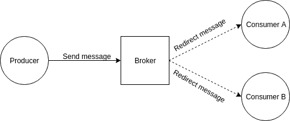

# 事件驱动架构解释

> 原文：<https://dev.to/buildly/event-driven-architecture-5el8>

互联网上的大多数应用程序都是同步工作的，但这在过去几年里发生了迅速的变化，特别是因为物联网、无人驾驶汽车等。同步应用程序接收执行一个动作的请求，参与者等待直到所有事情都完成，他/她等待响应。然而，有些情况下，我们不需要等待响应，而只需发送一个请求。当你只是想通知一些事情或者触发一个过程，并且如果一切顺利的话，可能在以后检查它的时候，它是非常有用的。

# 概念

事件驱动架构(EDA)通常以代理为中心，因此有一个生成事件/发送消息的生产者，一个接收事件并重定向到消费者的代理，以及一个连接到代理并等待事件的消费者。

## 生产者&消费者

正如上面第一句所解释的，生产者(也称为发布者)是向代理发送消息的应用程序，消费者(也称为侦听器)是连接到代理的应用程序，表示对消息类型感兴趣，并保持连接开放，以便代理可以将消息推送给他们。

## 消息代理

消息代理(也称为集成代理)是一个应用程序/软件，它将消息从生产者的正式消息传递协议转换为消费者的正式消息传递协议。有几个著名的经纪人，像 Redis，RabbitMQ，Kafka 等。

## 消息

如上所述，发布者向代理发送消息，该消息将被所有感兴趣的消费者重定向和接收。消息负载可以是任何东西，但是它们通常被分类为事件和命令。为了澄清，事件用于向消费者传达信息，命令用于要求消费者做事情。

## 协议

例如，我们有 HTTP 和 HTTPS 供 REST APIs 使用，也有一些协议供异步 API 使用。这些是其中的一些:

### AMQP

高级消息队列协议(又名 AMQP)是在应用程序或组织之间传递业务消息的开放标准。它连接系统，为业务流程提供所需的信息，并可靠地向前传输实现其目标的指令。[1]

### MQTT

MQTT 是一种机器对机器/“物联网”连接协议。它被设计成一种极其轻量级的发布/订阅消息传输。它对于需要少量代码和/或网络带宽非常宝贵的远程位置的连接非常有用。[2]

### Websocket

WebSocket 协议支持在受控环境中运行不受信任的代码的客户端与选择加入来自该代码的通信的远程主机之间的双向通信。为此使用的安全模型是 web 浏览器通常使用的基于原点的安全模型。[3]

# 结论

现在，我们对事件驱动架构(EDA)有所了解，它们促进了事件的产生、检测、消费和反应。关于它们的一条外部信息是，它们也是极其松散耦合且分布良好的。我们也知道有各种各样的协议，决定我们应该使用哪一个高度依赖于我们的具体用例和代码库。

# 参考文献

1-[https://www.amqp.org/about/what](https://www.amqp.org/about/what)
2-[http://mqtt.org/](http://mqtt.org/)T5】3-[https://tools.ietf.org/html/rfc6455](https://tools.ietf.org/html/rfc6455)