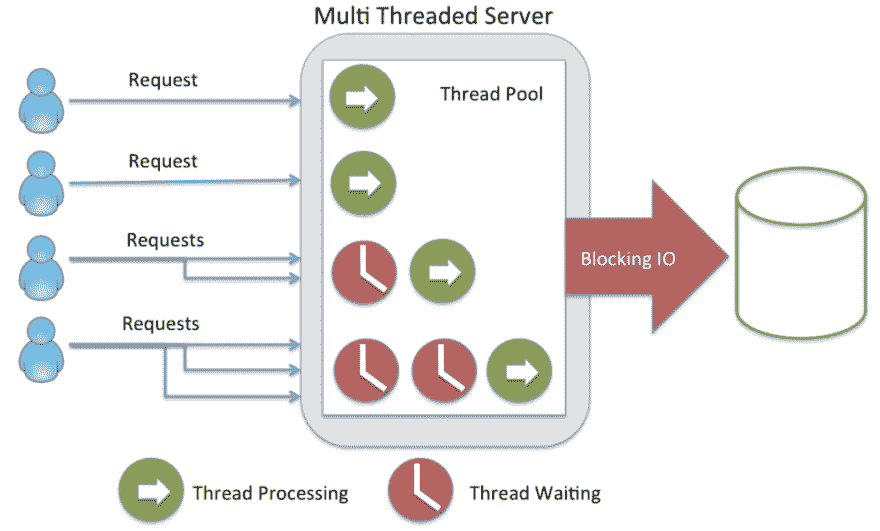
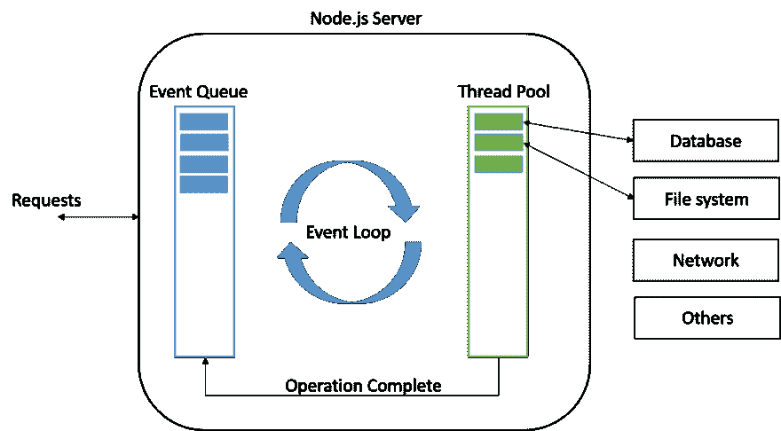
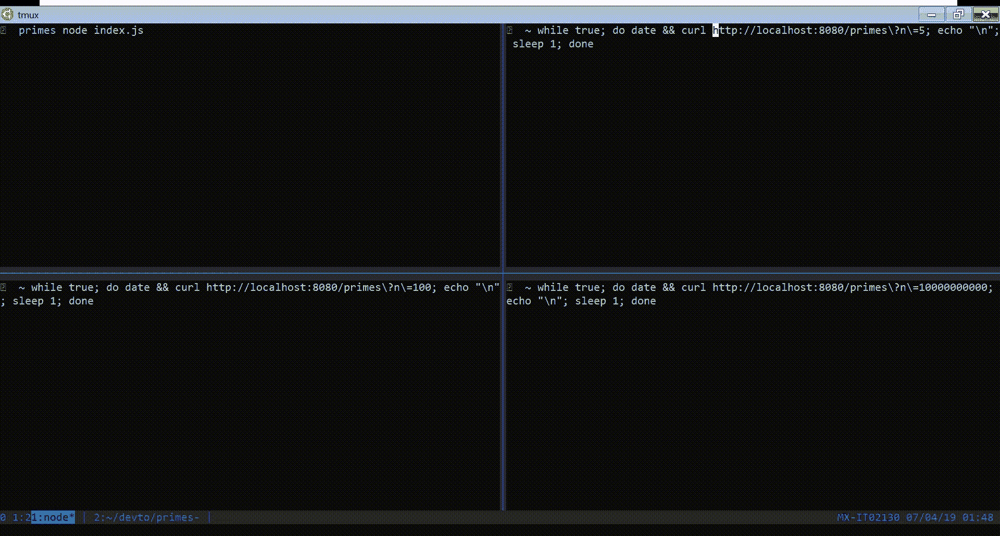
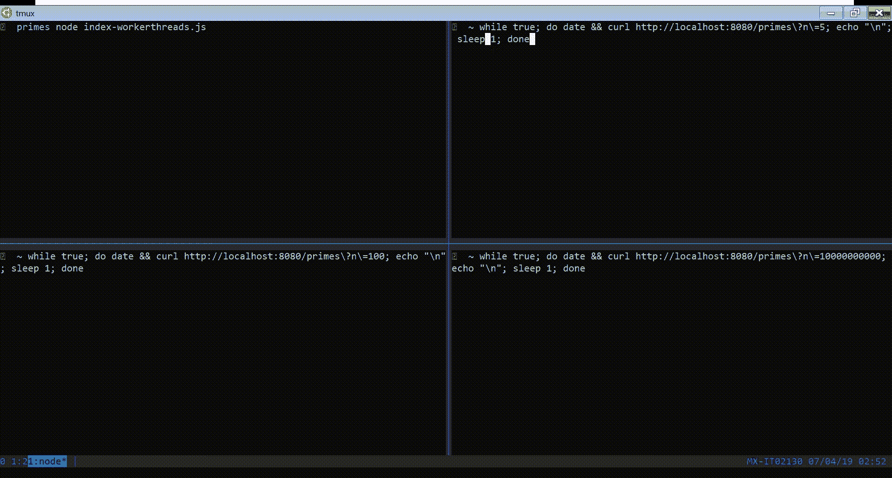

# 关于 Node.js 您需要知道的一切

> 原文：<https://dev.to/jorge_rockr/everything-you-need-to-know-about-node-js-lnc>

Node.js 是当今最流行的构建可伸缩和高效 REST API 的技术之一。它还用于构建混合移动应用、桌面应用甚至物联网。

我已经用 Node.js 工作了大约 6 年，我真的很喜欢它。这篇文章试图成为理解 Node.js 如何工作的终极指南。

我们开始吧！！

## 目录

*   [node . js 之前的世界](#theworldbeforenodejs)
*   [C10K 问题](#thec10kproblem)
*   [Node.js 和事件循环](#nodejsandtheeventloop)
*   [CPU 密集型任务的问题](#theproblemwithcpuintensivetasks)
*   [工作线程](#workerthreads)

### node . js之前的世界

#### 多线程服务器

Web 应用程序是在客户机/服务器模型中编写的，在这种模型中，客户机向服务器请求资源，服务器用资源来响应。服务器只在客户端请求时才响应，并且会在每次响应后关闭连接。

这种模式很有效，因为对服务器的每个请求都需要时间和资源(内存、CPU 等)。为了处理下一个请求，服务器必须完成前一个请求。

所以，服务器一次处理一个请求？不完全是，当服务器得到一个新的请求时，这个请求将由一个**线程**处理。

一个*线程*简单来说就是 CPU 给执行一个小单元指令的时间和资源。也就是说，服务器一次处理多个请求，每个线程一个请求(也称为**每个请求一个线程模型**)。

[](https://res.cloudinary.com/practicaldev/image/fetch/s--cfP_vEC2--/c_limit%2Cf_auto%2Cfl_progressive%2Cq_auto%2Cw_880/https://thepracticaldev.s3.amazonaws.com/i/d0iezqgfkxdfn7x832en.png)

为了同时处理 N 个请求，服务器需要 N 个线程。如果服务器收到 N+1 个请求，那么它必须等待，直到这 N 个线程中的任何一个都可用。

在多线程服务器示例中，服务器一次最多允许 4 个请求(线程),当它收到下 3 个请求时，这些请求必须等待，直到这 4 个线程中的任何一个可用。

解决这个限制的一个方法是给服务器增加更多的资源(内存、CPU 内核等),但也许这根本不是一个好主意...

[](https://i.giphy.com/media/l2Je5zEs6dxDjJGfe/giphy.gif)

当然，也会有技术上的限制。

#### 阻塞 I/O

这里，服务器中的线程数量不是唯一的问题。也许你想知道为什么一个线程不能同时处理两个或更多的请求？这是因为**阻塞了输入/输出操作**。

[](https://i.giphy.com/media/l0HlGM5d0EhzCW12g/giphy.gif)

假设你正在开发一个网上商店，它需要一个用户可以查看你所有产品的页面。

用户访问**[【http://yourstore.com/products】](http://yourstore.com/products)**，服务器从数据库中呈现一个包含您所有产品的 HTML 文件。很简单，对吧？

但是，后面会发生什么呢？...

1.  当用户访问 **/products** 时，需要执行特定的方法或函数来处理请求，因此一小段代码(可能是您的或框架的)解析请求的 url 并搜索正确的方法或函数。**线正在工作。** ✔️

2.  执行方法或函数，以及第一行。线程正在工作。 ✔️

3.  因为您是一个优秀的开发人员，所以您将所有的系统日志保存在一个文件中，当然，为了确保执行正确的方法/函数，您记录了“方法 X 正在执行！!"字符串，那是一个阻塞的 I/O 操作。线程正在等待。 ❌

4.  保存日志并执行下一行。这根线又开始工作了。 ✔️

5.  是时候去数据库获取所有产品了，一个简单的查询比如`SELECT * FROM products`就可以了，但是猜猜会发生什么？这是一个阻塞 I/O 操作。线程正在等待。 ❌

6.  您获得了所有产品的数组或列表，但要确保您记录了它们。线程正在等待。 ❌

7.  对于这些产品，是时候渲染一个模板了，但是在渲染之前，你需要先阅读它。线程正在等待。 ❌

8.  模板引擎完成它的工作，并将响应发送给客户端。这根线又开始工作了。 ✔️

9.  线是自由的，像一只鸟。🕊️

I/O 操作有多慢？嗯，看情况。让我们看看下表:

| 操作 | CPU 时钟周期数 |
| --- | --- |
| CPU 寄存器 | 3 个刻度 |
| 一级缓存 | 8 个刻度 |
| L2 高速缓存 | 12 个刻度 |
| 随机存取存储 | 150 点 |
| 唱片 | 三千万个分笔成交点 |
| 网络 | 2.5 亿分笔成交点 |

磁盘和网络操作太慢。您的系统进行了多少次查询或外部 API 调用？

在 resume 中，I/O 操作会使线程等待并浪费资源。

[](https://i.giphy.com/media/3oz8xIVAN07oNiCqCk/giphy.gif)

### C10K 问题

#### 问题

在 21 世纪初，服务器和客户机速度很慢。问题是在一台服务器上同时处理 10，000 个客户端连接。

但是为什么我们传统的请求线程模型不能解决这个问题呢？好吧，让我们做一些数学。

原生线程实现为每个线程分配大约 **1 MB 的内存，因此仅仅是线程堆栈，10k 线程就需要 **10GB 的 RAM** ，请记住我们是在 21 世纪初！！**

[](https://res.cloudinary.com/practicaldev/image/fetch/s--hPZhGElA--/c_limit%2Cf_auto%2Cfl_progressive%2Cq_auto%2Cw_880/https://thepracticaldev.s3.amazonaws.com/i/ovw0us49heooloaji0vc.jpg)

如今，服务器和客户机比这更好，几乎任何编程语言和/或框架都能解决这个问题。实际上，该问题已经更新为在一台服务器上处理 1000 万个客户端连接(也称为 [C10M 问题](http://c10m.robertgraham.com/p/manifesto.html))。

#### Javascript 来救场？

剧透警报🚨🚨🚨！！
Node.js 解决 C10K 问题...但是为什么呢？！

Javascript 服务器端在 21 世纪初并不新鲜，在 Java 虚拟机上有一些实现，比如 RingoJS 和 AppEngineJS，基于每个请求一个线程的模型。

但是如果这没有解决 C10K 问题，为什么 Node.js 解决了呢？！嗯，是因为 Javascript 是**单线程**的。

[](https://i.giphy.com/media/1L5YuA6wpKkNO/giphy.gif)

### Node.js 和事件循环

#### Node.js

Node.js 是一个建立在 Google Chrome 的 Javascript 引擎(V8 引擎)上的服务器端平台，它将 Javascript 代码编译成机器代码。

Node.js 使用一个**事件驱动的、非阻塞的 I/O 模型**，这使得它变得轻量级和高效。它不是一个框架，也不是一个库，而是一个运行时环境。

让我们写一个简单的例子:

```
// Importing native http module
const http = require('http');

// Creating a server instance where every call
// the message 'Hello World' is responded to the client
const server = http.createServer(function(request, response) {
  response.write('Hello World');
  response.end();
});

// Listening port 8080
server.listen(8080); 
```

#### 非阻塞输入输出

Node.js 是非阻塞 I/O，这意味着:

1.  主线程不会在 I/O 操作中被阻塞。
2.  服务器将继续处理请求。
3.  我们将使用**异步代码**。

让我们写一个例子，在每个`/home`请求中，服务器发送一个 HTML 页面，否则服务器发送“Hello World”文本。要发送 HTML 页面，必须先读取文件。

home.html

```
<html>
  <body>
    <h1>This is home page</h1>
  </body>
</html> 
```

index.js

```
const http = require('http');
const fs = require('fs');

const server = http.createServer(function(request, response) {
  if (request.url === '/home') {
    fs.readFile(`${ __dirname }/home.html`, function (err, content) {
      if (!err) {
        response.setHeader('Content-Type', 'text/html');
        response.write(content);
      } else {
        response.statusCode = 500;
        response.write('An error has ocurred');
      }

      response.end();
    });
  } else {
    response.write('Hello World');
    response.end();
  }
});

server.listen(8080); 
```

如果请求的 url 是`/home`，那么使用`fs`本地模块我们读取`home.html`文件。

传递给`http.createServer`和`fs.readFile`的函数被称为**回调**。这些函数将在未来某个时候执行(第一个函数在服务器收到请求时执行，第二个函数在文件被读取且内容被缓冲时执行)。

在读取文件时，Node.js 仍然可以处理请求，甚至再次读取文件，所有这些都在一个线程中一次性完成...但是怎么做呢？！

#### 事件循环

**事件循环**是 Node.js 背后的魔力，简而言之，事件循环实际上是一个无限循环，并且是唯一可用的线程。

[](https://res.cloudinary.com/practicaldev/image/fetch/s--vJX_GSYs--/c_limit%2Cf_auto%2Cfl_progressive%2Cq_auto%2Cw_880/https://thepracticaldev.s3.amazonaws.com/i/qlv8s9w3qp6vl1x5l4dt.png)

Libuv 是一个实现这种模式的 C 库，它是 Node.js 核心模块的一部分。你可以在这里阅读更多关于 libuv [的信息。](https://nikhilm.github.io/uvbook/introduction.html)

事件循环有六个阶段，所有阶段的执行称为一个**节拍**。

[](https://res.cloudinary.com/practicaldev/image/fetch/s--umvVVfbv--/c_limit%2Cf_auto%2Cfl_progressive%2Cq_auto%2Cw_880/https://thepracticaldev.s3.amazonaws.com/i/akrad3gqk5a4ro7gjdmm.png)

*   **定时器**:该阶段执行`setTimeout()`和`setInterval()`安排的回调。
*   **未决回调**:执行几乎所有回调，关闭回调、定时器调度的回调和`setImmediate()`除外。
*   **空闲，准备**:仅供内部使用。
*   **轮询**:检索新的 I/O 事件；节点将在适当的时候阻塞这里。
*   **检查**:此处调用`setImmediate()`回调，关闭回调:如`socket.on(‘close’)`。

好的，那么只有一个线程，这个线程就是事件循环，但是谁来执行 I/O 操作呢？

专心📢📢📢！！！
当事件循环需要执行 I/O 操作时，它使用池中的操作系统线程(通过 libuv 库),当任务完成时，回调被排队等待在*挂起回调*阶段执行。

[](https://res.cloudinary.com/practicaldev/image/fetch/s--MiV5vPUz--/c_limit%2Cf_auto%2Cfl_progressive%2Cq_auto%2Cw_880/https://thepracticaldev.s3.amazonaws.com/i/xmb5915l0s26zkcrhtu6.png)

是不是很牛逼？

[](https://i.giphy.com/media/dUdRbFp4w22w8/giphy.gif)

### CPU 密集型任务的问题

Node.js 看起来很完美，你想建什么都可以。

让我们构建一个计算质数的 API。

质数是一个大于 1 的整数，它的唯一因子是 1 和它本身。

[](https://res.cloudinary.com/practicaldev/image/fetch/s--_ds2v9xA--/c_limit%2Cf_auto%2Cfl_progressive%2Cq_auto%2Cw_880/https://thepracticaldev.s3.amazonaws.com/i/0ayapnksezp0dumav4vx.jpg)

给定一个数 N，API 必须计算并返回一个列表(或数组)中的前 N 个素数。

primes.js

```
function isPrime(n) {
  for(let i = 2, s = Math.sqrt(n); i <= s; i++)
    if(n % i === 0) return false;
  return n > 1;
}

function nthPrime(n) {
  let counter = n;
  let iterator = 2;
  let result = [];

  while(counter > 0) {
    isPrime(iterator) && result.push(iterator) && counter--;
    iterator++;
  }

  return result;
}

module.exports = { isPrime, nthPrime }; 
```

index.js

```
const http = require('http');
const url = require('url');
const primes = require('./primes');

const server = http.createServer(function (request, response) {
  const { pathname, query } = url.parse(request.url, true);

  if (pathname === '/primes') {
    const result = primes.nthPrime(query.n || 0);
    response.setHeader('Content-Type', 'application/json');
    response.write(JSON.stringify(result));
    response.end();
  } else {
    response.statusCode = 404;
    response.write('Not Found');
    response.end();
  }
});

server.listen(8080); 
```

`prime.js`是质数实现，`isPrime`检查是否给定一个数 N，这个数是质数，`nthPrime`得到第 N 个质数(当然)。

`index.js`创建一个服务器，并在每次调用`/primes`时使用这个库。N 数字通过查询字符串传递。

为了得到前 20 个质数，我们向`http://localhost:8080/primes?n=20`发出请求。

假设有 3 个客户端试图访问这个神奇的非阻塞 API:

*   第一个请求每秒前 5 个素数。
*   第二个请求每秒前 1000 个素数。
*   第三个请求前 10，000，000，000 个素数，但是...

[](https://i.giphy.com/media/Wp1PviELnqJcgjGqcz/source.gif)

当第三个客户端发送请求时，主线程被阻塞，这是因为质数库是 CPU 密集型的。主线程忙于执行密集的代码，不能做任何其他事情。

但是 libuv 呢？如果你记得这个库帮助 Node.js 用 OS 线程做 I/O 操作，以避免阻塞主线程，你是对的，这是我们问题的解决方案，但是要使用 libuv，我们的库必须用 C++语言编写。

Thanksfully Node.js v10.5 引入了**工作线程**。

### 工作者线程

正如[文档](https://nodejs.org/api/worker_threads.html)所说:

> Workers 对于执行 CPU 密集型 JavaScript 操作很有用；不要将它们用于 I/O，因为 Node.js 用于异步执行操作的内置机制已经比工作线程更有效地处理了它。

#### 修复代码

是时候修正我们的初始代码了:

primes-workerthreads.js

```
const { workerData, parentPort } = require('worker_threads');

function isPrime(n) {
  for(let i = 2, s = Math.sqrt(n); i <= s; i++)
    if(n % i === 0) return false;
  return n > 1;
}

function nthPrime(n) {
  let counter = n;
  let iterator = 2;
  let result = [];

  while(counter > 0) {
    isPrime(iterator) && result.push(iterator) && counter--;
    iterator++;
  }

  return result;
}

parentPort.postMessage(nthPrime(workerData.n)); 
```

index-workerthreads.js

```
const http = require('http');
const url = require('url');
const { Worker } = require('worker_threads');

const server = http.createServer(function (request, response) {                                                                                              
  const { pathname, query } = url.parse(request.url, true);

  if (pathname === '/primes') {                                                                                                                                    
    const worker = new Worker('./primes-workerthreads.js', { workerData: { n: query.n || 0 } });

    worker.on('error', function () {
      response.statusCode = 500;
      response.write('Oops there was an error...');
      response.end();
    });

    let result;
    worker.on('message', function (message) {
      result = message;
    });

    worker.on('exit', function () {
      response.setHeader('Content-Type', 'application/json');
      response.write(JSON.stringify(result));
      response.end();
    });
  } else {
    response.statusCode = 404;
    response.write('Not Found');
    response.end();
  }
});

server.listen(8080); 
```

在每个调用中,`index-workerthreads.js`创建一个`Worker`类的新实例(来自`worker_threads`本机模块),以在一个工作线程中加载并执行`primes-workerthreads.js`文件。当质数列表被计算时，触发`message`事件，将结果发送到主线程，并且因为任务已经完成，也触发`exit`事件，让主线程将数据发送到客户端。

`primes-workerthreads.js`一点点变化。它导入了`workerData`(从主线程传递的参数)和`parentPort`，这是我们向主线程发送消息的方式。

现在，让我们再次以 3 个客户端为例，看看会发生什么:

[](https://i.giphy.com/media/h8ymJyTsEZCcbrtDR2/source.gif)

主线程不再阻塞🎉🎉🎉🎉🎉！！！！！

[](https://i.giphy.com/media/amrNGnZUeWhZC/giphy.gif)

它像预期的那样工作，但是像那样产生工作线程并不是最佳实践，创建一个新线程并不便宜。一定要在之前创建一个线程池。

### 结论

Node.js 是一个强大的技术，值得学习。我的建议是永远保持好奇，如果你知道事情是如何运作的，你会做出更好的决定。

伙计们，就这样吧。我希望你学到了一些关于 Node.js.
的新知识。感谢你的阅读，下次❤️.见