# 用无服务器探索宇宙

> 原文：<https://dev.to/azure/explore-cosmos-with-serverless-422o>

在 [Twitter](https://twitter.com/chris_noring) 上关注我，很乐意接受您对主题或改进的建议/Chris

> 你认为这和太空有关，是吗？是我的错:)。但是现在我已经引起了你们的注意，让我们来谈谈无服务器以及我们如何将它与 Azure Cosmos DB 结合使用。这太容易了，简直超出了这个世界；)

[](https://res.cloudinary.com/practicaldev/image/fetch/s--UGatn5iK--/c_limit%2Cf_auto%2Cfl_progressive%2Cq_66%2Cw_880/et.gif)

我们要做的是展示:

*   **无服务器**以及如何在云中创建功能
*   创建一个 Azure Cosmos DB 数据库
*   **展示**如何向 Azure Cosmos DB 读写数据

## 无服务器-看起来 Ma 没有服务器

无服务器是新的黑色，每个人都在谈论它，这是有充分理由的。没有氧气、满是电缆、天知道还有什么的服务器机房的日子已经一去不复返了。

现在，您可以只关注代码，并放心您的代码住在别人的服务器房间；)，那就是*云*。关键是，这已经不是你需要关心的事情了。

当然，无服务器不仅仅是*没有服务器*，它是完全受管理的，甚至没有要配置的 web 服务器。我已经在这篇[文章](https://dev.to/azure/serverless-from-the-beginning-using-azure-functions-azure-portal-part-i-28o1)中介绍了*为什么*和提供什么，所以如果你有兴趣，可以去看看。

我们将专注于一个特定的产品，即 Azure Functions。
本文选择它的原因是:

*   **易于入门**，为所有主要的 ide 提供了强大的扩展，包括 VS 代码，让您可以搭建函数、调试等等。
*   **创建一个到 Azure Cosmos DB 数据库的连接**,这样你就可以专注于改变数据，而不必为连接的实例化而烦恼

## 资源

*   免费帐户 Azure 帐户您需要在 Azure 上注册才能使用 Azure CLI 和部署 Azure 功能
*   [如何安装 azure cli](https://docs.microsoft.com/en-us/cli/azure/install-azure-cli?view=azure-cli-latest&wt.mc_id=devto-blog-chnoring) 对于一些活动，我们将在终端中使用 azure cli。这是管理资源的好方法。
*   在 VS 代码中创建一个 Azure 函数，这将向你展示如何在 VS 代码中构建你的第一个 Azure 函数
*   使用 Azure Cosmos DB + Azure 函数
*   [使用 Azure Cosmos DB 和 Node.js](https://docs.microsoft.com/en-us/azure/cosmos-db/create-sql-api-nodejs?wt.mc_id=devto-blog-chnoring) 本文将带您构建一个 Node.js 应用程序，创建一个 Azure Cosmos DB 应用程序并连接两者。[使用 Azure CLI 创建 Azure Cosmos DB](https://docs.microsoft.com/en-us/azure/cosmos-db/manage-with-cli?wt.mc_id=devto-blog-chnoring)这展示了如何使用 Azure CLI 设置您的 Cosmos DB 数据库[使用 Azure CLI 创建 Azure Cosmos DB+附加资源](https://docs.microsoft.com/en-us/azure/cosmos-db/scripts/create-database-account-collections-cli?toc=%2fcli%2fazure%2ftoc.json?wt.mc_id=devto-blog-chnoring)这展示了在设置 Azure Cosmos DB 之前和期间您可能需要创建的所有不同资源，比上面的链接稍长
*   [我写的无服务器入门系列](https://dev.to/azure/serverless-series-16o8)
*   这是我的同事新美乐股份公司·科廷的一个资源库，展示了如何使用 MongoDB 客户端进行完整的 CRUD
*   GitHub 上的无服务器+ Azure Cosmos DB 参考页面这是关于无服务器+ JavaScript + Azure Cosmos DB 组合的最完整的页面
*   [松弛的网钩](https://slack.com/intl/en-gb/help/articles/115005265063-incoming-webhooks-for-slack)
*   [更好看的带附件的时差消息](https://api.slack.com/docs/message-attachments)

## 步骤

让我们从一英里高的角度来看这个问题，看看我们需要做什么，来完成我们想要的。我们需要:

1.  Azure 中的 Azure Cosmos DB 数据库
2.  **创建**一个无服务器的 app，为每个调用创建一个 Azure 函数。我们展示了如何读取数据、创建数据和更新数据
3.  **配置**我们的功能，连接到我们的数据库，这样使用数据库就变得非常简单

## 创建 Azure Cosmos DB 数据库

好的。有两种方法可以做到这一点。我们可以:

*   通过 Azure CLI 创建 it
*   **使用**门户并创建数据库

让我们先在`Azure-CLI`中演示如何操作，然后逐渐切换到终端。让我们面对它，感觉像一个黑客是很棒的，但有时你想看看你在做什么。你还想确保所有的东西都在那里，而且有些事情在 UI 中做更实际，比如数据输入。

### 使用 Azure CLI

要创建数据库，我们需要采取以下步骤:

1.  **资源组**，为我们的数据库创建一个资源组或使用一个现有的组
2.  Azure Cosmos DB ，创建一个 Azure Cosmos DB 帐户
3.  **数据库**，创建数据库
4.  **添加**集合和数据

**创建资源组**

```
az group create \
    --name mycosmosgroup \
    --location "West Europe" 
```

[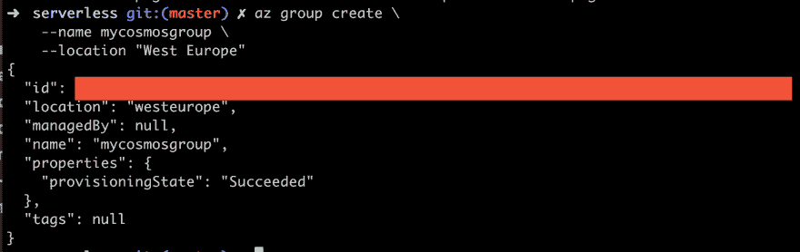](https://res.cloudinary.com/practicaldev/image/fetch/s--lxoP3JKN--/c_limit%2Cf_auto%2Cfl_progressive%2Cq_auto%2Cw_880/https://thepracticaldev.s3.amazonaws.com/i/g2lbhb61ykxj3bw8oqs7.png)

上面写着`"provisioningState": "Succeeded"`，这意味着我们成功地创建了我们的资源组。

创建 Azure Cosmos DB 帐户
下一步是创建我们自己的帐户。帐户名应该是小写的。

```
az cosmosdb create \
    --resource-group mycosmosgroup \
    --name cosmosaccount-chris-sql \
    --kind GlobalDocumentDB \
    --locations "North Europe"=0 "West Europe"=1 \
    --default-consistency-level "Session" \
    --enable-multiple-write-locations true 
```

这可能需要一点时间。所有的数据库都需要一点时间来搭建。

如果您不耐烦，您可以在门户中访问它，它应该看起来像这样:

[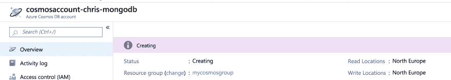](https://res.cloudinary.com/practicaldev/image/fetch/s--LRpgYgzk--/c_limit%2Cf_auto%2Cfl_progressive%2Cq_auto%2Cw_880/https://thepracticaldev.s3.amazonaws.com/i/ipo9zujz20hn7uuloahp.png)

最后一步是创建数据库。

**创建数据库**

好，我们有一个数据库帐户，但我们还没有一个数据库。现在，为了创建一个数据库，我们需要创建一个叫做*容器*的东西。让我们前往门户网站，找到我们的数据库帐户。现在点击标签`Data Explorer`。它现在应该看起来像这样:

[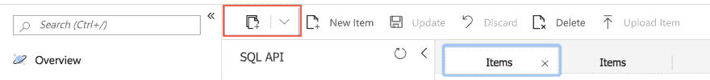](https://res.cloudinary.com/practicaldev/image/fetch/s--DZ4JJoVl--/c_limit%2Cf_auto%2Cfl_progressive%2Cq_auto%2Cw_880/https://thepracticaldev.s3.amazonaws.com/i/lmh3yqezefi6ip1kkdsz.png)

点击指示的按钮，我们会打开一个对话框，要求我们创建一个新的容器，如下所示:

[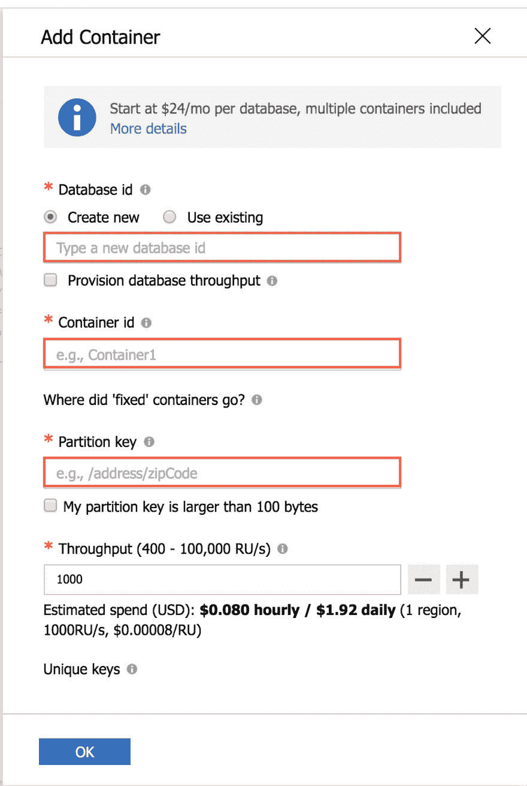](https://res.cloudinary.com/practicaldev/image/fetch/s--pfwwkhBA--/c_limit%2Cf_auto%2Cfl_progressive%2Cq_auto%2Cw_880/https://thepracticaldev.s3.amazonaws.com/i/xad0l96g3oivm5p14cwr.png)

填写突出显示部分的值。您会注意到，`Partition key`将在值前面加上一个`/`，因此`id`变成了`/id`。

我知道你在想什么，分区键到底是什么？让我们看看信息图标告诉我们什么:

[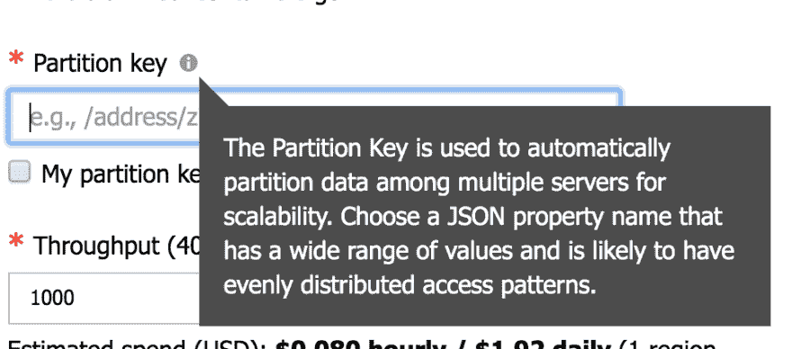](https://res.cloudinary.com/practicaldev/image/fetch/s--MGNkjszu--/c_limit%2Cf_auto%2Cfl_progressive%2Cq_auto%2Cw_880/https://thepracticaldev.s3.amazonaws.com/i/kj781lrr13a32th5eitl.png)

分区本身就是一个章节。如果你真的有兴趣了解更多，现在看看这篇[文章](https://blog.maartenballiauw.be/post/2012/10/08/what-partitionkey-and-rowkey-are-for-in-windows-azure-table-storage.html)
，我们很高兴知道这是我们在表格中指出的一个专栏。

好了，我们创建了我们的容器，我们应该有这样的东西:

[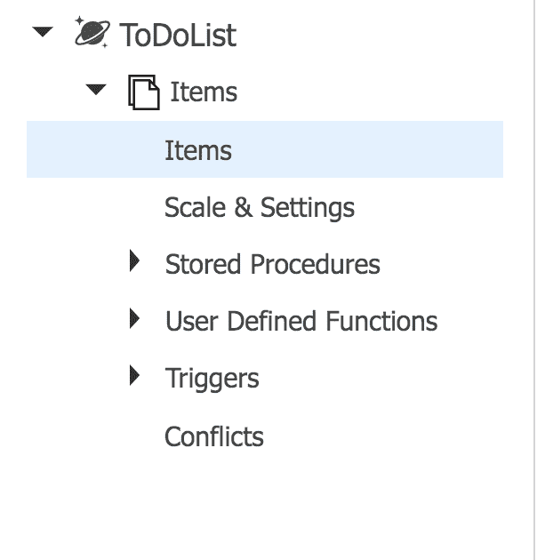](https://res.cloudinary.com/practicaldev/image/fetch/s--s-Rl7cbt--/c_limit%2Cf_auto%2Cfl_progressive%2Cq_auto%2Cw_880/https://thepracticaldev.s3.amazonaws.com/i/6ztcoxyxusf0xmwelaxr.png)

现在怎么办？现在我们用数据填充它，我们通过点击`New Item`按钮来完成。它应该为您呈现一个编辑视图，如下所示:

[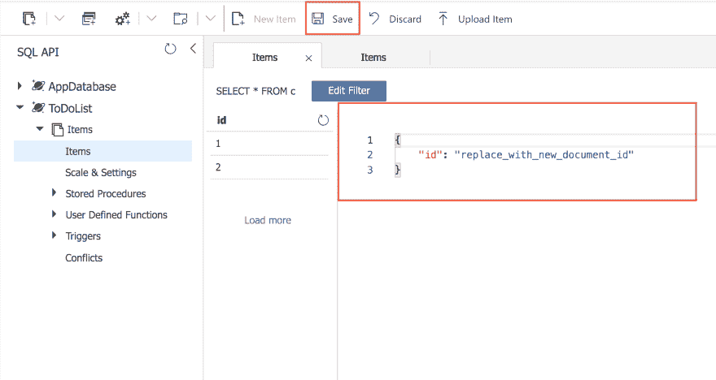](https://res.cloudinary.com/practicaldev/image/fetch/s--KylJI_fB--/c_limit%2Cf_auto%2Cfl_progressive%2Cq_auto%2Cw_880/https://thepracticaldev.s3.amazonaws.com/i/r3gbi4y1f1ljyp8folsx.png)

所以把条目改成:

```
{
  "id": "1",
  "name": "tomato"
} 
```

现在点击`Save`并重复该过程，用值`{ "id": "2", "name": "lettuce" }`创建另一个项目。

我们想在一个无服务器的函数中显示这些数据，对吗？对吗？

嗯，我也这么想:)

所以下一步是无服务器。

## 无服务器——读写我们的数据库

好吧，那就没有服务器了。我们需要支持与 Azure Cosmos DB 数据库的交互

我们将构建以下内容:

1.  一个 Azure 功能应用程序，它将包含我们所有的功能
2.  三个不同的 Azure 函数，每个都支持一个 HTTP 动词
3.  到 Azure Cosmos DB 的绑定，这是我们编写的为我们创建数据库连接的配置

### 打造 Azure 功能 App

为了能够使用 Azure 函数，它们需要存在于 Azure 函数应用程序中。我们将使用 VS 代码创建它，所以我们需要确保我们安装了正确的扩展。

所以在扩展区找`Azure Functions`。它应该是这样的:

[](https://res.cloudinary.com/practicaldev/image/fetch/s--VwPni39C--/c_limit%2Cf_auto%2Cfl_progressive%2Cq_auto%2Cw_880/https://thepracticaldev.s3.amazonaws.com/i/gkl1rs6toru3ilmnti2m.png)

下一步是搭建我们的应用程序。

我们通过打开命令面板来实现这一点。这可以通过选择菜单中的`View > Command Palette`来完成，如果你在 Mac 上，你也可以点击`CMD + SHIFT + P`。

[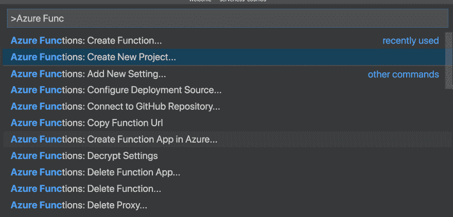](https://res.cloudinary.com/practicaldev/image/fetch/s--NgEf40PS--/c_limit%2Cf_auto%2Cfl_progressive%2Cq_auto%2Cw_880/https://thepracticaldev.s3.amazonaws.com/i/adf6m44bse86yewrzz3z.png)

选择当前目录，JavaScript 作为语言和 HTTP 触发器。最后将确保您的项目至少包含一个函数。将函数命名为`ProductsGet`，并将其命名为`Anonymous`作为授权级别。

### 创建剩余功能

对于这一步，我们需要再次打开命令面板。`CMD + SHIFT + P`。选择`Azure Functions: Create Function`并选择`HttpTrigger`。命名函数`ProductsCreate`。

现在重复这个过程，创建另一个名为`ProductsUpdate`的函数

[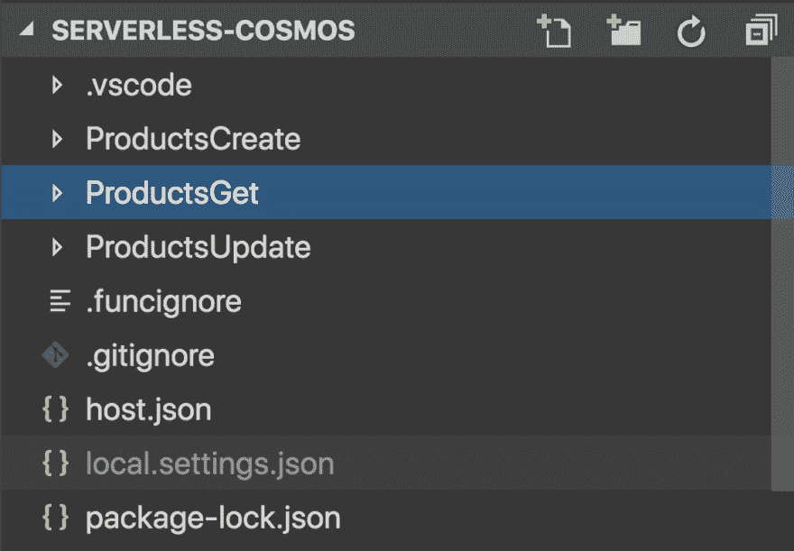](https://res.cloudinary.com/practicaldev/image/fetch/s--mySvQ07Q--/c_limit%2Cf_auto%2Cfl_progressive%2Cq_auto%2Cw_880/https://thepracticaldev.s3.amazonaws.com/i/0w4ytzw2fmft0y23q9sy.png)

我们现在应该为每个函数配置允许的 HTTP 方法。进入每个功能目录，打开`function.json`。在那里你会发现`bindings`和具体的配置如下:

```
"methods":  [  "get",  "post"  ] 
```

请确保按照以下方式进行配置:

*   `ProductsGet`，应该只支持`get`
*   `ProductsCreate`，应该只支持`post`
*   `ProductsUpdate`，应该只支持`put`

### 用 Azure Cosmos DB 配置功能

接下来，我们需要重新查看每个函数的`function.json`。这一次我们需要添加一个绑定，让我们能够与 Azure Cosmos DB 数据库对话。

本质上，我们需要创建一个叫做 *binding* 的东西，它不仅可以连接到我们的 Azure Cosmos DB 数据库，还可以让我们轻松地对特定集合进行 CRUD。

配置看起来很像这样:

```
{
  "name": "productDocument",
  "type": "cosmosDB",
  "databaseName": "ToDoList",
  "collectionName": "Items",
  "createIfNotExists": true,
  "connectionStringSetting": "CosmosDB",
  "direction": "in"
} 
```

根据我们要做的事情，我们要么需要一个`"direction": "in"`的绑定，要么需要一个`out`类型的绑定，在这种情况下，它看起来就像这个`"direction": "out"`。

如果我们只想读取数据，我们需要这个来表示`"direction": "in"`。创造我们需要它来说`"direction": "out"`。更新是另一回事，事实上，我们需要两组绑定，一组检索我们的记录，另一组创建/替换我们的记录，稍后将详细介绍。

所以我们在这里说什么？我们说我们有一个名为`TodoList`的`databaseName`，将其更改为您所称的数据库。我们还有一个名为`Items`的`collectionName`，你可以在 Azure 门户中看到这种情况。我们也将其定义为具有值`in`的`direction`。这意味着这将为我们建立连接，我们得到的任何对象都将包含我们需要的数据。
这里还有一个东西`connectionStringSetting`指向值`CosmosDB`，现在这是我们在 Azure Functions app 项目中设置的 AppSetting。我们还没有把它部署到 Azure，所以我们需要把它存储在某个地方，现在，这个地方在文件`local.settings.json`中。目前应该是这样的:

```
 "IsEncrypted":  false,  "Values":  {  "FUNCTIONS_WORKER_RUNTIME":  "node",  "CosmosDB":  "[connection string to our database]"  }  } 
```

你需要进入门户和我们创建的数据库，点击标签菜单`Keys`并复制字段`Primary Connection String`中的值，然后将其设置为上述键`CosmosDB`的值。

### 附加配置

恐怕我们还没有完成。我们还需要做两件事:

1.  **依赖关系**，设置要安装的依赖关系
2.  **存储账户**，设置一个存储账户

我们通过打开文件`host.json`来解决第一位，并确保它有以下内容:

```
{  "version":  "2.0",  "extensionBundle":  {  "id":  "Microsoft.Azure.Functions.ExtensionBundle",  "version":  "[1.*, 2.0.0)"  }  } 
```

`extensionBundle`的键和值指示 Azure 它应该安装所有需要的库，这样我们就可以与队列、数据库和几乎所有我们可以集成 Azure Function 应用程序作为输入和输出绑定的酷东西进行对话。

我们需要做的第二件也是最后一件事是创建一个存储帐户。我们可以在门户网站中通过点击`Add Resource`，键入`Storage Account`并按照说明进行操作。然后我们需要获得连接字符串，我们需要向文件`local.settings.json`添加一个条目，就像这样:

```
 "IsEncrypted":  false,  "Values":  {  "AzureWebJobsStorage":  "[storage account connection string]",  "FUNCTIONS_WORKER_RUNTIME":  "node",  "CosmosDB":  "[database connection string]"  }  } 
```

### 写一些代码

此时，我们想在我们的`ProductsGet`函数中编写一些代码。所以我们需要编辑`ProductsGet/index.js`来表示如下:

```
module.exports = function (context, req) {
  for(var i =0; i< context.bindings.productDocument.length; i++) {
      let product = context.bindings.productDocument[i];
      context.log('id', product.id); 
      context.log('name', product.name);
  }

  context.res = {
      // status: 200, /* Defaults to 200 */
      body: "Ran ProductsGet"
  };
}; 
```

查看上面的代码，我们看到`context.binding.productDoucment`包含了一个`Items`的列表。我们在代码中迭代这个列表，并打印出`id`和`name`。因为`function.json` :
中这样的配置

```
{  "name":  "productDocument",  "type":  "cosmosDB",  "databaseName":  "ToDoList",  "collectionName":  "Items",  "createIfNotExists":  true,  "connectionStringSetting":  "CosmosDB",  "direction":  "in"  } 
```

我们建立到 Azure Cosmos DB 数据库和特定集合`Items`的连接，并确保创建一个句柄`productDocument`。想象一下，必须自己编写连接数据库的代码，不是很有趣吗？

### 部署并测试

好了，下一步是部署它。要部署它，我们需要做两件事:

1.  **部署 Azure 功能 app** ，这就像在 VS 代码中点击一个按钮一样简单
2.  **将本地应用设置**部署到 Azure，这是为了确保我们在 Azure 中的应用设置正确地指出我们的 Azure Cosmos DB 数据库以及我们的存储帐户。

让我们从部署部分开始。确保在 VS 代码中安装了以下扩展:

[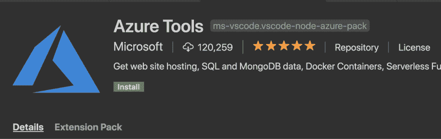](https://res.cloudinary.com/practicaldev/image/fetch/s--xsditmb3--/c_limit%2Cf_auto%2Cfl_progressive%2Cq_auto%2Cw_880/https://thepracticaldev.s3.amazonaws.com/i/k2kwed7fygebkmia7pte.png)

这将使您能够轻松地将任何东西部署到 Azure。我们在本文开始时讨论了另一个扩展，即`Azure Functions`。确保你已经安装了它们，生活会简单很多。

至于部署部分。首先点击
[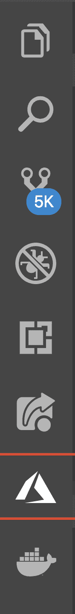](https://res.cloudinary.com/practicaldev/image/fetch/s--ly7eyNfp--/c_limit%2Cf_auto%2Cfl_progressive%2Cq_auto%2Cw_880/https://thepracticaldev.s3.amazonaws.com/i/c8y12pttws3dood1l76d.png) 下方高亮显示的天蓝色图标

然后我们来到这里:

[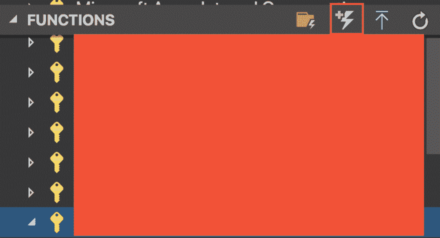](https://res.cloudinary.com/practicaldev/image/fetch/s--KorwJ7An--/c_limit%2Cf_auto%2Cfl_progressive%2Cq_auto%2Cw_880/https://thepracticaldev.s3.amazonaws.com/i/couf0kfd3ilklg8yjzed.png)

右上角显示的是一个看起来像闪光灯的图标。点击该按钮会将应用程序部署到 Azure。

之后，它将成为闪光图标下方列表的一部分。这也是我们重新部署变更的地方。

最后一步是确保我们将所有本地应用设置上传到 Azure。要做到这一点，我们需要谈论我们部署的 Azure 功能应用程序，右键单击它并选择上传它们。它应该是这样的:

[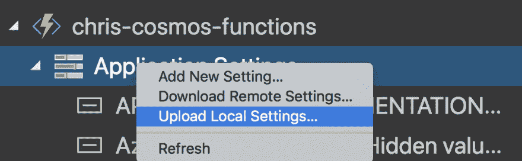](https://res.cloudinary.com/practicaldev/image/fetch/s--guPYWfIH--/c_limit%2Cf_auto%2Cfl_progressive%2Cq_auto%2Cw_880/https://thepracticaldev.s3.amazonaws.com/i/ubjmhjteub624nkmoyi9.png)

此时，应用程序实际上应该可以工作了。因此，让我们前往 Azure 门户并尝试一下:

[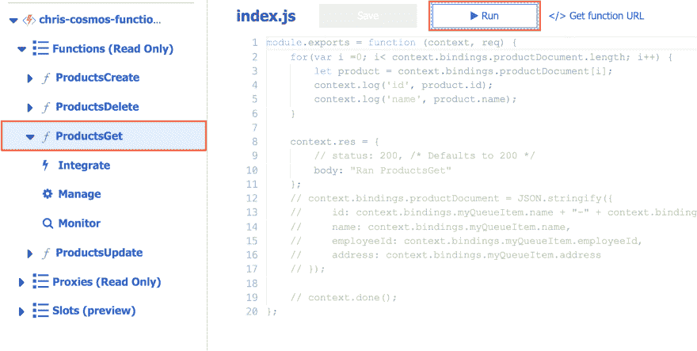](https://res.cloudinary.com/practicaldev/image/fetch/s--HnltsCis--/c_limit%2Cf_auto%2Cfl_progressive%2Cq_auto%2Cw_880/https://thepracticaldev.s3.amazonaws.com/i/fncix588u4dt2bha0l26.png)

只需点击正确的功能`ProductsGet`，然后点击`Run`。这将产生下面的终端窗口，它将打印以下内容:

[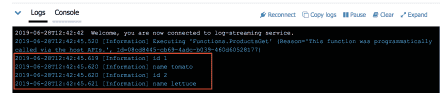](https://res.cloudinary.com/practicaldev/image/fetch/s--gLjREJUC--/c_limit%2Cf_auto%2Cfl_progressive%2Cq_auto%2Cw_880/https://thepracticaldev.s3.amazonaws.com/i/dek7ma9vjobcxf0sl9ue.png)

从上图中可以看出，它正在从 Azure Cosmos DB 数据库中读取数据。

太好了，我们有工作联系了。现在来谈谈剩下的操作。

## 添加剩余操作

到目前为止，我们一直在阅读如何支持这些额外的操作？嗯，我们需要配置每个`function.json`并给它正确的配置类型，当然，我们需要进入每个`index.js`并添加必要的代码来创建或更新。

### 支持创作

到目前为止，我们一直支持如何从数据库中读取数据。我们通过创建一个值为`in`的绑定来实现这一点，我们还需要指出我们的数据库和要读取的集合。

创建东西就是创建一个绑定，其中`direction`的值为`out`。这给了我们一个可以添加数据的句柄。

先说配置部分。在文件`ProductsCreate/function.json`中，我们将以下条目添加到绑定数组中:

```
 {  "name":  "productDocument",  "type":  "cosmosDB",  "databaseName":  "ToDoList",  "collectionName":  "Items",  "createIfNotExists":  true,  "connectionStringSetting":  "CosmosDB",  "direction":  "out"  } 
```

好了，这很好地设置了我们，所以我们可以专注于第二步，添加代码到`ProductsCreate/index.js` :

```
module.exports = function (context, req) {
     const { id, name } = req.body;

    // creating doc
    context.bindings.productDocument = JSON.stringify({
        id: id,
        name: name
    });

    // saving doc
    context.done();
}; 
```

请注意`function.json`中键`name`的配置值如何与`context.bindings.productDocument`匹配。我们接下来要做的是给`productDocument` :
分配一个对象

```
context.bindings.productDocument = JSON.stringify({
  id: id,
  name: name
}); 
```

上面我们正在创建我们想要插入的记录。为了让*真正保存*，我们用命令`context.done()`结束这一切

我们不相信这一点，直到我们尝试它的权利？我们需要做的第一件事是将我们的项目重新部署到 Azure。因为我们已经部署过一次，所以重新部署非常简单。单击左侧面板上的 Azure 扩展，然后右键单击您的 Azure Functions 应用程序项目，并选择`Deploy to Function App`，如下所示:

[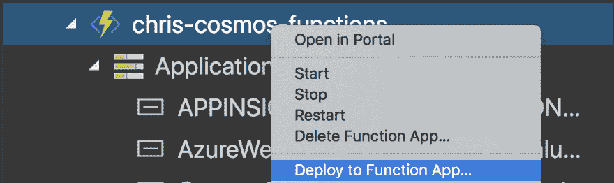](https://res.cloudinary.com/practicaldev/image/fetch/s--2QulwpBR--/c_limit%2Cf_auto%2Cfl_progressive%2Cq_auto%2Cw_880/https://thepracticaldev.s3.amazonaws.com/i/jguzbglb16mmtd12sshb.png)

这将全部重新部署。等待它结束。

> 完成了吗？好的，我们继续

对于这一个，让我们前往 Azure 门户并测试它(您可以使用 cURL 或任何支持发送 REST 调用的客户端)。

在门户中，我们希望选择我们的功能，并单击右侧的`Test`选项卡:

[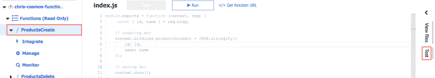](https://res.cloudinary.com/practicaldev/image/fetch/s--Hmb4lgOB--/c_limit%2Cf_auto%2Cfl_progressive%2Cq_auto%2Cw_880/https://thepracticaldev.s3.amazonaws.com/i/chl9ux18riuyeu59yb64.png)

现在输入一个请求，如下所示:

[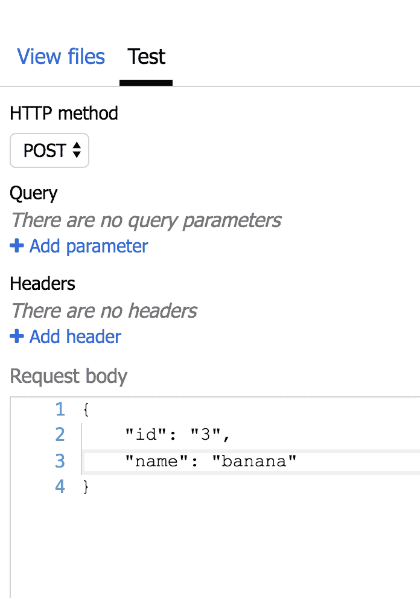](https://res.cloudinary.com/practicaldev/image/fetch/s--HVPcQaCy--/c_limit%2Cf_auto%2Cfl_progressive%2Cq_auto%2Cw_880/https://thepracticaldev.s3.amazonaws.com/i/mpxplv3jzash64tpy0eg.png)

下一步是点击`Run`按钮。我们应该会得到如下结果

[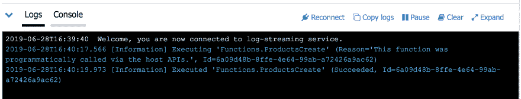](https://res.cloudinary.com/practicaldev/image/fetch/s--x6GTv1Kg--/c_limit%2Cf_auto%2Cfl_progressive%2Cq_auto%2Cw_880/https://thepracticaldev.s3.amazonaws.com/i/dnqc2j91l1t49nhju2he.png)

要真正验证这是否有效，请转到数据库的资源页面，看看是否有第三条记录:

[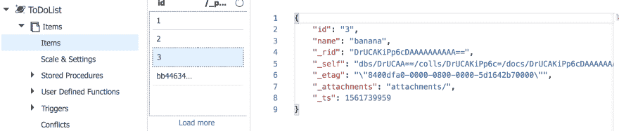](https://res.cloudinary.com/practicaldev/image/fetch/s--7BEXAZSm--/c_limit%2Cf_auto%2Cfl_progressive%2Cq_auto%2Cw_880/https://thepracticaldev.s3.amazonaws.com/i/qqdjwpllrct2w7t0t30d.png)

在那里！:)

创作到此为止，接下来说说更新。

### 支持更新

更新记录是另一回事。我们需要支持两个绑定。你为什么这么问？

嗯，我们需要一个类型为`in`的绑定，这样我们就可以检索我们需要的记录。

然后我们需要第二个`out`绑定来实际上*替换*记录。

> 嗯好吧，给我看看

好的，首先是绑定，它们应该是这样的:

```
{  "name":  "productDocument",  "type":  "cosmosDB",  "databaseName":  "ToDoList",  "collectionName":  "Items",  "createIfNotExists":  true,  "connectionStringSetting":  "CosmosDB",  "direction":  "out"  },  {  "name":  "productDocumentsIn",  "type":  "cosmosDB",  "databaseName":  "ToDoList",  "collectionName":  "Items",  "createIfNotExists":  true,  "connectionStringSetting":  "CosmosDB",  "direction":  "in"  } 
```

现在来看代码:

```
module.exports = function (context, req) {
    const {
        id,
        name
    } = req.body;

    // or you could limit the in to only be one doc
    const foundDoc = context.bindings.productDocumentsIn.find(p => p.id == id);

    // do the update
    context.bindings.productDocument = foundDoc;
    context.bindings.productDocument.name = name;

    context.done();

    context.res = {
        // status: 200, /* Defaults to 200 */
        body: "Record updated"
    };
}; 
```

我们可以看到，我们首先从输入绑定`productDocumentsIn`中检索记录，并将其赋给变量`foundDoc`。接下来我们要做的是将`foundDoc`分配给我们在`context.bindings.productDocument`上找到的`out`句柄。我们这样做是为了确保我们不会丢失该记录中的任何值，或者主体中的值仅代表部分更新。接下来我们要做的是使用`body`附带的`name`并应用它，就像这样`context.bindings.productDocument.name = name`，当然我们用`context.done()`结束它。

就是这样，这就是我们支持更新的方式。

## 总结

我们从创建 Azure Cosmos DB 数据库开始。然后我们放一些数据进去。接下来，我们创建了一些无服务器函数。此后，我们学习了*绑定*,以及在创建与数据库的连接时如何节省时间。多亏了绑定，我们最终只编写了很少的代码来支持读写。

你也试试这个怎么样？:)