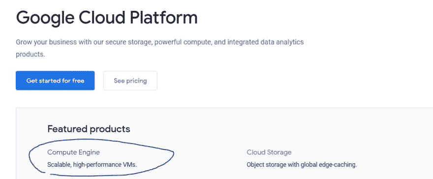

# 探索谷歌云平台

> 原文：<https://dev.to/buphmin/exploring-google-cloud-platform-1e6i>

声明:这真的不是一个教程，更多的只是我做的一些事情和我的想法。

所以在这里，我将介绍一下我对谷歌云平台(简称 GCP)的学习和使用。这篇文章大致总结了我用 GCP 的数据库创建一个基于 docker 的 web 服务器所做的工作。

# 背景

所以不久前，我为了好玩，建了一个梦幻足球选秀网站。我使用 Symfony 框架和 Aurelia 用 PHP 构建了它。托管是在 1&1 完成的，总的来说我不满意。性能是 meh，php 和 websockets 不是很好，我对服务器的控制很少。第二年，我着手重写了整本书。这次我用 node 和 Adonis 和 Vue 在 AWS 上托管。性能飞速提升，几乎所有的 API 调用都在 100 毫秒内返回(这是最佳点),我还拥有用于实时通知的 web 套接字。AWS 工作得很好，但在对一个没有流量的网站进行测试后，它变得非常昂贵(相对而言)。所以现在我正在尝试 GCP，看看我是否喜欢它。

# 入门

第一步当然是在 GCP 开一个账户。这很简单，因为它只是链接到你的谷歌账户。

接下来是启动虚拟机。对于我的使用，我将只使用 docker 来运行网站，因为 docker 使管理开发/测试/生产服务器配置和本地开发变得容易。浏览产品列表，很明显我需要的是计算引擎。

# 制作虚拟机

一旦你得到你的帐户，你可以进入 GCP 控制台，从那里得到计算引擎是很容易的。创建一个虚拟机很简单，你可以选择你想要它在哪里，以及它有多强大。对我来说，我只是玩玩，所以一个微实例就足够了。现在，因为我计划只在 docker 的服务器上运行，所以我选择了“容器优化操作系统”。

# 集装箱登记

因为我使用 docker 和 containers，所以我需要一个安全的地方来存储我的图片。幸运的是，GCP 使得创建你自己的注册表和从中推/拉变得很容易。只需遵循[文档](https://cloud.google.com/container-registry/docs/quickstart)即可。

# 联网

得到正确的网络产品需要多一点努力，但我最终发现 VPC 是我需要的。在后视中使用 VPC 非常容易，但是由于我选择的虚拟机镜像，我遇到了很多问题。我想要的是阻止所有不是来自我的连接。创建一个以我的 ip 为过滤器的防火墙规则非常有效。

### 天堂里的烦恼

我仍然不知道到底出了什么问题，但是选择容器优化操作系统(chromium os)给我带来了各种各样的问题。基本上我 ssh-进入服务器，运行 docker 拉我的图像，然后 docker 运行-网络主机，无论如何我都无法访问该网站。我想可能是 docker 出了什么问题，所以我甚至加载了一个 Go binary 裸机“hello world”网站。运行二进制文件导致“权限被拒绝”。然后，我给了上述可执行文件 777 权限作为健全检查(打算恢复)，但仍然“权限被拒绝。”Sudo 运行，但仍被拒绝。在那一点上，我放弃了虚拟机，创建了一个新的最小的 ubuntu 并安装了 docker。从那以后一切都很好。_(ツ)_/

# 创建 MySQL 实例

GCP 有几种不同的数据库和数据库服务。经过一番研究，他们的云 SQL 产品正是我所需要的。它允许你创建一个 MySQL 或 Postgres 数据库。创建它的过程很简单，类似于创建计算引擎虚拟机。我喜欢的一点是，它可以加载和运行存储在平台上的 SQL 文件。按照文档/工具提示/帮助链接，我上传了一个小脚本来创建我的表和 foo 数据。非常有效。

将 web VM 链接到 MySQL 实例非常容易，通过快速编辑，我可以限制谁可以访问服务器。

# 与 AWS 的比较

让我们来看看 GCP 与 AWS 相比如何。

赞成的意见

*   更清晰的文档
*   总体设置更简单

骗局

*   AWS 更容易调试问题
*   AWS 性能在响应时间上似乎稍高(暂定)

最终，两者之间的设置非常相似，因此 GCP 看起来更容易，因为我已经使用过类似的产品。

# 结论

到目前为止，我喜欢 GCP。一切都很容易使用和设置，除了那个奇怪的虚拟机镜像仍然让我困惑。这些文件信息丰富，真正有帮助。我将不得不更多地使用它，以便给出一个更好的评估，但迄今为止，它已经得到了我的赞许。