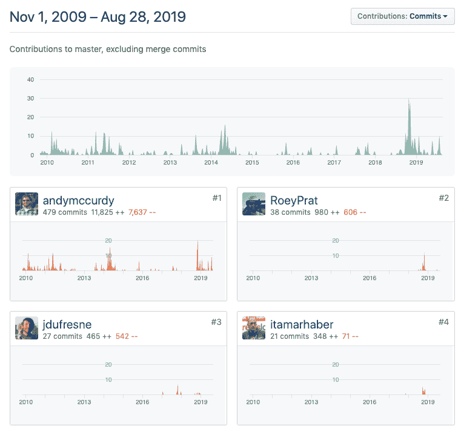
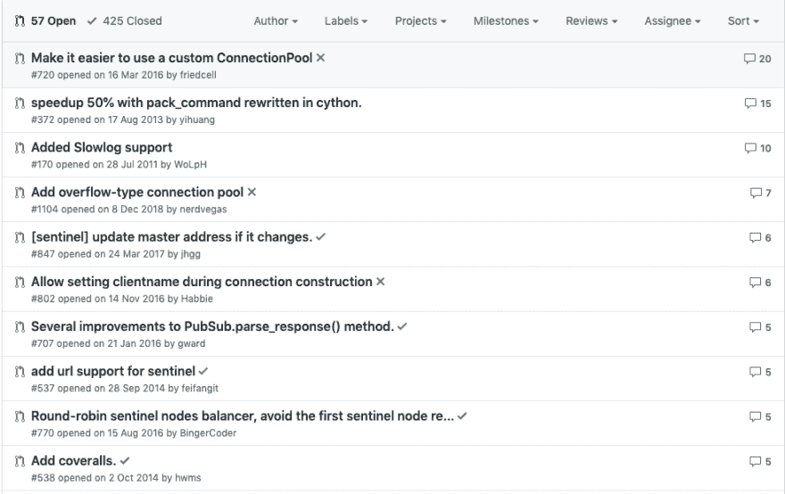
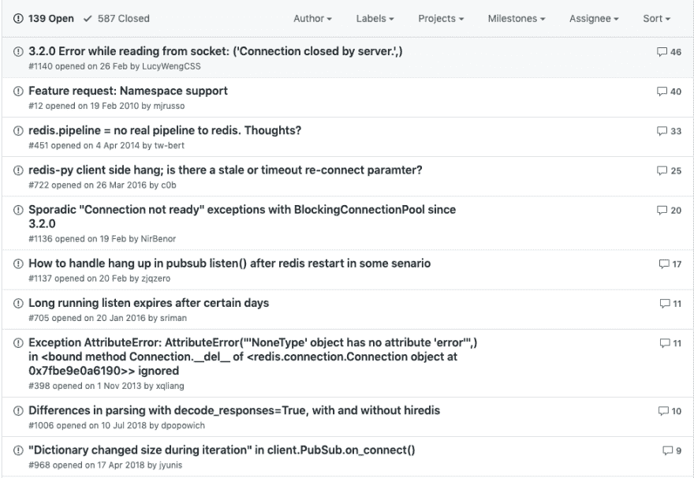

# 探索开源架构

> 原文：<https://dev.to/theodesp/exploring-open-source-architectures-redis-py-3en6>

[**阅读原文**](https://codethat.today/tutorial/open-source-architectures-redis-py/part-one/)

根据定义，开源软件是开放的，可以检查、修改和贡献。这仅仅创造了一个繁荣的社区和生态系统，在学者、企业和个人之间进行分享和合作。

如今，世界上最大的组织依赖开源软件进行日常运作。他们中的许多人还通过开源他们的内部工具和创造更多的有用性，将它带入了一个新的层次。一些多产的例子包括阿帕奇·卡珊德拉和 T2·卡夫卡。

在这个系列中，我们将探索流行的和真实的开源项目，谈论它们的历史，并看看它们的架构。我们旨在帮助未来的贡献者或感兴趣的各方，更好地理解它们的结构，它们的用法，逻辑，推理和它们的局限性。毕竟，如果软件有权利长期存在，它就意味着可读和可维护。

让我们从一个非常有趣的项目开始我们的系列，它是 redis-py，这是一个 Redis Python 客户端。在第一部分，我们将浏览项目文档，结构和 git 历史和问题。在接下来的部分，我们将更详细地介绍如何安装和使用它，代码结构和分析，如何测试和如何贡献。

让我们开始吧。

## 概述

该项目在 [Github](https://github.com/andymccurdy/redis-py) 上列出。它也在 [PyPi 包索引](https://pypi.org/project/redis/)中列出，最新版本是 2019 年 8 月 19 日发布的 3.3.8。

Github repo 拥有超过 7800 颗星星，这非常好，它由安迪·麦科迪维护。

[](https://res.cloudinary.com/practicaldev/image/fetch/s--fSNS4ekJ--/c_limit%2Cf_auto%2Cfl_progressive%2Cq_auto%2Cw_880/https://thepracticaldev.s3.amazonaws.com/i/19xn0t08ilvuivxek9oh.png)

## 文档

这些文档被列在一个 [readthedocs repo](https://redis-py.readthedocs.io/en/latest/) 中，尽管这是一个很大的参考页面，所以读起来很生涩。大多数官方文档位于[自述文件](https://github.com/andymccurdy/redis-py/blob/master/README.rst)中。

[](https://res.cloudinary.com/practicaldev/image/fetch/s--PSAIHqSU--/c_limit%2Cf_auto%2Cfl_progressive%2Cq_auto%2Cw_880/https://thepracticaldev.s3.amazonaws.com/i/x9snv4u3qx47nuu3glaq.png)

总的来说，文档是广泛的，但如果我们有更多的例子，它会有所帮助。

## 文件夹结构

该项目遵循传统的 Python 项目结构:

```
➜ tree .
.
├── CHANGES
├── INSTALL
├── LICENSE
├── MANIFEST.in
├── README.rst
├── RELEASE
├── benchmarks
│   ├── __init__.py
│   ├── base.py
│   ├── basic_operations.py
│   ├── command_packer_benchmark.py
│   └── socket_read_size.py
├── build_tools
│   ├── bootstrap.sh
│   ├── build_redis.sh
│   ├── install_redis.sh
│   ├── install_sentinel.sh
│   ├── redis-configs
│   │   ├── 001-master
│   │   └── 002-slave
│   ├── redis_init_script
│   ├── redis_vars.sh
│   ├── sentinel-configs
│   │   ├── 001-1
│   │   ├── 002-2
│   │   └── 003-3
│   └── sentinel_init_script
├── docs
│   ├── Makefile
│   ├── _static
│   ├── _templates
│   ├── conf.py
│   ├── index.rst
│   └── make.bat
├── redis
│   ├── __init__.py
│   ├── _compat.py
│   ├── client.py
│   ├── connection.py
│   ├── exceptions.py
│   ├── lock.py
│   ├── sentinel.py
│   └── utils.py
├── setup.cfg
├── setup.py
├── tests
│   ├── __init__.py
│   ├── conftest.py
│   ├── test_commands.py
│   ├── test_connection_pool.py
│   ├── test_encoding.py
│   ├── test_lock.py
│   ├── test_monitor.py
│   ├── test_multiprocessing.py
│   ├── test_pipeline.py
│   ├── test_pubsub.py
│   ├── test_scripting.py
│   └── test_sentinel.py
├── tox.ini
└── vagrant
    └── Vagrantfile

10 directories, 51 files 
```

Enter fullscreen mode Exit fullscreen mode

以下是文件夹的分类:

*   包含最重要操作的基准测试。
*   `docs`:包含 readthedocs 上文档站点的资产，它使用 [Sphinx Docs](http://www.sphinx-doc.org/en/master/) 。

*   `tests`:包含主测试套件。

*   `build_tools`:包含文件夹中[流浪文件](https://github.com/andymccurdy/redis-py/blob/84efaa73e71d83c8e2ff86c9e0d7fade851cf1e8/vagrant/Vagrantfile)的预备脚本。这用于在虚拟机内运行 Redis 和 Redis Sentinel。

*   `redis`:包含客户端库的主要源代码。

## 重要项目文件

项目级文件包括:

*   `CHANGES`:项目的变更日志。它包含从 v2.2.0 到最新版本的信息。
*   `RELEASE`:发布流程信息。这很简单明了。
*   `INSTALL`:关于如何安装库的信息。建议使用 python 设置工具:

```
python setup.py install 
```

Enter fullscreen mode Exit fullscreen mode

*   `README.rst`:项目的自述文件。
*   `LICENSE`:凭许可证
*   `setup.py`:安装和发布项目的安装文件。它指定支持以下 python 版本:

`python_requires=">=2.7, !=3.0.*, !=3.1.*, !=3.2.*, !=3.3.*",`

测试需要`pytest`和`mock` :

```
tests_require=[
        'mock',
        'pytest>=2.7.0',
    ], 
```

Enter fullscreen mode Exit fullscreen mode

如果你注意到它需要`hiredis`，这是一个用 C 编写的极简 Redis 客户端:

```
extras_require={
        'hiredis': [
            "hiredis>=0.1.3",
        ],
    }, 
```

Enter fullscreen mode Exit fullscreen mode

如自述文件中所述，默认情况下，`redis-py`将尝试使用`hiredis`模块中的`HiredisParser`，否则将退回到`PythonParser`。这纯粹是出于性能原因，因为 Hiredis 在解析来自 redis 服务器的响应时可以提供高达 10 倍的速度提升。

## Git 历史

该项目有着良好的统计数据，超过 1300 个提交和 174 个贡献者:

[](https://res.cloudinary.com/practicaldev/image/fetch/s--WWbAn_2v--/c_limit%2Cf_auto%2Cfl_progressive%2Cq_auto%2Cw_880/https://thepracticaldev.s3.amazonaws.com/i/8hi04iuyjb43n6fdjld3.png)

提交历史分布在几年中，偶尔会出现峰值。以下是四大贡献者:

[](https://res.cloudinary.com/practicaldev/image/fetch/s--u3uEk_yv--/c_limit%2Cf_auto%2Cfl_progressive%2Cq_auto%2Cw_880/https://thepracticaldev.s3.amazonaws.com/i/d5ttdife84zm5qvlrdtz.png)

该项目始于 2009 年 11 月 1 日，也就是 Redis 于 2009 年 3 月 22 日诞生的几个月后。

最早的发布从第 273 次提交之后的版本 2.4.6 开始。

## 重要问题

我们探讨了回购问题追踪器中记录的一些重要问题。

在总共 556 个问题中，该项目目前有 140 个未决问题，这是相当高的。它有相当多的打开拉取请求(57 个)，最后一次合并提交是在 20 天前完成的。

以下是 10 大最受称赞的采购关系细分:

[](https://res.cloudinary.com/practicaldev/image/fetch/s--P6nUKiEc--/c_limit%2Cf_auto%2Cfl_progressive%2Cq_auto%2Cw_880/https://thepracticaldev.s3.amazonaws.com/i/n0n9wndlrceiq9i0845u.png)

正如 Andy 所建议的那样，这些 PRs 中的大多数是可选的，并不是必需的。

以下是 10 个最值得推荐的问题:

[](https://res.cloudinary.com/practicaldev/image/fetch/s--ymrTUS3_--/c_limit%2Cf_auto%2Cfl_progressive%2Cq_auto%2Cw_880/https://thepracticaldev.s3.amazonaws.com/i/h4ahcjvzfbwmwh96lisl.png)

看起来在 3.2.0 版本之后，在某些情况下这个库出现了一些连接问题。如果我们查看该版本的变更日志:

> *   Added support for `select.poll` to test whether the data can be read on the socket. This should allow more connections to be used with pubsub. Fix #486/#1115

这是一个重大的变化，因为它改变了轮询套接字变化时的`select`策略。

其他问题是零星的连接问题。

## 安装

现在我们已经很好地掌握了项目细节，让我们试着安装它并在 repl 中运行它。

首先你需要安装 Redis。在这里遵循那些[指示。](https://redis.io/topics/quickstart)

接下来创建一个测试文件夹和一个 python 虚拟 env:

```
$ python3 -m venv .env
source .env/bin/activate 
```

Enter fullscreen mode Exit fullscreen mode

克隆存储库并运行设置过程:

```
$ git clone git@github.com:andymccurdy/redis-py.git && cd redis
$ python setup.py develop
$ pip install hiredis 
```

Enter fullscreen mode Exit fullscreen mode

在不同的终端启动 Redis 服务器:

```
$ redis-server & 
```

Enter fullscreen mode Exit fullscreen mode

使用`redis-cli`工具:
检查是否可以连接到服务器

```
➜ redis-cli              
127.0.0.1:6379> INFO
# Server
redis_version:5.0.0
... 
```

Enter fullscreen mode Exit fullscreen mode

现在让我们启动一个 Python repl，并尝试用 Redis.py:
运行几个查询

```
$ python3                
Python 3.7.3 (default, Mar 27 2019, 09:23:39) 
[Clang 10.0.0 (clang-1000.11.45.5)] on darwin
Type "help", "copyright", "credits" or "license" for more information.
>>> import redis
>>> r = redis.Redis(host='localhost', port=6379, db=0)
>>> r
Redis<ConnectionPool<Connection<host=localhost,port=6379,db=0>>>

>>> r.hset("dictionary", "Abate", "become less intense or widespread")
1
>>> r.hget("dictionary", "Abate")
b'become less intense or widespread'

>>> r.hkeys("dictionary")
[b'Abate'] 
```

Enter fullscreen mode Exit fullscreen mode

大多数命令与 [Redis 命令列表](https://redis.io/commands)同名

## 下一部分

在本系列的下一部分中，我们将更深入地探索运行这个库的代码。希望我们能学到一些惊人的建筑模式和技巧。