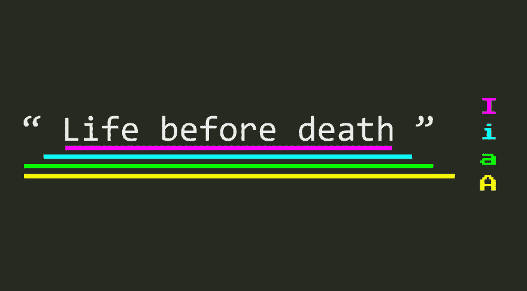

# 探索插件:用 targets 改进和扩展你的文本对象

> 原文：<https://dev.to/vintharas/exploring-vim-plugins-improve-and-extend-your-text-objects-with-targets-vim-30i7>

*本文最初发布于[barbarianmeetscoding.com](https://www.barbarianmeetscoding.com/blog/2019/08/11/exploring-vim-plugins-improve-and-extend-your-text-objects-with-targets-vim)。*😊

欢迎回到[探索 Vim 插件系列](https://www.barbarianmeetscoding.com/blog/categories/exploring-vim-plugins)！在这个系列中，您将学习如何通过发现令人敬畏的 Vim 插件以及如何掌握它们来每天提高一点生产力。今天，是我的最爱之一: [targets.vim](https://github.com/wellle/targets.vim) 的时候了。

通过增强 vim 最基本的特性之一:**文本对象**，vim 是真正增强你工作方式的插件之一。

## Vim 中的文本对象

Vim 最大的优点之一是它允许您高精度地编辑文本。你输入`daw`，Vim 按照你的命令执行， **d** 删除一个 **w** ord。你输入`ci'`，Vim 继续帮助你 **c** 修改单引号内的一些文本。Vim 通过将其有用的操作符(delete、change、yank 等)与一系列动作相结合，其中最强大的是文本对象**。**

**文本对象**描述了文档的各个部分:一个单词、一个句子、一个段落、引号内的文本、代码块、HTML 标签等等。在前面的例子中，`daw`和`ci'`中的`aw`和`i'`粒子是文本对象:

*   **`aw`** 代表**一词**
*   **`i'`** 代表**里面的单引号**

将操作符与文本对象结合使用，Vim 为您提供了更好的粒度和更强大的能力来编辑基于文本的文档和代码。

所以，如果**文本对象这么牛逼，我们还需要一个**的插件做什么？有什么比文本对象更棒的呢？**他们当中更有**！

## 更多文本对象！！！！

你曾经想要改变逗号之间的文本吗？现在你可以了！假设我们有这样一句话:

```
I think, most of the time, therefore I am. 
```

输入`ci,`，然后输入`all of the time`和`<ESC>`，瞧！

```
I think, all of the time, therefore I am. 
```

**你有没有想过编辑一个函数的参数和自变量？**现在你也可以了！

想象一下，我们有这个`obliterate`功能，可以让我们对我们的敌人施加过度的痛苦:

```
function obliterate(target, mana) {
  const damage = mana*1d20() + 1d100();
  target.hp -= damage;
  console.log(`${target} is obliterated with a ray of dark energy`);
} 
```

我们希望`mana`参数是可选的，并且有一个默认值。使用 [targets.vim](https://github.com/wellle/targets.vim) **参数**文本对象我们可以直接编辑`mana`参数如下:

1.  第二个 **n** ext **a** 参数
2.  `{mana=20}={}<ESC>`使该参数可选，并提供默认值`20`

是不是很棒？！

[Targets.vim](https://github.com/wellle/targets.vim) 附带了许多新的文本对象，在使用 vim 时，这些文本对象为您提供了全新水平的精度、控制、可重复性和速度:

*   类似`,.;:+-=~_*#/|\&$`的分隔符
*   函数中的自变量和参数
*   同时处理几对的多文本对象:`b`可以处理任何块(`{([`)和`q`可以处理任何报价。

## 等下还有更多！统一和改进搜索行为

[Targets.vim](https://github.com/wellle/targets.vim) 并没有停止添加新的操作符。它还改善了用户体验和所有文本对象的有用性。

在对文本对象使用操作符时，您可能已经注意到了一个不一致性，即任何引用文本对象的行为都与其他对象略有不同。与其他文本对象不同，引号支持向前查找，因此光标不需要在文本对象上操作。用一个例子可以更好地说明这一点，想象一下你有一个这样的字符串:

```
const greeting = "Hello Oh Mighty Wizard! I salute you!"
^ 
```

其中光标位于第一个字母上，由符号`^`表示。使用`ci"` when 可以改变该字符串的内容，即使我们不在引号本身之上。

这种搜索行为很棒，因为这意味着我们可以省去将光标放在引号上方所需的按键。唉，其他文本对象没有搜索行为。

检查以下功能:

```
const salute = (name) => `Hello Oh Mighty ${name}! I salute you`
^ 
```

现在让我们说，我们想改变那个`name`参数的名称。你可能认为输入`ci(`会让你立刻改变`name`参数，但事实并非如此。

`(`文本对象不支持向前查找，所以你需要分两步执行转换。

首先，你需要用`f(` :
移动光标

```
const salute = (name) => `Hello Oh Mighty ${name}! I salute you`
               ^ 
```

然后你可以用`ci(`改变`name`，因为`(`文本对象在你的光标下。

**搜索行为更优越，因为它允许你用更少的按键做更多的事情，也因为它让改变更容易用`.`命令**重复。不幸的是，这不是我们的运气，vanilla Vim 只支持报价文本对象的这种行为。

那么，如果我告诉你 [targets.vim](https://github.com/wellle/targets.vim) 将这种寻找行为统一并扩展到所有文本对象，会怎么样呢？扩展它，这样我们可以使用前面例子中的`ci(`,并且能够立刻改变那个参数？

是啊！这本身就是个好消息。但是 [targets.vim](https://github.com/wellle/targets.vim) 并没有就此止步。 **[Targets.vim](https://github.com/wellle/targets.vim) 给你跨多条线的前向和后向寻找行为**。

这是寻找工作原理的简化版本:

1.  如果光标位于文本对象之上，则该运算符适用于该文本对象
2.  否则，它会在一行内向前搜索
3.  如果没有文本对象向前，它会在一行中向后查找
4.  如果这一行中没有文本对象，它将向前搜索
5.  如果这一行或文档中的任何地方都没有文本对象，它会向后查找。

很棒吧？这意味着你可以节省更多的击键次数，更快地编辑文本。Wihoo！

但是，如果您不想更改文本对象的下一个出现位置，该怎么办呢？如果想改变之前的呢？这是否意味着您需要先将光标移动到那里？不会。 [targets.vim](https://github.com/wellle/targets.vim) 的制作者们很有远见，他们允许你用`n`(用于 **n** ext)和`l`(用于 **l** ast)命令明确指定你想要操作的文本对象。类型:

*   `cin[`您将更改下一对方括号中**的内容(这与`ci[`的行为完全相同)**
*   `cil[`你将改变**前一对方括号**的内容

这些命令也可以与**计数**结合使用，对远距离文本对象进行操作:

*   `c2in[`允许您更改第二对方括号的内容，依此类推。

这一切是不是太棒了？

## 再等等！还有更多！一、里、外、内

使用 vanilla Vim，当操作文本对象时，有两个修饰符可以使用:`a`和`i`。

*   `a"`表示**一个带引号的字符串**，它包括带引号的字符串的所有字符，包括引号
*   `i"`在带引号的字符串中表示**，它包括带引号的字符串减去引号后的所有字符**

[Targets.vim](https://github.com/wellle/targets.vim) 提供了两个新的修饰符，让你更加精确:`A`和`I`。

*   `A"`表示引号字符串周围的**，除了包含引号的整个字符串之外，还包含一个尾随空格。**
*   `I"`表示引用字符串内的**，包括引用字符串内的内容，不包括引号和任何内部尾随空格。如果您想保留引号、块等内的空白，这很有用。**

[](https://res.cloudinary.com/practicaldev/image/fetch/s--459rYhZY--/c_limit%2Cf_auto%2Cfl_progressive%2Cq_auto%2Cw_880/https://www.barbarianmeetscoding.cimg/targets-vim-modifiers.jpg)

## targets . vim 入门

1.  使用你最喜欢的插件管理器安装插件。你可以在本文中找到[更多关于插件管理器和如何安装插件的信息](https://www.barbarianmeetscoding.com/blog/2019/05/31/exploring-vim-plugins-a-methodology-to-become-1-percent-better-every-week)
2.  练习如下

vim 是那些无缝学习和实践的插件之一，因为它们非常适合 Vim 的哲学。因为它扩展了 Vim 的核心特性，如文本对象，所以使用新的分隔符或参数文本对象对有经验的 Vim 用户来说是很自然的。事实上这很自然，以至于您可能想知道为什么这些文本对象没有从一开始就构建在 Vim 中。

从我的个人经验来看，需要一些额外的刻意练习的一些事情是在普通 Vim 经验中不存在的明确的寻求行为:

1.  开始使用新的分离器(这是自然而然的，所以我认为你不需要刻意练习)
2.  通过直接从光标所在的位置使用文本对象，而不是在文本对象本身上移动，开始利用查找行为。这将使您更快，并且使您的更改更具可重复性(使用`.`操作符)。
3.  用显式的`n`和`l`寻找修饰符进行练习。
4.  练习用`A`代替`a`，用`I`代替`i`，注意不同的结果。

## 了解更多

这个 Vim 插件的[文档](https://github.com/wellle/targets.vim)是真正的**例外**，非常全面并且有很多有用的图表。所以在 GitHub 上或者通过`:help targets`命令在 Vim 中查看它[。](https://github.com/wellle/targets.vim)

此外， [targets.vim cheatsheet](https://github.com/wellle/targets.vim/blob/master/cheatsheet.md) 也是非常有用的摘要参考，并提供了许多视觉帮助。

> ### 您想了解更多关于 Vim 的信息吗？
> 
> 看看探索 Vim 系列中的所有其他[文章。祝你生活愉快！](https://www.barbarianmeetscoding.com/blog/categories/exploring-vim)