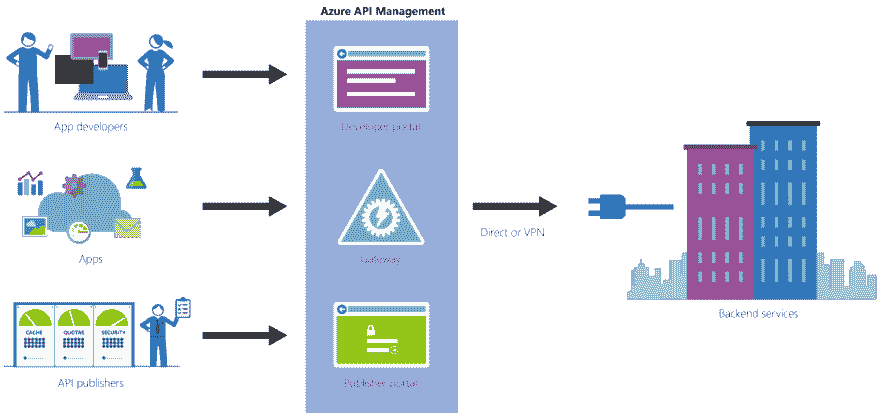
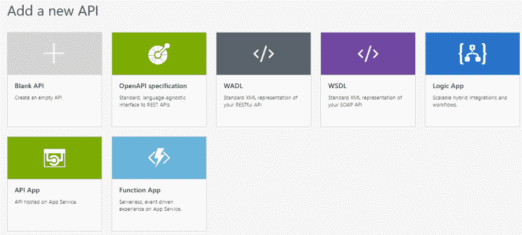
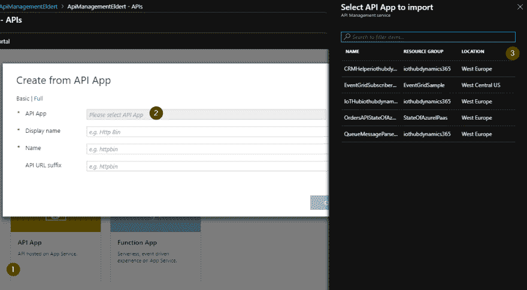
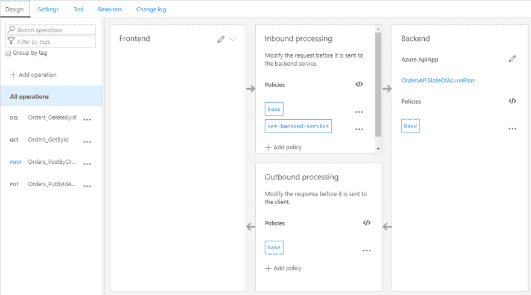
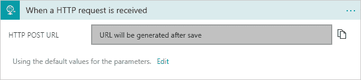
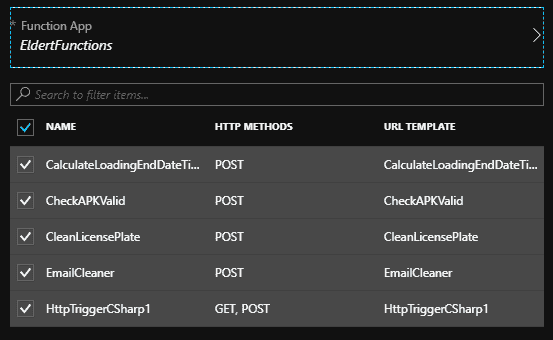
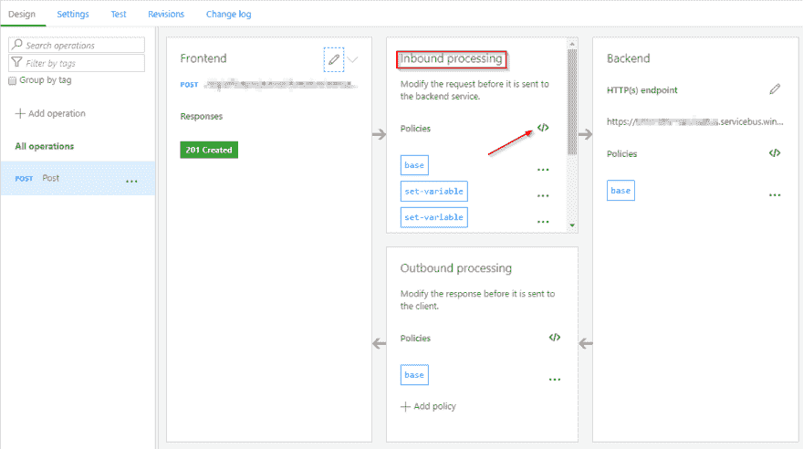

# 使用 Azure API 管理公开 Azure 服务

> 原文：<https://dev.to/suryavenkat_v/exposing-azure-services-using-azure-api-management-50k>

最初发布于[无服务器 360 博客](http://bit.ly/2Ke92I6)

## Azure API 管理

有了 Azure API Management，我们可以以一种受管的方式公开我们的服务，允许通过策略来控制、增加安全性、获得洞察力、提供前端和后端之间的分离等等。 [API Management](https://docs.microsoft.com/en-us/azure/api-management/api-management-key-concepts) 使我们能够创建一个服务仓库，在那里我们可以向客户展示我们所有的服务，客户可以很快开始使用这些服务——这要归功于[开发者门户](https://docs.microsoft.com/en-us/azure/api-management/api-management-key-concepts?irgwc=1&OCID=AID2000142_aff_7593_1243925&tduid=(ir__ou9wk0pcqgkfrxdpxmdf30kppu2xjrpnj3bwoehe00)(7593)(1243925)(je6NUbpObpQ-Ym49p.VvpJmUxoOTRCZJZA)()&irclickid=_ou9wk0pcqgkfrxdpxmdf30kppu2xjrpnj3bwoehe00#developer-portal?ranMID=24542&ranEAID=je6NUbpObpQ&ranSiteID=je6NUbpObpQ-Ym49p.VvpJmUxoOTRCZJZA&epi=je6NUbpObpQ-Ym49p.VvpJmUxoOTRCZJZA)提供的文档和测试功能。通过实施各种可用的策略，我们可以通过缓存、节流、高级安全性，甚至协议和数据翻译等功能来丰富我们的服务。简而言之，API Management 提供了围绕我们的服务创建完整生态系统的选项，包括从开发和发布到定制和监控的一切。

[](https://res.cloudinary.com/practicaldev/image/fetch/s--dRiuxIm3--/c_limit%2Cf_auto%2Cfl_progressive%2Cq_auto%2Cw_880/http://www.serverless360.com/wp-content/uploads/2018/10/API-Management-Overview.png)

这为我们提供了各种公开服务的可能性，不仅在云中，也在内部。此外，我们还可以用这种方式呈现我们的几个 Azure 服务。其中一些可以在现成的 API 管理中公开，如 API 应用程序或逻辑应用程序，但由于其他 Azure 服务也提供 REST 端点，我们也可以使用它们。这样，我们可以通过一个单一的存储库轻松地向我们的客户发布各种各样的服务，并以同质的体验来消费所有这些不同的服务。

## 暴露服务

所有这些都从创建一个 API 管理实例开始，该实例用于发布我们的服务。如果你还没有这样做，按照这些指示来创建你自己的。在这篇博文中，我们将假设您已经设置了 API 管理，包括用户、组和产品等基础知识。当我们在 API 管理中添加一个新的 API 时，我们会发现有几个不同的选项可以做到这一点。其中一些将在下面的段落中讨论，而另一些提供了在 Azure 之外添加我们自己的服务的能力。例如，可以通过这里添加一个具有 OpenAPI 规范的 API，它是 Swagger 的后继者。你只需指向你所在的 OpenAPI 定义的位置，API 管理就会获取所有关于操作、消息等的信息。另一种选择是从 WSDL 加载 API，甚至允许公开 SOAP 服务。因此，SOAP 服务可以直接公开，然而，我们甚至可以选择将其公开为 REST API。

[](https://res.cloudinary.com/practicaldev/image/fetch/s--p6UldNxy--/c_limit%2Cf_auto%2Cfl_progressive%2Cq_auto%2Cw_880/http://www.serverless360.com/wp-content/uploads/2018/10/Create-new-API-in-API-Management.png)

## API 应用程序

现在让我们看看通过 API 管理呈现 Azure 服务的各种选项。除了加载 OpenAPI、WADL 或 WSDL 等定义的选项，我们还有机会直接加载一些 Azure 服务。第一个例子是 API 应用程序，它允许在 Azure 中构建和托管 RESTful 服务。通过在添加新 API 屏幕上选择 API 应用选项，我们将看到订阅中所有可用 API 应用的概述。

[](https://res.cloudinary.com/practicaldev/image/fetch/s--XrUNYXOq--/c_limit%2Cf_auto%2Cfl_progressive%2Cq_auto%2Cw_880/http://www.serverless360.com/wp-content/uploads/2018/10/Add-API-App.png)

我们只需选择一个 API 应用程序，根据需要更新名称和后缀，API 定义将在我们的 API 管理中创建。总之，我们只花了几秒钟就通过 API 管理添加了 API 应用程序，现在我们可以根据需要进行配置，例如添加额外的策略或安全性。

[](https://res.cloudinary.com/practicaldev/image/fetch/s--S1C5Oa3p--/c_limit%2Cf_auto%2Cfl_progressive%2Cq_auto%2Cw_880/http://www.serverless360.com/wp-content/uploads/2018/10/API-App-imported.png)

## 逻辑应用

同样，我们也可以使用 API 管理向消费者公开我们的逻辑应用程序。这确实需要使用基于 HTTP 的触发器(如请求触发器)来触发逻辑应用程序。

[](https://res.cloudinary.com/practicaldev/image/fetch/s--l328trBs--/c_limit%2Cf_auto%2Cfl_progressive%2Cq_auto%2Cw_880/http://www.serverless360.com/wp-content/uploads/2018/10/Logic-App-HTTP-Request-Trigger.png)

当我们选择从 API 管理添加一个逻辑应用程序时，我们会发现所有可以这种方式使用的逻辑应用程序的概述。这又一次允许我们通过 API 管理快速轻松地发布另一个 Azure 服务。

## 功能

接下来，我们有 Azure 函数，同样可以从 Add a new API 屏幕导入。这里需要注意的是，要通过 API 管理公开函数，函数需要使用 HTTP 触发器，并且授权需要在匿名或函数级别上。此外，甚至可以在单个功能应用程序中选择多个功能，这些功能将通过 API 管理中的同一个 API 作为不同的操作公开。

[](https://res.cloudinary.com/practicaldev/image/fetch/s--UH3nFBQm--/c_limit%2Cf_auto%2Cfl_progressive%2Cq_auto%2Cw_880/http://www.serverless360.com/wp-content/uploads/2018/10/Add-Multiple-Functions.png)

## 服务总线

我们现在已经看到了如何通过 API 管理用户界面直接公开各种服务，但是不提供这种选项的服务呢？幸运的是，我们可以利用这些服务的 REST 端点。例如，Service Bus 提供了[各种端点](https://docs.microsoft.com/en-us/rest/api/servicebus/service-bus-runtime-rest?ranMID=24542&ranEAID=je6NUbpObpQ&ranSiteID=je6NUbpObpQ-lEdPCeehVSZmNaVM__Rr.A&epi=je6NUbpObpQ-lEdPCeehVSZmNaVM__Rr.A&irgwc=1&OCID=AID2000142_aff_7593_1243925&tduid=(ir__ou9wk0pcqgkfrxdpxmdf30kppu2xjrpntfbwoehe00)(7593)(1243925)(je6NUbpObpQ-lEdPCeehVSZmNaVM__Rr.A)()&irclickid=_ou9wk0pcqgkfrxdpxmdf30kppu2xjrpntfbwoehe00)，我们可以使用它们向队列和主题发送和检索消息。然而，服务总线确实要求我们使用包装令牌来验证服务。在 API 管理中，我们可以利用一个策略来公开服务总线实体，例如，允许我们的客户端通过 HTTP 发送消息，而不需要他们知道如何创建包装令牌的所有细节。为此，我们将在 API 管理中创建一个空白 API，使用我们的服务命名空间 URI 作为服务 URI(即 https://yournamespace.servicebus.windows.net/[)，然后向 API 添加一个新的 POST 操作。接下来，我们为操作的入站处理打开策略编辑器，在这里我们将设置所需的策略。](https://yournamespace.servicebus.windows.net/)

[](https://res.cloudinary.com/practicaldev/image/fetch/s--LDXI676n--/c_limit%2Cf_auto%2Cfl_progressive%2Cq_auto%2Cw_880/http://www.serverless360.com/wp-content/uploads/2018/10/Edit-Inbound-Processing-Policy.png)

我们需要设置的策略将设置必要的头，同时使用变量传递所需的数据。您会发现，我们将执行策略中的一些 C#代码来设置授权头，这是必需的，因为我们需要计算这个头中的一些预期值。请记住，SAS 密钥应该在 Service Bus 中使用正确的权限创建，比如 send 或 listen。

```
<policies>

    <inbound>

        <base />

        <set-variable name="resourceUri" value="https://yournamespace.servicebus.windows.net/yourqueuename" />

        <set-variable name="sasKeyName" value="yoursaskeyname" />

        <set-variable name="sasKey" value="yoursaskeyvalue" />

        <set-header name="Authorization" exists-action="override">

            <value>@{

// Load variables

string resourceUri = (string) context.Variables.GetValueOrDefault("resourceUri");

string sasKeyName = (string) context.Variables.GetValueOrDefault("sasKeyName");

string sasKey = (string) context.Variables.GetValueOrDefault("sasKey");

// Set the token lifespan

System.TimeSpan sinceEpoch = System.DateTime.UtcNow.Subtract(new System.DateTime(1970, 1, 1));

var expiry = System.Convert.ToString((int)sinceEpoch.TotalSeconds + 60); //1 minute

string stringToSign = System.Uri.EscapeDataString(resourceUri) + "\n" + expiry;

System.Security.Cryptography.HMACSHA256 hmac = new System.Security.Cryptography.HMACSHA256(System.Text.Encoding.UTF8.GetBytes(sasKey));

var signature = System.Convert.ToBase64String(hmac.ComputeHash(System.Text.Encoding.UTF8.GetBytes(stringToSign)));

// Format the sas token

var sasToken = String.Format("SharedAccessSignature sr={0}&sig={1}&se={2}&skn={3}",

System.Uri.EscapeDataString(resourceUri), System.Uri.EscapeDataString(signature), expiry, sasKeyName);return sasToken;

}</value>

        </set-header>

        <set-backend-service base-url="https:// yournamespace.servicebus.windows.net/" />

    </inbound>

    <backend>

        <base />

    </backend>

    <outbound>

        <base />

    </outbound>

    <on-error>

        <base />

    </on-error>

</policies>
```

现在，当我们保存策略时，我们可以使用 API 管理来传入任何消息，然后将这些消息放入指定的队列中。

## 斑点存储

类似地，我们也可以使用 API 管理来公开 Azure Blob 存储。在这种情况下，我们可以使用 API 管理来公开一个存储容器，允许我们让客户端发送消息，然后在容器中创建一个 blob。我们还将使用一些 C#代码来计算授权头。

```
<policies>

    <inbound>

        <set-variable name="UTCNow" value="@(DateTime.UtcNow.ToString("R"))" />

        <set-variable name="ContainerName" value="@(context.Request.Headers.GetValueOrDefault("Container"))" />

        <set-variable name="BlobName" value="@(context.Request.Headers.GetValueOrDefault("Blob"))" />

        <base />

        <set-header name="Authorization" exists-action="override">

            <value>@{

                    string storageAccount = " yournamespace ";

                    string storageKey = "yourstoragesaskeyvalue";

                    string containerName = context.Variables.GetValueOrDefault<string>("ContainerName");

                    string blobName = context.Variables.GetValueOrDefault<string>("BlobName");

                    string contentLength = context.Request.Headers.GetValueOrDefault("Content-Length");

                    string ContentType = context.Request.Headers.GetValueOrDefault("Content-Type");

                    string dateToSign = context.Variables.GetValueOrDefault<string>("UTCNow");

                    string headerResource = $"x-ms-blob-type:BlockBlob\nx-ms-date:{dateToSign}\nx-ms-version:2016-05-31";

                    string urlResource = $"/{storageAccount}/{containerName}/{blobName}";

                    var stringToSign = string.Format("PUT\n\n\n{0}\n\n{1}\n\n\n\n\n\n\n{2}\n{3}",contentLength,ContentType,headerResource,urlResource);

                    HMACSHA256 hmac = new HMACSHA256(Convert.FromBase64String(storageKey));

                    string signature = Convert.ToBase64String(hmac.ComputeHash(Encoding.UTF8.GetBytes(stringToSign)));

                    string authorizationHeader = String.Format("{0} {1}:{2}", "SharedKey", storageAccount, signature);

                    return authorizationHeader;

                }</value>

        </set-header>

        <set-header name="x-ms-date" exists-action="override">

            <value>@(context.Variables.GetValueOrDefault<string>("UTCNow"))</value>

        </set-header>

        <set-header name="x-ms-version" exists-action="override">

            <value>2016-05-31</value>

        </set-header>

        <set-header name="x-ms-blob-type" exists-action="override">

            <value>BlockBlob</value>

        </set-header>

        <set-backend-service base-url="@{

            string containerName = context.Variables.GetValueOrDefault<string>("ContainerName");

            string blobName = context.Variables.GetValueOrDefault<string>("BlobName");

            return String.Format("https://yournamespace.blob.core.windows.net/{0}/{1}", containerName, blobName);

        }" />

    </inbound>

    <backend>

        <base />

    </backend>

    <outbound>

        <base />

    </outbound>

    <on-error>

        <base />

    </on-error>

</policies>
```

## 结论

正如我们所看到的，API 管理允许我们轻松地公开我们的 Azure 服务，无论是开箱即用还是利用策略。我们现在可以将我们在 API 管理中创建的各种 API 分配给我们的产品，这将它们公开给客户。由于消费者不需要了解底层服务的任何信息，他们可以通过 HTTP 以一致的方式使用公开的 API，只需使用一个密钥，并且来自一个存储库。与此同时，我们获得了对服务使用情况的高级洞察力，并可以应用 API 管理提供的所有功能，如额外的安全性和高级策略。