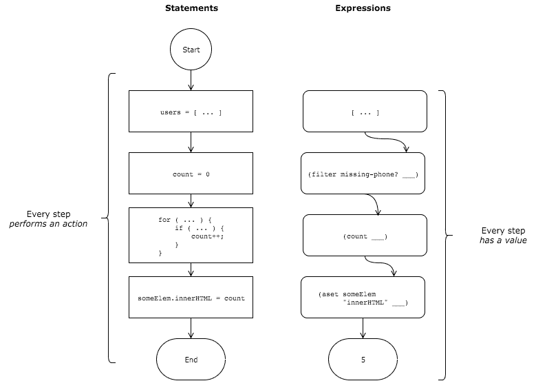
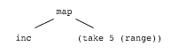
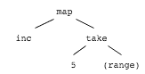
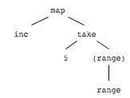
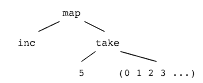
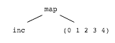
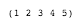

# 表达式和评估

> 原文：<https://dev.to/kendru/expressions-and-evaluation-42da>

这篇文章是安德鲁的书[第四课](https://www.learn-clojurescript.com/section-0/lesson-4-expressions-and-evaluation/)，[T3】学 ClojureScriptT5】](https://gum.co/learn-cljs)

* * *

正如我们在前一章中简要提到的，概念 an *expression* 是 ClojureScript 代码的核心。对于来自 JavaScript 这样的语言的程序员来说，从表达式的角度思考需要转换视角，但是就像 ClojureScript 的大多数方面一样，一旦我们习惯了，我们会发现用表达式编程是非常简单的。

*本章内容:*

*   了解 s 表达式并识别它们
*   定义语句和表达式之间的区别
*   理解 ClojureScript 的评估模型

## 用 S 表情打基础

大多数 ClojureScript 代码都用一个称为 s 表达式的结构来表示。S-expression 是“符号表达式”的缩写，这个术语来自激发 Clojure 的古老的 Lisp 语言家族。

### 构造一个 S 表达式

s 表达式有两种形式:

1.  原始值，如`12`、`true`或`"tacos"`
2.  包含零个或多个由空格分隔的表达式的圆括号列表:`( expression* )`

通过这两种形式，我们已经定义了 ClojureScript 的大部分语法。对于块、循环、函数调用、条件或语言的几乎任何其他部分，都没有特殊的语法。正如我们将很快讨论的，ClojureScript 与大多数 Lisps 不同，它添加了一些额外的语法元素以使代码更具可读性，但是简单的 s 表达式是迄今为止最基本和最流行的语法结构。我们现在来看几个 s 表达式的例子。

#### S-表情

```
5  <1>  ;; 5  +  <2>  ;; #object[cljs$core$_PLUS_ ...]  ()  <3>  ;; ()  (+  5  5)  <4>  ;; 10  (take  5  (range))  <5>  ;; (0 1 2 3 4)  (map  inc  (take  5  (range)))  ;; (1 2 3 4 5)  (mk-sandwich  "Bacon"  "Lettuce"  "Tomato")  <6>  ;; WARNING: Use of undeclared Var cljs.user/mk-sandwich at line 1 <cljs repl>  ;; #object[TypeError TypeError: Cannot read property 'call' of undefined] 
```

Enter fullscreen mode Exit fullscreen mode

1.  原始人
2.  函数名
3.  空的 s 表达式
4.  由其他简单 s 表达式组成的 s 表达式
5.  s 表达式可以嵌套
6.  仅仅因为 s 表达式在语法上有效，并不保证它会运行。

在这一点上，我们可以开始看到，所有的父母毕竟服务于一个目的(即使这位作者开始有他的怀疑)。它们为评估任何代码提供了一致和明确的结构。而其他编程语言通常对函数调用、数学和逻辑运算、条件、方法调用等有单独的语法。，ClojureScript 中只有一个语法构造，有明确定义的求值规则。我们将浏览如何计算 s 表达式的规则，但是首先，我们将简短地讨论对表达式
的*计算的强调，而不是对语句*的*执行的强调。*

> 注意
> 
> 使用基于 s 表达式的语言意味着不存在运算符优先级。在 JavaScript 中，我们必须记住，`*`比`+`优先级高，`&&`比`OR`优先级高，`!`比这里列出的其他操作符优先级高。在 ClojureScript 中，我们不需要图表，因为优先级在语言本身的语法中是显式的。例如，`(and x (or y z))`这个表达的意思是毫无疑问的，而且很明显`(or (and x y) z)`完全是另外一个意思。起初看起来奇怪的语法被证明是非常有用的！

### 理解表情

作为一种函数式编程语言，ClojureScript 强调*表达式*而不是语句。也就是说，ClojureScript *中的所有内容都将*评估为某个具体值。尽管 JavaScript 允许不产生值的语句和不返回任何东西的函数(更确切地说，是返回`undefined`)，但是每一段 ClojureScript 代码——从一个简单的数字到整个程序——都被求值以产生一些值。

让我们考虑一些不是表达式并且不返回任何东西的 JavaScript 语句:

```
var x = 5;

if (10 % 2 === 0) {
    evenOrOdd = "Even";
}

for (var i = 0; i < 10; i++) {
    console.log('Looping!');
} 
```

Enter fullscreen mode Exit fullscreen mode

在每一个例子中，我们都可以看到一段执行一些计算的代码，但是它并没有给出具体的结果。一种思考方式是，如果我们在这些语句的前面加上一个`var foo =`，就会导致语法错误，如下例所示:

```
var foo = if (10 % 2 === 0) {
    evenOrOdd = "Even";
}

// Uncaught SyntaxError: Unexpected token if 
```

Enter fullscreen mode Exit fullscreen mode

另一方面，在 ClojureScript 中，没有语句，只有表达式，所以绝对每样东西都有一个值(即使那个值是`nil`)。这大大简化了事情，因为我们不必把语言分成表达式和语句，表达式计算某个值，语句被执行，而不是被计算。*一切*都有价值。下面是我们刚刚考虑过的 JavaScript 语句的 ClojureScript 等价物。

#### ClojureScript 表达式

```
(def  x  5)  ;; #'user/x                                                    <1>  (if  (even?  10)  "Even"  "Odd")  ;; "Even"                                                      <2>  (doseq  [i  (range  5)]  (println  "Looping!"))  ;; Looping!  ;; Looping!  ;; Looping!  ;; Looping!  ;; Looping!  ;; nil                                                         <3> 
```

Enter fullscreen mode Exit fullscreen mode

1.  定义对 var 本身进行评估的 var
2.  if 表达式计算出适当的分支
3.  `doseq`评估为`nil`

设想构建一个联系人列表应用程序，您希望在 UI 的某个地方显示缺少电话号码的用户数量。在 JavaScript 中实现这一点的典型方法是创建一个计数器变量，然后遍历用户列表，如果电话号码丢失，就递增计数器。最后，一些元素的内容会用计数器的值来更新。

#### 面向语句的 JavaScript 代码

```
var counter = 0;
var users = [ /* ... */ ];

for (let user of users) {
    if (isMissingPhone(user)) {
        counter++;
    }
}

someElem.innerHTML = counter; 
```

Enter fullscreen mode Exit fullscreen mode

这段代码读起来就像是计算机遵循的指令手册——为了完成某项任务而要执行的事情的列表。另一方面，当用表达式编程时，我们考虑的是我们所拥有的数据，以及如何从中获得我们感兴趣的值。在本例中，我们有一个用户列表，我们感兴趣的是缺少电话号码的用户数量。使用面向表达式的方法，我们可能会做类似下面这样的事情，创建一个过滤的用户列表——只包含那些缺少电话号码的用户——然后获取过滤列表中的条目数。

#### [T1】面向表达式的 ClojureScript 代码](#expressionoriented-clojurescript-code)

```
(aset  someElem  "innerHTML"  (count  (filter  missing-phone?  users))) 
```

Enter fullscreen mode Exit fullscreen mode

除了更短之外，这段代码在我们开始使用的数据(`users`的集合)和我们想要的数据(计数)之间建立了更清晰的联系。有趣的是，上面的*整个*表达式计算的是丢失电话号码的用户数量。

[](https://res.cloudinary.com/practicaldev/image/fetch/s--J8FYqLar--/c_limit%2Cf_auto%2Cfl_progressive%2Cq_auto%2Cw_880/https://kendru.github.io/img/learn-cljs/chapter4/comparing-expressions-and-statements.png)

*比较表达式和语句*

我们看到面向表达式的代码在末尾返回一个值。但是，由于每个表达式都是由其他表达式组成的，因此流程中的每个步骤都有一定的价值。现在我们已经很好地理解了什么是表达式，以及它们与语句有何不同，我们可以深入研究 ClojureScript
*如何从表达式中计算*(获取值)。

#### 快速回顾

对于以下每个 JavaScript 代码片段，确定它是表达式还是语句:

```
// 1
if (age === 16) {
    sweetSixteen = true;
}

// 2
console.log('Regardless');

// 3
'happy birthday to you'.split('  ').map(_.capitalize).join('  ');

// 4
var x = 12;

// 5
(count >= threshold) ? 'Too High' : 'Ok';

// 6 function foo() {}

// 7
(function() {}) 
```

Enter fullscreen mode Exit fullscreen mode

*答案:* *1* -陈述； *2* -声明； *3* -表情； *4* -声明； *5* -表达式； *6* -声明； *7* -表情

## 评估 ClojureScript 代码

ClojureScript 计算表达式的规则很简单:

1.  如果表达式是一个原始元素或数据结构，它的值*就是那个元素的值*。
2.  如果表达式是带括号的表达式列表，则第一个表达式被解释为函数，其余的表达式被解释为参数。
3.  首先评估内部表达式，然后向外扩展

作为一个例子，我们将看看表达式，`(map inc (take 5 (range)))`。这个 s 表达式是一个带括号的表达式列表，所以第一个元素，符号`map`，被解释为一个带有两个参数的函数:`inc`和`(take 5 (range))`。

[](https://res.cloudinary.com/practicaldev/image/fetch/s--MRiCuJVN--/c_limit%2Cf_auto%2Cfl_progressive%2Cq_auto%2Cw_880/https://kendru.github.io/img/learn-cljs/chapter4/eval-step-1.png)

*评估表达式，步骤 1*

`inc`是一个接受整数并返回下一个更大数字的函数。ClojureScript 可以直接调用这个函数，所以不需要计算这个参数。但是，必须对参数`(take 5 (range))`求值，以便其值可以传递回`map`表达式。记住 s 表达式的规则，我们可以看到 ClojureScript 将把`take`解释为一个函数，并将`5`和`(range)`作为它的参数。

[](https://res.cloudinary.com/practicaldev/image/fetch/s--XctpRrIr--/c_limit%2Cf_auto%2Cfl_progressive%2Cq_auto%2Cw_880/https://kendru.github.io/img/learn-cljs/chapter4/eval-step-2.png)

*评估表达式，步骤 2*

原来的 s 表达式差不多可以求值了，但是首先要求值最后的内部 s 表达式，`(range)`。这个 s 表达式内部只有一个表达式，`range`，所以它将被解释为一个没有参数的函数。

[](https://res.cloudinary.com/practicaldev/image/fetch/s--uC0sP9XN--/c_limit%2Cf_auto%2Cfl_progressive%2Cq_auto%2Cw_880/https://kendru.github.io/img/learn-cljs/chapter4/eval-step-3.png)

*评估表达式，步骤 3*

最后，表达式将被“从内向外”求值，从调用`range`函数开始，一直到最外面的 s 表达式。

[](https://res.cloudinary.com/practicaldev/image/fetch/s--10k4b3eg--/c_limit%2Cf_auto%2Cfl_progressive%2Cq_auto%2Cw_880/https://kendru.github.io/img/learn-cljs/chapter4/eval-step-4.png)

*评估表达式，步骤 4*

对`range`的调用返回了一个从`0`开始的*无限*整数序列。我们稍后将讨论如何处理无限序列，但是现在，我们只需要理解无限序列是一个可以继续产生我们需要的任意多的值的对象。当这个表达式被求值时，无限序列被替换为原来的表达式`(range)`，求值继续向外进行。

[](https://res.cloudinary.com/practicaldev/image/fetch/s--JmV6ShPv--/c_limit%2Cf_auto%2Cfl_progressive%2Cq_auto%2Cw_880/https://kendru.github.io/img/learn-cljs/chapter4/eval-step-5.png)

*评估表达式，步骤 5*

下一个表达式被解释为对`take`函数的调用，带有参数、`5`和一个无限的数字序列。这个表达式的值是序列，`(0 1 2 3 4)`，由`(range)`生成的无限序列的前 5 个元素。对`take`的调用被替换为这个返回值，求值再次向外继续。

[](https://res.cloudinary.com/practicaldev/image/fetch/s--ZCS1LxNp--/c_limit%2Cf_auto%2Cfl_progressive%2Cq_auto%2Cw_880/https://kendru.github.io/img/learn-cljs/chapter4/eval-step-6.png)

*评估表达式，步骤 6*

最后，执行求值的最后一步，用参数`inc`和`(0 1 2 3 4)`调用`map`。这将递增序列中的每个元素，并返回 s 表达式的最终值。

计算 ClojureScript 的规则非常简单，我们可以通过几个步骤计算出表达式的计算方式。令人惊奇的是，无论我们看到的代码有多大，有多复杂，我们都可以使用相同的过程来读取几乎任何一段 ClojureScript。一旦理解了基本的语法，剩下要学的大部分就是词汇和常用习语了。

## 操作顺序

这可能令人惊讶，但是 ClojureScript 没有运算符优先级的概念。也就是说，没有规则指示乘法应该在加法或任何类似的事情之前执行。我们没有一套规则来隐式地确定表达式求值的顺序，而是通过嵌套 s 表达式的方式来指定顺序。例如，以下代码将 5 和 2 相乘，然后将结果加到 10:

```
(+  10  (*  5  2))  ; 20 
```

Enter fullscreen mode Exit fullscreen mode

另一方面，下一位代码将 10 和 5 相加，然后将结果乘以 2:

```
(*  (+  10  5)  2)  ; 30 
```

Enter fullscreen mode Exit fullscreen mode

使用括号来确定操作的顺序迫使我们更加明确，并且几乎消除了与运算符优先级相关的所有错误。

### 你试试

*   编写一个表达式，该表达式将调用一个名为`make-dessert`的函数，该函数带有参数`"ice cream"`和`"brownies"`。
*   用 ClojureScript 写出下面的数学表达式，使得乘法在加法和减法之前执行:`8 + 3 * 4 - 10`。
*   写出与上一个练习相同的表达式，但是乘法最后执行。

## 总结

在这一章中，我们学习了什么是表达式，以及面向表达式的编程与面向语句的编程有何不同。这让我们对 ClojureScript 的求值策略进行了研究，该策略从内到外简化了表达式。最后，我们学习了 s-expression 语法如何通过明确每个操作的顺序来消除对运算符优先级的需求。我们现在可以:

*   了解 ClojureScript 将如何评估我们的代码
*   定义一组语句的*执行*和一个表达式的*求值*之间的区别
*   阅读 ClojureScript 的 s 表达式语法