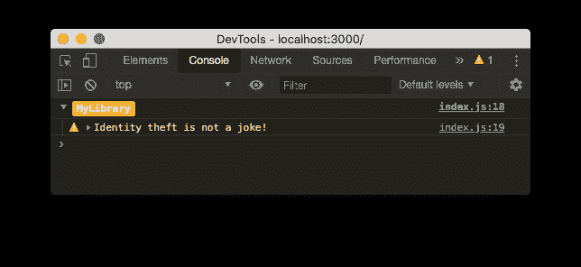
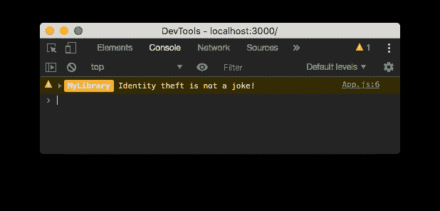

# 扩展控制台的方法而不丢失行信息

> 原文：<https://dev.to/maxbvrn/extend-console-s-methods-without-losing-line-information-2d68>

准备好接受本网站最不必要的精确和独特的帖子吧，因为今天我们将学习如何在你的浏览器控制台日志前添加一个**彩色芯片！**

扩展控制台的 log、error、warn 或其他方法对于轻松地向每个日志添加一些信息或上下文非常有用，尤其是使用 [CSS 样式](https://developers.google.com/web/tools/chrome-devtools/console/console-write#styling_console_output_with_css)！

有很多方法可以使用它，但是在这个例子中，我们将关注于如何容易地识别来自一个库的日志。

你实际上需要用一个新的方法替换这个方法，我建议在你的应用入口点(`index.js`(对我来说)
)这样做

```
const stylesWarning = [
    'background: #FFC82C',
    'border-radius: 3px',
    'color: white',
    'font-weight: bold',
    'padding: 2px 5px'
].join(';')

const _warn = console.warn;

console.warn = function(warnMessage) {
  console.group("%cMyLibrary", stylesWarning)
  _warn.apply(console, arguments)
  console.groupEnd()
} 
```

然后，您可以像平时一样使用该方法:

[](https://res.cloudinary.com/practicaldev/image/fetch/s--vGFU8ZBq--/c_limit%2Cf_auto%2Cfl_progressive%2Cq_auto%2Cw_880/https://thepracticaldev.s3.amazonaws.com/i/zjsudexvlz2ayxwdf8zn.png)

这将导致以下结果:

[](https://res.cloudinary.com/practicaldev/image/fetch/s--65crmBdp--/c_limit%2Cf_auto%2Cfl_progressive%2Cq_auto%2Cw_880/https://thepracticaldev.s3.amazonaws.com/i/lix80ibqg3y9w682eky7.png)

方便又好看！

但是有一个问题:**日志的文件和行号并不代表我们的原始日志，而是我们的方法被重写的位置。**(这里是`index.js`而不是`App.jsx`)没那么方便。

幸运的是，有一个技巧可以解决这个问题:您需要**修改 log 方法本身并返回它，而不是用一个新函数来替换它。**(谢谢 [StackOverflow 的 kylehuff](https://stackoverflow.com/a/26078207/6208520) ！)

```
console.warn = function() {
  return Function.prototype.bind.call(_warn, console, "%cMyLibrary", stylesWarning);
}(); 
```

这将导致类似于前一个(我实际上发现它更漂亮)，除了行号显示实际的文件和行号。

[](https://res.cloudinary.com/practicaldev/image/fetch/s--nBi5pZNk--/c_limit%2Cf_auto%2Cfl_progressive%2Cq_auto%2Cw_880/https://thepracticaldev.s3.amazonaws.com/i/45t3braftfwyzphvsemy.png)

如果您或您团队中的任何人使用 VSCode 的调试器，有一个小技巧:CSS 样式不会在每个参数之间重置，所以如果您不想让整行都着色，您需要添加第二个“%c”和一个无意义的 CSS 规则字符串，如下:

```
console.warn = function() {
  return Function.prototype.bind.call(_warn, console, "%cMyLibrary%c", stylesWarning, 'color: inherit');
}(); 
```

结果非常有用，您不必更改任何控制台调用。如果可以的话，**我推荐在不改变控制台对象**的情况下编写自己的日志记录器助手，这样风险会小一些，但是你必须重构很多代码。

你怎么想呢?你在你的项目中使用这种技巧吗？不要犹豫评论！