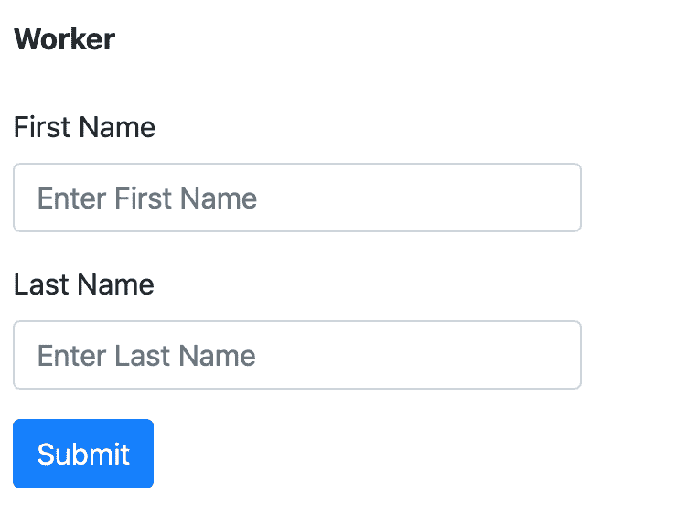

# 在 Pharo Smalltalk 中扩展胡子的使用

> 原文：<https://dev.to/skaplar/extending-mustache-usage-in-pharo-smalltalk-3mph>

Mustache 是一个模板系统，有各种各样的实现。其中之一是在 Pharo Smalltalk 中，这将是本文的重点。你可以在这里找到更多关于它的信息。

当你打开 [mustache.github.io](https://mustache.github.io) 时，你会注意到的第一件事是无逻辑的模板，并且应该保持下去。然而，您经常希望扩展一个这样的模板系统的使用，并根据自己的需要进行调整。

在本文中，我们将了解如何适应某些需求，如何生成新的模板并使用它们来呈现 html 表单，尤其是当您无法影响传入数据时。

假设我们有一个数据，看起来像:

```
{  "name":  "Worker",  "formProperties":  [  {  "name":  "firstName",  "component":  "TextFieldComponent",  "label":  "First Name"  },  {  "name":  "lastName",  "component":  "TextFieldComponent",  "label":  "Last Name"  }  ]  } 
```

现在，如果我们想将它呈现为 html 表单，它看起来已经很熟悉了。formProperties 中的一个条目应该对应一个表单行，我们有一个名称和一个标签，但是我们缺少输入的类型。显然我们应该使用 component，但我们应该做点什么，因为没有 TextFieldComponent 输入类型。

想法是创建一个模板，其中一部分将包含每个表单属性的部分。

```
MiniExample >> render: json

templateString := String new writeStream.
templateString nextPutAll: self baseTemplate.
partial := String new writeStream.
parts := Dictionary new.
s := NeoJSONReader fromString: json.
    (s at: 'formProperties') do: [ :el | 
        | tmp |
        tmp := self preparePartialTemplate: el.
        parts at: (el at: 'name') put: tmp.
        partial nextPutAll: '{{> '.
        partial nextPutAll: (el at: 'name').
        partial nextPutAll: '}}'.
    ].

p := partial contents asMustacheTemplate value: '' asDictionary partials: parts.
^ templateString contents asMustacheTemplate value: s partials: {'partial' -> p } asDictionary. 
```

这里我们可以看到`json`参数，它代表我们想要处理的数据，我使用 [NeoJSON](https://github.com/svenvc/NeoJSON) 读取 JSON 并将其转换为 Smalltalk 对象。包含了这个例子的基本模板，它有一个

*   简单形式，
*   `{{ name }}`模板，将直接替换为 json 中的`name`，
*   `{{> partial }}`哪一个将被替换成那么多部分，`formProperties`中有多少个条目，或者在这种情况下是两个。

```
MiniExample >> baseTemplate

^
'<form action="http://localhost:8081/addNewEntity" method="post">
    {{ name }}
    {{> partial }}
    <button type="submit" class="btn btn-primary">Submit</button>
</form>' 
```

接下来我们有`partial`，它将包含生成的分音，在迭代结束时看起来像这样`{{> firstName}}{{> lastName}}`，还有`parts`字典，它将为两个生成的分音保存两个模板。所以让我们更深入的了解一下`do:`是做什么的。

`:el`是字典，它包含名称、组件和标签，而`preparePartialTemplate:`是期望字典并返回模板的方法。当`preparePartialTemplate:`完成时，我们将结果存储在`parts`字典中，并生成对应于该模板的部分，例如`{{> firstName}}`。

在这里你可以组织你想要的模板，为了教程的缘故，我让它保持简单并且在同一个地方。

```
MiniExample >> preparePartialTemplate: dict

templateString := String new writeStream.
templateString nextPutAll:
'
<div class="form-group">
    <label for="{{ label }}">{{ label }}</label>
'.
templateString nextPutAll: (self determineComponent: (dict at: 'component')).
templateString nextPutAll: '</div>'.
^ templateString contents asMustacheTemplate value: { 
    'label' -> (dict at: 'label').
} asDictionary. 
```

此外，在这里，当你有你的组件，你可以做任何你想做的，我只是保持它简短。

```
MiniExample >> determineComponent: aComponent

aComponent = 'TextFieldComponent' ifTrue: [ 
    ^'<input type="text" id="{{label}}" name="{{ label }}" placeholder="Enter {{label}}">'] 
```

最后，我们有我们的部分:

```
 partial -> {{> firstName}}{{> lastName}} 
```

还有`parts`字典:

```
firstName ->

<div class="form-group">
    <label for="First Name">First Name</label>
    <input type="text" class="form-control" id="First Name" name="First Name" placeholder="Enter First Name">
</div>

lastName ->

<div class="form-group">
    <label for="Last Name">Last Name</label>
    <input type="text" class="form-control" id="Last Name" name="Last Name" placeholder="Enter Last Name">
</div> 
```

现在回到第一个片段

```
p := partial contents asMustacheTemplate value: '' asDictionary partials: parts.
^ templateString contents asMustacheTemplate value: s partials: {'partial' -> p } asDictionary. 
```

`p`将得到最终形式:

```
 <div class="form-group">
    <label for="First Name">First Name</label>
    <input type="text" class="form-control" id="First Name" name="First Name" placeholder="Enter First Name">
</div>
<div class="form-group">
    <label for="Last Name">Last Name</label>
    <input type="text" class="form-control" id="Last Name" name="Last Name" placeholder="Enter Last Name">
</div> 
```

并且`p`会替换原来`baseTemplate`中的`{{> partial }}`模板，最后到

```
<form action="http://localhost:8081/addNewEntity" method="post">
    {{ name }}
    <div class="form-group">
        <label for="First Name">First Name</label>
        <input type="text" class="form-control" id="First Name" name="First Name" placeholder="Enter First Name">
    </div>
    <div class="form-group">
        <label for="Last Name">Last Name</label>
        <input type="text" class="form-control" id="Last Name" name="Last Name" placeholder="Enter Last Name">
    </div>
    <button type="submit" class="btn btn-primary">Submit</button>
</form> 
```

在评估之后，稍微调整一下 css，我们会得到这样的结果

[](https://res.cloudinary.com/practicaldev/image/fetch/s--xhFbfdsE--/c_limit%2Cf_auto%2Cfl_progressive%2Cq_auto%2Cw_880/https://thepracticaldev.s3.amazonaws.com/i/qpsbfzdzlm2izib2doyh.png)

现在，可以扩展您的模板并添加对其他字段类型、组件、需求等的支持。