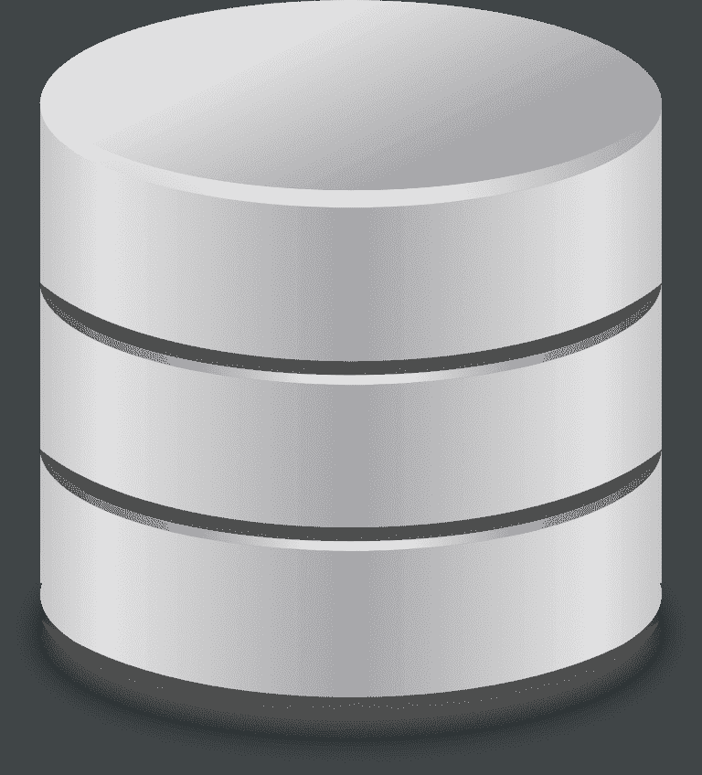

# 提取转换和加载概述

> 原文：<https://dev.to/ryboflavin42/extract-transform-and-load-overview-5a6k>

## 数据接收系列的第 1 部分

提取转换和加载(ETL)的过程有许多名称:

*   数据采集
*   数据接收
*   企业转换和加载

但它们都是关于将外部数据导入系统。

大多数企业面临的问题是，没有容易遵循的最佳实践来指导他们创建 ETL 管道。在这个由 6 部分组成的系列中，我将通过展示一组简单灵活的创建或评估 ETL 系统的最佳实践来解决这个问题。

## 高质量数据的重要性

首先让我们讨论一下为什么 ETL 对业务很重要。数据通常是任何业务中最重要的资产。在信息时代，很容易明白为什么。让我们看看这些例子:

*   亚马逊收集买家数据，建议购买新商品。
*   脸书跟踪用户数据，用于有针对性的营销。
*   谷歌使用用户搜索历史来显示谷歌广告。
*   音乐行业交换数据是为了销售音乐、支付版税和交换权利。
*   政府吸收威胁评估数据，以加强国家安全。

这个清单还在继续...

因此，我们如何处理这些数据源以及这些数据源的质量对于销售、治理、商业以及某些情况下的生死决策非常重要。

## 购买与构建

这个主题值得在自己的博客上发表文章，实际上在尽职调查阶段可能会引起相当大的争议。在这一系列文章中，我将只简要地谈到这个主题。

### 评估 COTS ETL 平台的一些标准是什么？

评估定制产品或购买商用现货(COTS)平台的常见标准是:

*   **价格。**多少许可证？从零开始建造的成本是多少？他们的维修合同。我需要将我的员工送去参加外部培训吗？我需要第三方顾问吗？托管费用是多少？
*   **保养。**升级难度如何？有可靠的升级途径吗？我将在哪里托管应用程序？这是单机/托管安装吗？或者我可以部署到支持应用程序中。
*   **摄取速度。**我需要多快处理数据？定制解决方案通常比 COTS 产品快得多。
*   **用例**。该应用程序将用于一个项目还是整个组织？(老实说这一条。我曾与无数为特定项目购买和安装的 COTS 产品一起工作过，其中组织说“让 beta 在一个项目上测试这个百万美元的产品，如果它有效，让我们在组织的其余部分实现它”。只是他们从来没有这样做，现在他们被困在一个非常昂贵的许可证)。
*   **治理。**我需要维护一组单独的用户和角色吗？我可以限制谁可以访问我的数据管道吗
*   **灵活性。**添加新的输入数据类型有多容易。我能改变流程吗？
*   谁将开发它？COTS 产品的一个特点是他们经常声称工作流(管道)可以由业务用户创建和管理。这通常需要对业务用户和特定类型的业务用户进行专门培训来维护。有时公司会使用现有的开发者来开发管道。

在构建数据管道时，有许多优秀的产品可以为厨房水槽提供灵活的管道。这似乎很棒！购买许可证、安装、创建管道，然后开始吧！但是，请考虑这种方法的隐性成本。

## 成分

大多数数据管道可以归结为 6 个主要部分。其中一些组件可以重新排序，其他组件在特定用例中可能是可选的。然而，理解并充分考虑每个组件是确保数据质量和管道可重用性的关键。

### 提交信息包(SIP)

提交信息包是任何数据管道的第一步。它是数据本身以及数据将如何进入系统，也称为原始数据和数据端点。

原始数据是系统提交或接收的数据文件。这可能是来自多个提交者的多种格式。要问的问题是

*   我们吸收了哪些数据类型(Excel、XML、JSON ),行业中是否使用了任何特定的标准(行业标准操作程序、模式、XSD、格式最佳实践)
*   我们需要创建一个标准吗？或者我们需要简化现有的标准吗？
*   谁将提交数据？它是来自一个合作伙伴，还是可以由多个合作伙伴提交相同的数据类型。

端点讨论系统如何获取数据。要问的问题是

*   合作伙伴会向我们提交数据吗(推送)？
*   还是我们需要从合作伙伴那里获得数据(拉取)？

sip 和高级验证将在本系列的第 2 部分中深入讨论。

### 高级验证

高级验证是任何 ETL 过程的第二步。高级验证主要关注确保接收的数据格式实际上是系统知道如何接收的格式。例如，它检查 XML 文件是否符合模式，或者 CSV/Excel 文件是否具有正确的列。它不关心数据的细节，比如书有标题吗。用户是否至少有一个帐户等。

本系列的第 2 部分将深入讨论 sip 和高级验证。

### 典范变换

这是任何 ETL 过程的第三步。正则变换实际上由两部分组成。规范域和数据映射过程。

规范形式是一组所有数据格式都可以映射到的简单对象。通常情况下，规范数据采用目标数据库表或最复杂或标准化的输入数据格式。行业数据标准，如医疗保健中的 OMOP，也代表了规范的数据模型。

数据映射过程是将数据从输入格式转换成规范格式的实际过程。例如，从 CSV 文件中获取书名，并将其放入 book 规范对象的 title 字段中。

这一步对流程很重要，因为它允许下游处理变得可重用和易于维护。

本系列的第 3 部分将深入讨论正则变换。

### 商业规则

第四步使用第三步中的规范，并对数据应用详细的验证规则。这些规则对于保持数据库的完整性非常重要。这些可以是简单的验证，比如所有的书都必须有一个标题，也可以是更复杂的规则，比如一本书的所有权份额总计为 100%。复杂的业务规则通常关注数据关系或聚合数据。

业务规则也可能关注对组织重要的规则。数据标准通常被设计为在许多用例中是灵活的，但是，您的组织可能只关心数据标准的某个特定方面。业务规则是系统如何过滤掉需要的数据和不需要的数据。

本系列的第 4 部分将深入讨论业务规则。

### 识别

识别步骤是 ETL 过程中的第五步。识别步骤是系统如何将新数据与以前获取的数据进行协调。该过程将涉及关键标识符，以将数据与我们已知的数据集(数据库、索引、非 SQL、外部系统等)进行比较。).如果发现匹配(数据被识别)，则该步骤可以解决如何合并数据。这意味着，如果数据是已知的，并且数据存储和传入数据之间存在差异，如何对其进行协调。一些用例需要在持久层进行数据合并。这个决定最终将基于业务规则和系统需求。

根据业务需求和接收的数据类型，可能需要跳过这一步。此外，在某些用例中，在运行业务规则之前识别数据是很重要的，因为业务规则可能会根据数据是已知的(已识别)还是新的(未识别)而变化。

识别步骤将在本系列的第 5 部分中深入讨论。

### 坚持

这是数据接收过程的第六步。它侧重于将数据存储在我们的数据存储中，以供下游使用或用于未来的数据识别

本系列的第 5 部分将深入讨论持久性。

### 审计/治理/工作队列

审计、治理和工作队列组件不是整个接收过程中的步骤，但却是 ETL 系统的重要但可选的组件。这些是大多数婴儿床产品的“厨房水槽”特征。数据接收管道的使用和管理方式将最终决定是否需要实施这三个组件中的任何一个。

#### 审计

审计组件是多方面的，涵盖了许多重要领域:

*   **数据来源:**知道存储在数据存储中的数据的来源
*   **商业智能:**这是一个术语，用于分析管道和数据流。它回答了以下问题
    *   从给定的来源获取了多少数据？
    *   处理这些步骤需要多长时间？
    *   数据在流程的哪个环节出现故障？
    *   我们的瓶颈在哪里？
    *   每次提交会创建多少条记录？
*   **决策审核:**为什么做出关于数据的决策。
    *   为什么要识别记录？
    *   为什么数据文件没有通过业务规则？
    *   为什么记录是持久的？

#### 管理

治理包括谁可以访问、运行和报告我们的数据接收管道？谁能改变我们的数据管道？

#### 工作队列

工作队列组件在许多接收系统中并不常见，但是考虑到接收的数据类型，它可以极大地提高数据质量、数据透明度和数据吞吐量。

审计、治理和工作队列将在本系列的第 6 部分中讨论。

## 摘要

数据采集在系统中的重要性毋庸置疑，数据的质量最终决定了系统的质量。有了这 6 个基本组件，几乎任何数据接收管道都可以在保证数据质量和管道可重用性的情况下进行设计和实现。在本系列的下一部分，我们将讨论提交信息包