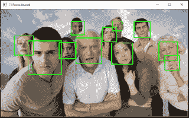
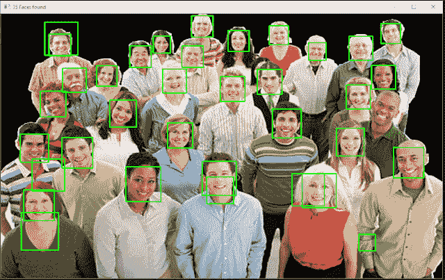

# Python 中的人脸检测

> 原文：<https://dev.to/demg_dev/face-detection-in-python-1n5f>

嗨，在这篇文章中，我将向你展示如何使用 OpenCV 库来检测图片中的人脸，在以后的文章中，我将向你展示如何在实时视频中进行检测，这对于练习视觉识别来说是一件很棒的事情。

> 让我们开始吧

## 要求

检查您的 python 版本或安装 python 3.6。

```
python--version 
```

然后，我们需要通过在[官方网页](https://opencv.org/)中搜索来安装 OpenCV 库，在我的本地环境中，我使用 OpenCV v4.1 版，你可以使用之前的版本 v3。x，我建议你按照官方
文档中的说明进行安装。

## 编码人脸检测解决方案

现在我们开始编写人脸检测程序。首先需要导入 OpenCV 库和系统库(可以是可选的，当我运行 python 代码时，我使用这个库来获取参数)。

```
import cv2
import sys 
```

接下来导入语句，我们需要从用户那里获得参数，这个参数是人脸检测程序中要测试的图片。

```
# Get user supplied values imagePath = sys.argv[1] 
```

在下一部分中，我们需要在我们的代码中添加面部检测的魔法，这部分被称为哈尔级联特征；你可能会问为什么是哈尔瀑布，好吧，现在我来解释一下它是什么。

> 使用基于 Haar 特征的级联分类器的目标检测是由 Paul Viola 和 Michael Jones 在 2001 年的论文“使用简单特征的增强级联的快速目标检测”中提出的一种有效的目标检测方法。这是一种基于机器学习的方法，其中从大量正面和负面图像中训练级联函数。然后，它被用于检测其他图像中的对象。这里我们将使用人脸检测。最初，该算法需要大量的正面图像(人脸图像)和负面图像(没有人脸的图像)来训练分类器。然后我们需要从中提取特征。为此，使用下图所示的哈尔特征。它们就像我们的卷积核。每个特征是通过从黑色矩形下的像素总和中减去白色矩形下的像素总和而获得的单个值。现在我们有了一个想法，HaarCascade 可以继续使用代码，我正在使用 Rainer Lienhart 创建的 Haar cascade 文件(您在代码库中找到的文件)，我们需要将该文件添加到代码中。
> 
> *   通过 opencv 文档

```
cascPath = "haarcascade_frontalface_default.xml" 
```

接下来，我们需要用 haar 级联文件训练 OpenCV 分类器。

```
# Create the haar cascade faceCascade = cv2.CascadeClassifier(cascPath) 
```

在下一步中，我们需要读取图像并设置为灰色，因为 OpenCV 使用 haar 级联分类器对灰度图像做得更好。

```
# Read the image image = cv2.imread(imagePath)
gray = cv2.cvtColor(image, cv2.COLOR_BGR2GRAY) 
```

在这一部分魔术完成了，OpenCV 框架魔术般地检测图像中的人脸并返回人脸在图像中的位置，你可以调整参数以获得更详细的结果或更疯狂的哈哈！！！。

```
# Detect faces in the image faces = faceCascade.detectMultiScale(
    gray,
    scaleFactor = 1.05,
    minNeighbors = 5,
    minSize = (30, 30),
    flags = cv2.CASCADE_SCALE_IMAGE
) 
```

要完成我们的人脸检测代码，只需打印图像中找到的人脸数量，然后画一个包含人脸的矩形，并显示一个包含图像和圆角人脸的窗口；要关闭窗口，请按任意键。

```
print("Found {0} faces!".format(len(faces)))

# Draw a rectangle around the faces for (x, y, w, h) in faces:
    cv2.rectangle(image, (x, y), (x + w, y + h), (0, 255, 0), 2)

height, width, channels = image.shape
cv2.imshow("{0} Faces found".format(len(faces)), image)
cv2.waitKey(0) 
```

这是一个结果更准确的例子。

[](https://res.cloudinary.com/practicaldev/image/fetch/s--LQa3magY--/c_limit%2Cf_auto%2Cfl_progressive%2Cq_auto%2Cw_880/https://1.bp.blogspot.com/-E7gxWsBDFt0/XS9IqyqpG-I/AAAAAAAAWzo/or6VTnoARuolE0FyWqPQ1U05YnO-UVyugCPcBGAYYCw/s320/Captura.PNG)

就像你在图像中看到的，他们像识别人脸一样识别手，这是我发现的一些问题，我试图设置更准确的值，但它检测到的人脸较少，你可以用它来看看它是如何工作的。

这是另一个例子，就像你看到的在低分辨率图片中检测到许多人脸，但有很多错误，在这个图像和这个配置中，只有一个人脸没有被检测到。

[](https://res.cloudinary.com/practicaldev/image/fetch/s--x27YH5aY--/c_limit%2Cf_auto%2Cfl_progressive%2Cq_auto%2Cw_880/https://1.bp.blogspot.com/-w0X2CmxtJjk/XS9R_wGjTmI/AAAAAAAAWz0/_9KPKNVQ1Vo3L7cDWJZNgTN_5FUYM3CFwCLcBGAs/s640/Captura1.PNG)

## 完整代码

这里是完整的代码，就像你看到的只需要 33 行空格，这是一个非常短的程序，具有强大的应用程序。

```
import cv2
import sys

# Get user supplied values imagePath = sys.argv[1]
cascPath = "haarcascade_frontalface_default.xml"

# Create the haar cascade faceCascade = cv2.CascadeClassifier(cascPath)

# Read the image image = cv2.imread(imagePath)
gray = cv2.cvtColor(image, cv2.COLOR_BGR2GRAY)

# Detect faces in the image faces = faceCascade.detectMultiScale(
    gray,
    scaleFactor = 1.05,
    minNeighbors = 5,
    minSize = (30, 30),
    flags = cv2.CASCADE_SCALE_IMAGE
)

print("Found {0} faces!".format(len(faces)))

# Draw a rectangle around the faces for (x, y, w, h) in faces:
    cv2.rectangle(image, (x, y), (x + w, y + h), (0, 255, 0), 2)

height, width, channels = image.shape
cv2.imshow("{0} Faces found".format(len(faces)), image)
cv2.waitKey(0) 
```

## 结论

为了完成这篇文章，如你所见，如果你使用人脸检测的实际解决方案，你可以开发一个更详细的程序，比如门铃或交通灯中的摄像头，来检测人脸，也许可以更好地识别人脸。

接下来，你可能会尝试做相同的程序，但在一个真正的视频或等待我的下一个帖子来学习如何做。