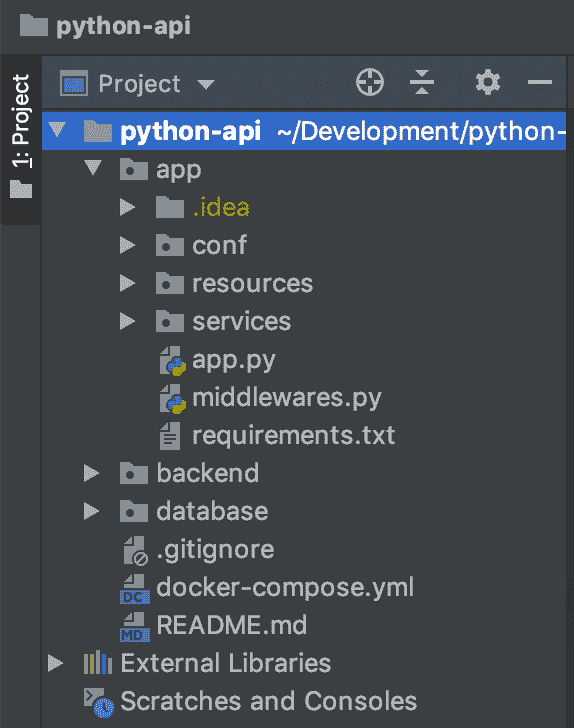
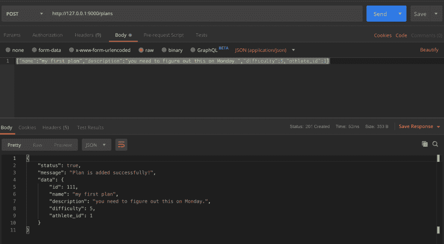

# Docker - 2 上的 Falcon API 框架

> 原文：<https://dev.to/_mertsimsek/falcon-api-framework-on-docker-2-e9k>

在本文中，我们将需要使用 Python 中的 Falcon API 框架来构建一个 API。我们将介绍一些提示和请求方法。本文是系列文章的一部分:

1) [在 Docker 上引导 Falcon API 框架](https://dev.to/_mertsimsek/falcon-api-framework-on-docker-5eid)

2)通过使用单独的 Falcon 方法创建 API。(你来了。)

你最好读一下前面的文章，否则你会对此感到困惑。好了，我们开始吧。

我的根目录如下。首先，我已经创建了`requirements.txt`文件。

[](https://res.cloudinary.com/practicaldev/image/fetch/s--YvYf-whW--/c_limit%2Cf_auto%2Cfl_progressive%2Cq_auto%2Cw_880/https://thepracticaldev.s3.amazonaws.com/i/4nj69x0sj9a2nv3gqjgi.png)T3】

```
attrs==19.1.0
falcon==2.0.0
falcon-autocrud==1.0.36
gunicorn==19.9.0
jsonschema==3.0.1
marshmallow==2.19.5
psycopg2==2.8.3
pyrsistent==0.15.4
python-dateutil==2.8.0
six==1.12.0
SQLAlchemy==1.3.6
webargs==5.4.0 
```

它已经准备好通过这个命令获取库。

```
pip install -r requirements.txt 
```

安排好库之后，我们就可以创建 Python 文件了。我的主档是`app.py`。尽管如此，您可以定义另一个名称。

```
import falcon
from resources import athlete
from resources import plan
from resources import exercise
from services import database_service

from middlewares import (
    ContentEncodingMiddleware,
)

conn = database_service.connect()

api = falcon.API(middleware=[
    ContentEncodingMiddleware(),
])

# api = falcon.API() athlete = athlete.Athlete(conn, database_service)
plan = plan.Plan(conn, database_service)
exercise = exercise.Exercise(conn, database_service)

api.add_route('/athletes/{id}', athlete)
api.add_route('/athletes', athlete, suffix='collection')
api.add_route('/plans/{id}', plan)
api.add_route('/plans', plan, suffix='collection')
api.add_route('/exercises/{id}', exercise)
api.add_route('/exercises', exercise, suffix='collection') 
```

这个文件为 bootstrap 提供 Falcon 应用程序。我将我的路线和相关文件添加到这个文件中。现在，如你所见，有一个`resource`目录。这个目录载有我的目标。我有 3 个对象作为资源来确保。第一个是`plan.py`。

```
 import falcon
from webargs import fields
from webargs.falconparser import use_args

class Plan(object):
    post_request_args = {"name": fields.Str(required=True), "description": fields.Str(required=True),
                         "difficulty": fields.Int(required=True), "athlete_id": fields.Int(required=True)}

    def __init__(self, conn, database_service):
        self.conn, self.database_service, self.resource_name = conn, database_service, self.__class__.__name__

    def on_delete(self, req, resp, id):

        try:
            q = " ".join(
                ["DELETE", "FROM", self.resource_name.lower(), "WHERE", self.resource_name.lower() + "_id = %s"])
            q_resp = self.database_service.run_delete_query(self.conn, q, [id])
            if not q_resp['status']:
                output = {"status": True, "message": q_resp['message'],
                          "data": None}
            else:
                output = {"status": True, "message": self.resource_name + " was deleted successfully!", "data": None}

            resp.status = falcon.HTTP_200
            resp.body = output
        except Exception as error:
            output = {"status": False, "message": str(error), "data": None}
            resp.status = falcon.HTTP_500
            resp.body = output

    def on_get(self, req, resp, id):
        try:
            cur = self.conn.cursor()

            q = " ".join(
                ["SELECT", "*", "FROM", self.resource_name.lower(), "wHERE", self.resource_name.lower() + "_id = %s"])
            q_resp = self.database_service.run_get_query(cur, q, [id])
            if not q_resp['status']:
                output = {"status": True, "message": q_resp['message'],
                          "data": None}
            else:
                output = {"status": True, "message": None,
                          'data': self.database_service.set_columns(q_resp['data'], cur)}

            resp.status = falcon.HTTP_200
            resp.body = output
        except Exception as error:
            output = {"status": False, "message": str(error), "data": None}
            resp.status = falcon.HTTP_500
            resp.body = output

    def on_get_collection(self, req, resp):
        try:
            cur = self.conn.cursor()
            q = " ".join(
                ["SELECT * FROM", self.resource_name.lower()])
            q_resp = self.database_service.run_get_query(cur, q, [])
            if not q_resp['status']:
                output = {"status": True, "message": q_resp['message'],
                          "data": None}
            else:
                output = {"status": True, "message": None,
                          'data': self.database_service.set_columns(q_resp['data'], cur)}

            resp.status = falcon.HTTP_200
            resp.body = output
        except Exception as error:
            output = {"status": False, "message": str(error), "data": None}
            resp.status = falcon.HTTP_500
            resp.body = output

    def on_put(self, req, resp, id):
        try:

            cur = self.conn.cursor()
            # q = "SELECT name, description, difficulty FROM " + self.resource_name.lower() + " WHERE " + self.resource_name.lower() + "_id = %s;"
            get_q = " ".join(
                ["SELECT name,description,difficulty FROM", self.resource_name.lower(), "wHERE",
                 self.resource_name.lower() + "_id = %s"])
            get_resp = self.database_service.run_get_query(cur, get_q, [id])

            record = list(self.database_service.set_columns(get_resp['data'], cur))[0]

            request = req.media
            for index in record.keys():
                if index in request.keys():
                    record[index] = request[index]
            record['id'] = id

            update_q = " ".join(
                ["UPDATE", self.resource_name.lower(), "SET name=%s, description=%s, difficulty=%s WHERE",
                 self.resource_name.lower() + "_id=%s RETURNING ", self.resource_name.lower() + "_id;"])

            update_resp = self.database_service.run_upsert_query(self.conn, update_q, record.values())
            if not update_resp['status']:
                output = {"status": True, "message": update_resp['message'],
                          "data": None}
            else:
                response_data = {
                    "id": update_resp['data'],
                    "name": record['name'],
                    "description": record['description'],
                    "difficulty": record['difficulty']
                }

                output = {"status": True, "message": self.resource_name + " is updated successfully!",
                          "data": response_data}

            resp.status = falcon.HTTP_201
            resp.body = output

        except Exception as error:
            output = {"status": False, "message": str(error), "data": None}
            resp.status = falcon.HTTP_500
            resp.body = output

    @use_args(post_request_args)
    def on_post_collection(self, req, resp, args):
        try:
            # q = "INSERT INTO " + self.resource_name.lower() + " (name, description, difficulty, athlete_id) VALUES (%s,%s,%s,%s) RETURNING " + self.resource_name.lower() + "_id;"
            q = " ".join(
                ["INSERT INTO", self.resource_name.lower(),
                 "(name, description, difficulty, athlete_id) VALUES (%s,%s,%s,%s) RETURNING",
                 self.resource_name.lower() + "_id;"])

            params = {'name': args['name'], 'description': args['description'], 'difficulty': args['difficulty'],
                      'athlete_id': args['athlete_id']}

            q_resp = self.database_service.run_upsert_query(self.conn, q, params.values())

            if not q_resp['status']:
                output = {"status": True, "message": q_resp['message'],
                          "data": None}
            else:
                response_data = {
                    "id": q_resp['data'],
                    "name": args['name'],
                    "description": args['description'],
                    "difficulty": args['difficulty'],
                    "athlete_id": args['athlete_id']
                }

                output = {"status": True, "message": self.resource_name + " is added successfully!",
                          "data": response_data}

            resp.status = falcon.HTTP_201
            resp.body = output
        except Exception as error:
            output = {"status": False, "message": str(error), "data": None}
            resp.status = falcon.HTTP_500
            resp.body = output 
```

我将只共享这个文件作为资源。因为根据代码结构，其他文件完全相同。

您会在名为`on_`的方法前面看到前缀，HTTP 动词跟在这个前缀后面。我们理解，每个方法代表 HTTP 动词。

根据这个，我们会有这些端点。

1-)[http://localhost:8000/plans](http://localhost:8000/plans)(GET，POST，PUT，DELETE)

完美！自举很简单。我们可以通过配置步骤。因此，我创建了一个 conf 目录。它提供了两个文件。`config.ini`和`gunicorn_conf.py`。ini 文件是这样的。

```
[postgresqlDB]
host = postgresql
db = test_dev
user = mertingen
pass = mertingen 
```

这是 web 服务的配置文件。

```
import multiprocessing

bind = '0.0.0.0:8000'
workers = multiprocessing.cpu_count() * 2 + 1
timeout = 30
worker_connections = 1000 
```

我还使用了`services`目录来处理一些有用的进程。那就是`create_schema_service.py`

```
import psycopg2
import database_service

conn = database_service.connect()

def create_tables():
    """ create tables in the PostgreSQL database"""
    commands = (
        """
        CREATE TABLE IF NOT EXISTS athlete (
            athlete_id SERIAL PRIMARY KEY,
            name VARCHAR(255) NOT NULL,
            email VARCHAR(255) NOT NULL,
            phone VARCHAR(255) NOT NULL,
            gender VARCHAR(255) NOT NULL,
            birthday DATE NOT NULL
        )
        """,
        """ CREATE TABLE IF NOT EXISTS plan (
                   plan_id SERIAL PRIMARY KEY,
                   athlete_id INTEGER NOT NULL,
                   name VARCHAR(255) NOT NULL,
                   description TEXT NOT NULL,
                   difficulty VARCHAR(255) NOT NULL,
                        FOREIGN KEY (athlete_id)
                            REFERENCES athlete (athlete_id)
                            ON UPDATE CASCADE ON DELETE CASCADE
               )
        """,
        """
                CREATE TABLE IF NOT EXISTS exercise (
                    exercise_id SERIAL PRIMARY KEY,
                    name VARCHAR(255) NOT NULL,
                    description TEXT NOT NULL
                )
                """
    )

    try:
        cur = conn.cursor()
        for c in commands:
            cur.execute(c)
            print("Table was created successfully!")
        cur.close()
        conn.commit()
    except (Exception, psycopg2.DatabaseError) as error:
        print(error)
    finally:
        if conn is not None:
            conn.close()

if __name__ == '__main__':
    create_tables() 
```

`database_service.py`和，

```
import psycopg2 as pg
import configparser as cp
import os

dir_path = os.path.dirname(os.path.realpath(__file__))
c = cp.ConfigParser()

c.read(dir_path + '/../conf/config.ini')

def connect():
    try:
        connection = pg.connect(user=c['postgresqlDB']['user'],
                                password=c['postgresqlDB']['pass'],
                                host=c['postgresqlDB']['host'],
                                port="5432",
                                database=c['postgresqlDB']['db'])
        print("You are connected!")
        return connection
    except (Exception, pg.Error) as error:
        print("Error while connecting to PostgreSQL", error)

    # finally:
    #    if connection:
    #        connection.close()
    #        print("PostgreSQL connection is closed") 

def set_columns(data, cur):
    items = []
    if data:
        for x in data:
            item = {}
            c = 0
            for col in cur.description:
                item.update({col[0]: x[c]})
                c = c + 1
            items.append(item)
        return items
    else:
        return []

def run_get_query(cur, query, params):
    try:
        if params:
            cur.execute(query, tuple(params))
        else:
            cur.execute(query)
        records = cur.fetchall()
        return {"status": True, "message": "", "data": records}
    except pg.InternalError as e:
        return {"status": False, "message": str(e), "data": None}

def run_upsert_query(conn, q, params):
    try:
        cur = conn.cursor()
        cur.execute(q, tuple(params))
        conn.commit()

        id = cur.fetchone()[0]
        return {"status": True, "message": "", "data": id}
    except pg.InternalError as e:
        conn.rollback()
        return {"status": False, "message": str(e), "data": None}

def run_delete_query(conn, q, params):
    try:
        cur = conn.cursor()
        cur.execute(q, tuple(params))
        conn.commit()
        return {"status": True, "message": "", "data": None}
    except pg.InternalError as e:
        conn.rollback()
        return {"status": False, "message": str(e), "data": None} 
```

最后，我宁愿以 JSON 格式提供我的资源。为此，我在 Falcon 的根目录下创建了中间件。

```
import json
from datetime import date, datetime

class JSONEncoder(json.JSONEncoder):
    def default(self, obj):
        if isinstance(obj, bytes):
            return obj.decode("utf-8")
        if isinstance(obj, (date, datetime)):
            return str(obj.isoformat())
        return super(JSONEncoder, self).default(obj)

class ContentEncodingMiddleware(object):
    def process_response(self, req, resp, _, req_succeeded):
        if not req_succeeded:
            return
        if req.client_accepts_json:
            resp.set_header('Content-Type', 'application/json')
            resp.body = json.dumps(resp.body, cls=JSONEncoder) 
```

让我们通过邮递员创建一个计划。

[](https://res.cloudinary.com/practicaldev/image/fetch/s--w0u0oqgi--/c_limit%2Cf_auto%2Cfl_progressive%2Cq_auto%2Cw_880/https://thepracticaldev.s3.amazonaws.com/i/bbsahiezsr63ittjzxqr.png)

# 就是这样！

你可以在这个链接上找到代码和相关的知识库。

[https://github.com/mertingen/python-falcon-framework-api](https://github.com/mertingen/python-falcon-framework-api)

Falcon framework 构建了非常酷的 API。希望，这篇文章对你有用，下篇再见。如果你有什么困难，尽管问。