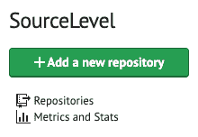
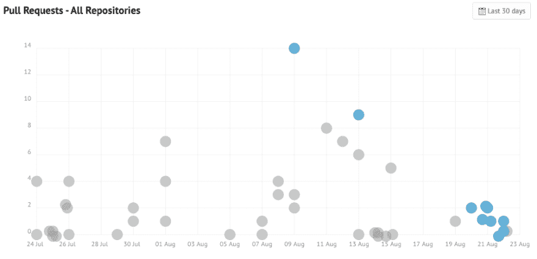
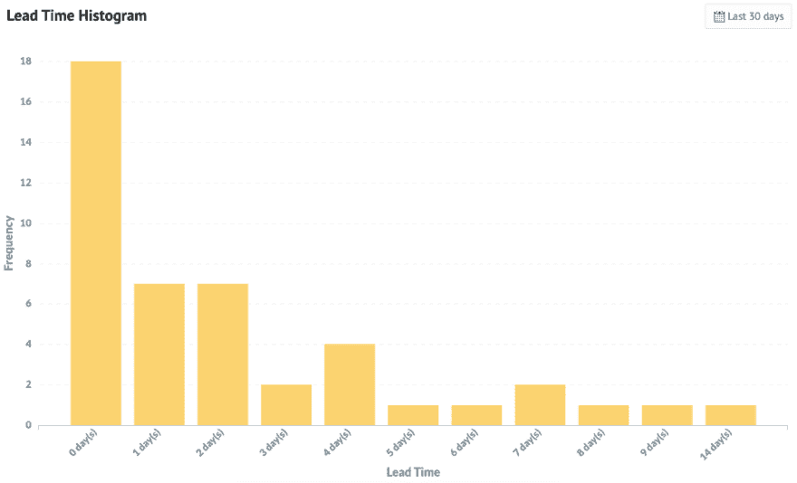
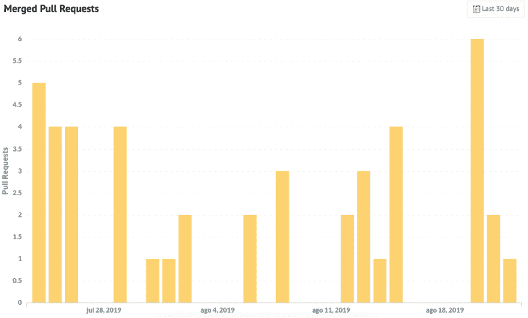

# 功能发布:组织范围的指标

> 原文：<https://dev.to/sourcelevel/feature-announcement-organization-wide-metrics-203f>

我们非常兴奋地宣布一项重要功能:**组织范围的指标**。

SourceLevel 测量整个组织的拉请求的交付时间，即所有存储库的拉请求，并绘制三个图表。每个图表显示了流程的不同方面。

单击您的组织名称下方的*指标和统计信息*链接，即可获得这些信息。

下面，我会对每个图表进行更多的解释，以及它们可能会有什么帮助。

## 您团队的提前期

这个图表显示了所有存储库的拉取请求的交付周期的分布。灰色点是关闭的或合并的拉请求，蓝色点是保持打开的拉请求。

打开/关闭拉式请求的组织范围图表示例

这是了解和改进流程的一个很好的工具。以上面的图表为例，下面是**您的团队可以提出的一些问题**:

*   为什么拉取请求需要超过 14 天才能关闭或合并？
*   从 8 月 11 日到 8 月 15 日，发生了什么事，拉动式请求的关闭或合并时间超过了平均水平？
*   为什么有太多打开的拉取请求？我们应该限制在制品吗？

### **提前期柱状图:**

提前期是拉动式请求保持打开状态的天数。不管是关闭还是合并，都无关紧要。

示例显示了最多在 4 天内关闭的大多数拉取请求。

现在，您可以通过观察图表来判断大多数变更需要多少天才能被合并或关闭。在上例中，**大部分拉取请求最多在 4 天**内关闭或合并。

### **合并拉取请求**

每天走一走，看看当天有多少拉式请求被关闭或合并。如果你需要了解外部事件如何影响生产力，这是一个必不可少的图表。

图表显示每天关闭的拉动式请求的数量

这个图表对于理解提前期过长的影响特别有用。随着提前期的缩短，每天会有更多的拉式请求被关闭或合并。这意味着代码被更快地交付给生产，也就是说，更短的上市时间。

## 期待更快的指标

我们正在努力为您和您的团队寻找有用的指标。更多特定于存储库的指标即将推出，请关注我们的 Twitter ( [@sourcelevelhq](https://twitter.com/sourcelevelhq) )和博客！

## 我们爱反馈！

你有什么建议或改进吗？我们希望听到您的意见，以便我们可以一起改进和完善我们的产品！不要犹豫给我们写信。

如果你很想知道你的公司情况如何，[现在就开始我们的 14 个试验](http://sourcelevel.io/pricing)并找出答案！

post [特性公告:组织范围的指标](https://sourcelevel.io/feature-announcement-organization-wide-metrics)首先出现在[源级别](https://sourcelevel.io)上。