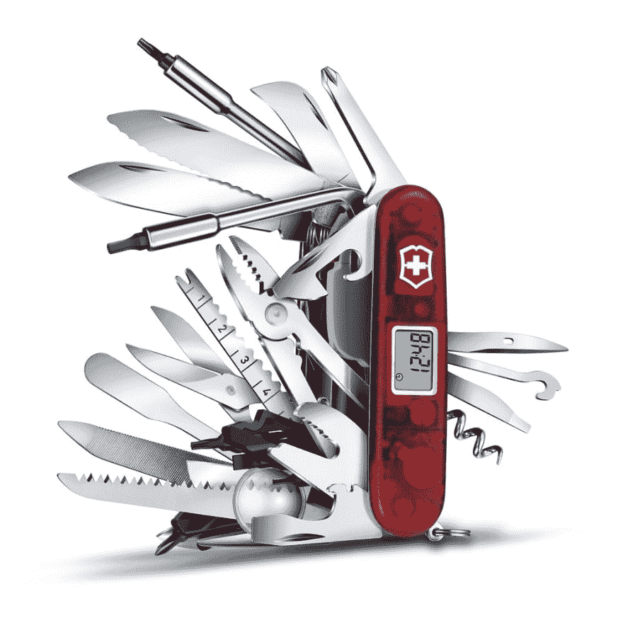

# 我保留什么特征？-软件、棋盘游戏和刀具的设计技巧

> 原文：<https://dev.to/nwdunlap17/feature-creep-and-user-feedback-design-tips-for-games-software-and-knives-2h4g>

## “万能”机器

> “聚焦就是说‘不’。”史蒂夫·乔布斯

我们都经历过:你正在创造一些东西，可能是学校的一个项目，或者是一个 flash 游戏，或者是一个新奇的厨房用具。作为设计师，回答“我的创作能做什么”这个问题是你的工作。。开发人员有一种用“一切”来回答这个问题的天然诱惑。毕竟越多越好，对吧？

这种本能是一个陷阱。理论上多样性听起来不错，但是实际上它会引起很多问题。对于添加到产品中的每一个特性，其他特性都需要改变以适应。一个工具可能需要被改造，软件可能有过于宽泛的范围，营销活动可能会被淡化。即使您避免了这些陷阱，额外的开发时间/复杂性也会表现为价格的增加。因此，制造多个焦点产品通常比制造一个涵盖广泛功能的产品更有效率。

这里有一个真实的例子。想一想，你会用什么工具来完成以下任务？

*   将螺钉插入宜家家具。
*   打开一个啤酒瓶。
*   用一些建筑用纸剪出一个形状。

我猜你的答案是一把螺丝刀、一把开瓶器和一把剪刀。你可以对每个问题都回答“瑞士军刀”,但很明显为什么这不是一个好的首选。每个工具都必须缩小，以便和其他工具一起塞进刀里。这使得很难旋转 T 形螺丝刀，用薄开瓶器抓握，或用短剪刀快速切割。

瑞士军刀实际上是一个有趣的例子，因为它的妥协得到了回报。它的小尺寸和重量使它比全尺寸工具更便于携带。如果有其他工具可用，你永远不会使用瑞士军刀，但因为它适合你的口袋，它总是给你一个有用的选择。通过这种方式，它不是在与“合适的”工具竞争，而是瞄准了自己的利基市场！

传统的瑞士军刀在设计上有一定的局限性，尽管它们用途广泛，但通常每把军刀的功能不到十种。让我们想象一下，如果制造商疯狂地添加他们能想到的每一个功能，会发生什么。外面有那么多工具！如果他们加了钳子呢？放大镜？扳手？锯子怎么样？当然，把它们都扔进去！很快你就会有这样的东西了！

那个庞然大物价值超过 400 美元。许多工具都无法使用。那么小的放大镜毫无意义，你能想象用那把小锯子能切割出什么东西吗？更糟糕的是，它变得太宽了，几乎再也装不进口袋了。在这一点上，任何顾客最好只买一条工具带。

这东西正遭受着*特征蠕变*的糟糕案例。特征蠕变是设计师不断给产品增加越来越多的特征的趋势，远远超过了它不再有意义的程度。在上面这样的实物产品中，任何局外人都很容易看出事情已经失控。但是当设计软件时，这个坏习惯变得很难被发现。

### 筑牢基础，防止特征蠕变

你怎么知道一个特性是会改进还是会阻碍你的设计呢？要回答这个问题，你需要对你的产品的用例有一个坚定的理解。在开始一个项目之前，你应该尽可能彻底地回答下列问题。

*   这个产品是给谁的？
*   人们什么时候会使用这个产品？
*   我希望人们在使用该产品时有什么感觉？
*   该产品将如何与现有的同类产品区分开来？

值得注意的是，这些问题的答案不是特性，它们甚至可能不是用户故事。你不应该说‘我的产品将有 X、Y 和 Z 特性’，因为你可能会发现在原型制作中这些特性并没有你想象的那么好。相反，你应该说‘我的产品将帮助消费者解决 X 问题’。这样，您的产品的驱动焦点是明确的，并且您/您的团队有一个度量来比较不同的实现。

一旦你回答了这些问题，就把它们写下来，当作真理。每当你需要做出一个设计决策时，回到你的答案，问问你自己“为了证明我的答案是正确的，我需要这个特性吗？”如果答案是肯定的，你就应该执行这个决定。这些基本问题也为谁接近完成你的项目提供了一个基准。毕竟，在你检查完基础的每个部分之前，你还没有完成。

但是你如何决定实现你为自己设定的目标的最佳方法呢？你怎么知道是特性 A 还是特性 B 更适合你的产品？

## 客户反馈

只有一种方法可以理解你在创造什么样的用户体验，那就是把你的产品放在用户面前。频繁的原型和测试周期是必要的，以确保你能生产出最好的产品。收集客户反馈的方法有很多种，具体取决于您可用的资源。

许多移动应用公司随机向用户发送不同的更新，然后查看数据来比较用户对每个版本的更新的反应。监控用户花了多少时间与你的产品互动，或者他们最常用的功能是一个很好的数据集，如果你可以实现系统来跟踪它。但是最基本的方法是经过验证的:简单地询问用户关于他们体验的问题。

> “如果我问人们想要什么，他们会说是更快的马”
> ——亨利·福特

坏消息是，说起来容易做起来难。从用户那里获得有用的反馈有很多障碍。不幸的是，当被问到“你觉得这个产品怎么样？”，大多数人不会自动回应深思熟虑的批评和相关的反馈。如果你想要可操作的信息，你必须用引导性的问题来引导你的客户朝着正确的方向前进。

一般来说，你应该尽量让你的问题更具体。你想问的问题会迫使用户思考他们的体验，并提供关键和具体的反馈(如果可能的话，用例子和轶事)。每个问题都应该有针对性，有明确的目的。此外，你可能不应该在每个测试周期问同样的问题，一次专注于提炼几个特性。

当我运行桌面或棋盘游戏的游戏测试时，我会问以下问题:

*   (解释完前提但在玩之前)**你最兴奋去做或尝试什么？**–这有助于我了解我的推销/宣传材料在设定期望值方面做得如何。如果他们期待的东西完全偏离了基础，我需要提高我写作的清晰度。
*   最令人困惑或沮丧的部分是什么？这往往是我在游戏测试后问的第一个问题。它迫使玩家在整个过程中思考，无论他们说什么都是一种批评。我发现很多团队都不太愿意提及他们经历中的负面部分。这个问题有助于设定讨论的基调，让每个人都有正确的心态。
*   **你为什么选择选项 X 而不是选项 Y？**–我希望玩家在体验过程中做出选择，但我希望确保这些选择背后的原因更符合“X 在当时是有意义的”，而不是“X 显然比 Y 好”。
*   另一位玩家做过的最有趣或最难忘的事情是什么？我在我的游戏中有一些机制，鼓励玩家关注和支持彼此。我并不关心他们回答的细节。实际上，我只是在检查他们的回答是否是“我不知道”，因为这意味着我的机制失败了。

### 解读数据

我们已经收集了测试周期的所有反馈。我们已经提出了我们的问题，写下了他们所有的答案，甚至可能会自动记录一些不错的客观数据。所以现在我们要做的就是实施客户建议的修复。很简单，对吧？

我希望。

事实证明，事实往往在反馈中被掩盖。客户可能无法注意到关键特征，错误地归因于感知到的问题，并做出不正确的假设。许多人在他们的反馈中很快直接跳到功能上，详细描述那些没有达到目标或者不符合你的设计目标的“解决方案”。即使看似客观的数据也可能被幸存者的偏见或看不见的因素所困扰。有很多关于顾客以错误的理由抱怨产品的故事。

这是 2003 年《沃尔芬斯坦》发展过程中的一个著名轶事:敌人的领地。Wolfenstein 是一个标准的二战射击游戏，多人对战轴心国和盟军。在游戏测试中，大量玩家发现盟军的汤普森冲锋枪远远优于轴心国的 MP40。这大大出乎开发团队的意料，因为两支枪有相同的统计数据。两把枪之间唯一的区别是型号和音效，但玩家一致认为两把枪非常不同。“普遍的共识是，如果你有一个汤普森，它更慢，但更难击中，MP40 更快，但它更弱，”一位开发者回忆说。更令团队惊讶的是，球员们都是正确的。当他们查看比赛数据时，汤普森的命中率要比据称相同的 MP40 高得多。经过彻底混乱的检查，该小组得出结论，差异是由于两支枪产生的声音效果。汤普森的枪声比 MP 40 的低音明显更强。它听起来更有力，玩家感觉更自信，这种自信导致他们比 MP40 的玩家更容易尝试爆头。这个问题的“修复”只涉及降低汤普森镜头的低音。后来，玩家们觉得这把枪被“降低”到了合适的能量水平。

正确理解这个故事的寓意很重要。即使技术上没有问题，客户也察觉到了，并且如此强烈地相信它，以至于它实际上扭曲了收集的数据。这个发明的问题仍然让顾客不高兴，如果不加以控制，就会把他们赶走。从这个意义上说，感知到的问题和其他任何问题一样真实。

所以，当你有了数据，你注意到一个强劲的趋势，不要只看表面价值。调查、迭代和测试可能的解决方案，因为真正的问题可能是每个人都认为理所当然的事情。