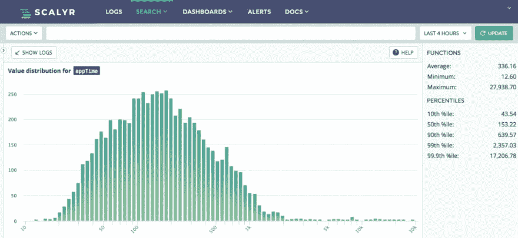
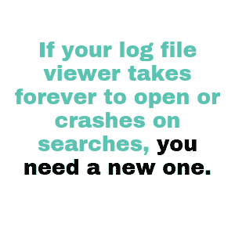
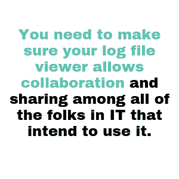

# 一个好的日志文件查看器的特性

> 原文：<https://dev.to/scalyr/features-of-a-good-log-file-viewer-4cjm>

当您想到日志文件查看器时，您会想到什么？拜托，说实话。

[Vim](https://vim.sourceforge.io/) 还是 [Emacs](https://www.gnu.org/software/emacs/) ？[记事本++](https://notepad-plus-plus.org/) 还是[崇高](https://www.sublimetext.com/)？你只是从命令行调用“tail”吗？

请说你不只是在 Windows 中使用记事本。没有判断，但如果你走那条路，你会让自己经历很多不必要的痛苦。

在本文中，我们将更详细地了解日志文件查看器在 2019 年的今天到底是什么。然后，我们将了解优秀的日志文件查看器所具有的特性，以及您应该寻找的特性。

## 日志文件查看器不仅仅是一个文本编辑器

我询问了前面提到的工具 **—** 文本编辑器 **—** ，因为这就是我们对日志文件查看器的理解。日志是文本文件。

因此，当我们去查看它们时，我们使用的是一种用于查看(和编辑)文本的工具。

这是完全可以理解的，而且自从半个世纪前一些程序员第一次有了将运行时信息输出到文件的想法以来，它也很好地服务了我们这个行业。

或者，至少，这已经足够了。

使用文本编辑器查看日志文件为我们提供了故障排除的基础知识。我们可以查看文件中包含的信息，还可以进行不同复杂程度的文本搜索。如果有必要，我们可以复制并修改文本。

但是生存并不意味着繁荣。

当谈到使用日志文件查看器时，我们可以要求更多。在 2017 年，这真的不应该令人惊讶。[软件正在“吞噬世界”](https://techcrunch.com/2016/06/07/software-is-eating-the-world-5-years-later/)devo PS 运动给我们带来了 SaaS 和帮助软件商店的工具的爆炸式增长。

现代日志文件查看器可以做一些很棒的事情，这真的应该让任何人感到惊讶吗？

让我们来看看在选择一个工具来帮助您查看日志时，您应该期待什么。

在这个时代，一个好的日志文件查看器有什么特点？

## 1.日志文件查看器应该能够很好地进行查看

还记得我是怎么问记事本的，我是怎么说它给你带来的痛苦的吗？

这不是反对工具；记事本是一个很好的记事本。你快速打开它，为以后做一些文本笔记，然后关闭它。

但是你试过用它打开一个巨大的文本文件吗？

它会挂起，然后可能会在某个时候崩溃。或者，如果你离开了一个晚上，运气好的话，你可能会发现你的文件在早上被打开了，这时你可以慢吞吞地查看它。

这是一个非常有目的的扩展的例子。这是有道理的，因为记事本并不是用来做这种事情的。

但是，当您谈论日志文件查看器时，它们正是为了这类事情而存在的。因此，一个好的日志文件查看器应该能够轻松地扩展到大量的日志，并且在打开这样的文件时表现得很智能。

这意味着它应该立即加载，没有迟滞，向您显示文件中的一些数据子集。然后它应该开始在后台加载更多的内容，或者在你需要的时候按需加载。

如果您的日志文件查看器需要很长时间才能打开或在搜索时崩溃，您需要一个新的。

## 2.复杂而直观的搜索

说到搜索，这是日志文件查看器的下一个需求。当你[在日志管理工具](https://www.scalyr.com/blog/choosing-among-log-management-tools/)中选择时，确保你的浏览器能够执行复杂的搜索。

文本编辑器，这种查看的历史工具，在这里有各种功能。有些，比如前面提到的记事本，只支持基本的文本搜索。

其他的可能有更复杂的功能，比如通配符搜索或者甚至是对 regex 的支持。但是它们仍然不是为我们心目中的用例而设计的。

这些文本编辑器用于编辑文本 **—** ，而不是查看和解析大量的文本数据。

当然，一个好的日志文件查看器可以支持这些搜索。但是[比这更进一步，](https://www.scalyr.com/blog/searching-1tb-sec-systems-engineering-before-algorithms/)使用了专门为这个问题空间设计的算法技术。

此外，从用户体验的角度来看，它也应该让你的搜索更加愉快。

尽管每个人都喜欢重温他们的 regex 技术或者搜索复杂的食谱，但是一个好的日志文件查看器不应该强迫你这么做。

相反，它应该提供视觉搜索帮助，让你的体验尽可能简单。

## 3.可视化工具很重要

乍一看，谈论可视化似乎有点奇怪。日志文件查看器的全部前提不就是让你可视化你的日志吗？

是的，文本编辑器允许您实际查看日志文件中存在的文本。但是不，它并不能真正帮助你想象它。

以下是可视化日志的样子。

你的日志文件真正包含的不是文本，而是*数据*。这意味着你可以有意义地量化它并观察趋势。

然后，您可以使用一个好的工具来以图形格式表示这些趋势。如上图所示的图表是其中重要的一部分，仪表板也是如此。

视觉效果让您可以即时、引人注目地了解日志发生了什么。如果文本是您唯一的查看方式，那么您的日志文件中的 [403 代码](https://httpstatuses.com/403)中的一个巨大尖峰可能会被忽略。

但是，如果你有一个 403 的图表，显示在过去的一个小时里有一个巨大的峰值，你马上就会知道有些可疑的事情正在发生。

## 4.它还应提供报告

可视化数据至关重要。但拥有报告这些数据的手段也同样重要。前者可以帮助你在趋势发生时监控趋势，并理解你的软件所描绘的大图景。

但是后者可以让您将这些趋势传达给外部的利益相关者，包括非技术人员。

您的日志文件存储的数据，经过适当的交流，应该会引起每个人的兴趣。当然他们会有错误代码和高度技术性的操作细节。

但是他们也可以让你描绘出诸如正常运行时间、可靠性、流量和收入等情况。

您选择的日志文件查看器应该为您提供一种基于这些问题(或您想到的任何其他问题)生成定制报告的方法。

然后，您可以获取这些报告，并利用可视化的力量为您的非技术同行描绘一幅图画。

## 5.它们为您提供了共享信息和协作的方式

乍一看，“意味着共享信息”可能听起来像是描述可视化和报告功能的另一种方式。

但我不是在专门谈论可视化，也不是在谈论与 IT 团队之外的人进行信息社交。

相反，我说的是团队内部的协作。

如果您有一个奇特的工具，可以让您搜索日志、生成图表并报告它们，那当然很好。但是如果你是团队中唯一拥有这种能力的人，它的用处就变得有限了。

或者，如果每个人都有这个工具，但您必须为每个使用它的人重新创建相同的图表和报告，它的用处同样会变得有限。

您需要确保您的日志文件查看器允许打算使用它的所有人之间的协作和共享。

如果我创建一个仪表板并保存它，您应该能够引用该仪表板。对于它提供给您的任何其他自定义功能也是如此。

## 利用外面的东西

我决不会给你一个日志文件查看器能为你提供什么的详尽列表。

我在这里的目的只是简单地列出一些强大的功能，以便让您知道您可以使用哪些功能。

如果您正在使用您最喜欢的文本编辑器查看日志文件，甚至是记事本或 shell，这是完全可以理解的。这些工具已经存在很长时间了，你用起来很舒服，而且它们以某种方式完成了工作。

但是你错过了。

您的日志文件以数据的形式为您提供了大量有价值的信息。通过挑选和使用复杂的日志文件查看器，确保您能够充分利用这些数据。