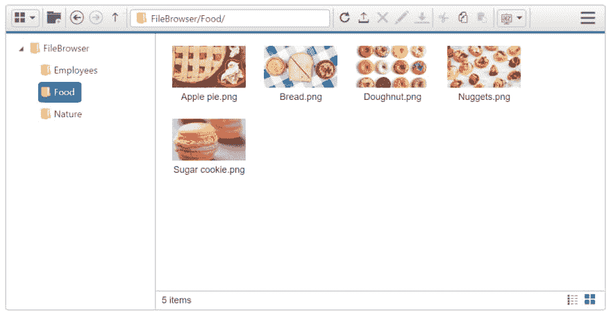
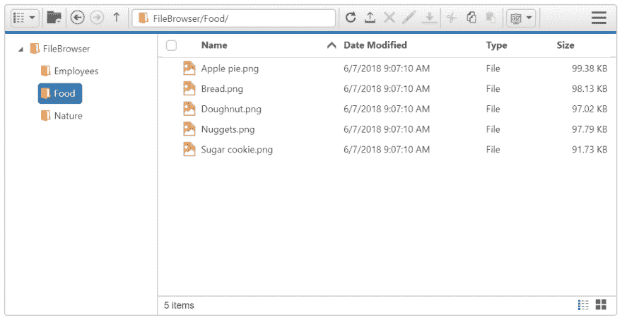
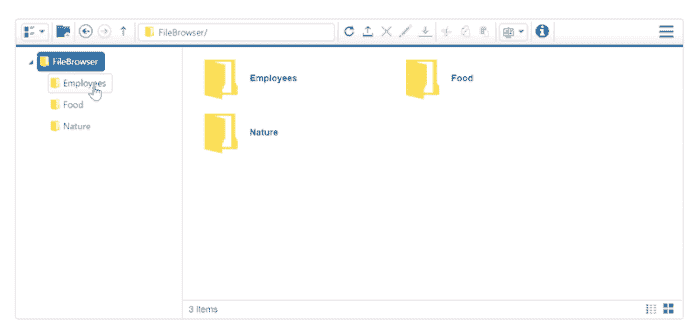
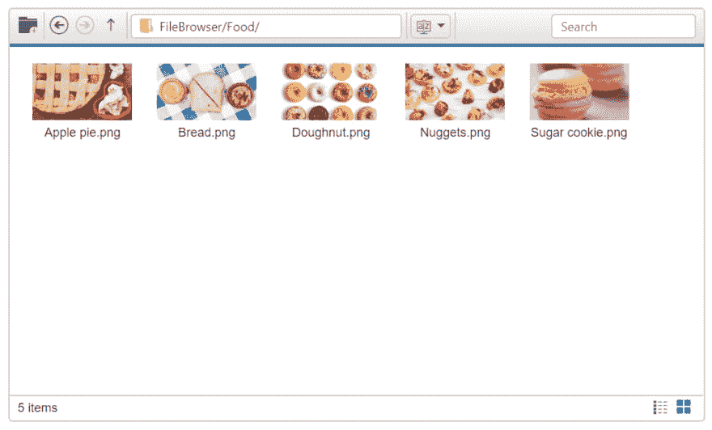
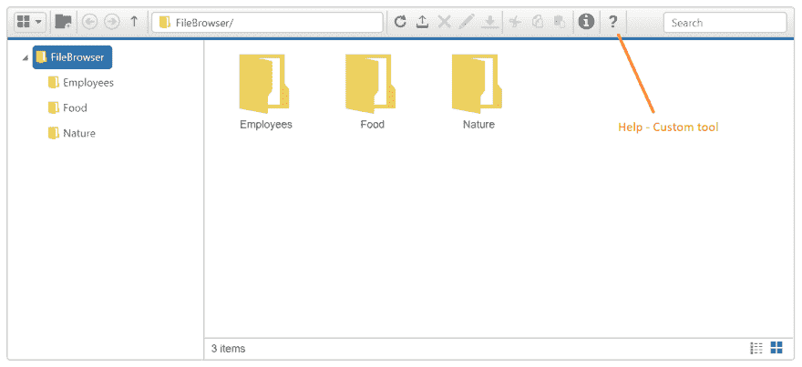
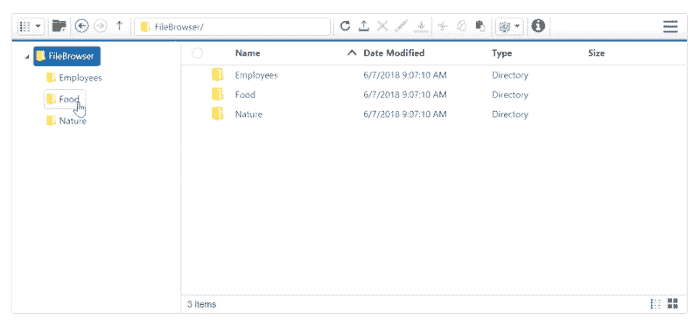
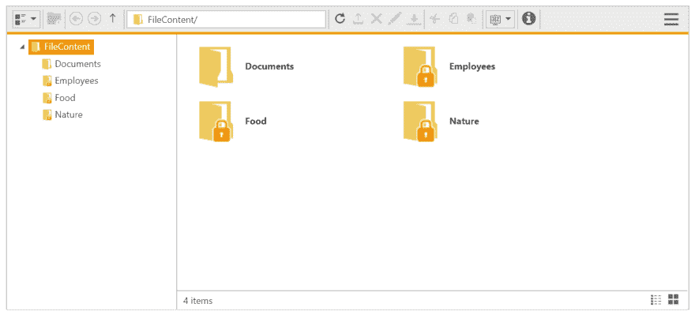
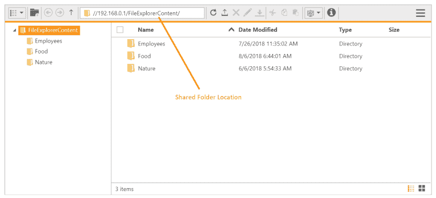

# JavaScript 中的文件浏览器

> 原文：<https://dev.to/syncfusion/file-explorer-in-javascript-4j2a>

JavaScript 的文件资源管理器控件在 web 应用程序中提供了一个类似 Windows 资源管理器的界面，允许最终用户浏览、上传和下载文件。可以通过重命名、移动或删除文件夹和文件来更改文件夹结构，并且可以自定义控件的布局和文件夹管理。

这个博客将解释文件资源管理器组件中可用的特性。

## 布局类型

文件资源管理器控件支持两种查看文件的布局:

*   平铺视图
*   网格视图

    <figure>

    <figcaption>文件浏览器布局带平铺视图</figcaption>

    </figure>

    <figure>

    <figcaption>文件浏览器布局带详细网格视图</figcaption>

    </figure>

## 图像预览

您可以通过双击图像来预览图像，这将在对话框窗口中打开图像。然后，可以通过调整对话框的大小来缩放预览的图像。

 

<figure>

<figcaption>文件浏览器内置图像预览选项</figcaption>

</figure>

## 自定义布局

可以自定义文件资源管理器面板的布局。

 

<figure>

<figcaption>带有自定义布局的文件浏览器</figcaption>

</figure>

## 自定义工具支持

在文件资源管理器工具栏中，您可以创建带有自定义操作的自定义工具。例如，这里的帮助工具是作为工具栏中的自定义工具创建的。

 

<figure>

<figcaption>文件浏览器带自定义工具</figcaption>

</figure>

## 支持排序

在详细视图或网格视图中，文件可以按所需字段排序。

 

<figure>

<figcaption>按升序/降序排列文件</figcaption>

</figure>

## 虚拟化

文件资源管理器有一个虚拟滚动选项，当你滚动内容时，它将按需加载文件。当文件系统的存储中有大量文件时，这将提高性能。

 

<figure>

<figcaption>虚拟滚动大量文件</figcaption>

</figure>

## 文件访问控制

通过将对特定文件和文件夹的访问权限授权给特定的人或组，可以在安全的文件系统中使用文件资源管理器。通过为您的文件和文件夹定义一组访问规则，您可以授权他人读取、写入、删除和上传文件。

这些访问规则在服务器端得到验证，因此更加安全，未经授权的人无法访问。

 

<figure>

<figcaption>访问权限受限的文件夹</figcaption>

</figure>

在前面的屏幕截图中，访问权限被提供给文档用户，因此只有 documents 文件夹可以被访问，其余的文件夹受到限制。

## 共享文件夹支持

文件资源管理器还可以管理本地共享机器上的文件和文件夹。当您通过 intranet 环境访问文件时，这很有用。

 

<figure>

<figcaption>访问共享位置</figcaption>

</figure>

## 其他存储支持

除了默认的文件系统，文件资源管理器还可以用作在线文件系统和其他存储的用户界面。目前，文件资源管理器支持浏览以下存储:

1.  Azure 存储
2.  SQL 数据库

### Azure 存储支持

Azure storage 是微软提供的基于云的存储，用于存储数据对象、文件系统服务等。默认的文件资源管理器被设计用于一般的文件系统，所以通过扩展功能，我们可以执行 Azure 存储相关的操作。

Azure 相关的操作已经在下面的知识库中进行了处理和解释，在这里你可以获得 ASP.NET 核心和 MVC 平台的示例。

[https://www . sync fusion . com/kb/8355/how-to-access-the-azure-storage-files-in-file explorer](https://www.syncfusion.com/kb/8355/how-to-access-the-azure-storage-files-in-fileexplorer)

您可以通过替换您的 Azure 存储细节来进一步扩展该示例。

### SQL 数据库支持

在某些情况下，文件系统可能由 SQL 数据库提供服务。对于 SQL 数据库，文件访问操作也将有所不同。这也可以通过扩展文件操作来处理。

这一点已经完成，并在下面的文档部分用示例进行了解释:

[https://help . sync fusion . com/aspnet MVC/file explorer/how-to #管理 sql 数据库中可用的文件](https://help.syncfusion.com/aspnetmvc/fileexplorer/how-to#managing-files-that-is-available-in-sql-database)

您可以通过替换与 SQL 数据库相关的设置来进一步扩展该示例。

## 总结

总的来说，文件资源管理器组件是为所有文件操作而设计的，它还可以根据应用程序的观点进一步扩展，或者支持其他文件存储。

如果你想尝试文件资源管理器组件，你可以下载免费试用版。您也可以查看我们的[样本浏览器](https://js.syncfusion.com/demos/web/#!/bootstrap/fileexplorer/DefaultFunctionalities)和[文档](https://help.syncfusion.com/js/fileexplorer/overview)以获得进一步的详细解释。

如果你有任何问题或需要澄清，请在下面的评论区告诉我们。您也可以通过我们的[支持论坛](https://www.syncfusion.com/forums)或 [Direct-Trac](https://www.syncfusion.com/support/directtrac/incidents) 联系我们。我们随时乐意为您提供帮助！

如果你喜欢这篇博文，我们认为你也会喜欢下面的免费资源:

[【电子书】SQL Server for C#开发者简洁地](https://www.syncfusion.com/ebooks/sql_server_for_c_sharp_developers_succinctly)
[【电子书】Aurelia 简洁地](https://www.syncfusion.com/ebooks/aurelia_succinctly)
[【电子书】AngularJS 简洁地](https://www.syncfusion.com/ebooks/angularjs)
[【电子书】SQL Azure 简洁地](https://www.syncfusion.com/ebooks/sqlazure)
[【博文】介绍 Syncfusion 新的用于 Web 的 JavaScript 文字处理器组件](https://blog.syncfusion.com/post/introducing-syncfusion-s-new-javascript-word-processor-component-for-web.aspx)
[【博文】介绍 Syncfusion 新的用于 Web 的 JavaScript 图表组件](https://blog.syncfusion.com/post/introducing-syncfusions-new-javascript-diagram-component-for-web.aspx) 

JavaScript 中的帖子[文件浏览器最早出现在](https://blog.syncfusion.com/post/file-explorer-in-javascript.aspx) [Syncfusion 博客](https://blog.syncfusion.com)上。