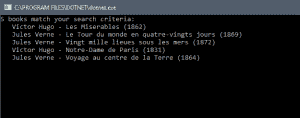
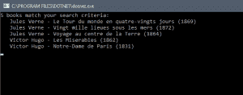
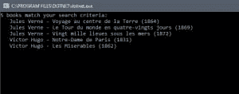

# 使用 LINQ 过滤列表

> 原文：<https://dev.to/bradwellsb/filter-a-list-using-linq-4bjo>

[来源](https://wellsb.com/csharp/beginners/linq-syntax-filter-list/)

中的 **L** 语言**集成了 **Q** 查询( **LINQ** )语法，这是一种在 C#中处理集合的强大方法。在本教程中，你将学习如何使用 LINQ 从 C#列表中过滤数据。您还将学习如何将 LINQ 查询链接在一起，以便准确返回您感兴趣的数据。**

## 初始设置

本教程的初始设置类似于[之前的教程](https://wellsb.com/csharp/beginners/linq-syntax-sort-list/)。我们将继续图书馆中图书编目的例子。从下面的代码开始。您将看到我们已经创建了一个 Book 类(第 27-39 行),它将保存每本书的标题、作者和出版日期。此外，我们已经初始化了十本书的集合，特别是第 11-23 行的`List<Book>`。还要注意，我们已经引用了`System.Linq`和`System.Collections.Generic`的名称空间(第 2-3 行)。如果您对此有任何疑问，请随时查看以前的教程。

```
using System;
using System.Linq;
using System.Collections.Generic;

namespace IntroducingLINQ
{
    class Program
    {
        static void Main(string[] args)
        {
            List<Book> bookList = new List<Book>()
            {
                new Book("Les Miserables", "Victor Hugo", 1862),
                new Book("L'Etranger", "Albert Camus", 1942),
                new Book("Madame Bovary", "Gustave Flaubert", 1857),
                new Book("Le Comte de Monte-Cristo", "Alexandre Dumas", 1844),
                new Book("Les Trois Mousquetaires", "Alexandre Dumas", 1844),
                new Book("Candide", "Voltaire", 1759),
                new Book("Notre-Dame de Paris", "Victor Hugo", 1831),
                new Book("Vingt mille lieues sous les mers", "Jules Verne", 1872),
                new Book("Le Tour du monde en quatre-vingts jours", "Jules Verne", 1869),
                new Book("Voyage au centre de la Terre", "Jules Verne", 1864)
            };
        }
    }

    class Book
    {
        public string Title { get; set; }
        public string Author { get; set; }
        public int PubDate { get; set; }

        public Book(string title, string author, int pubDate)
        {
            Title = title;
            Author = author;
            PubDate = pubDate;
        }
    }
} 
```

## LINQ 方法语法:过滤 C#列表

在之前的教程中，你学习了两种和 LINQ 一起工作的方法。在本教程中，我们将只关注第二种方法，LINQ 方法语法。

假设我们只想列出儒勒·凡尔纳写的书。C#集合允许使用`Where()`方法，该方法可用于根据指定的条件过滤集合。在`Where()`方法中，我们可以使用 lambda 表达式为集合中的每个给定实例定义我们想要的条件。

```
var subList = bookList.Where(p => p.Author == "Jules Verne");

Console.WriteLine($"{subList.Count()} books match your search criteria:");
foreach (Book book in subList)
{
    Console.WriteLine($" {book.Author} - {book.Title} ({book.PubDate})");
}

Console.ReadLine(); 
```

这段代码应该在您的`static void Main()`方法结束之前添加，但是在`bookList`初始化之后添加。在本例中，您将在第 25 行看到一个 lambda 表达式，它检查作者的姓名。只有集合中 lambda 表达式解析为 true 的那些实例才会被返回并添加到一个新列表中，`subList`。本质上，第 25 行告诉我们的程序执行以下逻辑:*对于集合中的任何给定项目，检查它是否匹配指定的标准。如果是的话，把它加入新的收藏*。

您可以在 lambda 表达式中使用逻辑运算符来进一步限制或扩大搜索范围。例如，如果您想要包含儒勒·凡尔纳或维克多·雨果写的书，您可以使用逻辑 or 运算符`||`来组合查询。

```
var subList = bookList.Where(p => p.Author == "Jules Verne" || p.Author == "Victor Hugo"); 
```

[](https://wellsb.com/csharp/wp-content/uploads/sites/2/2019/07/beginners-linq-filter-unsorted-min.png)

## 过滤和排序

上面经过筛选的列表很好，但是组织得不好。现在我们有了一个过滤后的结果列表，我们可能希望对它进行排序，以确保同一作者的书籍被分组在一起。幸运的是，在 C#中有一种方法可以将多个方法链接在一起。这样做可以将我们的过滤列表与我们之前学习的排序方法结合起来。

您可以使用`.`令牌将第 25 行的`Where()`方法与`OrderBy()`方法链接在一起。

```
var subList = bookList.Where(p => p.Author == "Jules Verne" || p.Author == "Victor Hugo").OrderBy(p => p.Author); 
```

[](https://wellsb.com/csharp/wp-content/uploads/sites/2/2019/07/beginners-linq-filter-chain-min.png)

得到的列表是一个改进，但是有没有一种方法可以将书籍按作者分组，然后按出版日期排序？LINQ 提供了一种应用二级排序的方法，我们可以用它来达到我们想要的结果。为此，将一个`ThenBy()`方法链接到查询。您的代码将类似于:

```
var subList = bookList.Where(p => p.Author == "Jules Verne" || p.Author == "Victor Hugo")
    .OrderBy(p => p.Author)
    .ThenBy(p => p.PubDate); 
```

现在，我们的 LINQ 查询将我们的藏书过滤到只有维克多·雨果或儒勒·凡尔纳写的书(第 25 行)。接下来，它按照作者对结果列表进行排序(第 26 行)。最后，它根据出版日期进行二次排序(第 27 行)。这将产生如下所示的输出:

[](https://wellsb.com/csharp/wp-content/uploads/sites/2/2019/07/beginners-linq-filter-sorted-min.png)

## 底线

在本教程中，您学习了如何使用 LINQ 查询筛选 C#集合。具体来说，您学习了如何使用`Where()`查询根据指定的参数过滤`List<T>`。您还了解了如何将方法链接在一起，并使用这种技术向过滤列表添加了一个主要排序`OrderBy()`和一个次要排序`ThenBy()`。

[来源](https://wellsb.com/csharp/beginners/linq-syntax-filter-list/)