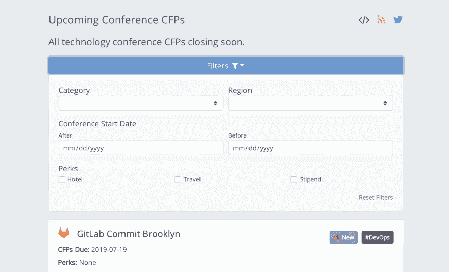

# 在前端过滤许多选项

> 原文：<https://dev.to/karllhughes/filtering-many-options-on-the-frontend-bl6>

我的一个朋友最近给我发了一封电子邮件，询问他如何在 Javascript 中过滤一大堆条目。他开始时只有几个过滤器，但随着越来越多的过滤器加入，过滤匹配变得越来越复杂。

我最近在为 CFP 土地构建新的[过滤功能时遇到了类似的问题。我希望用户能够将具有开放 CFP 的会议限制在那些符合他们标准的会议上，由于列表不是很大(通常少于 100 个)，我决定在前端实现它。](https://www.cfpland.com/conferences/)

[](https://res.cloudinary.com/practicaldev/image/fetch/s--cgUzbteo--/c_limit%2Cf_auto%2Cfl_progressive%2Cq_auto%2Cw_880/https://thepracticaldev.s3.amazonaws.com/i/cq9c5nkam9x020w8twy0.png)

虽然这种解决方案没有优化，但它确实限制了任何一种滤波器的复杂性。在性能差异可以忽略不计的情况下，更好的选择是让代码对那些优化的代码更具可读性的解决方案。

首先，我创建了一个主过滤函数:

```
function filter(allResults, options) {
    return allResults.filter(result => passesFilter(result, options))
} 
```

其中`allResults`是列表中所有项目的数组(在我的例子中是会议)。

接下来，我创建了一个`passesFilter`函数，该函数最终将返回一个布尔值(`true`或`false`)，这取决于一个单独的项目是否通过了所有给定的过滤选项:

```
function passesFilter(result, options) {
    const results = [];

    if (option.firstOption) {
        results.push(resultPassesFirstOption(result, options.firstOption));
    }

    // TODO: Repeat for as many options as you want.
    // You'll end up with an array of true/false statements

    return results.every(result => result);
} 
```

如果`results`数组中的所有元素都是`true`，最后一行使用`every`返回`true`。

最后，我实现了真正业务逻辑所在的`resultPassesFirstOption`函数:

```
function resultPassesFirstOption(result, option) {
    // TODO: Return true or false depending on the result and option
} 
```

现在，您只需要创建函数和`if`语句来处理您想要支持的每个选项。

你怎么想呢?你知道在 Javascript 中使用复杂选项过滤项目的更有效的方法吗？让我在评论中听到你对这个问题的解决方案👇。