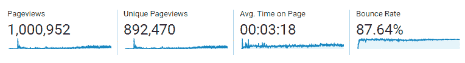
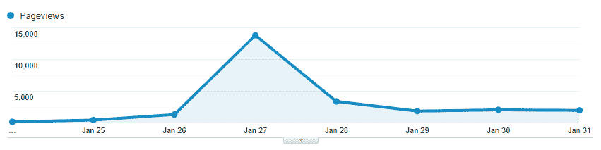
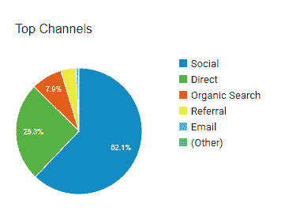
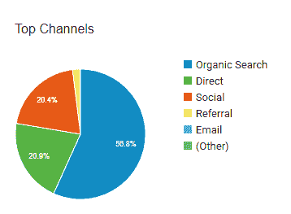
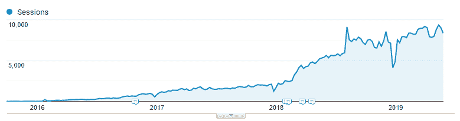
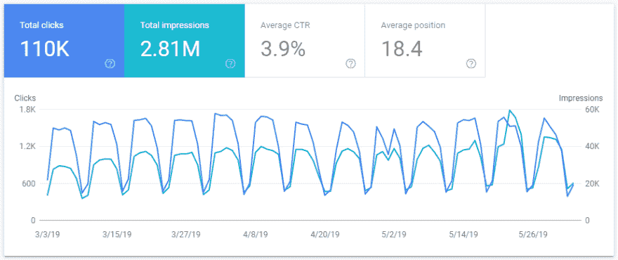
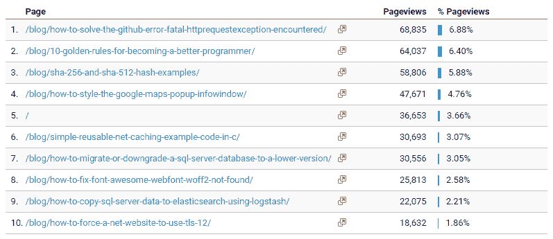
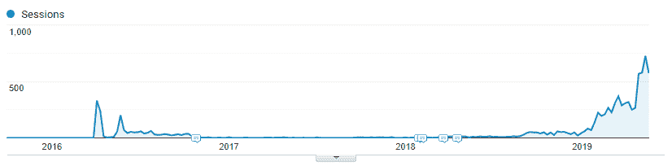

# 了解我的开发博客是如何达到 100 万页面浏览量的

> 原文：<https://dev.to/prjseal/find-out-how-my-dev-blog-reached-1-million-page-views-33pj>

在这篇文章中，我将告诉你我的博客是如何达到 100 万浏览量的。

## 一切开始的地方

我开始写博客有三个主要原因:

1.  为我自己创造一个个人品牌，并帮助促进我的事业
2.  我想分享我作为一名 web 开发人员学到的有用的技巧和工具
3.  我想把 [Umbraco CMS](https://umbraco.com) 作为一个内容编辑器，而不仅仅是一个开发者

当我听了约翰·桑梅兹的书《软技能》后，我才意识到拥有一个博客是多么的有用。他告诉你拥有个人品牌有多重要。不管你现在是否想换工作，你都应该推销自己。作为一名开发人员，最好的方法之一就是拥有一个博客。这本书里有很多好的建议，我总是向人们推荐它。

如果你像我一样喜欢听有声版的书，也可以在 [Audible](https://codeshare.co.uk/audible) 上找到。我就是这么“读”出来的。

约翰的建议对我来说很有价值。我开始写博客，试图对别人有所帮助。每当我遇到一个很难解决的问题时，我会写一篇博文来帮助其他人摆脱这种痛苦，让他们更容易解决。

## 我的第一次幸运突破

在大约 4、5 个月的时间里，我写了很多文章，但没有多少人阅读，于是我在工作的午休时间写了一篇名为[成为更好的程序员的 10 条黄金法则的文章。](https://codeshare.co.uk/blog/10-golden-rules-for-becoming-a-better-programmer/)我听说列表风格的帖子很受欢迎，固执己见的帖子似乎会把人们分成两类，喜欢的人会分享，不喜欢的人也会分享，甚至只是告诉人们他们不同意。无论如何，这篇文章在编程社区引起了一些轰动。我把它放在 facebook、twitter 和 LinkedIn 等社交网站上。我还在[黑客新闻](https://news.ycombinator.com/)上分享了它，这是一个很好的举动，因为它在一天的大部分时间里都停留在头版。一天之内，该帖子获得了近 14，000 次页面浏览，一周之内，该帖子获得了约 25，000 次页面浏览。

许多人从他们的网站上链接到这个帖子，在 twitter、facebook 和 LinkedIn 上分享，甚至将它包括在他们的编程电子邮件通讯中。正因为如此，它对我的谷歌搜索引擎优化排名帮助很大。尽管流量在第一周之后回落了，但谷歌开始为我的这篇文章和我的其他一些文章发送流量。

## 列表帖子做得好

继我的 10 条黄金法则帖子成功之后，我意识到列表帖子做得很好，所以我开始考虑我可以写的其他帖子:

*   [在面试中脱颖而出的 10 个技巧](https://codeshare.co.uk/blog/10-tips-for-being-outstanding-in-an-interview/)
*   [10 个免费的、非常有用的网站开发者工具](https://codeshare.co.uk/blog/10-free-highly-useful-tools-for-web-developers/)

这些帖子产生了相当多的流量，但这和我从 10 条黄金法则文章中看到的流量完全不同。我想要那种兴奋的感觉。我在追它。

## 我手动驾驶交通

因为我想看到我的网站有大量的流量，所以我到处分享文章。当时，分享它们最有效的地方是 LinkedIn 群组。的。NET Developers group 有 30 万成员。即使人们不喜欢我的帖子，他们也会对它发表评论，它会保持在小组的顶部，当他们点击它时，会给我的网站带来流量。这是不可持续的。人们会厌倦看到我的文章出现在这些群组的顶端。我把它塞进了他们的喉咙。相反，交通应该是有机的。

第一年，我的网站只有 7.9%的流量是有机的，62.1%来自社交网站。

我需要专注于创造人们想要搜索的好内容，而不是列表中的噱头内容，或者意见两极分化的帖子。

*   为什么不应该在代码中写注释。
*   如果真等于真，请告诉我你不写

它们对读者没用，只是让人们从 reddit 等网站点击进来。

## 越来越技术化

我开始写更多基于教程的博客文章。帮助人们解决问题，而不仅仅是在谷歌分析中给我即时的页面浏览量。

在我写博客的第二年，这些技术性更强的帖子做得很好:

*   [SHA 256 和 SHA 512 哈希示例](https://codeshare.co.uk/blog/sha-256-and-sha-512-hash-examples/)
*   [如何设计谷歌地图弹出信息窗口](https://codeshare.co.uk/blog/how-to-style-the-google-maps-popup-infowindow/)

它们是我自己的问题的解决方案，其他人也在寻找解决方案。

所以在我写博客的第二年，56.8%的页面浏览量来自有机搜索。

## 保持一致

约翰·桑梅兹说，如果你打算写博客，你需要每周至少写一篇文章，并保持一致，每天定期发布文章。这有助于创造一个追随者。

我会说我比一贯更多产，但每周至少一篇的定期帖子确实有助于有机搜索。

这张图表显示了从开始到 2019 年 6 月 1 日(3.5 年)的有机流量

## 重新设计并转向 https

2018 年初，我将网站改为通过 https 运行，我担心会搞砸它，失去我所有的有机流量，但幸运的是，我已经将正确的重写规则放在适当的位置，将流量重定向到 https 路由。

我也掉了 [www](http://www) 。去掉地址的前面，使它成为一个更短的 url。我已经不得不把重定向到位，我还不如抓住这个机会，而我在这里。

我的网站看起来非常自举，不是很现代。我想买一个新的高级主题，看起来更专业，所以我做了一些研究，发现[创意蒂姆](https://codeshare.co.uk/creative-tim)制作了最好看的高级引导网站。我不得不为这个主题支付大约 50 美元，但它是值得的。

我不知道以上哪件事是有责任的，但我的有机流量从那时起就一直在增长。从 2018 年开始见上图。

## 不要去改变

此刻我不敢改变任何事。搜索引擎优化对我来说似乎是完美的。我只包括元描述和元关键字。我不实现 schema.org 或任何东西。

我只是继续写帖子来帮助人们克服我遇到的错误，比如:

*   [如何解决 GitHub 错误 fatal:遇到 HttpRequestException】](https://codeshare.co.uk/blog/how-to-solve-the-github-error-fatal-httprequestexception-encountered/)
*   [如何修复字体 Awesome WebFont woff2 找不到](https://codeshare.co.uk/blog/how-to-fix-font-awesome-webfont-woff2-not-found/)

我必须对这些帖子做些正确的事情，因为谷歌现在很喜欢我的网站。

这是过去 3 个月谷歌搜索控制台的视图

## 我的前 10 页

## 总结

帮助我的网站达到 100 万页面浏览量的主要因素是:

*   不要放弃
*   保持一致
*   解决别人的问题
*   通过 https 服务网站
*   有一个体面的溢价主题
*   根据人们搜索的内容来命名文章
*   使用像样的内容管理系统，如 [Umbraco](https://umbraco.com)

## 恐龙的结局

3 年前，我写过一个帖子，做过一个视频，关于[如何在 Google Chrome](https://codeshare.co.uk/blog/how-to-find-the-hidden-dinosaur-game-in-google-chrome/) 中找到隐藏的恐龙游戏。起初它还算流行，但很快就销声匿迹了。就在最近，我注意到它再次成为我网站上的热门页面。以下是《邮报》的流量:

