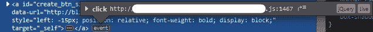

# Chrome 开发工具中类似 Firefox 的事件监听器检测？

> 原文：<https://dev.to/fcfn/firefox-like-event-detection-in-chrome-dev-tools-3688>

我发现火狐开发者版开发者工具的这个功能非常有用。有人知道在 Chrome 开发工具中是否有可能获得相同的功能吗？我习惯于 Chrome(JetBrains ide 也只在高级 JS 调试中使用 Chrome)，但与在 Chrome 中查找特定事件侦听器相比，这是一个非常棒的特性，除非必要，否则我不喜欢在 Firefox 和 Chrome 之间切换。

也许某个地方有我可以投票支持的功能请求？