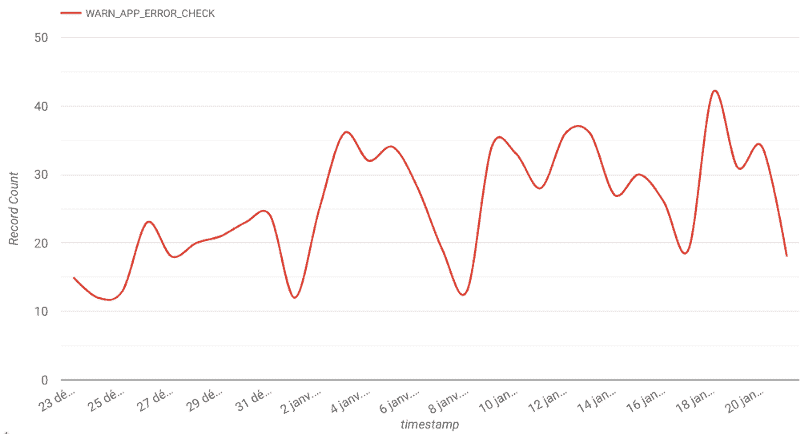

# 测试固件不明显:生产监控

> 原文：<https://dev.to/fouge/firmware-testing-is-not-obvious-production-monitoring-a28>

我想在这里分享一些最初发布在媒体上的生产监控过程的一部分，网址是 https://Medium . com/equi sense/quality-assurance-for-firmware-production-monitoring-68 CD 5 fcf 038d

* * *

你可以尽可能多地测试你的软件，你正在开发的产品可能在办公室工作得很好，但无疑会在最终用户的手中出现许多意想不到的问题。固件很难在真实环境中调试，开发人员不得不承认，为了方便起见，他们往往会忽略现场发生的问题🙄。我想在这篇文章中分享的几个解决方案让我意识到生产中的追踪器有多少缺陷…我现在后悔以前没有实施这些想法。

## 保持光亮

首先，为了捕捉生产中的错误，我想记录使用数据。在嵌入式设备上记录任何类型的数据显然比在个人电脑上更难，因为在目标上没有太多的空间来存储整个程序。此外，快速传递所有信息的无线通信最终会受到限制，例如使用蓝牙低能耗。因此，想象一下，必须将许多人类可读的句子保存在固件中，以无线方式发送到远程对等点:这太沉重了。

考虑到这一点，我实现了一个轻量级的解决方案:每个日志必须包含在最多 18 个字节中(BLE 4.0 对每个数据包中 20 个可用字节的限制)。首先，错误代码使用一个字节。然后，一个人类可读的字符串给出关于错误的更多信息:起源、原因或任何你期望理解的问题。例如，下面是一些关于存储问题的错误代码:

```
#define WARN_STORAGE_CORRUPT        (WARN_STORAGE + 0)
#define WARN_STORAGE_LOW            (WARN_STORAGE + 1)
#define WARN_STORAGE_FAILURE        (WARN_STORAGE + 2) 
```

除了`WARN_STORAGE_CORRUPT`代码，我还可以传递被破坏数据的类型或受该 bug 影响的页码。

所有的警告在发生时通过蓝牙发送到遥控器，或者如果没有连接，则排队等待传输。然后，远程应用程序将数据发送到我们的数据库，连同用户的电子邮件地址、手机型号、固件版本等，以供进一步分析……(继续阅读😉)

## 最佳用例:捕捉失败的断言

所以现在我能够发送警告，我必须弄清楚发送什么。

我的代码中充满了到处都经过验证的断言(希望你的也是)。当一个断言在“调试”配置下运行失败时，我有一个处理程序可以将文件、行和错误代码记录到串行输出或 RTT 中(参见塞格·RTT)。这是一个闪存驱动程序的例子，它不能写入大于 FLASH_PAGE_SIZE (512)的块，第 123 行:

```
#define FLASH_PAGE_SIZE 256 
void flash_write_page(uint32_t addr, uint8_t* data, uint32_t length)
{
    APP_ERROR_CHECK_BOOL(length <= FLASH_PAGE_SIZE);
    [...]
} 
```

如果我调用长度大于 512 字节的`flash_write_page`，串行日志将打印下面一行并重置:

```
code: 0x0, line: 123, file: src/flash.c 
```

这在调试时非常有用。

显然，我希望在发布的固件上有同样的特性。在 18 个可用字节中存储和发送完整的文件名太麻烦了，所以我决定用一个哈希表来存储源文件名和一个 4 字节长的哈希之间的关系，这个哈希表是在编译时生成的，可以在警告消息中使用。对于每个编译单元(。o file)，我生成一个新的散列，它可以被编译到单元中，散列被附加到一个 CSV 文件`FILENAME_HASTABLE_OUTPUT`中。下面是 Makefile 中有趣的部分:

```
FILE_CHKSUM = $(word 1,$(shell echo $(1) | cksum))
FILE_CHKSUM_HEX = $(shell echo "obase=16; $(call FILE_CHKSUM,$(1))" | bc)
# $1 command
# $2 flags
# $3 message
define run
$(info $(call PROGRESS,$(3) file: $(notdir $($@)))) \
$(NO_ECHO)$(1) -MP -MD -c -o $@ $(call get_path,$($@)) $(2) $(INC_PATHS) -DFILE_CHKSUM='((uint32_t) 0x$(call FILE_CHKSUM_HEX,$@))'
endef

# Create object files from C source files
# Write filename checksums in a file if it doesn't exist
%.c.o:
   $(call run,$(CC) -std=c99,$(CFLAGS),Compiling)
   @grep -s -q -F "0x$(call FILE_CHKSUM_HEX,$@) = $@" ${FILENAME_HASHTABLE_OUTPUT} || echo "0x$(call FILE_CHKSUM_HEX,$@),$@" >> ${FILENAME_HASHTABLE_OUTPUT} 
```

我必须处理的另一个问题是，断言失败时，设备会复位，这意味着不会发送警告消息。所以我实现了一个启动时不初始化的 RAM 区域。内容会在重置时保存，因此我可以存储几个变量，并使用 CRC 来确保数据完整性。我使用那个区域来存储失败的断言值(文件散列、行和代码)。在重置时，我现在可以在连接后将错误发送给远程对等方。

使用 RAM 区域，我还可以跟踪任何硬故障错误或看门狗超时，并在致命错误发生时发送程序计数器或正在执行的任务🐛。

这个特性对于查看发布的固件上实际发生了哪些关键问题非常有用。该特性发布几天后，我在数据库中输入了许多错误代码和描述。它已经非常有用了，但是随着信息量越来越大，我很快意识到我需要在那个巨大的桌子周围制作工具。

## 代码质量随时间变化

下一步是建立一个仪表板，能够随着时间的推移跟踪代码质量。每天，我现在可以检查哪些错误发生得最多，以及受影响的人数，运行在特定的固件版本等。供您参考，所有警告都发送到 Big Query，然后链接到 Data Studio。这些工具非常方便，完全满足了我的需求。我可以与我的同事分享我的仪表板，并通过添加一些过滤器和显示漂亮的图表来更容易地跟踪用户错误🤩。

我不得不说，我发现了新的缺陷，甚至是客户以前从未注意到的。在我看来，断言是在调试过程中使用的，我并不期望由于失败的断言而导致许多崩溃，例如:

[](https://res.cloudinary.com/practicaldev/image/fetch/s--UzHAOT9f--/c_limit%2Cf_auto%2Cfl_progressive%2Cq_auto%2Cw_880/https://thepracticaldev.s3.amazonaws.com/i/tccjaovnokwmqvh9jrlv.png)

上面绘制的值是绝对的，没有考虑安装了最新固件版本的跟踪器的数量(现在跟踪错误)，以及总的使用时间。但是，看到哪个部分出现故障还是很有帮助的。我实现了一些更强的指标来提取关于代码质量的有价值的见解。例如，新的 KPI 之一是每个会话记录的警告数量。我还为每个 bug 添加了几个重要级别，以便从重要的 bug 中删除无害的警告。现在评估固件质量变得非常有趣📈。

即使集成测试有在产品发布前发现 bug 的优势，我自己实现它们也要困难得多，最后，我现在对我们的跟踪器上发生的小故障有了很好的理解。今天，我觉得那些简单的 QA 步骤有最好的投资回报。到今天为止，我还没有找到一个简单的方法来实现蓝牙命令和低级驱动程序的集成测试。有像 nRF-Connect 自动化测试这样的工具，但我认为最好的方法是使用我们的移动应用程序来循环记录培训课程。

* * *

现在，我想知道你们是如何处理项目中固件的质量保证的😃