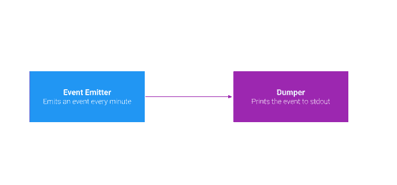
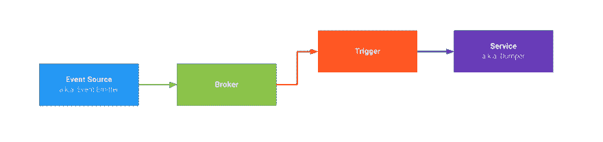

# 灾难性事件的第一印象

> 原文：<https://dev.to/andre/first-impressions-of-knative-eventing-bn5>

你可能听说过[Knative](https://knative.dev/)——基于 Kubernetes 的无服务器应用开发平台。我知道这是一大堆术语，但本质上它提供了多个 API 来部署您的应用程序，而不用(过多)考虑 Kubernetes 机器。

目前，Knative 可分为三个部分:

*   部署基于 HTTP 的应用程序——想想 AWS Lambda 或谷歌云功能
*   Knative Build -帮助你避免触碰容器。你提供代码，其余的将自动发生。
*   Knative Eventing -帮助你构建事件驱动的应用程序💥

你可能知道我是事件驱动架构的超级粉丝。这就是为什么我们会在这篇文章中稍微探讨一下 *Knative Eventing* 。

## 我需要什么？

由于 *Knative* 作为基于 Kubernetes 的无服务器平台的性质，您需要—🎉–安装了服务网络的 Kubernetes 集群，如 [Istio](https://istio.io/) 。别担心，如果你不知道这是怎么回事。请暂时忽略它，只把它当作一个要求。

对于那些还没有以拥有 Kubernetes 集群为荣的人，我建议在[谷歌云平台(GCP)](https://cloud.google.com/) 上创建一个。通常需要以下步骤:

1.  用 Istio 插件在 GCP 创建一个集群
2.  安装 Knative

为了保持干燥和不重复内容，你可以在官方文档中找到对*Knative*:[Install on Google Kubernetes Engine](https://knative.dev/docs/install/knative-with-gke/)的详细描述。

节点自动扩展配置(1 - 10 个节点)不会抑制⚠️。对于这个演示，您可以删除`--enable-autoscaling --min-nodes=1 --max-nodes=10`并用`--num-nodes 1`替换它。这产生了一个单节点集群，足以满足我们在这里的小小探索。

## 我们的目标

那么我们的目标是什么呢？我想到了一个简单的场景，展示了所有必要的关键部分，而没有太多的仪式。结果是下面这个简单的用例:

> 建立一个发射器，它每分钟发送一个 JSON 格式的事件，并有一个应用程序，它自动旋转并只显示相应的事件。

[](https://res.cloudinary.com/practicaldev/image/fetch/s--rYkCRSFJ--/c_limit%2Cf_auto%2Cfl_progressive%2Cq_auto%2Cw_880/https://thepracticaldev.s3.amazonaws.com/i/l63haadl1kpelrubdrho.png)

## 顺其自然...

上述用例可以转化为以下架构，该架构展示了如何通过 *Knative Eventing* 实现事件流:

[](https://res.cloudinary.com/practicaldev/image/fetch/s--qWHhIfGN--/c_limit%2Cf_auto%2Cfl_progressive%2Cq_auto%2Cw_880/https://thepracticaldev.s3.amazonaws.com/i/n7cft44p1bjqnrpdwir1.png)

尽管这看起来很复杂，但是用`Broker`和`Trigger`引入的间接方式最终还是很有意义的。让我们一块一块来分析。

### 经纪人

`Broker`充当中央事件网关。它从源接收事件，并将其委托给对事件感兴趣的各个订户。

在我们的场景中，我们将通过执行:
在`default`名称空间中创建代理

```
kubectl label namespace default knative-eventing-injection=enabled 
```

Enter fullscreen mode Exit fullscreen mode

您可以通过
验证代理的创建

```
$ kubectl get broker
NAME      READY   REASON   HOSTNAME                                   AGE
default   True             default-broker.default.svc.cluster.local   22s 
```

Enter fullscreen mode Exit fullscreen mode

### 事件源

充当事件的起源。想象一种微服务架构。在这种情况下，您会有多个这样的事件源。它们中的每一个都将发出特定于域的事件。

建立实际事件源有几种可能性。除了编写自己的源代码， *Knative Eventing* 附带了一堆预定义的源代码。仅举几个例子:

*   GitHub:存储库/组织事件，如:PR 创建、提交推送等。
*   Apache Kafka:将 Kafka 消息流式传输到 *Knative*
*   Kubernetes:将 Kubernetes 集群事件带到 *Knative*

您可以在 [Knative 文档](https://knative.dev/docs/eventing/sources/index.html)中找到现有资源的完整列表。

另一个有趣的预定义组件是`Cron Job`源。它允许及时发送消息。这正是我们想要在演示中使用的:

```
# filename: source.yaml
apiVersion: sources.eventing.knative.dev/v1alpha1
kind: CronJobSource
metadata:
  name: event-emitter
spec:
  schedule: "*  *  *  *  *"
  data: '{"message":  "Hello  world!"}'
  sink:
    apiVersion: eventing.knative.dev/v1alpha1
    kind: Broker
    name: default 
```

Enter fullscreen mode Exit fullscreen mode

这是定义一个`Cron Job`源所需要的一切。您可以通过
申请

```
kubectl apply -f source.yaml 
```

Enter fullscreen mode Exit fullscreen mode

之后，`event-emitter`将...

*   ...每分钟发送一次`data`中定义的事件
*   ...将此消息发送给`default broker`

### 服务

服务是你的实际应用。一个负责接收相应的事件并执行一些业务逻辑。在我们的例子中，我们只是使用一个现有的容器图像，它获取一个接收到的事件并将其打印在`stdout`上。

定义看起来像:

```
# service.yaml
apiVersion: serving.knative.dev/v1alpha1
kind: Service
metadata:
  name: dumper
spec:
  template:
    spec:
      containers:
        - image: gcr.io/knative-releases/github.com/knative/eventing-sources/cmd/event_display 
```

Enter fullscreen mode Exit fullscreen mode

执行`kubectl apply -f service.yaml`后，服务将处于活动状态，日志可以通过
进行整理

```
kubectl logs -f  -l serving.knative.dev/service=dumper -c user-container --since=10m 
```

Enter fullscreen mode Exit fullscreen mode

虽然我们已经应用了`Broker`、`Source`和`Service`，但是您可能想知道为什么还看不到任何输出。这让我们看到了最后一个缺失的拼图，即`Trigger`

### 触发

老实说，A `Trigger`是一只有趣的野兽。它充当一个间接层，在这个层中你可以定义哪些事件应该被发送给哪些服务。它基本上将相应的事件类型绑定到特定的服务。不错的宣言，嗯？

```
# trigger.yaml

apiVersion: eventing.knative.dev/v1alpha1
kind: Trigger
metadata:
  name: trigger
spec:
  subscriber:
    ref:
      apiVersion: serving.knative.dev/v1alpha1
      kind: Service
      name: dumper 
```

Enter fullscreen mode Exit fullscreen mode

所以在一个`kubectl apply -f trigger.yaml`之后，我们基本上创建了一个组件，每当一个新事件到来时，*触发*服务。从现在开始，您应该会在服务的日志中看到输出。

## 结论

在我以前的一些客户项目中，我们自己创建了这样的事件基础设施。你可能已经有了建造这种东西的经验。工作量很大，对吧？建立代理基础设施(通过 [RabbitMQ](https://www.rabbitmq.com/) 、 [Apache Kafka](https://kafka.apache.org/) 等)。)和手动定义所有事件路由，这只是整个工作的两个方面。 *Knative Eventing* 搭载正确的原语 IMHO。它使您能够以一种良好的、声明性的方式来执行过去必须手动完成的所有工作。

我的假设是，总体而言，Knative 公司正面临着光明的未来。许多工程师只是避免接触 Kubernetes，因为它的学习曲线很高。你可能会再次考虑生态系统。 *Knative* 在这里让你专注于运输代码，而没有大量的基础设施开销。

你对 *Knative* 和 *Knative Eventing* 的总体印象如何？