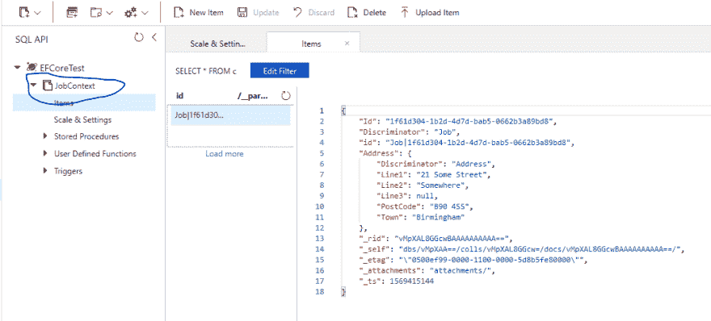
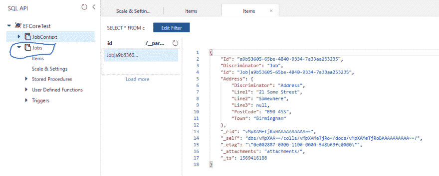
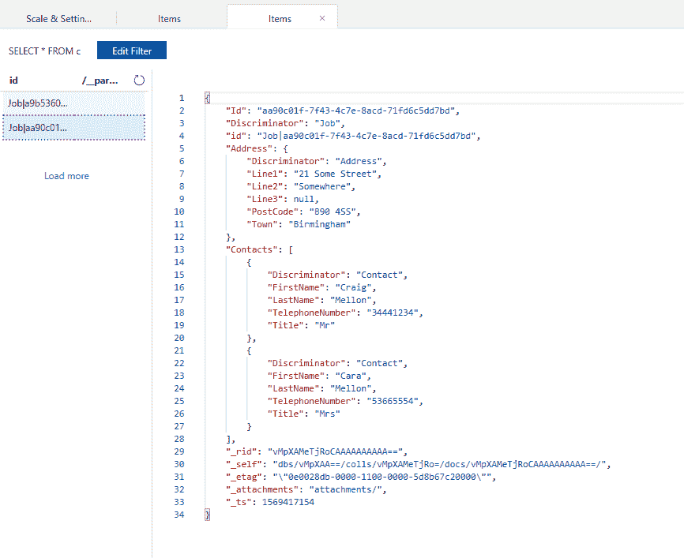
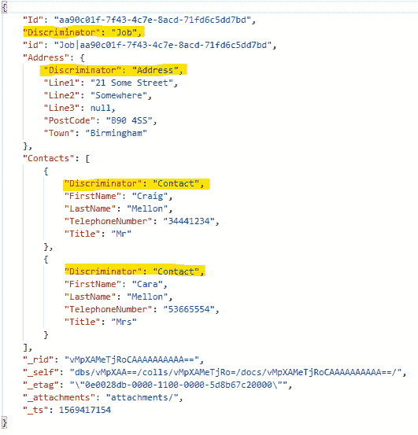
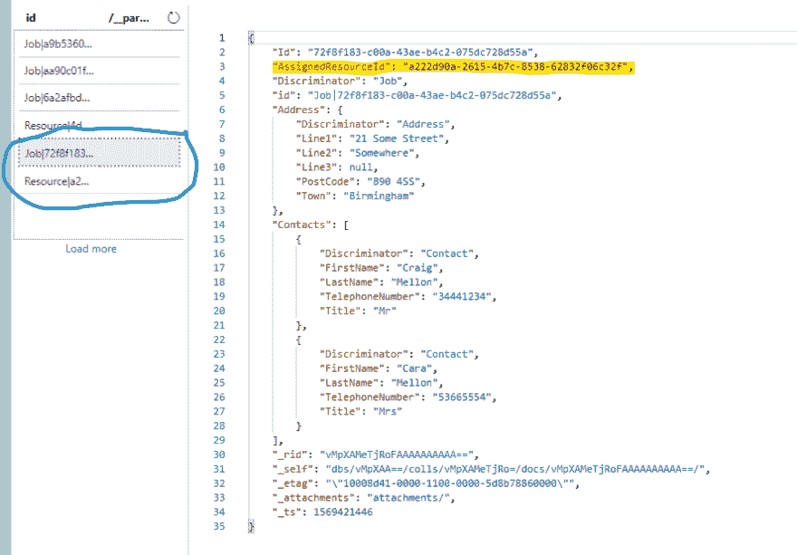

# 首先看看 EFCore 3 和 Azure CosmosDB 提供程序

> 原文：<https://dev.to/mellon_dev/first-look-efcore-3-and-the-azure-cosmosdb-provider-3nlb>

我一直想尝试一下 Cosmos DB 提供商，所以当 EF Core 3 发布时，我决定是时候看看了。

我在一些项目中使用 Azure Cosmos DB，并且总是发现 SDK 感觉笨重，尽管新版本 3 SDK 看起来好多了。我也在我的许多项目中使用 Entity Framework Core，我真的很喜欢使用它的简单性，所以我对新的提供商感到兴奋和充满希望。

Cosmos DB provider 将帮助我们删除大量在使用 SDK 时必须实现的模板代码。提供者将使我们能够使用实体框架和它为持久性提供的所有好东西。

> 对于这篇文章，我假设你对 Cosmos DB 和实体框架有一些了解。微软文档对于介绍 Cosmos DB 和实体框架非常有用，如果不是的话
> [实体框架核心文档](https://docs.microsoft.com/en-us/ef/core/)
> [Cosmos DB 文档](https://docs.microsoft.com/en-us/azure/cosmos-db/introduction)

所以，让我们开始吧，用它来玩一玩...

# 宇宙 DB

我将使用我已经在 Azure 中创建的一个 Cosmos 实例，如果你没有 Azure 帐户，你可以免费创建一个来试试 Cosmos，或者你可以安装并使用 [Cosmos DB 模拟器](https://docs.microsoft.com/en-us/azure/cosmos-db/local-emulator)

> 注意:模拟器目前只能在 Windows 上运行

# 项目设置

你可以在下面的 github repo
查看这个帖子示例

## [【cramelon】](https://github.com/CraigMellon)/[【efcore-cosmo sdb】](https://github.com/CraigMellon/efcore-cosmosdb)

### 测试新的实体框架 Core 3 Cosmos DB Provider

您需要下载并安装。NET Core 3.0 SDK 可以在这里找到:[https://dotnet.microsoft.com/download/dotnet-core/3.0](https://dotnet.microsoft.com/download/dotnet-core/3.0)

让我们使用 dotnet CLI 创建一个新的空控制台应用程序，并添加实体框架核心和 Cosmos 提供者 nuget 包。

```
dotnet new console 
```

安装[微软。EntityFrameworkCore . Cosmos Nuget 包](https://www.nuget.org/packages/Microsoft.EntityFrameworkCore.Cosmos/)

```
dotnet add package Microsoft.EntityFrameworkCore.Cosmos 
```

> 添加 Cosmos nuget 包也将添加实体框架核心包作为依赖项

### 我们开始吧

在第一个实验中，我们将使用一个简单的`Job`模型，其中嵌入了`Address`类型:

```
 public class Job
    {
        public Guid Id { get; set; }
        public Address Address { get; set; }
    }

    public class Address
    {
        public string Line1 { get; set; }
        public string Line2 { get; set; }
        public string Line3 { get; set; }
        public string Town { get; set; }
        public string PostCode { get; set; }
    } 
```

我们需要创建一个 DbContext，并将其配置为使用 Cosmos provider，添加一个新的`JobContext`文件，代码如下

```
 public class JobContext : DbContext
    {
        public DbSet<Job> Jobs { get; set; }

        protected override void OnConfiguring(DbContextOptionsBuilder optionsBuilder) {
            optionsBuilder.UseCosmos(
               "*YOUR-COSMOSDB-ENPOINT*",
                "*YOUR-KEY*",
                "EFCoreTest"
            );
        }

        protected override void OnModelCreating(ModelBuilder modelBuilder)
        {
            modelBuilder.Entity<Job>().OwnsOne(j => j.Address);
        }
    } 
```

> 为了简单起见，我们将端点和键硬编码到 DbContext 中，我不建议在实际应用程序中这样做

我们正在覆盖`OnModelCreating`方法，将`Address`配置为`Job`拥有的实体，这将确保`Address`实体在保存时嵌入到`Job`文档中

现在我们有了 DbContext 和 models 设置，让我们更新`Program.cs`来创建一个`Job`，并使用 EF Core
将它保存到我们的 Cosmos 数据库中

```
 Console.WriteLine("Welcome to the EFCore Cosmos DB Provider...");

        var job = new Job
        {
            Id = Guid.NewGuid(),
            Address = new Address
            {
                Line1 = "21 Some Street",
                Line2 = "Somewhere",
                Town = "Birmingham",
                PostCode = "B90 4SS",
            }
        };

        using (var context = new JobContext())
        {
            context.Database.EnsureCreated();

            context.Add(job);

            context.SaveChanges();
        }

        using (var context = new JobContext())
        {
            var loadedJob = context.Jobs.First();
            Console.WriteLine($"Job created and retreived with address: {job.Address.Line1}, {job.Address.PostCode}");
            } 
```

> 如果您的 Cosmos DB 中还没有集合，那么`context.Database.EnsureCreated()`将在其中创建一个集合

如果我们运行这段代码，它会将一个文档添加到我们的 Cosmos DB 中，如果我们在 Azure 门户中查看一下，我们可以看到一个名为 JobContext 的新集合已经创建，并且添加了一个新文档。

[](https://res.cloudinary.com/practicaldev/image/fetch/s--NFO6szMw--/c_limit%2Cf_auto%2Cfl_progressive%2Cq_auto%2Cw_880/https://thepracticaldev.s3.amazonaws.com/i/uzsc5wgziv830w56k4kt.PNG)

默认情况下，cosmos 提供者将使用您的上下文名称作为集合名称。这可以在 DbContext 的`OnModelCreating`方法中被覆盖。

让我们将集合的默认名称设置为 **Jobs** ，重新运行我们的应用程序，并在门户中再次查看我们的数据库。在我们的`JobContext.cs`
中，将下面一行添加到`OnModelCreating`方法的顶部

```
modelBuilder.HasDefaultContainer("Jobs"); 
```

[](https://res.cloudinary.com/practicaldev/image/fetch/s--CEtB6xek--/c_limit%2Cf_auto%2Cfl_progressive%2Cq_auto%2Cw_880/https://thepracticaldev.s3.amazonaws.com/i/ziddsw6q442qjb02xx16.PNG)

### 嵌入式收藏

除了在文档中嵌入实体之外，你还可以嵌入集合，这些集合将实体作为数组嵌入到你的文档中。为了测试这一点，我们将添加一个新的`Contact`实体，并将一组联系人添加到我们的`Job`中。

```
 public class Job
    {
        public Guid Id { get; set; }
        public Address Address { get; set; }

        public List<Contact> Contacts { get; set; }
    }

    public class Contact
    {
        public string Title { get; set; }
        public string FirstName { get; set; }
        public string LastName { get; set; }
        public string TelephoneNumber { get; set; }
    } 
```

还要更新`JobContext` `OnModelCreating`方法，使用`OwnsMany`方法
将`Job`上的联系人配置为拥有的集合

```
 modelBuilder.Entity<Job>().OwnsMany(j => j.Contacts); 
```

现在更新`Program.js`,向我们的工作添加联系人列表。

> 现在，我们的集合中有多个文档，所以调用`context.Jobs.First()`将不再保证检索我们的新作业，相反，我们将更新它以获取具有我们刚刚创建的 Id
> 的作业

```
Console.WriteLine("Welcome to the EFCore Cosmos DB Provider...");

var job = new Job
{
    Id = Guid.NewGuid(),
    Address = new Address
    {
        Line1 = "21 Some Street",
        Line2 = "Somewhere",
        Town = "Birmingham",
        PostCode = "B90 4SS",
    },
    Contacts = new List<Contact>()
    {
        new Contact { Title = "Mr", FirstName = "Craig", LastName = "Mellon", TelephoneNumber = "34441234" },
        new Contact { Title = "Mrs", FirstName = "Cara", LastName = "Mellon", TelephoneNumber = "53665554" }
    }
};

using (var context = new JobContext())
{
    context.Database.EnsureCreated();

    context.Add(job);

    context.SaveChanges();
}

using (var context = new JobContext())
{
    var loadedJob = context.Jobs.First(x => x.Id == job.Id);
    Console.WriteLine($"Job created and retreived with address: {job.Address.Line1}, {job.Address.PostCode}");
    Console.WriteLine($"  Contacts ({job.Contacts.Count()})");
    job.Contacts.ForEach(x =>
    {
        Console.WriteLine($"    Name: {x.FirstName}  {x.LastName}");
    });
} 
```

如果我们现在看一下门户，我们可以看到联系人已经作为一个数组嵌入到我们的工作中

[](https://res.cloudinary.com/practicaldev/image/fetch/s--NQJS4q4Y--/c_limit%2Cf_auto%2Cfl_progressive%2Cq_auto%2Cw_880/https://thepracticaldev.s3.amazonaws.com/i/86btpe3rp8k5roqa9s48.PNG)

### 一个系列中的多个型号

Cosmos 提供者支持在同一个集合中存储多个实体类型。为此，EF Core 在我们的文档中添加了一个名为`Discriminator`的字段。如果我们看一下数据库中的最后一个文档，我们可以看到每个对象都有一个**鉴别器**字段。

[](https://res.cloudinary.com/practicaldev/image/fetch/s--HlO9O7H---/c_limit%2Cf_auto%2Cfl_progressive%2Cq_auto%2Cw_880/https://thepracticaldev.s3.amazonaws.com/i/xnc41vnjwxkrmovh9f3a.PNG)

还要注意`id`列，它对于 Cosmos 集合/分区中的每个条目都是唯一的，EF Core 通过连接鉴别符和主键值来生成值，使用“|”作为分隔符

#### 链接实体/文档

如上所述，EF 核心可以在同一个集合中存储多个实体。为了了解这是如何工作的，让我们创建一个名为 Resource 的新实体，并将其作为链接实体添加到我们的`Job`中。

首先为我们的`Resource`创建一个新模型，并为我们的`Job`添加一个名为`AssignedResource`的新属性，类型为`Resource`，我们还将添加`AssignedResourceId`，这将使我们能够访问链接到`Job`的资源的 Id。如果我们不添加这个字段，EF 核心会自动将它添加到封面下，但是如果没有这个属性，我们就无法轻松访问它。

```
public class Job
{
    public Guid Id { get; set; }
    public Address Address { get; set; }

    public List<Contact> Contacts { get; set; }

    public Guid AssignedResourceId { get; set; }
    public Resource AssignedResource { get; set; }
}

public class Resource
{
    public Guid Id { get; set; }
    public string Title { get; set; }
    public string FirstName { get; set; }
    public string LastName { get; set; }
    public string TelephoneNumber { get; set; }
} 
```

现在我们需要更新我们的`JobContext`,使用模型构建器上的`HasOne`方法将`Resource`配置为链接实体。

```
protected override void OnModelCreating(ModelBuilder modelBuilder)
{
    ...

    modelBuilder.Entity<Job>().HasOne(j => j.AssignedResource);
} 
```

更新`Program.cs`以创建一个包含作业
的资源

```
Console.WriteLine("Welcome to the EFCore Cosmos DB Provider...");

var job = new Job
{
    Id = Guid.NewGuid(),
    Address = new Address
    {
        Line1 = "21 Some Street",
        Line2 = "Somewhere",
        Town = "Birmingham",
        PostCode = "B90 4SS",
    },
    Contacts = new List<Contact>()
    {
        new Contact { Title = "Mr", FirstName = "Craig", LastName = "Mellon", TelephoneNumber = "34441234" },
        new Contact { Title = "Mrs", FirstName = "Cara", LastName = "Mellon", TelephoneNumber = "53665554" }
    },
    AssignedResource = new Resource
    {
        Id = Guid.NewGuid(),
        Title = "Mr",
        FirstName = "Bob",
        LastName = "Builder",
        TelephoneNumber = "0800 1234567"
    }
};

using (var context = new JobContext())
{
    context.Database.EnsureCreated();

    context.Add(job);

    context.SaveChanges();
} 
```

如果我们运行这段代码并查看门户，我们可以看到已经创建了两个文档。一个用于我们的`Job`，一个用于我们的`Resource`，还要注意 EF Core 已经将我们的`Job`中的`AssignedResourceId`字段设置为新的`Resource`文档的 id:

[](https://res.cloudinary.com/practicaldev/image/fetch/s--5ABLi7od--/c_limit%2Cf_auto%2Cfl_progressive%2Cq_auto%2Cw_880/https://thepracticaldev.s3.amazonaws.com/i/rih67c9k5le40ps3z15x.PNG)

#### 加载链接实体

通常来说，为了获取我们的`Resource`和`Job`，我们在获取`Job`时会使用 Include()方法，在关系世界中，EF Core 会将其转换为后端的 join，并返回填充了`Resource`的`Job`。如果我们试图用 Cosmos provider EF Core 做这件事，它会抛出一个异常，通知我们还不支持 joins。

> Cosmos provider 的当前版本不支持连接实体，因此我们无法一次性检索带有`Resource`的`Job`。这个特性已经在路线图上了，希望它会在 3.1 版本中出现

那么，当从数据库中获取数据时，我们如何将`Resource`填充到`Job`中呢？

我们可以先加载`Job`，然后再加载`Resource`，因为我们已经在`Job`上加载了`AssignedResourceId`。让我们试一试，看看效果如何。

首先，我们需要为`Resource`添加一个 DbSet 到我们的 DbContext:

```
 public DbSet<Resource> Resources { get; set; } 
```

接下来，让我们更新`Program.cs`中代码的加载部分，以获取资源并将其分配给作业，最后让我们将资源名称输出到控制台:

```
using (var context = new JobContext())
{
    var loadedJob = context.Jobs.First(x => x.Id == job.Id);

    // now load the resource and assign it to the Job
    var resource = context.Resources.First(x => x.Id == loadedJob.AssignedResourceId);
    loadedJob.AssignedResource = resource;

    Console.WriteLine($"Job created and retreived with address: {job.Address.Line1}, {job.Address.PostCode}");
    Console.WriteLine($"  Contacts ({job.Contacts.Count()})");
    job.Contacts.ForEach(x =>
    {
        Console.WriteLine($"    Name: {x.FirstName}  {x.LastName}");
    });

    Console.WriteLine($"  Assigned Resource: {loadedJob.AssignedResource?.FirstName}  {loadedJob.AssignedResource?.LastName}");
} 
```

如果您的代码运行成功，您应该会看到类似下面的输出:

```
Job created and retreived with address: 21 Some Street, B90 4SS
  Contacts (2)
    Name: Craig Mellon
    Name: Cara Mellon
  Assigned Resource: Bob Builder 
```

虽然这不是最干净的代码，但希望我们能够在 Cosmos provider 的下一个版本中包含链接资源。

#### 加载多个链接实体

我想到的另一个场景是，当我们有多个任务都链接到同一个`Resource`时。我们如何有效地装载它们？

当我们用 EF Core 获取一个实体时，它开始在 DbContext 中跟踪这个实体。如果我们事先知道`Resource`，也许我们可以将资源预加载到 DbContext 中，然后当加载一个链接到`Resource`的`Job`时，希望 EF Core 会自动将`AssignedResource`引用到已经在 DbContext 中的实体。

为了测试这个选项，我将执行以下步骤:

*   创建一个`Resource`实体
*   创建 2 个`Job`实体
*   将`Resource`分配给两个任务
*   保存到数据库
*   创建一个新的 DbContext 实例(这将确保我们有一个没有被跟踪实体的干净的 DbContext)
*   加载`Resource`
*   加载 2 个`Job`实体
*   检查 EF Core 是否已经使用预取的`Resource`自动设置了 AssignedResource

好消息是这似乎是可行的，所以如果链接的实体已经被 EF Core 跟踪，那么当你获取链接到它的实体时，EF Core 将自动重建你的实体

```
var resourceId = Guid.NewGuid();

var resource = new Resource
{
    Id = resourceId,
    Title = "Mr",
    FirstName = "Bob",
    LastName = "Builder",
    TelephoneNumber = "0800 1234567"
};

var job1 = new Job
{
    Id = Guid.NewGuid(),
    Address = new Address
    {
        Line1 = "Job 1 Address"
    },
    AssignedResource = resource
};

var job2 = new Job
{
    Id = Guid.NewGuid(),
    Address = new Address
    {
        Line1 = "Job 2 Address"
    },
    AssignedResource = resource
};

using (var context = new JobContext())
{
    context.Database.EnsureCreated();

    context.Add(job1);
    context.Add(job2);

    context.SaveChanges();
}

using (var context = new JobContext())
{
    var loadedResource = context.Resources.First(x => x.Id == resourceId);

    // Load all jobs with the same assigned resource id
    var jobs = context.Jobs.Where(x => x.AssignedResourceId == resourceId).ToList();

    jobs.ForEach(job =>
    {
        Console.WriteLine($"Job: {job.Id} - Resource: {job.AssignedResource?.FirstName}  {job.AssignedResource?.FirstName}");
    });
} 
```

# 总结

总的来说，我喜欢 EF Core 的新 Cosmos provider，它大大简化了用 Cosmos 创建和查询文档的过程。

尽管上面的场景很简单，但我还有很多更高级的场景想尝试。(*也许是另一个帖子*):

Cosmos provider 的当前限制记录在这里:
[Cosmos Provider 限制](https://docs.microsoft.com/en-us/ef/core/providers/cosmos/limitations)
[Cosmos provider 特性积压](https://github.com/aspnet/EntityFrameworkCore/issues?page=1&q=is%3Aissue+is%3Aopen+Cosmos+in%3Atitle+label%3Atype-enhancement+sort%3Areactions-%2B1-desc)