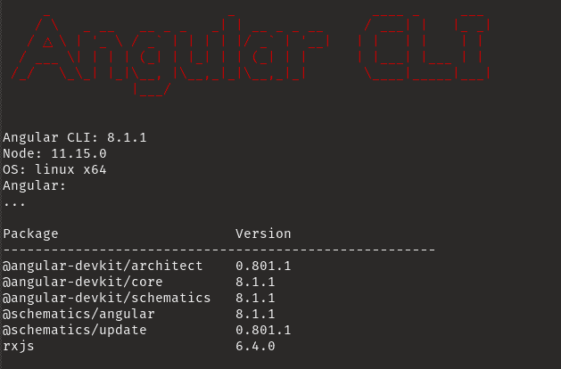
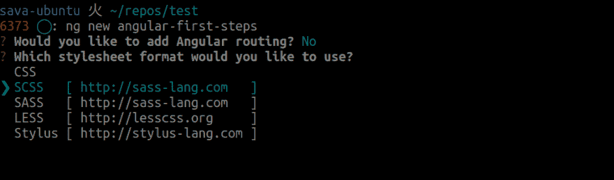
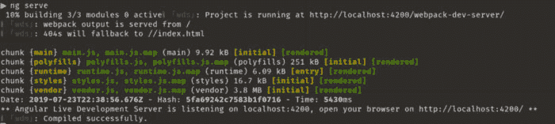
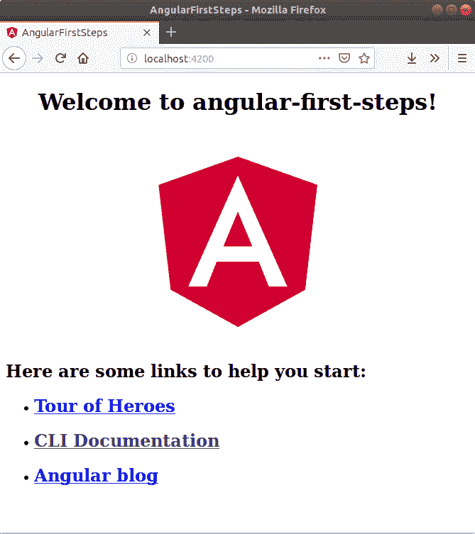
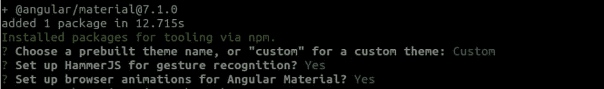
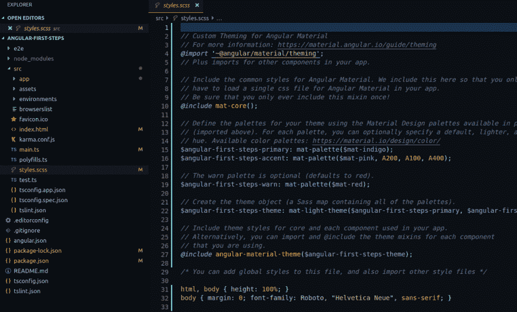
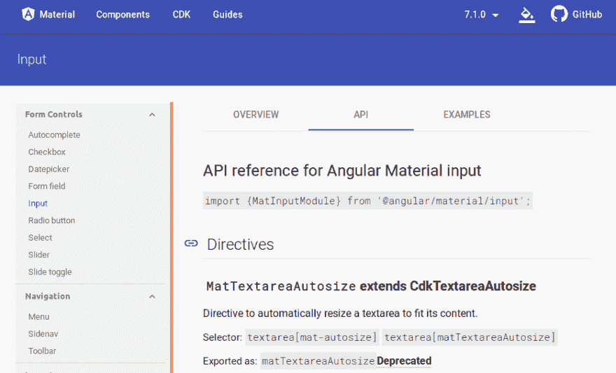

# 第一步，带角材和角材的角材 8

> 原文：<https://dev.to/ismaproco/first-steps-with-angular-8-with-angular-cli-and-angular-material-33p5>

*如果想查看 Angular 6 的流程查看我之前的文章:[https://medium . com/@ Isma pro/first-steps-with-Angular-CLI-and-Angular-material-5a 90406 e9 a4](https://medium.com/@ismapro/first-steps-with-angular-cli-and-angular-material-5a90406e9a4)T3】*

Angular 自版本 2 以来已经走过了漫长的道路，现在有了更多的库和工具来帮助开发，用它开始开发应用程序甚至更容易了。在本指南中，我将一步一步地讲述如何使用 angular-cli(命令行工具)和 Angular Material 构建一个 Angular 应用程序。

如果你来自 angular 以前的版本，看看这个页面:[https://update.angular.io/](https://update.angular.io/)在这里你可以看到升级到最新版本的步骤。(或者例如在 2 到 6 之间)。

### 要求

*   NodeJs (v10.9.0 或更高版本)

### 准备环境

Angular development 大量使用 angular-cli，所有东西都开始在全球范围内安装它:

```
npm install @angular/cli -g 
```

安装后，使用以下命令检查一切是否正常工作:

```
ng --version 
```

您将看到类似于以下内容的内容:

[](https://res.cloudinary.com/practicaldev/image/fetch/s--lra7jmEp--/c_limit%2Cf_auto%2Cfl_progressive%2Cq_auto%2Cw_880/https://miro.medium.com/max/629/1%2A115EbMxvwbve9FwIaHANkg.png)

如果您没有看到任何错误，并且显示了 ASCII 艺术，一切都应该正常工作，现在让我们创建应用程序，因为它让执行“ng new”命令与应用程序的名称:

```
ng new angular-first-steps 
```

它会问你是否要添加路由，键入“No”或简单的字母“n”，因为我们现在想保持简单，然后它会问你样式表格式，你可以用键盘箭头键移动，并选择“SCSS”，我们很好地需要它为材料主题化。

[](https://res.cloudinary.com/practicaldev/image/fetch/s--8joe9O9d--/c_limit%2Cf_auto%2Cfl_progressive%2Cq_auto%2Cw_880/https://cdn-images-1.medium.com/max/2000/1%2AiCOVKdl5WbAo0uoOnEmzEw.png)

您可以使用以下标志“路由”和“样式”跳过选择过程:

```
ng new angular-first-steps --routing=false --style=scss 
```

有关 ng 新标志的更多详细信息，请查看:[https://github.com/angular/angular-cli/wiki/new](https://github.com/angular/angular-cli/wiki/new)

angular-cli 将负责依赖项的初始配置和安装。现在，您可以转到项目文件夹:

```
cd angular-first-steps 
```

并使用以下命令启动应用程序:

```
ng serve 
```

然后，您的应用程序将显示构建过程，最后，类似于:

[](https://res.cloudinary.com/practicaldev/image/fetch/s--Fc3OWoMN--/c_limit%2Cf_auto%2Cfl_progressive%2Cq_auto%2Cw_880/https://miro.medium.com/max/700/1%2AvlOP20QRCVWzcysmKBu8VQ.png)

你现在可以进入你的浏览器，并前往以下地址进行检查

```
http://localhost:4200 
```

它应该是这样的:

[](https://res.cloudinary.com/practicaldev/image/fetch/s--Rgx8AB-q--/c_limit%2Cf_auto%2Cfl_progressive%2Cq_auto%2Cw_880/https://cdn-images-1.medium.com/max/2000/1%2ANiEEqLJk4umfIoEeyD1VKg.png)

### 添加有棱角的材料

很好，现在我们确定应用程序已加载，您可以在运行它的控制台中按“Ctrl + c”来停止它，这样我们就可以通过原理图向我们的应用程序添加角度材料。

```
ng add @angular/material 
```

并确保您为问题选择了以下选项。

[](https://res.cloudinary.com/practicaldev/image/fetch/s--OTPE4D-V--/c_limit%2Cf_auto%2Cfl_progressive%2Cq_auto%2Cw_880/https://cdn-images-1.medium.com/max/2000/1%2A6P2DKcdGTFgYQRu1fQKqhA.png)

第一个问题会问你是想使用一个预建的主题还是使用你自己的，在这种情况下，我们将创建自己的主题。

第二个问题是使手势识别对移动应用程序特别有帮助，因为这个 HammerJS 将被添加到 package.json 和应用程序配置中的库列表中。

最后，最后一个问题是，如果你想启用角度默认动画，让我们离开它，所以我们现在可以有完整的功能。

有关角材安装的更多信息，您可以查看[角材入门](https://material.angular.io/guide/getting-started)

现在打开你最喜欢的 IDE 或文本编辑器中的应用程序文件夹，我推荐使用 VS 代码，要从终端打开它，在当前位置只需执行:

```
code . 
```

IDE 打开后，导航到“styles.scss”

[](https://res.cloudinary.com/practicaldev/image/fetch/s--FsBwvPhr--/c_limit%2Cf_auto%2Cfl_progressive%2Cq_auto%2Cw_880/https://cdn-images-1.medium.com/max/2250/1%2Axo-D7haPij8WmvT2G6W-Zg.png)

在这里，您可以看到主题的主要配置部分，并且您将看到有助于您理解每个步骤的内嵌注释。

如果你想知道更多关于材质主题化和调色板的信息，请看下面的链接。
[**色系**
*材质设计色系可用于打造反映您品牌或风格的色彩主题。颜色使用和…*material.io](https://material.io/design/color/#color-usage-palettes)

### 添加材料成分

在 IDE 中，导航到文件**“src/app/app . module . ts”、**并导入以下模块:

```
import { MatInputModule, MatButtonModule, MatSelectModule, MatIconModule } from '@angular/material';
import { FormsModule } from '@angular/forms'; 
```

然后将它们添加到导入数组:

```
imports: [
    BrowserModule,
    BrowserAnimationsModule,
    FormsModule,
    MatInputModule,
    MatButtonModule,
    MatSelectModule,
    MatIconModule
  ], 
```

你想要使用的每个组件都需要你导入它各自的模块，你可以查看 Angular Material 文档来了解每个组件的模块名称，通常在它们的 [API 部分的顶部。](https://material.angular.io/components/input/api)

[](https://res.cloudinary.com/practicaldev/image/fetch/s--bhpgBm5w--/c_limit%2Cf_auto%2Cfl_progressive%2Cq_auto%2Cw_880/https://cdn-images-1.medium.com/max/2000/1%2AT8ywjMD5c8pcQTRRVvLKjQ.png)

下一步是添加一些组件，所以转到“***src/app/app . component . html***，添加以下代码: