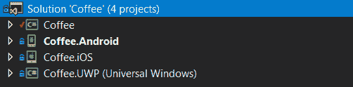
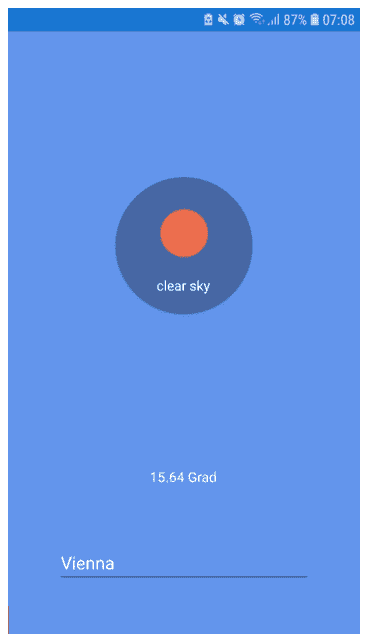
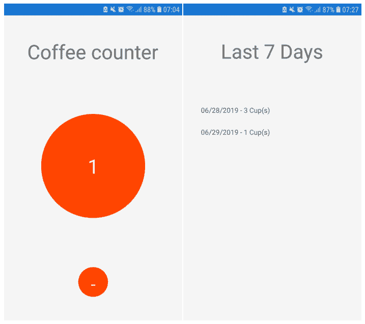

# Xamarin 的第一步

> 原文：<https://dev.to/jessica_veit/first-steps-with-xamarin-kjb>

最近我做了一些关于移动应用程序开发的研究。NET 世界，首先出现的当然是 **Xamarin** 。

## 基础

对于那些不熟悉它的人，让我来解释一下:
使用 Xamarin，你可以为 Windows Phone 创建原生的 Android、iOS 和应用程序——一切尽在其中！

你的后端，你的项目需要的所有业务逻辑，以及你的 UI，只需要被定义。UI 代码(用 xaml 编写)和应用程序逻辑(用 C#定义)在解决方案中的项目之间共享，这些项目代表不同操作系统的应用程序。

## 让我们开始吧:开发和测试

我在 Visual Studio 2017 中开发了我的第一个 Xamarin 应用程序，并直接在我的三星 Galaxy S7 上进行测试，它只是通过 USB 连接到我的笔记本上。

开始只需要几个步骤:

1.  添加扩展名*移动开发为。NET* 安装到您的 Visual Studio 2017 中
2.  创建一个新的*移动应用程序(Xamarin。【T1 表格)】项目*
3.  (可选)如果你想用手机直接测试你的应用，我推荐你在手机上启用开发者模式！启用后，VS17 确实自动检测到了我的手机，并允许我选择它作为目标，用于调试软件。

## 到目前为止我所做的

在 Xamarin 的两天后，我创建了两个测试应用。

### 天气应用

显示您选择的城市的天气信息。

#### 目标:

*   创建您的第一个应用程序，并将其安装到您的手机上

结果:你必须从某个地方开始，这就是我开发超级简单的天气应用程序所做的。基本上发生的事情是你插入一个城市的名称，该地点的当前天气是从 https://openweathermap.org/的(顺便说一句，这是一个非常好的服务)查询的。

### 咖啡柜台

记录你每天的咖啡消耗量！

#### 目标:

*   能够在页面之间滑动和移动
*   为用户界面使用某种列表和绑定
*   永久保存数据

## 我的下一个目标

*   我希望 UI 和业务逻辑通信完全运行在使用 MVVM 模式的绑定上。
*   从某种来源读取数据(例如本地 json 文件)
*   了解有关不同可用 UI 组件的更多信息
*   实现拖放功能

如果你对我有任何酷的应用想法，请在评论区告诉我！

## 结论

所以，如果你是开发者(尤其是。NET)并想进入应用程序/移动开发，Xamarin 是一个简单而又酷的方法。