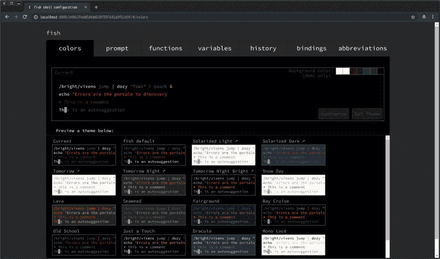
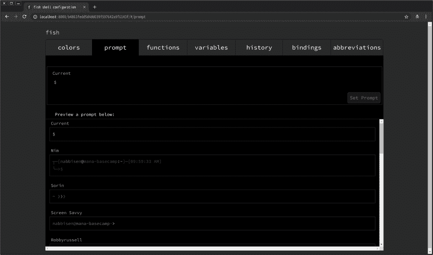
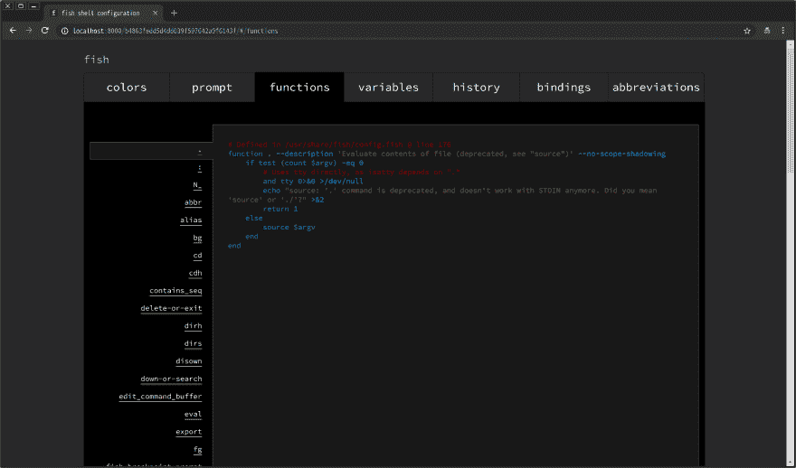
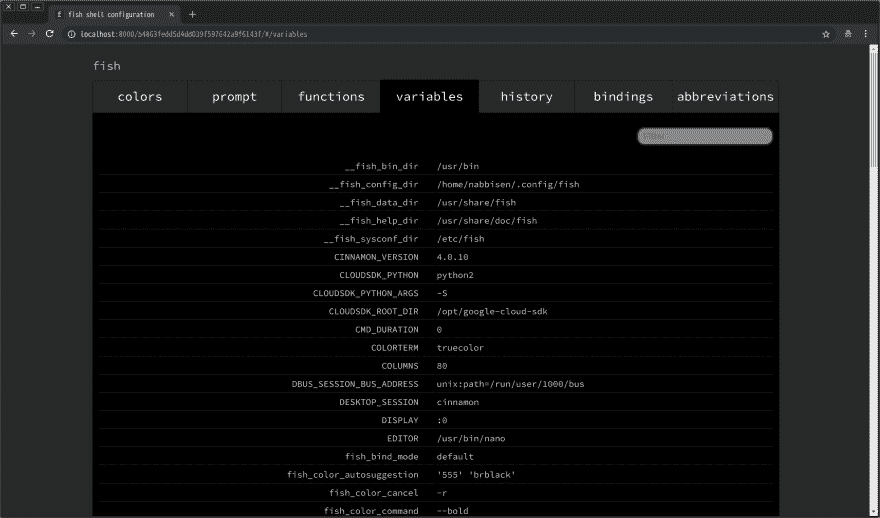
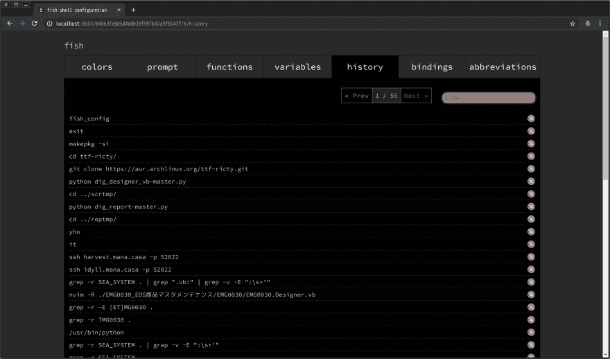
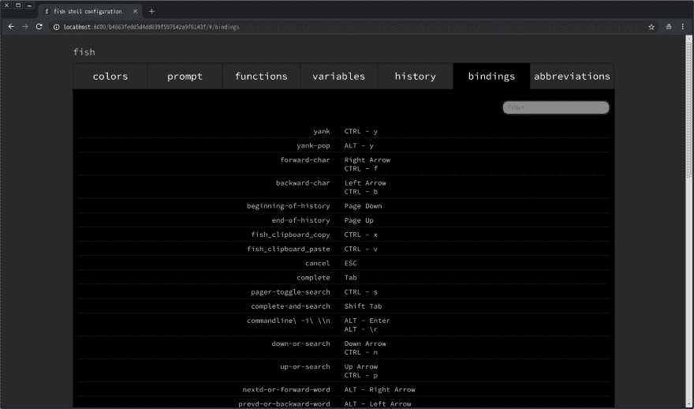
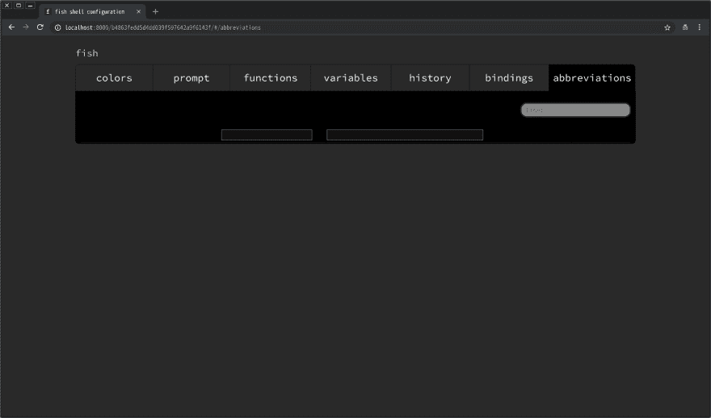
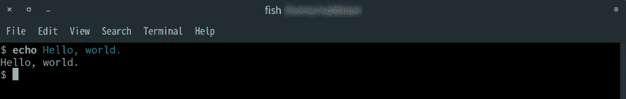

# 鱼壳结构

> 原文：<https://dev.to/nabbisen/fish-shell-configuration-594k>

我在寻找如何在控制台中隐藏用户名，以便获得更漂亮的截图。
我找到了 [`fish_config`](https://fishshell.com/docs/current/commands.html#fish_config) 那个 [`fish`外壳](https://fishshell.com)官方提供的。它有优秀的基于网络的用户界面，让我们配置颜色主题，提示风格等等。

只需在终端输入:

```
$  fish_config 
```

Enter fullscreen mode Exit fullscreen mode

然后你的网络浏览器就会运行，显示有用的菜单:)
带选项，选择一个，点击“设置***”，就搞定了。

况且我现在的`fish`版本是 3.0.2。

* * *

### fish_config Web UI

##### 颜色

[](https://res.cloudinary.com/practicaldev/image/fetch/s--7lEzbdXk--/c_limit%2Cf_auto%2Cfl_progressive%2Cq_auto%2Cw_880/https://thepracticaldev.s3.amazonaws.com/i/mtyuu9dauk4xfb0lc1h6.png)

##### 提示

[](https://res.cloudinary.com/practicaldev/image/fetch/s--wBLVXQ3F--/c_limit%2Cf_auto%2Cfl_progressive%2Cq_auto%2Cw_880/https://thepracticaldev.s3.amazonaws.com/i/q8nwdlsbcnnpcn37msbn.png)

##### 功能

[](https://res.cloudinary.com/practicaldev/image/fetch/s--Pm0jVHf7--/c_limit%2Cf_auto%2Cfl_progressive%2Cq_auto%2Cw_880/https://thepracticaldev.s3.amazonaws.com/i/0emoxe0yhrjg4ljfytfa.png)

##### 变量

[](https://res.cloudinary.com/practicaldev/image/fetch/s--ihmw0afx--/c_limit%2Cf_auto%2Cfl_progressive%2Cq_auto%2Cw_880/https://thepracticaldev.s3.amazonaws.com/i/s8siq5xa43od6qnfrp8t.png)

##### 历史

[](https://res.cloudinary.com/practicaldev/image/fetch/s--VV19KEOk--/c_limit%2Cf_auto%2Cfl_progressive%2Cq_auto%2Cw_880/https://thepracticaldev.s3.amazonaws.com/i/arr3vtphdio14x6nh0py.png)

##### 绑定

[](https://res.cloudinary.com/practicaldev/image/fetch/s--c03qyfz4--/c_limit%2Cf_auto%2Cfl_progressive%2Cq_auto%2Cw_880/https://thepracticaldev.s3.amazonaws.com/i/1oalcktlkveaj0pdzmxc.png)

##### 缩写

[](https://res.cloudinary.com/practicaldev/image/fetch/s--ob3KsAxx--/c_limit%2Cf_auto%2Cfl_progressive%2Cq_auto%2Cw_880/https://thepracticaldev.s3.amazonaws.com/i/lm3suxily2pe99j9lyme.png)

* * *

更改“提示”后，很好，我的控制台在提示行顶部只显示“$”:

[](https://res.cloudinary.com/practicaldev/image/fetch/s--Ar5lLadR--/c_limit%2Cf_auto%2Cfl_progressive%2Cq_auto%2Cw_880/https://thepracticaldev.s3.amazonaws.com/i/8vam7vysu060vxkffduv.png)

快乐编码。