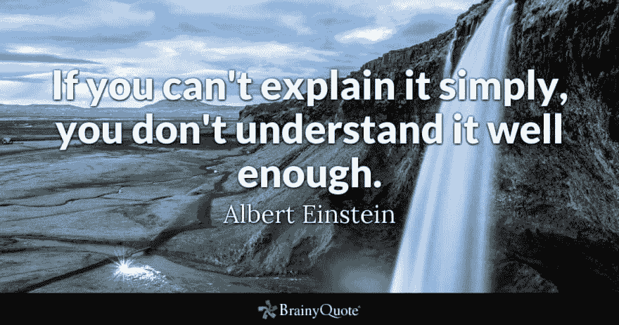
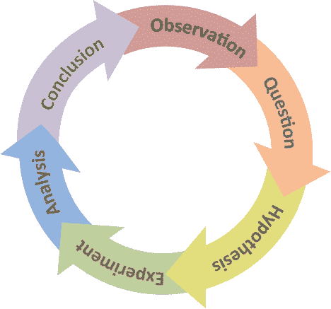
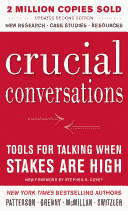

# 在现实世界中最容易学到的五项开发人员技能

> 原文：<https://dev.to/scottshipp/five-developer-skills-best-learned-in-the-real-world-2f94>

无论一个人是如何进入这个行业的——无论是通过计算机科学学位、集训还是完全自学——现实是，现代软件的大规模团队驱动的性质是不可能在一个人为的环境中学习的。只是有些东西除了在工作岗位上是教不出来的。虽然没有一个列表是详尽的，但我相信其中的五个技能比其他的更经常出现。

## 阅读

我不知道为什么阅读不被认为是一种发展技能，尤其是阅读理解，但是你几乎不会听到有人提到它。然而，专业人士一直在讲述*隐藏在手册中的一行文字*是如何解决一个长期存在的问题的。

今天的软件是由现成的构建工具、库、插件等组成的复杂结构。如果想要成功，现代的开发人员必须阅读和消化大量的代码和文档。

## 写作

这可能不言而喻，但组织一个人的思想，解释复杂的问题和解决方案是一个关键的开发技能。

据说爱因斯坦观察到“如果你不能简单地解释它，你就理解得不够好。”

由于代码(及其周围的文档)必须告诉计算机和人类需要做什么，所以开发人员能够清楚地解释正在发生的事情是绝对重要的。

> 编程是告诉另一个人他想要计算机做什么的艺术。
> ~唐纳德·克努特

## 把大问题分解成小问题

我记得学习编程有多好。我能做一个时钟程序，让它与真正的时钟同步计时吗？是啊！我能帮助机器人穿越迷宫吗？是啊！一开始，我写的每一个新程序都像是一个无法完成的任务。然后我会发现问题，解决问题，最终站在“山顶”

工作上的事情变得复杂多了。我意识到我在学习时编写的程序是单一问题或很少问题的程序。他们当然是！当我在学校的时候，我写的每个程序最迟在月末或季度末到期。它们都必须以某种方式加以限制，以便在我和那位教授相处的时间结束时能够交付。

但在工作中，情况就不同了。这些问题是抽象的，庞大的，无法解决的。能够解决一个大问题，并仔细考虑如何将它分解成更小的问题，直到出现可解决的部分，这一点非常重要。

W.爱德华兹·戴明曾经说过“尽力而为是不够的:你必须知道要做什么，然后再尽力而为。”这就是工作，虽然不容易，但很重要！

> 尽力而为是不够的:你必须知道该做什么，然后*再*尽力而为。
> ~ w·爱德华兹·戴明

我认为这是你必须在工作中学习的另一项技能，随着时间的推移，通过解决越来越大的问题。然而，我确实认为像程序员一样思考的资源会有所帮助。

## 科学方法

我的意思不仅仅是知道科学方法或者在科学课程的实验室部分使用过它。我的意思是通过提出假设、进行实验、观察结果等方式将它应用到软件中。

一个开发人员在工作中使用科学方法的经验与在教室里的经验完全不同。用给定的工具观察一个现象(比如说一个竞争条件)通常是有限的或者不可能的。想象一下，必须创建自己的显微镜，然而这通常是开发者在现实世界中所能做的。软件通常是一种新的抽象，并不总是带有已知的属性和观察这些属性的工具。

对于一个开发人员来说，面对这种不确定性是很重要的，因为有一个工具已经被证明可以让混乱变得清晰:科学方法。

## 谈判

开发人员并不单独制作软件。这可能是开发者在现实世界中面临的最大现实。无论开发者从哪里开始——训练营、CS 项目或者自学——它似乎总是和其他开发者在一个房间里(或者至少是一个聊天室)。

然而，在职谈判需要管理各种利益相关者的利益，如销售人员、金融家、技术作家、支持人员、会计、营销人员、用户和许多其他人。谈判和妥协的艺术对任何开发者的生存都至关重要。

我越是与已经从事职业生涯五年或更长时间的成熟开发人员交谈，他们最喜欢的书就越是成为像[关键对话](https://en.wikipedia.org/wiki/Crucial_Conversations:_Tools_for_Talking_When_Stakes_Are_High)和[如何赢得朋友和影响他人](https://en.wikipedia.org/wiki/How_to_Win_Friends_and_Influence_People)这样的作品。软件中人的方面成为工作中最难的部分。

## 临别赠言

无论你的职业带你到哪里，我都祝你在学习和实践这些技能时好运。我正和他们一起踏上旅程。我不认为任何人在所有方面都是完美的。但我确实认为，意识到软件的这些“隐藏”技能会帮助任何人构建成功的、生产就绪的应用程序。