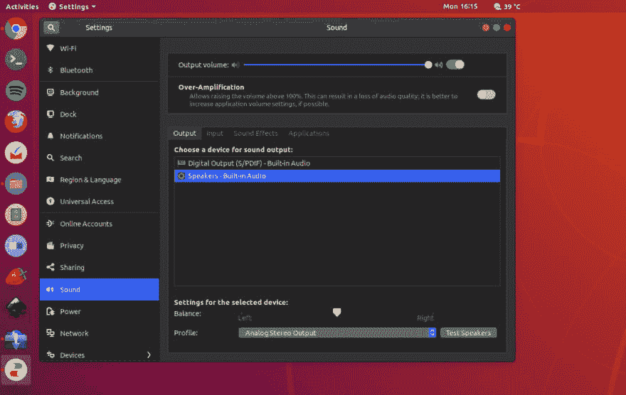
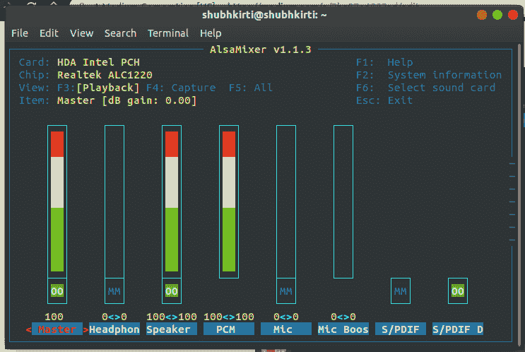
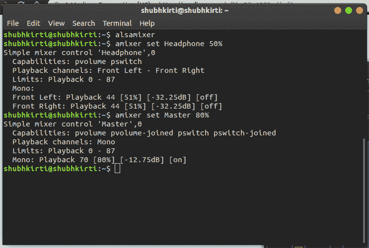

# 用 alsamixer 修复 Ubuntu 18.04 中的音频错误

> 原文：<https://dev.to/shubhkirtisharma/fix-audio-errors-in-ubuntu-18-04-with-alsamixer-729>

最近，我在笔记本电脑上安装了 Ubuntu 18.04，它有一个固态硬盘和一个内置硬盘。在解决了很多问题后不久，我遇到了这个问题，我想可能很多人都在经历这个问题。那么，为什么不写下来呢？

[](https://res.cloudinary.com/practicaldev/image/fetch/s--HxV_BeIn--/c_limit%2Cf_auto%2Cfl_progressive%2Cq_auto%2Cw_880/https://thepracticaldev.s3.amazonaws.com/i/ngrqy7f6orzk8hgo4r93.png)

有时会发生这样的情况，所有的音频控制和音量都满了，你仍然听不到任何音量从那些扬声器里出来。我研究了很多，发现可能是调音台控制有问题。这是我发现的。我在终端中运行`alsamixer`并检查是否所有的卷都已满。

[](https://res.cloudinary.com/practicaldev/image/fetch/s--wUhdGZGC--/c_limit%2Cf_auto%2Cfl_progressive%2Cq_auto%2Cw_880/https://thepracticaldev.s3.amazonaws.com/i/d7zjho3ux37iriic17i2.png)

“耳机”音量静音，即使“主”音量已满。这件小事就是问题所在。修复？简单地使用箭头键(左/右)突出显示耳机标签(它变成红色的主是在上面的照片)。然后使用箭头键(向上/向下)来增大/减小音量。点击 Esc 键退出界面。

您也可以使用终端命令来调节音量:

```
amixer set Headphone 50%

amixer set Master 80% 
```

[](https://res.cloudinary.com/practicaldev/image/fetch/s--eK7H2mOt--/c_limit%2Cf_auto%2Cfl_progressive%2Cq_auto%2Cw_880/https://thepracticaldev.s3.amazonaws.com/i/f5pjfsmcmsueg5iizcce.png)

这最终帮助我解决了音频问题。如果这不起作用，让我们只是讨论可能会发生什么！