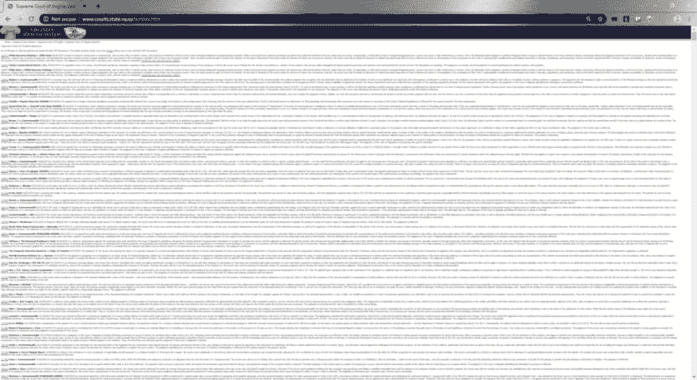

# 修正民主，开发者风格

> 原文：<https://dev.to/yitzi/fixing-democracy-developer-style-5b27>

#### 为公益事业提交表格和收集数据

<figure> 

<figcaption>照片由 [kyryll ushakov](https://unsplash.com/@ushakov_kyryll?utm_source=medium&utm_medium=referral) 上传 [Unsplash](https://unsplash.com?utm_source=medium&utm_medium=referral)</figcaption>

</figure>

美国的法律体系对穷人不利。

任何诉讼案件的结果主要取决于当事人在他们的代理人身上能花多少钱。那些伤害他人却不受惩罚的富有罪犯会被从轻发落。与此同时，经济上不太幸运的人可能会因为最轻微的违法行为而被判处令人发指的刑罚。

> 造成这种不公平局面的主要原因之一是法律研究的成本。两家公司垄断了美国的法律信息市场。

寻求获得开创先例的法律意见的律师事务所需要每月向 Westlaw 或 Lexis 支付 100 美元以上的许可费！参见“[Lexis/west law 双头垄断和法律研究的私人化](http://emoglen.law.columbia.edu/twiki/bin/view/LawNetSoc/ElliottPaper1)”—哥伦比亚大学。

为了对抗这种嘲弄，any law(forbes.com 上的[)建立了一个强大的、功能齐全的、最重要的免费法律搜索引擎！](https://www.forbes.com/sites/maryjuetten/2019/01/22/free-legal-research-for-all-anylaw)

[https://www.youtube.com/embed/7y9QP-Sh4fU](https://www.youtube.com/embed/7y9QP-Sh4fU)

酷，我知道！

### 我们是如何做到的

因为这是一个免费的解决方案，我们显然没有每年许可发表意见的开销。

令人欣慰的是，美国法律要求每个州和联邦法院维护一个网站，并在网上公布他们的法律意见。

因此，显而易见的解决方案是从各个法院网站抓取并下载数据。

可惜没有标准。站点可以是:

*   静电
*   呈现的服务器端
*   动态 JavaScript 站点

法院可以随心所欲地建设自己的网站。

> 他们很高兴做一些非常有趣的事情。

例如，看看弗吉尼亚最高法院的网站:

<figure> 

<figcaption>咦！！</figcaption>

</figure>

是的，这是自 1995 年以来最高法院的所有判决。😕

TLDR；每个法院网站都需要一个机器人😧

#### 案例研究:德克萨斯州

德州是一个很好的例子，因为他们网站的复杂性。这就是我们的机器人在导航到[法院系统 URL](http://www.search.txcourts.gov/CaseSearch.aspx?d=1&coa=cossup) 时所面临的情况:

<figure> 

<figcaption>一种非特殊形式</figcaption>

</figure>

我们的机器人需要做的第一件事是获取所有最高法院意见的列表。由于这个机器人需要与网站交互，我们选择使用由[石像鬼软件公司](http://www.gargoylesoftware.com/)开发的 [HtmlUnit](http://htmlunit.sourceforge.net/)

第一步。安装 HtmlUnit 依赖项。我们将以下代码片段放入我们应用程序的 pom.xml 中。如果您没有使用 Maven，请访问网站获取更多选项。