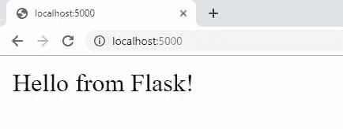
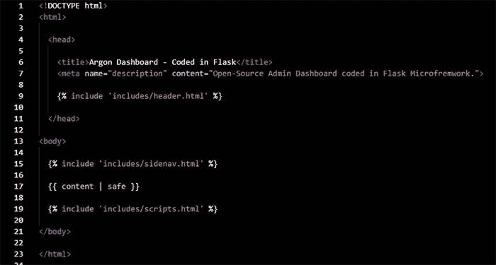
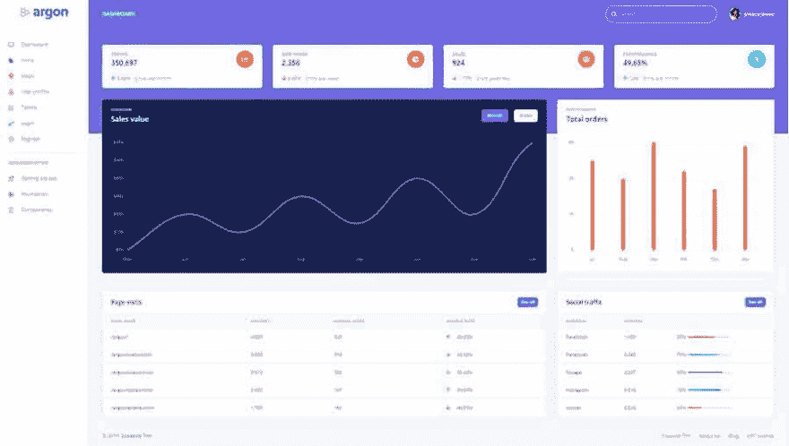

# 烧瓶样板-氩气仪表板

> 原文：<https://dev.to/sm0ke/flask-boilerplate-argon-dashboard-73o>

你好编码器，

这个*边编码边学习*教程将一步一步地描述如何在 **Argon Dashboard** 之上构建一个 **[Flask 样板](https://appseed.us/product/argon-dashboard/flask/)** ，这是一个由 100 多个独立组件和预建页面(登录、仪表板、用户资料)构建的现代 UI 套件。通过使用这种现代设计，您将节省大量从原型到全功能代码的时间，因为所有元素都已实现。

> *感谢阅读！* -内容由 **[App 生成器](https://appseed.us/)** 提供。

* * *

*   ✨ [烧瓶氩气仪表盘](https://appseed.us/product/argon-dashboard/flask/) -产品页面
*   ✨ [烧瓶氩气仪表盘](https://flask-argon-dashboard.appseed-srv1.com/) -现场演示

* * *

在本教程中编码的**管理面板**，**，[烧瓶仪表盘氩气](https://appseed.us/admin-dashboards/flask-boilerplate-dashboard-argon)，**是在 MIT 许可下发布的。请随意在您的项目中使用它。

这个简单的启动程序可以在本地编译并启动，不需要太多的努力，只需在终端中键入几个命令。

* * *

> ✨ **1# -克隆代码**T2】

```
$ git clone https://github.com/app-generator/flask-boilerplate-dashboard-argon.git
$ cd flask-boilerplate-dashboard-argon 
```

Enter fullscreen mode Exit fullscreen mode

* * *

> ✨ **2# -安装模块/依赖关系**T2】

```
$ # Install modules - SQLite Database
$ pip3 install -r requirements.txt 
```

Enter fullscreen mode Exit fullscreen mode

* * *

> ✨ **3# -设置环境&启动 app**T2】

```
$ # Set the FLASK_APP environment variable
$ export FLASK_APP=run.py
$
$ # Start the application (development mode)
$ flask run 
$
$ # Access the dashboard in the browser: http://127.0.0.1:5000/ 
```

Enter fullscreen mode Exit fullscreen mode

默认情况下，默认用户不提供这个简单的烧瓶启动。要创建一个新的，请访问注册页面并使用相同的凭据(用户/密码)进行身份验证。

* * *

[](https://res.cloudinary.com/practicaldev/image/fetch/s--vqDHSy6E--/c_limit%2Cf_auto%2Cfl_progressive%2Cq_auto%2Cw_880/https://raw.githubusercontent.com/app-generator/flask-boilerplate-dashboard-argon/master/media/flask-boilerplate-dashboard-argon-screen.png)

* * *

### ✨ 1# -设置环境

为了开始编写我们的 **[烧瓶](https://appseed.us/admin-dashboards/flask/)** 启动器，我们需要将 [Python](https://www.python.org/) 和[烧瓶](http://flask.pocoo.org/)正确安装在我们的系统上。

对于新人来说，Python 可以从官网[下载](https://www.python.org/downloads/)。只需为您的操作系统选择安装程序并点击几次。要检查安装，打开终端并键入`python --version`。您应该会看到类似这样的内容:

```
$ python --version
$ Python 3.7.2 
```

Enter fullscreen mode Exit fullscreen mode

安装 Flask 最简单的方法是使用 PIP (python 包管理器):

```
$ pip install Flask 
```

Enter fullscreen mode Exit fullscreen mode

* * *

### ✨ 2# - `Hello from Flask`

用 Flask 建立一个新项目是相当容易的。我们的环境中只需要两个文件和一个小的更新:

*   run.py -应用程序启动器
*   **初始化**。py -代表 app **构造器**的文件
*   设置 *FLASK_APP* 变量**导出 FLASK_APP=run.py** 指向 APP 启动器文件(如 *run.py*

* * *

```
< PROJECT ROOT >
   |
   |-- app/                      # Implements app logic
   |    |-- base/                # Base Blueprint - handles the authentication
   |    |-- home/                # Home Blueprint - serve UI Kit pages
   |    |
   |   __init__.py               # Initialize the app
   |
   |-- requirements.txt          # Development modules - SQLite storage
   |-- requirements-mysql.txt    # Production modules  - Mysql DMBS
   |-- requirements-pqsql.txt    # Production modules  - PostgreSql DMBS
   |
   |-- .env                      # Inject Configuration via Environment
   |-- config.py                 # Set up the app
   |-- run.py                    # Start the app - WSGI gateway
   |
   |-- ************************************************************************ 
```

Enter fullscreen mode Exit fullscreen mode

* * *

```
# run.py 
from app import app

if __name__ == "__main__":
    app.run() 
```

Enter fullscreen mode Exit fullscreen mode

* * *

```
# __init__.py 
from flask import Flask

app = Flask(__name__)

@app.route('/')
def index():
    return 'Hello from Flask!' 
```

Enter fullscreen mode Exit fullscreen mode

* * *

> 通过键入*烧瓶运行*启动应用程序，并访问浏览器:

```
$ flask run
 * Serving Flask app "run.py" (lazy loading)
 * Environment: production
 * Debug mode: on
 * Restarting with stat
 * Debugger is active!
 * Running on http://127.0.0.1:5000/ 
```

Enter fullscreen mode Exit fullscreen mode

* * *

[](https://res.cloudinary.com/practicaldev/image/fetch/s--Y56P41OB--/c_limit%2Cf_auto%2Cfl_progressive%2Cq_auto%2Cw_880/https://raw.githubusercontent.com/app-generator/static/master/flask-argon-dashboard-tutorial/flask-app-first-run.jpg)

* * *

### ✨ 3# -集成氩气设计

我们的**样板文件**现在运行了，但是它是一个空的、没有样式的页面。为了提供一些有用的东西，让我们集成一个好看的 UI，配备基本的 UI 模块，由专业人士设计: [Argon Dashboard](https://www.creative-tim.com/product/argon-dashboard?ref=appseed) 由 **Creative-Tim** 精心制作。

* * *

```
$ pip install Jinja2
$ 
$ python # lunch Python console
$ >>>
$ >>> from jinja2 import Template
$ >>> template = Template('Hello {{ my_variable }}!')
$ >>> template.render(my_variable='from Jinja2')
$ 'Hello from Jinja2!'
$ >>> 
```

Enter fullscreen mode Exit fullscreen mode

* * *

设计集成阶段通常既耗时又无聊。因为我是一个懒惰的人，所以我写了一个工具，几乎完全自动化了从 HTML 到 Jinja2 模板的翻译。基本步骤是:

*   检测母版页布局，并将其保存为注入页面特定块的模板
*   提取页面间共享的页眉、页脚和其他重复 HTML 组件的容器
*   用变量替换硬编码文本。例如，每个页面的标题都应该改变。为此，每次加载页面时，*页面标题*使用新值注入页面。

* * *

> 氩仪表盘，Jinja2 主页面- [来源此处](https://github.com/app-generator/flask-argon-dashboard/blob/master/app/templates/layouts/default.html)

* * *

[](https://res.cloudinary.com/practicaldev/image/fetch/s--NGIx1K2r--/c_limit%2Cf_auto%2Cfl_progressive%2Cq_auto%2Cw_880/https://raw.githubusercontent.com/app-generator/static/master/flask-argon-dashboard-tutorial/flask-app-integrate-design-master-page.jpg)

* * *

*   [页脚](https://github.com/app-generator/flask-argon-dashboard/blob/master/app/templates/includes/footer.html) Jinja 模板-源代码
*   [Header](https://github.com/app-generator/flask-argon-dashboard/blob/master/app/templates/includes/header.html) Jinja 模板-源代码
*   [Sidenav](https://github.com/app-generator/flask-argon-dashboard/blob/master/app/templates/includes/sidenav.html) Jinja 模板-源代码

* * *

此时，我们需要有效地使用模板，并向用户展示新的 UI 界面。代码中的更新包括:

* * *

```
from flask import Flask, render_template

app = Flask(__name__)

@app.route('/')
def index():
    return render_template(  'layouts/default.html',
                             content=render_template( 'pages/index.html') ) 
```

Enter fullscreen mode Exit fullscreen mode

* * *

集成代码非常直观，并执行以下操作:

*   导入`render_template`助手来加载和处理 Jinja2 模板
*   `index()`方法使用`render_template`助手来构建页面
*   通过 Jinja 模板引擎呈现页面

* * *

[](https://res.cloudinary.com/practicaldev/image/fetch/s--yDk9GjOp--/c_limit%2Cf_auto%2Cfl_progressive%2Cq_auto%2Cw_880/https://raw.githubusercontent.com/app-generator/static/master/flask-argon-dashboard-tutorial/flask-app-integrate-design-original-page.jpg)

* * *

> 感谢阅读！欲了解更多资源，请访问:

* * *

*   达塔啤酒杯 -另一个免费的开胃菜
*   更多[烧瓶仪表盘](https://appseed.us/admin-dashboards/flask) -由 AppSeed 提供