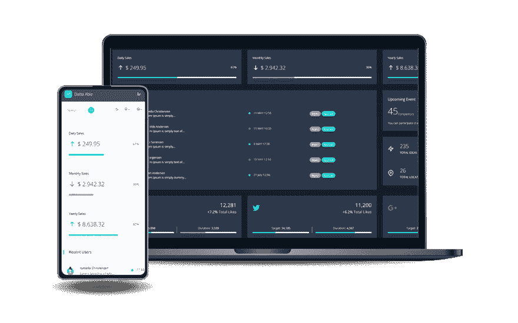
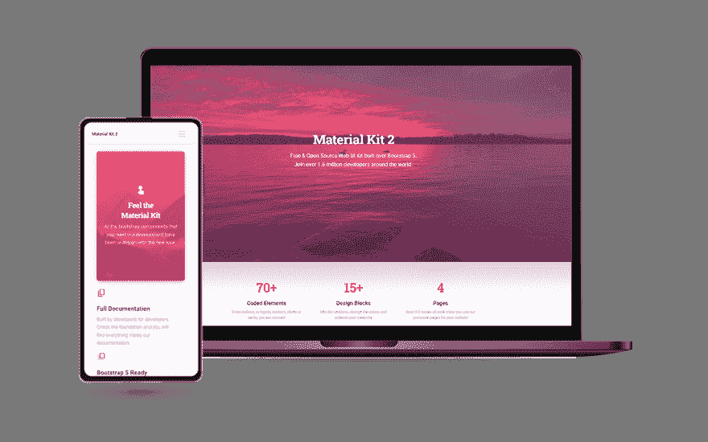
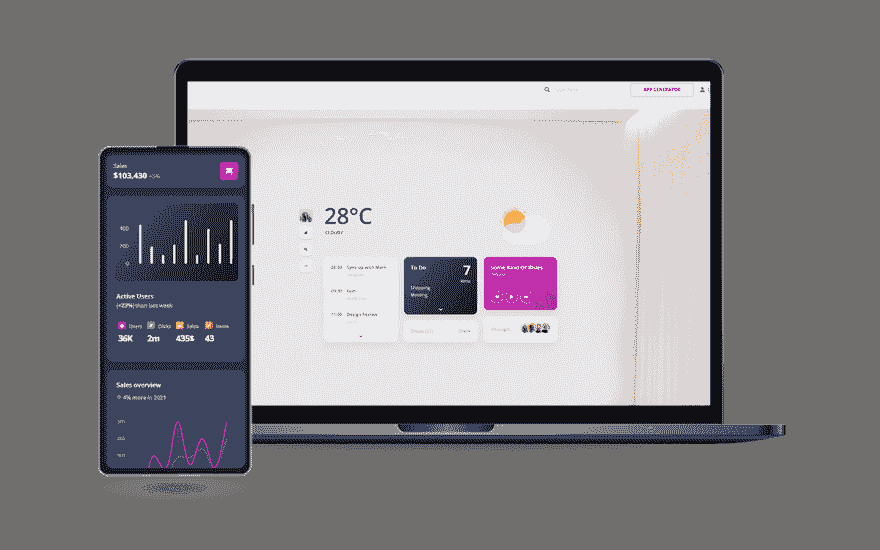
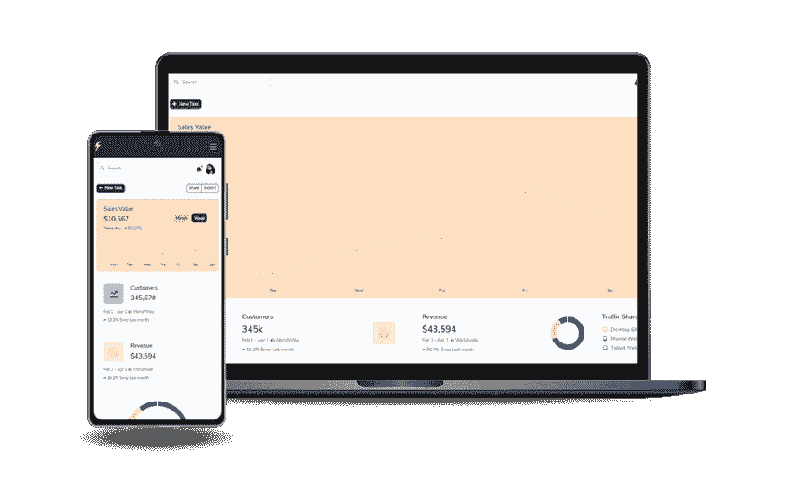
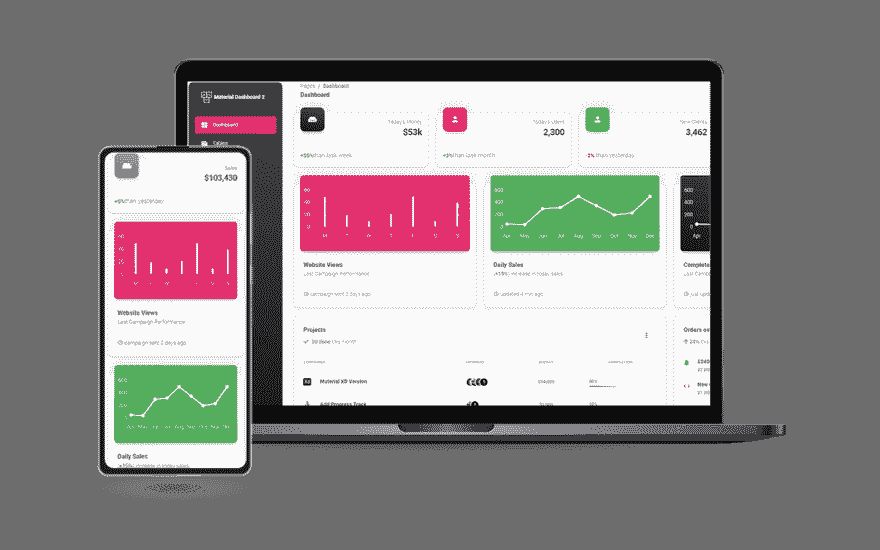
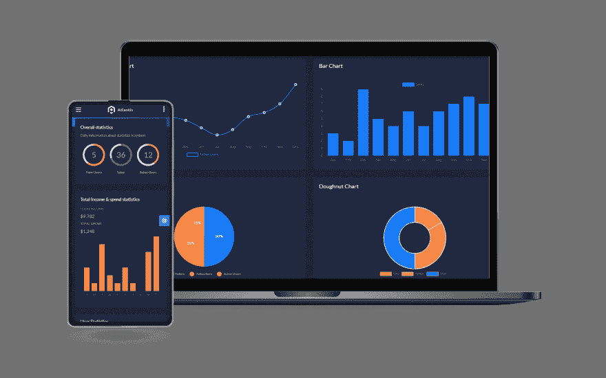
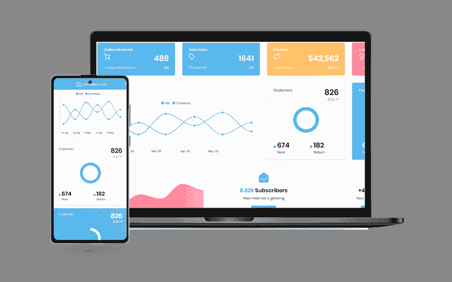
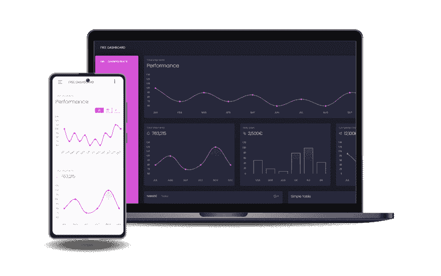

# 烧瓶仪表板-开源样板

> 原文：<https://dev.to/sm0ke/flask-dashboard-open-source-boilerplates-dkg>

hello coder

因为我是 Flask 和**开源**概念的忠实粉丝，所以在这篇文章中，我将展示一个简短的列表，其中有 **[Flask 仪表板](https://appseed.us/admin-dashboards/flask/)** ，用最少的一组特性(数据库、ORM、认证、部署脚本)编码，并在 MIT 许可下发布。对于新人来说， **[Flask](https://appseed.us/admin-dashboards/flask/)** 是一个用 Python 编写的轻量级 web 应用框架，可以轻松扩展- *感谢阅读！*

* * *

## 动机

最近，我把很多精力放在了**样板代码**和自动化工具上，以便赢得时间，减少重复性的小任务，并在每次开始新项目时使用干净的代码库。为了加快我的发展，我的计划很简单:

*   当我开始一个新项目时，使用稳定简单的**样板代码**
*   编写工具来自动集成设计(提取 HTML 组件，用变量替换硬编码文本..等等)
*   使用脚本来自动化部署，并使用现代平台(Heroku、Azure)

这种半自动过程的结果是这个带有**烧瓶仪表盘**的入围名单，每个名单在不到一个小时内编码。在这个自动化过程中，最难的部分是 HTML 处理阶段，但是我计划写一篇关于它的单独的文章。

* * *

## 什么是 **[烧瓶](https://appseed.us/admin-dashboards/flask/)**

Flask 是一个轻量级的 WSGI web 应用程序框架。它旨在快速轻松地开始使用，并能够扩展到复杂的应用程序。Flask 被归类为微框架，它是用 Python 编写的，不需要特殊的工具或库。它没有数据库抽象层、表单验证或任何其他组件，而现有的第三方库提供了通用功能。

*   [烧瓶备忘单](https://blog.appseed.us/flask-cheat-sheet-and-free-templates-63zo/) -博客文章
*   更多[免费仪表盘](https://appseed.us/admin-dashboards/open-source) -策划索引

* * *

## [【datta able flask】](https://appseed.us/product/datta-able/flask/)

**达塔能够**免费仪表板是最风格化的 Bootstrap 4 建兴管理模板，围绕市场上所有其他建兴/免费管理模板。它带有功能丰富的页面和组件，代码完全以开发人员为中心。附带无错误/bug、结构良好、注释良好的代码，并定期提供所有最新更新的代码。这为您节省了大量开发后端应用程序的时间，并且它是完全可定制的。

*   👉[达塔艾布尔烧瓶](https://appseed.us/product/datta-able/flask/) - `Product page`
*   👉[烧瓶达塔能力](https://flask-datta-able.appseed-srv1.com/) -现场演示

* * *

## ✨ [烧瓶材料套件](https://appseed.us/product/material-kit/flask/)

一个像素完美的 Bootstrap 5 UI 套件，带有预构建的设计块、4 个示例页面和 50 多个 UI 组件。如果您想获得灵感或直接向客户展示一些东西，您可以使用我们预先构建的示例页面快速启动您的开发。

*   👉[烧瓶材料套件](https://appseed.us/product/material-kit/flask/) -产品页面
*   👉[烧瓶材料套件](https://flask-material-kit.appseed-srv1.com/) -实时应用

* * *

## ✨ [软 UI 仪表盘烧瓶](https://appseed.us/product/soft-ui-dashboard/flask/)

专为那些喜欢大胆的元素和美丽的网站，软用户界面仪表板准备好帮助您创建惊人的网站和网络应用程序。**软 UI 仪表板**由 70 多个前端独立元素组成，如按钮、输入、导航条、导航标签、卡片或提醒，让您自由选择和组合- **功能**:

*   ✅ `Up-to-date Dependencies`
*   ✅ `UI Kit`:自举 5，持续**黑暗模式**
*   ✅基本认证，`OAuth via Github`
*   ✅ [API 生成器模块](https://www.youtube.com/watch?v=jrdwFsNLZfw) - `video presentation`

* * *

## ✨ [烧瓶自举 5 伏](https://appseed.us/product/volt-dashboard/flask/)

开源 **Flask Dashboard** 在 Volt(免费版)之上用基本模块、数据库、ORM 和部署脚本编码，Volt 是一种现代的引导仪表板设计。Volt 是一款免费开源的 Bootstrap 5 管理仪表板，包含 100 多个组件、11 个示例页面和 3 个定制插件。 **Volt 不需要 jQuery** 作为依赖，这意味着每个库和脚本都是 jQuery 无关的。

*   👉[伏特仪表盘烧瓶](https://flask-volt-dashboard.appseed-srv1.com/) -现场演示
*   👉[伏特仪表盘烧瓶](https://appseed.us/product/volt-dashboard/flask/) -产品页面

* * *

## [【flask 像素 UI 套件】](https://appseed.us/product/pixel-bootstrap/flask/)

基于现代引导设计制作的免费烧瓶启动器。该产品带有示例页面、80 个 UI 组件和一个许可(MIT)许可证。

*   👉 [Flask Pixel UI Kit](https://appseed.us/product/pixel-bootstrap/flask/) - `product page`
*   👉 [Flask Pixel UI Kit](https://flask-pixel-lite.appseed-srv1.com/) - `LIVE demo`

* * *

## ✨ [烧瓶仪表盘材料](https://appseed.us/product/material-dashboard/flask/)

材料仪表板是一个免费的材料 Bootstrap 4 Admin，其清新的新设计灵感来自谷歌的材料设计。我们很高兴能通过一套简单易用且美观的组件来介绍我们对材料概念的理解。Material Dashboard 是在流行的 Bootstrap 4 框架上构建的，它带有几个重新设计的第三方插件，以适应其余的元素。

*   👉[烧瓶仪表板材料](https://appseed.us/product/material-dashboard/flask/) -产品页面
*   👉[烧瓶仪表板材料](https://flask-material-dashboard.appseed-srv1.com/) -现场部署

* * *

## ✨ [烧瓶亚特兰蒂斯建兴](https://appseed.us/product/atlantis-dark/flask/)

**[Atlantis Lite](https://appseed.us/admin-dashboards/flask-dashboard-atlantis-dark)** (深色布局)是一个免费的 Bootstrap 4 admin dashboard，设计精美优雅，可以显示各种指标、数字或数据可视化。Atlantis Lite admin dashboard 有 2 个布局、许多插件和 UI 组件，帮助开发人员快速有效地创建仪表板，从而节省开发时间，并帮助用户基于现有数据做出正确快速的决策

*   👉[亚特兰蒂斯暗瓶](https://appseed.us/product/atlantis-dark/flask/) -产品页面
*   👉[亚特兰蒂斯黑暗烧瓶](https://flask-atlantis-dark.appseed-srv1.com/) -现场演示

* * *

## ✨ [烧瓶材质建兴](https://appseed.us/admin-dashboards/flask-dashboard-material-lite)

开源的 **Flask Dashboard** 在 MaterialPro Bootstrap Lite(一种现代引导仪表板设计)的基础上用基本模块、数据库、ORM 和部署脚本编码。 [WrapPixel](https://appseed.us/agency/wrappixel) 的 **MaterialPro Bootstrap Lite** 是管理仪表板和控制管理面板的最佳引导模板之一。这个强大的 Bootstrap 4 管理模板是基于 HTML 的，并且是用 CSS 框架构建的。

*   👉[烧瓶材质简装](https://appseed.us/product/material-wpx/flask/) -产品页面
*   👉[烧瓶材料精简版](https://flask-materialpro-lite.appseed-srv1.com) -现场部署

* * *

## ✨ [烧瓶梯度表](https://appseed.us/admin-dashboards/flask-gradient-able)

梯度能够免费 Bootstrap 4 免费/建兴管理模板是一个完整的解决方案，为您的仪表板创建。默认布局版本带有有限的选项，如谷歌优化，字体集成，高速，成熟和复杂，以及组织非常良好的代码，这使得自由渐变能够成为任何后端应用程序项目的完全灵活的解决方案。

*   👉[可梯度烧瓶](https://appseed.us/product/gradient-able/flask/) -产品页面
*   👉[梯度瓶](https://flask-gradient-able.appseed-srv1.com/) -现场部署

* * *

## ✨ [烧瓶仪表盘黑色](https://appseed.us/admin-dashboards/flask-dashboard-black)

Black Dashboard 是一个漂亮的 Bootstrap 4 Admin Dashboard，由大量组件组成，看起来非常棒。如果您正在寻找一种工具来管理和可视化关于您的业务的数据，这个仪表板是你的事情。它结合了悦目的颜色、宽敞的卡片、漂亮的排版和图形。

*   👉[黑色仪表盘烧瓶](https://flask-black-dashboard.appseed-srv1.com/) -现场演示
*   👉[黑色仪表盘烧瓶](https://appseed.us/product/black-dashboard/flask/) -产品页面

* * *

> **感谢阅读！**如需更多资源，请随时访问:

*   ✨更多[免费仪表盘](https://appseed.us/admin-dashboards/open-source)在 Django 制作，Flask 和 [React](https://appseed.us/apps/react)
*   ✨更多[管理仪表板](https://www.admin-dashboards.com/) -一个巨大的产品索引