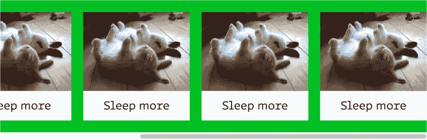
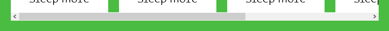
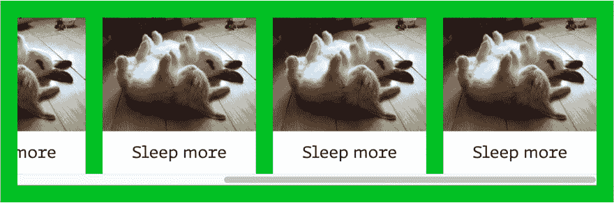
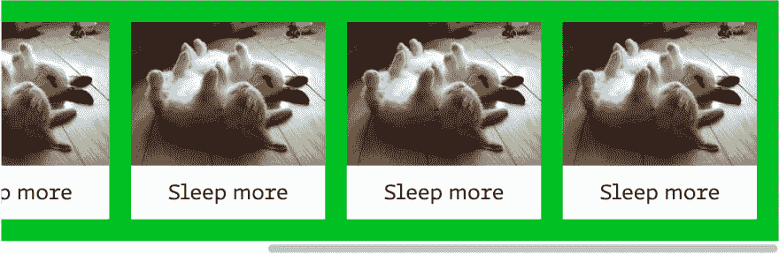

# 柔性盒和衬垫

> 原文：<https://dev.to/huijing/flexbox-and-padding-2683>

我刚刚看到我之前的一篇关于魔法 kittencorns 和 CSS 动画的文章被读了 18 分钟。显然，让人们阅读整本书是很糟糕的。还好我是那个看自己文章的人，哈？

无论如何，这是一个非常短的问题，它来自于我和我的伙伴魏关于在 flex 格式环境中使用填充的讨论。因为那是朋友们在随意交谈中谈论的话题。

但我认为这是人们可能会遇到的一个相当普遍的问题，所以这里有一个记录。

## 场景

如果您尝试将填充应用到具有水平溢出行为的滚动 flex 容器，您可能会注意到填充没有应用到容器的 flex 端。

[](https://res.cloudinary.com/practicaldev/image/fetch/s--ue_HUCIV--/c_limit%2Cf_auto%2Cfl_progressive%2Cq_auto%2Cw_880/https://thepracticaldev.s3.amazonaws.com/i/gvo428zmd5suhbi6ie9e.png)

~~这是因为浏览器在这种情况下分配给 flex 项目的可用空间是:flex 容器的包含块的宽度减去其水平方向的边距、边框和填充。~~

~~规范相关章节为 [CSS 柔性框布局模块一级:9.2 线尺寸](https://www.w3.org/TR/css-flexbox-1/#line-sizing)T3】~~

*更新:*
*[Konstantin Rouda](https://twitter.com/KonstantinRouda)和[ime Vidas](https://twitter.com/simevidas)提出了我最初的解释没有真正解释为什么有开始填充但没有结束填充的观点。经过进一步挖掘，我发现了一个长期存在的争议，即在考虑 Web-compat 的约束时，应该如何处理溢出的内容。*

这不仅仅是一个影响 Flexbox 布局的问题，它对包含块和内嵌子元素的滚动容器也有不同的影响。CSS2.1 对溢出并不清楚，这可能导致不同的浏览器供应商实现不同的行为。比如 Webkit 有(有？)对块子级和内联子级的不同策略。

从 GitHub 发布[【CSS-overflow-3】澄清溢出内容](https://github.com/w3c/csswg-drafts/issues/129)， [fantasai](https://twitter.com/fantasai) 评论说:

> 我认为历史上的问题是浏览器不希望触发滚动条溢出:auto，除非可视内容溢出了内部边框边缘，所以他们不计算填充。

事情还没有解决，有兴趣的可以通读以下相关链接:

*   [错误 748518 使用溢出:自动/滚动忽略底部/右侧填充(block-end/inline-end ),因为它从边框延伸，而不是从可滚动区延伸](https://bugzilla.mozilla.org/show_bug.cgi?id=748518)
*   [【CSS-grid-1】在可滚动溢出区中包含填充](https://github.com/w3c/csswg-drafts/issues/3665)
*   [【CSS-overflow-3】明确溢出内容中的填充底部](https://github.com/w3c/csswg-drafts/issues/129)
*   [CSS 溢出模块三级](https://www.w3.org/TR/css-overflow-3/)
*   [Bug 1527949 实现 CSSWG 提出的任何更具互操作性的行为，使“end”填充在可滚动元素上可滚动](https://bugzilla.mozilla.org/show_bug.cgi?id=1527949)

然而，在带有填充的滚动容器中放置项目是一种相对常见的情况，有几种变通方法可以达到预期的效果。不过，这两种解决方法都有点像黑客。这是一个基本 flex 容器的标记，其中包含一些项目。

```
<div class="flex">
  <div class="flex__item card">
    
    <div class="card__txt">
      <h3>Sleep more</h3>
    </div>
  </div>
  <div class="flex__item card">
    
    <div class="card__txt">
      <h3>Sleep more</h3>
    </div>
  </div>
  <!–– repeat for like 10 more cards ––>
</div> 
```

Enter fullscreen mode Exit fullscreen mode

### 使用边框

一种选择是设置边框样式，使其看起来像容器中的项目周围的填充。

```
.border {
  border: 1em #4abc41 solid;
} 
```

Enter fullscreen mode Exit fullscreen mode

这种解决方案的一个潜在缺点是滚动条的位置。根据操作系统的不同，这可能是也可能不是问题。比如在 Windows 上(如下图截图)，就相当明显。在 Android 上，滚动条几乎看不到。

[](https://res.cloudinary.com/practicaldev/image/fetch/s--WRK9C8ny--/c_limit%2Cf_auto%2Cfl_progressive%2Cq_auto%2Cw_880/https://www.chenhuijing.com/asseimg/posts/flex-padding/border.png)

我想借此机会谈谈 [CSS 滚动条模块第一级](https://drafts.csswg.org/css-scrollbars-1/)规范，它目前是一个编辑草案。它为滚动条样式引入了两个新的 CSS 属性，`scrollbar-color`和`scrollbar-width`。Firefox 从 64 版开始就支持它们。

更多信息请见网络平台新闻第 1022 期[。](https://webplatform.news/issues/2019-07-25)

[](https://res.cloudinary.com/practicaldev/image/fetch/s--t4I_2zYl--/c_limit%2Cf_auto%2Cfl_progressive%2Cq_auto%2Cw_880/https://thepracticaldev.s3.amazonaws.com/i/u68wrdqipqgizaqk2zdr.png)

### 使用`::after`伪元素

另一个选择是利用 flex 容器上的`::after`伪元素。`::before`和`::after`是生成的内容，被插入到它们相关的元素中。换句话说，它将被呈现为 flex 容器中的子元素。

```
.pseudo-elem {
  padding: 1em;

  &::after {
    content: '';
    padding: 0.5em;
  }
} 
```

Enter fullscreen mode Exit fullscreen mode

您必须确保`::after`伪元素上的填充是 flex 容器上使用的填充的一半。

[](https://res.cloudinary.com/practicaldev/image/fetch/s--EW_aeHqO--/c_limit%2Cf_auto%2Cfl_progressive%2Cq_auto%2Cw_880/https://thepracticaldev.s3.amazonaws.com/i/gaxz1h572s7n8vbofk43.png)

## 包装完毕

我保证会很短。无论如何，如果你想看一看代码，并对其进行修改。或者更好，添加到工作区列表中，请随意这样做。把你的解决方案告诉我！

[https://codepen.io/huijing/embed/MMPPeL/?height=600&default-tab=result&embed-version=2](https://codepen.io/huijing/embed/MMPPeL/?height=600&default-tab=result&embed-version=2)