# 响应布局的 FlexBox 容器属性

> 原文：<https://dev.to/thisdotmedia/flexbox-container-properties-for-responsive-layouts-4fdn>

## 什么是 Flexbox？

当你设计一个页面的时候，你会应用很多技巧吗，比如对齐条目，在容器中的多个条目之间分配空间等等？

是的，我们都这样做，但所有这些黑客现在都被 Flexbox 取代了。它取代了用于校准项目的浮标和表格。即使项目的大小是动态的，Flexbox 也会在容器中的项目之间分配分配的空间。Flex 有助于最佳利用空间。它的主要目的是根据可用空间改变容器中物品的高度/宽度，或者在溢出的情况下缩小它们。

我们可以称 **Flexbox** 为当今时代设计的优雅布局。

Flexbox 有两个组件:一个容器和其中的项目。
[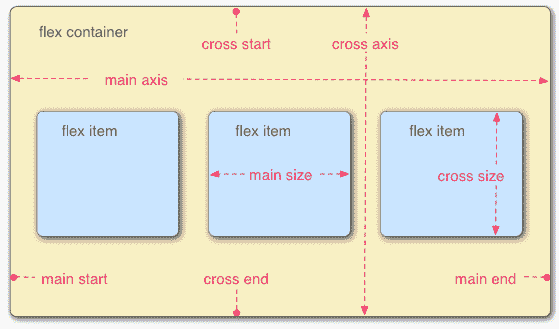T3】](https://res.cloudinary.com/practicaldev/image/fetch/s--HqX7bhII--/c_limit%2Cf_auto%2Cfl_progressive%2Cq_auto%2Cw_880/https://thepracticaldev.s3.amazonaws.com/i/v5o6lps70s17mmi6ou2c.png)

1.  主轴是沿柔性项目布局方向运行的轴。该轴的起点和终点称为主起点和主终点。

2.  横轴是垂直于柔性项目布局方向的轴。该轴的起点和终点称为十字起点和十字终点。

让我们来看看一些 flex 属性:

**1。显示** -一旦应用到父节点，它将为所有直接子节点启用 flex 上下文。`display:flex`开始使用 Flex 所需要的一切。然后，您可以添加其他属性。

```
.component {
  padding: 10px;
  display: flex;
  max-width: 200px;
} 
```

下图显示了 flex 如何动态分配空间给它的项目。

[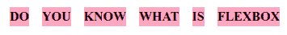](https://res.cloudinary.com/practicaldev/image/fetch/s--Cmgvcwzv--/c_limit%2Cf_auto%2Cfl_progressive%2Cq_auto%2Cw_880/https://thepracticaldev.s3.amazonaws.com/i/nllyxxdhwyzalr7eejm1.png)

**2。挠曲方向** -挠曲是一维的，挠曲方向有助于改变主轴的方向。

我们可以改变方向:行|行-反转|列|列-反转。

```
.component {
  flex-direction: column;
} 
```

[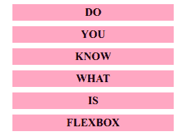](https://res.cloudinary.com/practicaldev/image/fetch/s--SOm6j_A---/c_limit%2Cf_auto%2Cfl_progressive%2Cq_auto%2Cw_880/https://thepracticaldev.s3.amazonaws.com/i/y7cewzyd2oplh7mi3e24.png)T3】

```
.component {
  flex-direction: row;
} 
```

[](https://res.cloudinary.com/practicaldev/image/fetch/s--Cmgvcwzv--/c_limit%2Cf_auto%2Cfl_progressive%2Cq_auto%2Cw_880/https://thepracticaldev.s3.amazonaws.com/i/nllyxxdhwyzalr7eejm1.png)T3】

```
.component {
  flex-direction: row-reverse;
} 
```

[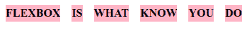](https://res.cloudinary.com/practicaldev/image/fetch/s--bmVFdt_L--/c_limit%2Cf_auto%2Cfl_progressive%2Cq_auto%2Cw_880/https://thepracticaldev.s3.amazonaws.com/i/3fsowoph3z9vj292ul0k.png)T3】

```
.component {
  flex-direction: column-reverse;
} 
```

[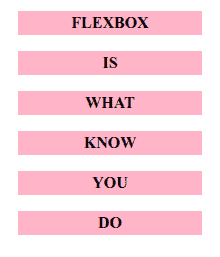](https://res.cloudinary.com/practicaldev/image/fetch/s--VPC48IoK--/c_limit%2Cf_auto%2Cfl_progressive%2Cq_auto%2Cw_880/https://thepracticaldev.s3.amazonaws.com/i/eb5hzf0ks696n0siemqn.png)

**3。flex-wrap** - Flex 提供了一种包装功能，允许你以不同的方式包装你的物品。

```
.component{  
  flex-wrap: wrap;
} 
```

*   `nowrap`(默认):所有弹性项目将在一行
*   `wrap` : flex 项目将从上到下换行到多行。
*   `wrap-reverse`:伸缩项将从下到上换行。

[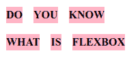](https://res.cloudinary.com/practicaldev/image/fetch/s--7Z3PULZg--/c_limit%2Cf_auto%2Cfl_progressive%2Cq_auto%2Cw_880/https://thepracticaldev.s3.amazonaws.com/i/2btkdqkbh4k010c5q6kf.png)

**4。justify-content** -这个属性帮助我们填充主轴上剩余的空间。

```
.component {
  justify-content: flex-start;
} 
```

[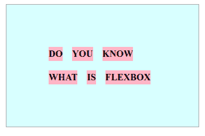](https://res.cloudinary.com/practicaldev/image/fetch/s--2GiNGOvL--/c_limit%2Cf_auto%2Cfl_progressive%2Cq_auto%2Cw_880/https://thepracticaldev.s3.amazonaws.com/i/34zgwaouactjeb87xjx1.png)T3】

```
.component {
  justify-content: flex-end;
} 
```

[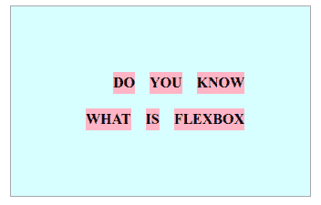](https://res.cloudinary.com/practicaldev/image/fetch/s--ypCMiaWN--/c_limit%2Cf_auto%2Cfl_progressive%2Cq_auto%2Cw_880/https://thepracticaldev.s3.amazonaws.com/i/9bem67qloqmn69j02h9l.png)T3】

```
.component {
  justify-content: space-around;
} 
```

[](https://res.cloudinary.com/practicaldev/image/fetch/s--M3CyClPM--/c_limit%2Cf_auto%2Cfl_progressive%2Cq_auto%2Cw_880/https://thepracticaldev.s3.amazonaws.com/i/5336orxm7un8e9xfurbx.png) 

```
.component {
  justify-content: space-between;
} 
```

[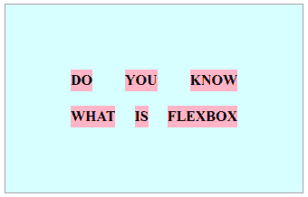](https://res.cloudinary.com/practicaldev/image/fetch/s--8bB4mYlO--/c_limit%2Cf_auto%2Cfl_progressive%2Cq_auto%2Cw_880/https://thepracticaldev.s3.amazonaws.com/i/aezlyzsnhv7chy1ta999.png)T3】

```
.component {
  justify-content: space-evenly;
} 
```

[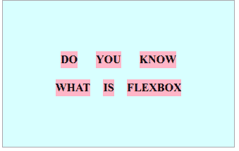](https://res.cloudinary.com/practicaldev/image/fetch/s--xE5HNbP4--/c_limit%2Cf_auto%2Cfl_progressive%2Cq_auto%2Cw_880/https://thepracticaldev.s3.amazonaws.com/i/ry521kz8evlpri7fotmi.png)

**5。align-content** -这与 justify-content 非常相似。在这种情况下，项目在可用空间中沿横轴对齐。

```
.component {
  align-content: flex-start | flex-end | center | space-between | space- 
  around | space-evenly;
} 
```

**6。align-items** -它控制横轴上项目的对齐。

```
.component {
  align-items: stretch | flex-start | flex-end | center | baseline;
} 
```

7 .**。align-self** -用于对齐当前柔性线内的选定项目，并覆盖 align-items 的值。

```
.item {
  align-self: auto | flex-start | flex-end | center | baseline | stretch;
} 
```

这些是一些非常基本的 flex 属性，可以帮助我们实现响应式设计。Flexbox 还减少了 css 中包含的媒体查询。我希望通过看样本图像，你会更好地理解这些属性。

下面是一些上述属性的工作演示。试着添加其他属性，看看有什么变化。

[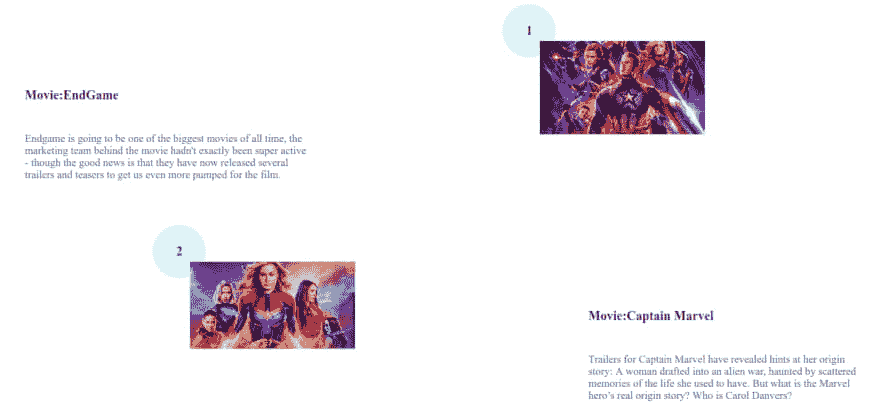](https://res.cloudinary.com/practicaldev/image/fetch/s--YOuldN2A--/c_limit%2Cf_auto%2Cfl_progressive%2Cq_auto%2Cw_880/https://thepracticaldev.s3.amazonaws.com/i/cw1gldlt639tgjs8eqk9.png)

[https://codesandbox.io/s/jolly-herschel-3ixi5](https://codesandbox.io/s/jolly-herschel-3ixi5)

总之，Flexbox 有大量的属性，你可以点击下面的链接查看。我介绍的属性是我作为初学者学到的一些基本概念。希望这对正在寻找起步的人有所帮助。

在写这篇文章的时候，我发现了一个有趣的链接，可以让你享受使用 Flexbox 的体验。

参考:[https://flexboxfroggy.com/](https://flexboxfroggy.com/)T2【参考:[https://css-tricks.com/snippets/css/a-guide-to-flexbox/](https://css-tricks.com/snippets/css/a-guide-to-flexbox/)

这篇文章是由 Megha Sachdev 写的，她是这个点的学徒。

你可以在@ megsachdev 的 Twitter 上关注他们。

需要 JavaScript 咨询、指导或培训帮助吗？在 [This Dot Labs](https://thisdot.co) 查看我们的服务列表。