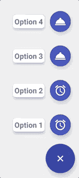

# 带有 Xamarin Android 的浮动操作菜单

> 原文：<https://dev.to/fanmixco/floating-action-menu-with-xamarin-android-2mha>

很多时候，当你构建应用程序时，一个新的控件变得非常著名，浮动按钮，但是在一些著名的应用程序中，你可以找到浮动菜单！

[](https://res.cloudinary.com/practicaldev/image/fetch/s--mEmugG1R--/c_limit%2Cf_auto%2Cfl_progressive%2Cq_66%2Cw_880/https://raw.githubusercontent.com/DeKoServidoni/OMFM/mastimg/example_v1.0.3.gif)

时不时地，在 NuGet 中为这项工作找到一个好的控制有点困难，大多数都已经过时或在最新版本的 Android 中没有真正工作。经过多次失败的尝试后，我找到了来自 [André Servidoni](https://github.com/DeKoServidoni) 的这个 [OneMoreFabMenu](https://github.com/DeKoServidoni/OMFM) ，它没有那么明显的约束力，因为它是用 Kotlin 编写的，但现在，我有了自己的版本，我希望它能帮助你简化移动开发。

现在，让我们来看一些编码:

### **第一步。从 NuGet 下载软件包:**

[](https://www.nuget.org/packages/Xamarin-OneMoreFabMenu/)

### * *第二步。将控件添加到布局中。

```
<com.dekoservidoni.omfm.OneMoreFabMenu
    android:id="@+id/fabMenu"
    android:layout_width="wrap_content"
    android:layout_height="wrap_content"
    android:layout_gravity="bottom|end"
    app:content_options="@menu/omfm_content_options"
    app:color_main_button="@color/colorPrimaryDark"
    app:close_on_click="true"
    app:color_secondary_buttons="@color/colorPrimary"
    app:expanded_background_color="@color/colorGrayTrans"/> 
```

Enter fullscreen mode Exit fullscreen mode

### **第三步。配置您的菜单选项**

你需要在菜单文件夹中创建一个菜单，它可以有这个名称:

**omfm _ content _ options . XML**

```
<?xml version="1.0" encoding="utf-8"?>
<menu xmlns:android="http://schemas.android.com/apk/res/android">
    <!-- The First button is the initial Fab of the menu -->
    <!-- Don't need the title in this case, so let it empty -->
    <item
        android:id="@+id/main_option"
        android:icon="@drawable/icon1"
        android:title=""/>

    <!-- Options buttons of the Fab menu -->

    <item
        android:id="@+id/option1"
        android:icon="@drawable/icon2"
        android:title="@string/options_1" />

    <item
        android:id="@+id/option2"
        android:icon="@drawable/icon3"
        android:title="@string/options_2" />

    <item
        android:id="@+id/option3"
        android:icon="@drawable/icon4"
        android:title="@string/options_3" />
</menu> 
```

Enter fullscreen mode Exit fullscreen mode

### **第四步。配置您的活动以阅读选项**

```
private OneMoreFabMenu FabButtonMenu { get; set; }

public partial class MainActivity : AppCompatActivity, OneMoreFabMenu.IOptionsClick
{
    protected override async void OnCreate(Bundle savedInstanceState)
    {
        base.OnCreate(savedInstanceState);
        FabButtonMenu = FindViewById<OneMoreFabMenu>(Resource.Id.fabMenu);
        FabButtonMenu.SetOptionsClick(this);
    }
}

public void OnOptionClick(Integer p0)
{
    switch (Convert.ToInt32(p0))
    {
        case Resource.Id.option1:
            break;
        case Resource.Id.option2:
            break;
        case Resource.Id.option3:
            break;
    }
} 
```

Enter fullscreen mode Exit fullscreen mode

这就是全部，现在，你有一个很好的和容易使用的菜单！

### 关注我:

| 商务化人际关系网 | 油管（国外视频网站） | 照片墙 | 网络先知 | 分享您的故事 |
| --- | --- | --- | --- | --- |
| [](https://bit.ly/3xLCmvb) | [](https://youtube.com/c/FedericoNavarrete) | [](https://www.instagram.com/federico_the_consultant) | [](https://redcircle.com/shows/cyber-prophets) | [](https://redcircle.com/shows/sharing-your-stories) |

[](https://www.buymeacoffee.com/fanmixco)