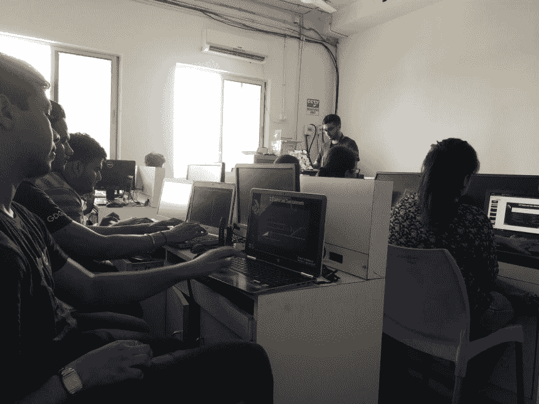
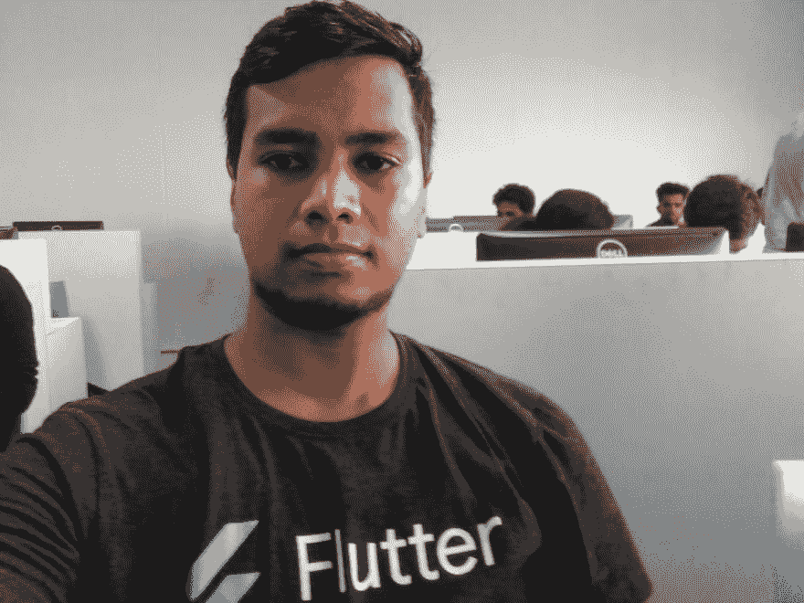

# 颤振训练营 Vadodara 2019

> 原文：<https://dev.to/arps18/flutter-bootcamp-vadodara-2019-7i8>

描述:

Flutter 是 Google 的可移植 UI 工具包，用于从单一代码库构建漂亮的、本机编译的移动、web 和桌面应用程序。它有一些惊人的特点，如快速开发，富有表现力和灵活性的用户界面，本地性能&等等...使用 Flutter 的功能-反应框架，你会感到强大和高效，它在设备和模拟器上的热重载速度极快。

Flutter 应用程序是用 Dart 语言编写的，并利用了该语言的许多更高级的功能。Flutter 与现有代码一起工作，被世界各地的开发人员和组织使用，并且是免费和开源的。

日期和时间:

2019 年 6 月 16 日 10 时至 15 时。

地点:

纳夫拉奇纳大学，瓦多达拉

与会者:50 名学生

个人笔记

Flutter Bootcamp Vadodara 是 DSC SVIT 公司和 DSC PU 公司的联合项目。训练营的座右铭是通过向观众介绍像 flutter 这样的新技术来使编码变得有趣。因此，这导致了 2019 年的组织颤振 Bootcamp Vadodara。自从我们宣布以来，反应非常热烈。

我们非常感谢我们的导师 Harshil Agarwal 和 Ayush Bherwani，他们给了我和我的搭档 Pranit Brahmbhatt 在活动第一天分享舞台的机会。但是第一天是史诗般的印度对巴基斯坦板球比赛的同一天。关于有多少参与者将加入我们，这是一个进退两难的问题。令我们惊讶的是，当我们到达现场时，我们看到了大批参与者的热情。我们也有一些专业人士，所以他们的存在可以丰富我们和参与者的经验。

普拉尼特用一些令人惊叹的迷因向参与者介绍了 dart！他首先讲述了为什么 Flutter ♥镖，然后转移到编程概念，如数据类型，条件语句，循环，方法，异常处理，并简要介绍了 OOP。虽然我们有一些电力故障，但这并不能降低我们的热情，这也体现在参与者身上。他还进行了一次实践活动，以便观众能够用代码来匹配节奏。当他们自己编码时，观众也是互动的。

休息之后，我们进行了一个快速的交流会议，与会者用迷因进行了自我介绍。他们创造了一些严肃搞笑的迷因。(我们的 meme 主 pranit 在那里搞了个比赛！).一切就绪后，是时候开始我的课程了。

这是我第一次作为演讲者的经历，我非常兴奋。我继续讲解了继承、getters 和 setters、抽象、泛型、安全操作符和异步。我不断地与观众互动，他们也有所回应。(我们还为他们颁发了超酷的奖品！).当我们遇到关于空指针错误的讨论时，我邀请了一位专业人士来分享他的知识和经验。

在两次会议之后，是时候开始有趣的时光了。因此，我们在 Kahoot 上举办了一个小测验，测试参与者的知识，度过了一段美好的时光！。他们刚刚度过了最美好的时光。获胜者得到了很酷的奖品。

我们讨论了数据保护法及其重要性&参与者愉快地加入了 Mozilla 发起的运动。

这一天以一场精彩的社交会议结束。人们相互交流，他们中的许多人也交了新朋友。别忘了，是 Mona(GitHub 吉祥物)抓住了所有人的注意力。他们中的许多人也点击快照！最后是合影的时间了。

以下是关于我们训练营的推特信息…

> 尼莱耶尔@ nlycskn[# Vadodaya](https://twitter.com/hashtag/Vadodaya)[# India](https://twitter.com/hashtag/India)已经办了一个飘起的新兵训练营！与他人分享他的激情是不是很神奇！祝贺所有组织者和与会者！[twitter.com/hackyroot/stat…](https://t.co/Wt3EbDiLoI)🎉# flutterbootcampvadodara # flutterbootcamp 19 @ FlutterDev @ moz guj @ GitHubEducation @ GitKraken[@ pblead 26](https://dev.to/pblead26)@ nlycskn @ a _ harsh il 1712 @微软 https://t.co/fxfHb2oAOZ29

> Pooja bhau mik[@ pblead 26](https://dev.to/pblead26)补上 [@flutterbootcamp](https://twitter.com/flutterbootcamp) 周一的所有更新。迫不及待地想加入瓦多达拉训练营的第三周！😎[twitter.com/flutterbootcam…](https://t.co/kEYAHFQJx6)2019 年 6 月 16 日下午 16:59flutterbootcamp vado Dara@ flutterbootcamp今日惊艳环节快速总结。[@ pblead 26](https://dev.to/pblead26)@ nlycskn @ FlutterDev @ moz guj @ GitHubEducation # flutterbootcampvadodara # flutterbootcamp 19 https://t.co/EPg1YOs691327

> 阿尤什·Bherwani@阿尤什·Bherwani如果你错过了 [@flutterbootcamp](https://twitter.com/flutterbootcamp) 别担心，下面为你快速总结一下。
> [# flutterbootcampvadodara](https://twitter.com/hashtag/flutterbootcampvadodara)[# flutterbootcamp 19](https://twitter.com/hashtag/flutterbootcamp19)[twitter.com/flutterbootcam…](https://t.co/jz0fEOALtT)2019 年 6 月 16 日下午 16:23flutterbootcamp Vadodara@ flutterbootcamp今日惊艳环节快速总结。[@ pblead 26](https://dev.to/pblead26)@ nlycskn @ FlutterDev @ moz guj @ GitHubEducation # flutterbootcampvadodara # flutterbootcamp 19 https://t.co/EPg1YOs69109

> 南丹卡拉里亚@ none _ done _FlutterBootcamp 第一周第二场:潜入 Dart 更深处！
> 
> PS:希望丰盛的午餐不要玩扫兴的游戏😴
> 
> [# flutterbootcamp 19](https://twitter.com/hashtag/flutterbootcamp19)
> [# flutterBootcampVadodara](https://twitter.com/hashtag/flutterbootcampvadodara)
> [# flutterbootcamp 19](https://twitter.com/hashtag/flutterBootcamp19)
> [# flutterBootcampVadodara](https://twitter.com/hashtag/flutterBootcampVadodara)
> [@ flutterbootcamp](https://twitter.com/flutterbootcamp)08:23AM-2019 年 6 月 16 日T37

> 阿潘@ arps _ 1899我们的兄弟 [@pranitb10](https://twitter.com/pranitb10) 摇摆舞台[@ flutterbootcamp](https://twitter.com/flutterbootcamp)[#颤振](https://twitter.com/hashtag/flutter)[#颤振](https://twitter.com/hashtag/flutter)dev[#颤振](https://twitter.com/hashtag/flutter)bootcampvadodara06:12

> 杰伦·帕特尔@杰伦帕特尔 15406void main(){
> Print("带着满满的能量在颤动的新兵训练营 Vadodara 动手实验")；
> }
> [@ ayushbherwani](https://twitter.com/ayushbherwani)[@ pranitb 10](https://twitter.com/pranitb10)[@ flutterbootcamp](https://twitter.com/flutterbootcamp)[@ FlutterDev](https://twitter.com/FlutterDev)
> [# flutterbootcampvadodara](https://twitter.com/hashtag/flutterbootcampvadodara)[# flutterbootcamp 19](https://twitter.com/hashtag/flutterbootcamp19)[# FlutterDev](https://twitter.com/hashtag/flutterdev)[# Flutter](https://twitter.com/hashtag/Flutter)
> [# Flutter](https://twitter.com/hashtag/Flutter)社区

> 法丁可汗[@ dev _ delight](https://dev.to/dev_delight)从第一天出发[@ flutterbootcamp](https://twitter.com/flutterbootcamp)04:17AM-2019 年 6 月 16 日0

因此，第一周在高潮中结束，参与者也给出了积极的反馈。

但这还没有结束。我们袖子里藏着很多东西。探险继续前进到第 2 周。在第二周，我们有很多关于颤振的有趣的东西。它将包括无状态窗口小部件、有状态窗口小部件、flutter 中导航等等。

第 3 周将是特别的一周，因为 Pooja Bhaumik(印度第一位女性谷歌开发专家)将加入我们，用她的知识和经验启发我们。她将执行 API 调用，NoSQL vs SQl，Firestore with Flutter &推进关于 Flutter 的主题。

在第 4 周，我们将举办黑客马拉松。许多导师也将加入我们，敬请期待。

那都是乡亲们！再见！