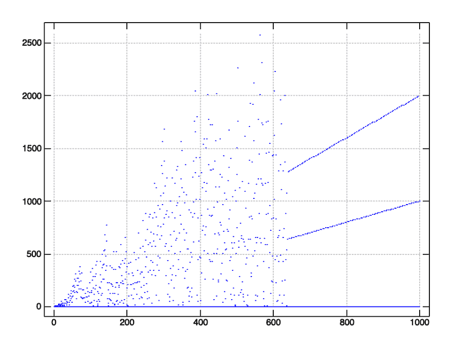
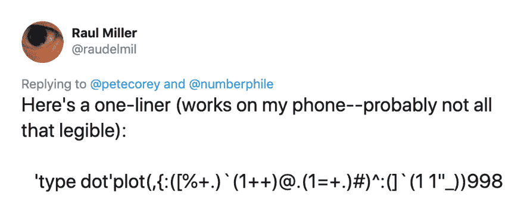

# 笔直飞，该死的！

> 原文：<https://dev.to/petecorey/fly-straight-dammit-3nkf>

[Numberphile](https://www.numberphile.com/) 最近发布了一个关于[的视频，一个有趣的递归函数](https://www.youtube.com/watch?v=pAMgUB51XZA)叫做“直线飞行，该死！”当绘制时，最初看起来是混乱的，但是经过 638 次迭代后，立即稳定下来。

这听起来像是一个完美的机会来展示我们的 J 肌肉并自己设计这个函数！

## 势在必行的解决办法

最简单的方法来策划我们的“直线飞行，该死！”图形使用[J 编程语言](https://www.jsoftware.com/#/)是命令式地接近事物:

```
a =: monad define
  if. y < 2 do.
    1
  else.
    py =. a y - 1
    gcd =. y +. py
    if. 1 = gcd do.
      1 + y + py
    else.
      py % gcd
    end.
  end.
) 
```

我们已经定义了我们的`a`一元动词，如果我们传入一个`0`或`1`的“基本情况”值，它将返回`1`。否则，我们在`y - 1`递归执行`a`来得到我们的`py`，或者“前一个`y`”。接下来，我们检查`y`和`py`的`gcd`是否等于`1`。如果是，我们返回`1 + y + py`。否则，我们返回`py`除以`gcd`。

这种解决方案对任何人来说都不应该太陌生。

让我们画出`a`的值来验证我们的解决方案:

```
require 'plot'
'type dot' plot a"0 i. 1000 
```

[](https://res.cloudinary.com/practicaldev/image/fetch/s--DlHeUghb--/c_limit%2Cf_auto%2Cfl_progressive%2Cq_auto%2Cw_880/http://www.petecorey.com/img/2019-08-12-fly-straight-dammit/plot.png)

这个可以，但是非常慢。我们知道我们的递归调用做了很多重复的工作。如果我们能够记住调用`a`的结果，我们可以节省相当多的时间。幸运的是，在 J 中记忆一个动词很简单，只需在动词的声明中添加`M.`:

```
a =: monad define M.
  ...
) 
```

现在，我们迫切需要的解决方案要快得多。

## 使用叉子和钩子

虽然我们最初的解决方案是可行且快速的，但它并没有利用 J 语言独特而有趣的优势。让我们试着改变这一点。

我们解决方案的核心是计算两种情况下的值。在`y`和`py`的最大公约数等于`1`的情况下，我们计算`1`加上`y`加上`py`。我们的命令式的、从右到左的计算实现如下所示:

```
1 + y + py 
```

我们也可以把它写成一个[“一元名词分叉”](https://www.jsoftware.com/help/jforc/forks_hooks_and_compound_adv.htm)，基本上读作“`1`加上`x`加上`y`的结果:

```
a_a =: 1 + + 
```

同样，当我们遇到`y`和`py`的最大公约数大于`1`的情况时，我们要计算`py`除以那个`gcd`。这可以写成[“并叉”](https://www.jsoftware.com/help/jforc/forks_hooks_and_compound_adv.htm) :

```
a_b =: [ % +. 
```

我们可以把这个分叉读成“`x`除以`x`和`y`的最大公约数。”

既然我们已经将两个计算写成了默认动词，我们可以使用[“议程”动词](https://www.jsoftware.com/help/dictionary/d621.htm) ( `@.`)来根据当前情况决定使用哪一个:

```
a_a =: 1 + +
a_b =: [ % +.

a =: monad define M.
  if. y < 2 do.
    1
  else.
    py =. a y - 1
    has_gcd =. 1 = y +. py
    py (a_b ` a_a @. has_gcd) y
  end.
) 
```

如果`has_gcd`是`0`，或者“假”，我们将返回`py a_b y`的结果。否则，如果`has_gcd`是`1`，我们将返回`py a_a y`的结果。

## 更多议程

我们可以详细说明[使用 agenda 有条件地选择我们想要应用的动词](https://www.jsoftware.com/help/learning/10.htm)的想法，以帮助简化基本情况检查。

```
 <p>I find myself producing lots of ranging content from books and articles, like the one you're reading now, to open source software projects. If you like what I'm doing, <strong>nothing shows your support more than signing up for <a href="#newsletter">my mailing list</a></strong>.</p> 
```

首先，让我们将基本格和递归格定义为可以组合成动名词的动词。我们的基本情况很简单。我们只想返回`1` :

```
base_case =: 1: 
```

我们的递归例子就是上一个例子中的(memoized) `else`块:

```
recursive_case =: monad define M.
  py =. a y - 1
  has_gcd =. 1 = y +. py
  py (a_b ` a_a @. has_gcd) y
) 
```

我们的函数`a`想要有条件地应用`base_case`或`recursive_case`，这取决于`y`是大于还是小于 1。我们可以这样写议程:

```
a =: base_case ` recursive_case @. (1&<) 
```

因为我们的`base_case`动词非常简单，我们可以直接内联它来清理:

```
a_a =: 1 + +
a_b =: [ % +.

recursive_case =: monad define M.
  py =. a y - 1
  has_gcd =. 1 = y +. py
  py (a_b ` a_a @. has_gcd) y
)

a =: 1: ` recursive_case @. (1&<) 
```

使用 agenda 构建条件语句和伪“case 语句”是将条件语句合并到 J 程序中的强大工具。

## 更进一步

可以想象，您可能想要实现我们的`recursive_case`的默认版本。不幸的是，我的 J-fu 不够强大，无法解决这个问题并提出合理的解决方案。

也就是说，劳尔·米勒(在他的手机上)想出了一个简单的解决方案，并且[在 Twitter](https://twitter.com/raudelmil/status/1159575084757135361) 上发布了它。劳尔的 J-fu 很强。

[](https://res.cloudinary.com/practicaldev/image/fetch/s--HdK1C09G--/c_limit%2Cf_auto%2Cfl_progressive%2Cq_auto%2Cw_880/http://www.petecorey.com/img/2019-08-12-fly-straight-dammit/tweet.png)