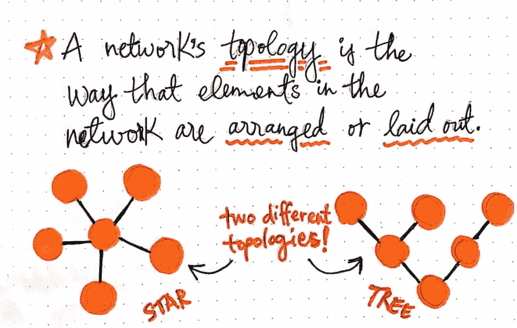
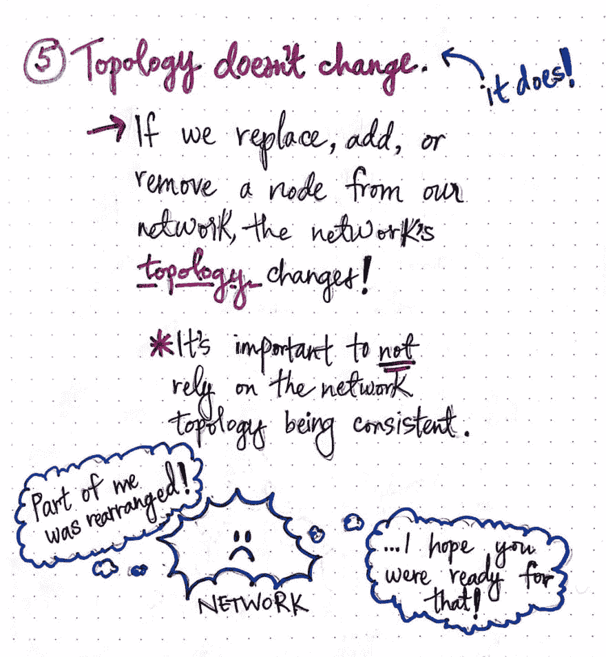
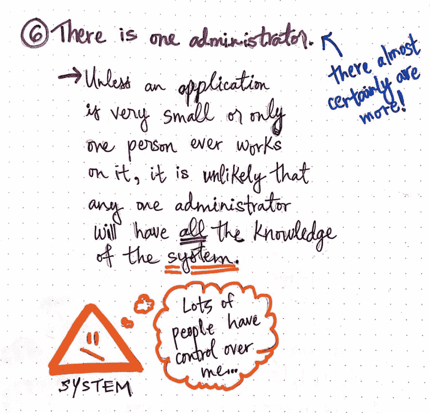
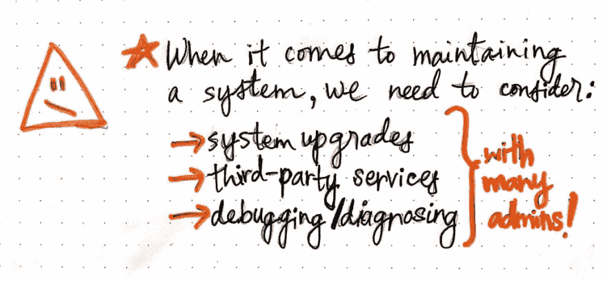
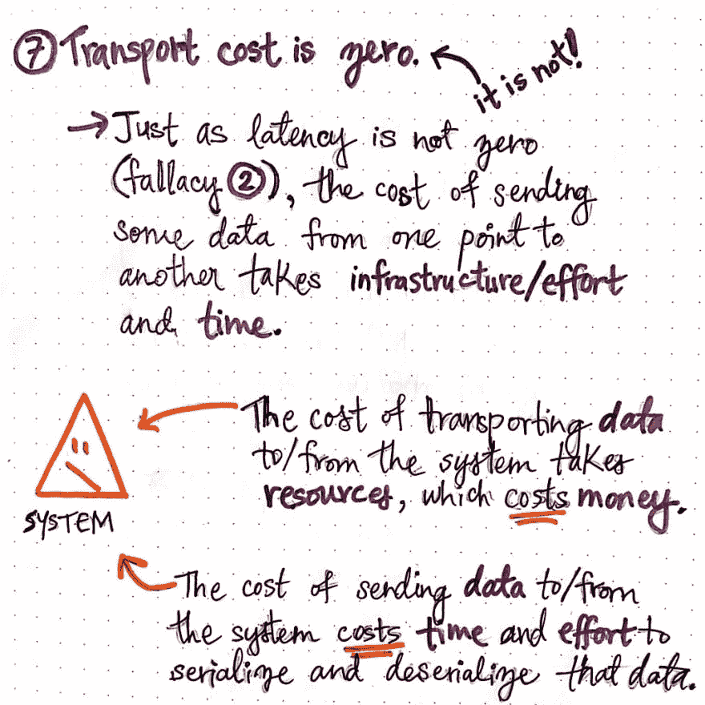
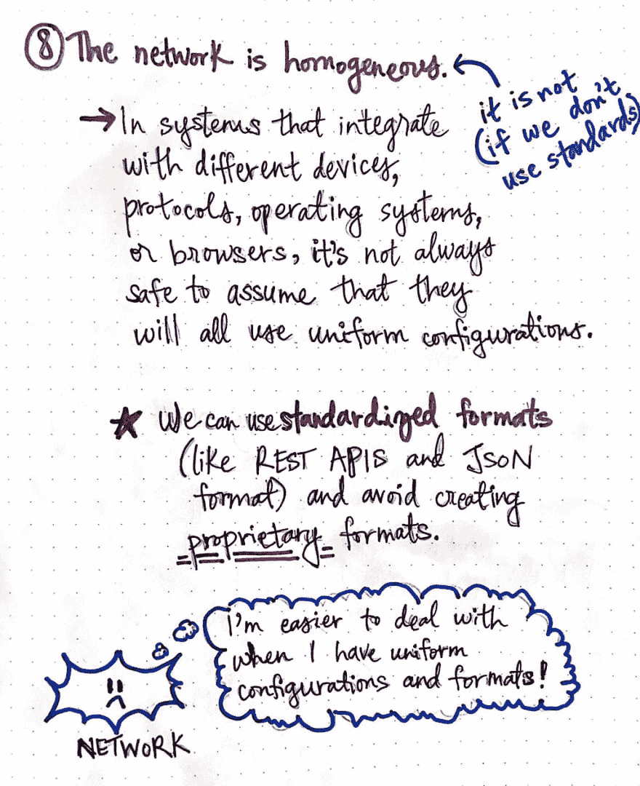

# 搜寻分布式计算的谬误(第 2 部分)

> 原文：<https://dev.to/vaidehijoshi/foraging-for-the-fallacies-of-distributed-computing-part-2-2p21>

分布式系统很难应对的一个事实是，随着系统的增长，它会发生变化。此外，系统周围的事物——系统本身的一部分、它的依赖项以及维护它的人——也都能够改变。

在本系列的第一部分中，我们研究了分布式计算的八个著名谬误中的前四个。方便的是，这四个谬误都围绕着网络，以及许多开发人员在处理分布式系统时可能陷入的误解和谬误。但是在这个系列的第二部分，我们将缩小一点，看看剩下的四个谬误，在我看来，它们在本质上更抽象。

对我来说，后半部分谬误有趣的是，乍一看，它们似乎对我们来说是显而易见的。你甚至可能在阅读它们的时候对自己说，“怎么会有人认为这个谬论是真的呢？”。但是当我们深入研究每一个谬论的时候，我们很快就会发现，每一个谬论都有比我们看到的更多的东西。当我们设计一个简单的系统或者一个复杂的系统时，检查这些宏观的事实比我们想象的要难。所以让我们开始吧，结束我们对谬误的搜寻！

#### 重新整理网络

众所周知，分布式系统中的节点必须通过网络发送消息进行通信。然而，这个网络是一个不断变化、波动的实体。如果一个节点被添加到网络中，它本质上会有一些不同，对吗？我们在舞台上有了一个新的角色，网络看起来的方式或它是如何排列的取决于所涉及的节点。

<figure> 

<figcaption>拓扑:网络中的定义。</figcaption>

</figure>

事实证明，这个概念有一个术语，现在是我们熟悉它的时候了: ***拓扑*** 。网络拓扑是网络中元素的布局或排列方式。

> 拓扑说明了我们的分布式系统中的节点相互关联或连接的方式，更重要的是，它们如何相互通信。

例如，我们可以将网络中的一组节点连接成环形并相互通信，或者将所有节点连接成一条线。或者，就像上面的例子一样，节点可以连接成星形，也可以排列成树形。所有这些不同的例子都是在网络中布置节点的有效方式，并且它们中的每一个都是不同的拓扑。

理解拓扑的概念对我们解决谬误五是至关重要的:**拓扑不会改变。**记住这是一个*谬误*，意思是这是一个误解；换句话说，这种说法是不真实的，事实上，网络的拓扑*的确*发生了变化。

<figure> 

<figcaption>谬误 5:拓扑不会改变(它会改变！)</figcaption>

</figure>

从表面上看，这种说法似乎显而易见；任何时候，当我们在网络中添加、替换或删除一个节点时，该网络的元素(节点)的排列方式以及它们之间的关系都必须灵活多变，以便能够应对这些变化。考虑到我们所知道的关于节点如何可能[有缺陷](https://dev.to/vaidehijoshi/fantastic-faults-and-what-to-call-them-2djb)以及它们如何[失败](https://dev.to/vaidehijoshi/modes-of-failure-part-2-544h)的信息，我们也可以确定，可能添加新节点或者可能移除或替换旧节点的频率将会相当一致和高。换句话说，网络的拓扑结构总是不断变化的！

那么，为什么这个显而易见的谬误在这里值得注意呢？好吧，让这个谬论比它看起来更棘手的是，事实上我们大多数人只是没有在日常生活中考虑它的明显性。我们经常依赖网络以某种方式行动，做某些事情。有时，我们明确地依赖于以某种方式排列的网络拓扑。例如，如果我们的系统每 30 秒向系统中的一个节点发送消息，并期望该节点存在于网络中的某个位置，如果该节点消失了会发生什么？或者它动了怎么办？

如果我们依赖于我们的网络总是“看”着某个特定的方式，如果我们期望它的节点总是以某个特定的方式排列，我们就会陷入这个谬误的陷阱。这是一个很容易做出的假设，特别是当我们作为一个分布式系统的设计者和维护者在日常交往中没有考虑到这个谬误的时候！因此，我们应该考虑我们可能依赖的方式——即使是无意的——我们系统网络的拓扑结构。

#### 系统管理现实

假设是很容易做出的事情——我们一直在做假设！我们不仅会对我们的系统及其外观以及在特定情况下的表现做出错误的假设，还会对在任何给定时间谁将维护和处理该系统做出错误的假设。

<figure> 

<figcaption>谬论#6:有一个管理员(几乎肯定有更多！).</figcaption>

</figure>

这就把我们带到了谬误六:**有一个管理员。**在几乎所有的现实场景中，分布式系统的管理员通常都不止一个*。除了非常小的应用程序——或者可能是只有一个人构建和维护的玩具/业余爱好项目的系统——大多数系统最终都会有许多人参与系统的维护。*

 *假设只有一个管理员维护一个分布式系统会有长期的副作用。例如，设想一个系统，其中有三个管理员帮助保持系统正常运行。如果其中一个管理员——碰巧是系统某一方面的专家——离开团队，会发生什么？或者，如果系统的一部分实际上是一个依赖项，并且是外部服务的一部分，该怎么办？

在这两种情况下，系统的一部分很可能在其他人的控制之下，我们必须考虑如果系统的这一部分需要维护，我们将做什么，或者如果系统的这一部分出现故障，将会发生什么(以及谁将解决问题，更不用说多快了)!

<figure> 

<figcaption>作为一名管理员维护一个系统的诸多方面。</figcaption>

</figure>

第六个谬误非常重要，要牢记在心(而且很容易完全忘记！).我们已经知道像维护和升级系统这样的常规任务[是导致大量软件错误的原因](https://dev.to/vaidehijoshi/weeding-out-distributed-system-bugs-9c8)。因此，当一个系统有许多管理员时，我们有责任确保随着越来越多的管理员加入进来，系统仍然可以容易地升级和维护。类似地，如果我们的系统依赖于第三方服务，我们需要考虑那些外部管理员是谁，以及我们将如何处理需要注意的外部依赖性。

我们还需要确保有一种方法来授权系统的所有管理员调试和诊断系统的不同部分。这个难题的最后一块尤其重要，因为管理员可以做出重要的决策，如重启节点、限制数据量或决定使用什么协议，而这些决策对于管理系统并保持其正常运行至关重要。

<figure> 

<figcaption>谬论七:运输成本为零(其实不是！)</figcaption>

</figure>

另一个“容易忽略”的假设是运行一个系统的实际成本。这将我们引向谬论七:**运输成本为零。**正如我们从[谬误二](https://dev.to/vaidehijoshi/foraging-for-the-fallacies-of-distributed-computing-part-1-35n9)中了解到的，数据从一个地方传输到另一个地方需要时间；这段时间的另一个名称是*延迟*。类似地，将数据从一个地方发送到另一个地方的成本也有其他成本！

例如，在分布式系统中，需要 ***资源*** 才能将任何数据从一个地方传输到另一个地方。这些资源都有一个价格标签，这些资源是要花钱的。

此外，将数据从一个地方发送到另一个地方也需要一些努力和时间来将数据转换成机器可读代码(随后，再从机器可读代码转换成数据)。这些过程被称为 ***序列化*** 和 ***反序列化*** ，在系统中传递的所有数据都需要从字节流中序列化和反序列化到内存中用于表示该数据的某个对象中。许多开发人员熟悉序列化和反序列化，并且每天都在使用它；然而，并不是所有人都必须考虑这两个过程发生时所花费的时间和精力！

它耗费时间、精力和资源的事实提醒我们，通过我们的系统发送数据和来回传输信息是不自由的。然而，我们很容易忘记这一点，直到我们从 AWS 或 Heroku 那里收到一份意想不到的账单，这时我们突然想起了这个现实。当我们的系统规模扩大，运输成本开始攀升时，牢记这一谬误尤为重要。

#### 系统的标准化

最后一个谬误是我们许多人可能从未想过的，特别是如果我们一直在使用已经存在了一段时间的框架和系统。第八个谬误把我们带回到我们的老朋友，网络:**网络不是同质的。我们中的许多人可能都知道这个谬论本质上是错误的:网络中的节点可以是任何东西，所以不能保证它们都是相同的！**

事实上，大多数分布式系统可能与不同种类的设备集成，也许是不同的协议，并且几乎肯定会适应各种操作系统和浏览器。因为我们网络的节点不会看起来都一样，所以假设它们的配置都一样也不总是安全的。

<figure> 

<figcaption>谬误 8:网络是同质的(如果我们不用标准就不是)。</figcaption>

</figure>

事实上，大多数网络都是异构的，但是系统网络中的节点仍然需要协同工作并具有互操作性。然而，方便的是，我们大多数人不需要害怕这种谬论；这就是 ***标准化*** 的用武之地！如今，大多数系统都被设计为依赖并利用标准化格式，这些格式是为了在系统中的不同元素之间创建一种共享语言而创建的，即使它们的配置可能并不完全相同。

我们中的许多人每天都在使用这些标准——比如 HTTP 协议、REST APIs 和 JSON 格式的数据，这些标准使得处理异构网络变得更加容易。但是记住这个谬误仍然很重要，万一有一天，我们发现自己构建了一个没有使用标准化格式的系统的一部分！推出自己的专有协议意味着，将来很可能会有另一个节点与我们的非标准格式不兼容。

事实上，我认为所有八个谬误都值得思考，即使我们正在与已经建立的系统一起工作，这样我们就不需要考虑这些问题。仅仅因为我们每天不遇到这些谬误并不意味着它们不强大！事实上，它们可以在我们不注意的时候悄悄靠近我们，并证明即使是最有经验的分布式系统工程师也会做出错误的假设。

#### 资源

分布式计算的谬误已经被写得相当好了，你可以找到一些关于不同技术的不同解释的好资源。如果您想了解更多，请查看下面的参考资料！

1.  分布式计算的谬误解释
2.  理解分布式系统的 8 个谬误
3.  揭穿分布式系统的八大谬误
4.  分布式系统的谬误，乌迪·达汗
5.  分布式计算的谬误重生:云时代

* * **