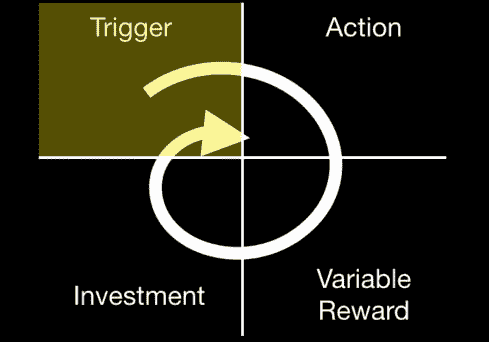
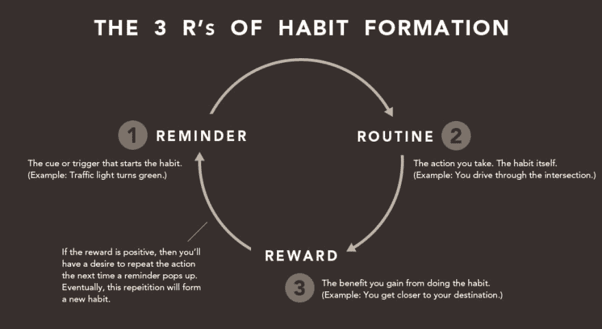

# 养成良好的习惯来掌控你的生活

> 原文：<https://dev.to/taillogs/form-great-habits-to-take-control-of-your-life-1g4k>

## 保持客观

“自我”的概念是最重要的概念之一，也是存在中潜在的焦虑感。它允许美妙和可怕的经历让我们成为“我们”，但也让客观的自我分析成为一个真正的挑战。

重要的是要记住，每时每刻都有无数的潜意识决定和机制影响着你的行为和感受。你是否曾经想去健身房，但却没有足够的精力或意志力？**不能做自己想做的事情是不是感觉很糟糕，因为你大脑中释放的化学物质似乎是你无法控制的？**

## 习惯养成，人类自动驾驶

很容易忘记你的大脑没有魔力。它遵守规则和模式，而这些模式和规则可以被利用，甚至被劫持。

我想讨论的具体机制是大脑形成习惯的能力。关于习惯的形成，维基有如下说法:

> 习惯的形成是一个过程，通过有规律的重复，一种行为变成自动的或习惯性的。

不幸的是，围绕这个主题有很多废话，但如果你在正确的地方寻找，也有一些真正的科学。这篇文章对养成新习惯给出了一个很好的展望，要点如下。

> 平均来说，一种新行为变成自动行为需要 2 个多月的时间——确切地说是 66 天。养成一个新习惯需要多长时间，这取决于行为、人和环境。在拉里的研究中，人们需要 18 天到 254 天才能形成一种新习惯。

这不是神话中的[“3 周习惯周期”](https://science.howstuffworks.com/life/inside-the-mind/human-brain/form-a-habit.htm)，但它所花费的时间并不重要。更重要的是，我们有经验证明，给你足够的时间，你可以让自己自动做事。

那么问题是什么，为什么不是每个人都这样做呢？

很难，真的很难。你的意识喜欢“在控制中”的感觉。因此，你可以像猴子一样被训练的想法并不令人愉快。但那不是客观的展望，那为什么要成为你的展望呢？如果你不再把自己视为*【你】*，而是一个可以被训练自动做事的肉容器，可能性是无限的。

## 激活自动驾驶仪

我讨厌跑步。但我知道客观上这是保持健康最省时的方法之一，而且总是很实用(不需要装备)。所以在过去的几周里，我强迫自己每天跑步。尽管我已经强迫自己养成了很多习惯，但是开始一个新的习惯从来都不容易。你的每一部分都会想停下来，但那是你必须用逻辑来超越你的生理的时候。请记住，从那一刻起的几天后，你会自动获得这种行为的好处，而不会有现在的压力。

 
*Pic 来源:[养成习惯大文章](https://open.buffer.com/building-habits/)*

你也会惊讶于这种行为变得令人愉快的速度。对于跑步，我没有考虑到跑步本身会让我感觉更好，因此增加了我对跑步的享受，也更容易养成习惯。你可以用它来改善你健康的其他方面，比如合理饮食，喝足够的水。即使你开始时很挣扎，这项活动的好处可能会让你更健康，从而让第二天更轻松。

## 外卖

记住，你可以强迫自己做任何你想做的事情。一开始可能不是即时的或令人愉快的，但那是你的潜意识天真地把短期放在长期之前。最终，如果你能建立足够多的好习惯，增加新的习惯应该会容易得多。

如果你想了解更多关于习惯形成的知识，我强烈推荐《习惯的力量》这本书，它深入地讨论了这个话题。