# 14 个免费的即将发布的页面

> 原文：<https://dev.to/creativetim_official/free-coming-soon-pages-406>

###### 本帖包含附属链接；如果您从本文提供的不同链接购买产品或服务，我可能会收到报酬。

* * *

为什么有一个即将到来的网页和订阅？

因为社交媒体传播你的信息，但电子邮件和内容营销帮助你与客户建立联系。

如果你以这种心态开始，它只会给你带来好处。所以，当你认为你有一个产品的提示时，试着去验证它！获得用户参与，创建社交媒体帐户，设置您的 Mailchimp 帐户，并通过即将推出的页面让人们看到它。这听起来可能很复杂，或者你可能倾向于拖延，但现在每一步都变得更容易了。

什么是“即将推出”页面？

“即将推出”页面不是一个静态的白色页面与一些正在建设中的图标。如果你的页面看起来像这样，你就错过了很多。

它不仅仅是一个让人们了解即将到来的网站或网络服务的登陆页面，而是一种提高预期水平的方式。一个设计良好的“即将推出”页面会吸引感兴趣的用户点击订阅按钮。一个即将到来的网页是一个很好的方式，让访问者了解你网站的一切，同时，也让你从访问者那里得到一些东西。

接下来，我们将向您展示 15 个免费“即将推出”页面的列表。希望这个列表对你有用。

### [t1**第一咖啡馆**](#1ego-cafe)

自我咖啡馆是一个免费即将到来的网站模板。非常适合帮助你开始下一次创业。
[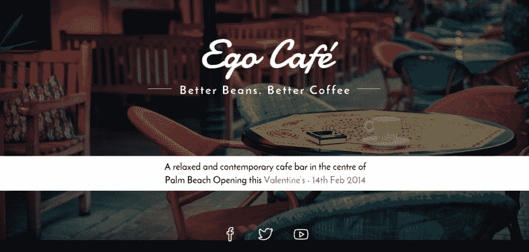T3】](https://res.cloudinary.com/practicaldev/image/fetch/s--M8lvIf8f--/c_limit%2Cf_auto%2Cfl_progressive%2Cq_auto%2Cw_880/https://blog.creative-tim.com/wp-content/uploads/2015/10/csb.png)

[下载](https://www.successagency.com/di/coming-soon-page/ego-cafe/) | [直播预告](https://www.successagency.com/di/coming-soon-demo/ego-cafe-22/) | [获取主持](https://m.do.co/c/276af09d9975)

### **2。iPhone 应用**

[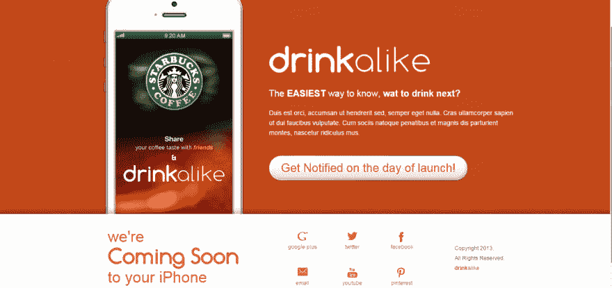](https://res.cloudinary.com/practicaldev/image/fetch/s--fBRta4lV--/c_limit%2Cf_auto%2Cfl_progressive%2Cq_auto%2Cw_880/https://blog.creative-tim.com/wp-content/uploads/2015/10/csb2.png)

[下载](https://www.successagency.com/di/coming-soon-page/drinkalike-iphone-app/) | [直播预告](https://www.successagency.com/di/coming-soon-demo/drinkalike-the-iphone-app-15/) | [获取主持](https://m.do.co/c/276af09d9975)

### **3。艾丽莎**

如果您计划很快启动一个新项目或服务，并且希望在启动之前开始创建您的电子邮件列表，您可以使用它。
[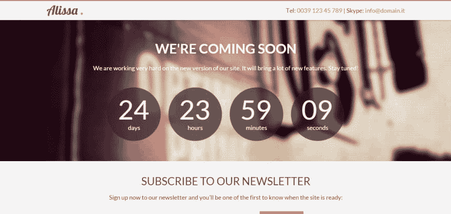T3】](https://res.cloudinary.com/practicaldev/image/fetch/s--bOYRiYyJ--/c_limit%2Cf_auto%2Cfl_progressive%2Cq_auto%2Cw_880/https://blog.creative-tim.com/wp-content/uploads/2015/10/csb3.png)

[下载](https://azmind.com/free-template-alissa-responsive-bootstrap-coming-soon-page/) | [直播预告](https://azmind.com/demo/alissa-coming-soon/) | [获取主持](https://m.do.co/c/276af09d9975)

### **4。智能推车**

免费即将到来的模板:智能车。即将推出的购物网站页面。
[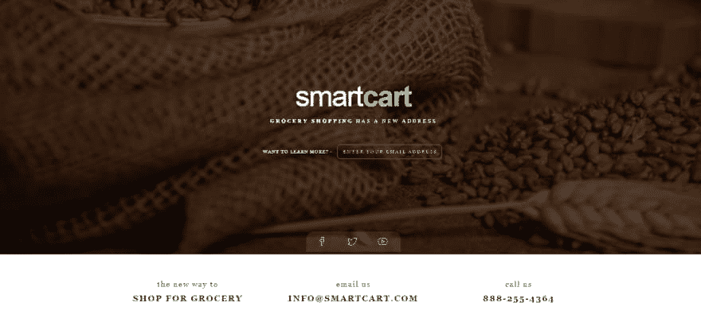T3】](https://res.cloudinary.com/practicaldev/image/fetch/s--P19xc7ZR--/c_limit%2Cf_auto%2Cfl_progressive%2Cq_auto%2Cw_880/https://blog.creative-tim.com/wp-content/uploads/2015/10/csb4.png)

[下载](https://www.successagency.com/di/coming-soon-page/smart-cart/) | [直播预告](https://www.successagency.com/di/coming-soon-demo/smart-cart-21/) | [获取主持](https://m.do.co/c/276af09d9975)

### **5。时间在浪费**

[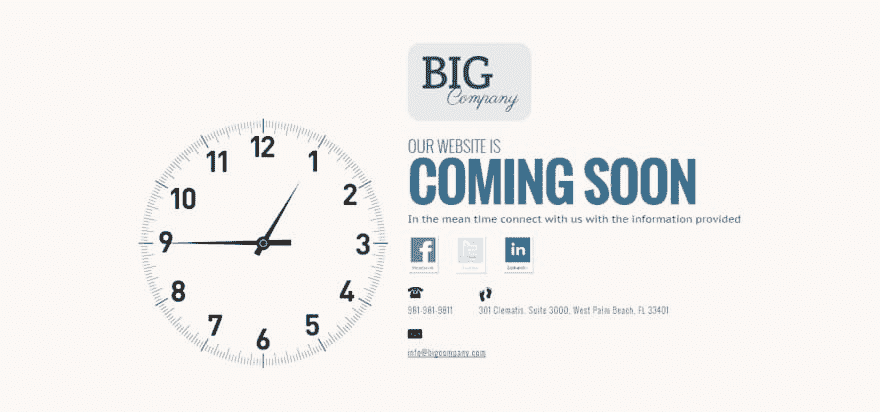](https://res.cloudinary.com/practicaldev/image/fetch/s--9Dl8Er-l--/c_limit%2Cf_auto%2Cfl_progressive%2Cq_auto%2Cw_880/https://blog.creative-tim.com/wp-content/uploads/2015/10/csb5.png)

[下载](https://www.successagency.com/di/coming-soon-page/times-a-wastin/) | [直播预告](https://www.successagency.com/di/coming-soon-demo/times-a-wastin-5/) | [获取主持](https://m.do.co/c/276af09d9975)

### **6。日出**

Sunrise 是一个用 Bootstrap3 构建的响应性 HTML5 CSS3 即将推出的模板。放心用吧！
[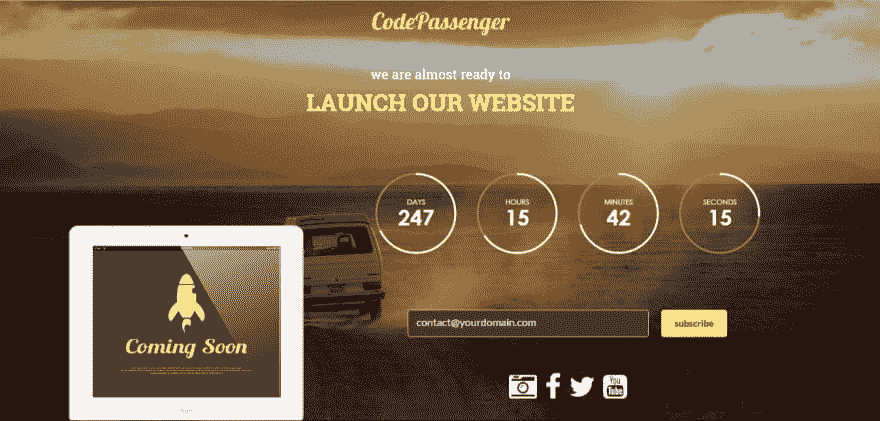T3】](https://res.cloudinary.com/practicaldev/image/fetch/s--doaAn22f--/c_limit%2Cf_auto%2Cfl_progressive%2Cq_auto%2Cw_880/https://blog.creative-tim.com/wp-content/uploads/2015/10/csb7.png)

[下载](http://codepassenger.com/html/?product=sunrise) | [直播预告](http://codepassenger.com/html/?product=sunrise) | [获取主持](https://m.do.co/c/276af09d9975)

### **7。进度**

Progress 是一个快速响应的模板。对于所有的初学者来说，这可能有点复杂，但是试一试吧。
[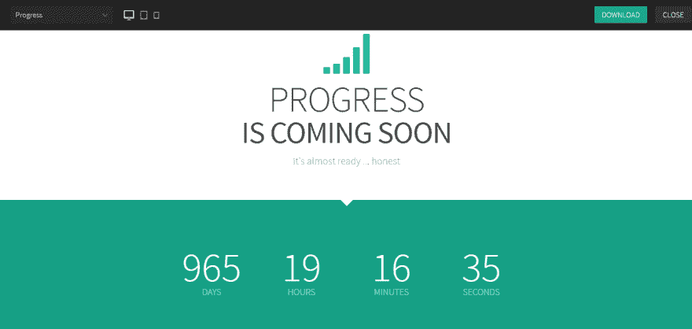T3】](https://res.cloudinary.com/practicaldev/image/fetch/s--j5LKSfU4--/c_limit%2Cf_auto%2Cfl_progressive%2Cq_auto%2Cw_880/https://blog.creative-tim.com/wp-content/uploads/2015/10/csb8.png)

[下载](https://www.downloadwebsitetemplates.co.uk/template/progress/) | [直播预告](http://www.downloadwebsitetemplates.co.uk/preview/?theme=progress) | [获取主持](https://m.do.co/c/276af09d9975)

### **8。Jasm**

Jasm 是一个非常时尚的多用途网站模板。你可以从 your-plugin.com
[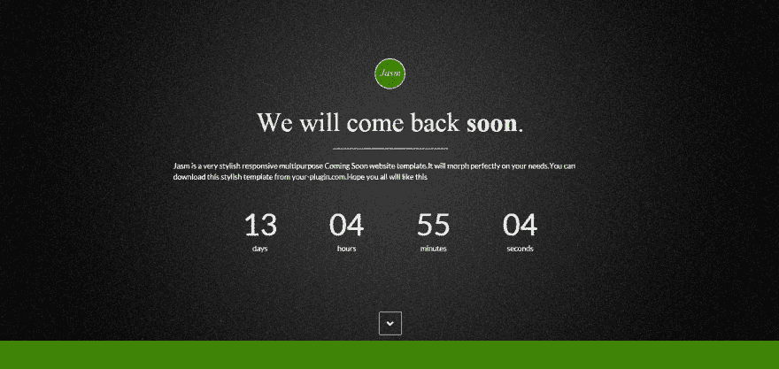](https://res.cloudinary.com/practicaldev/image/fetch/s--vFBetcyU--/c_limit%2Cf_auto%2Cfl_progressive%2Cq_auto%2Cw_880/https://blog.creative-tim.com/wp-content/uploads/2015/10/csb9.png)下载这个时髦的模板

[下载](https://www.your-plugin.com) | [直播预告](https://www.your-plugin.com/jasm/) | [获取主持](https://m.do.co/c/276af09d9975)

### **9。活着**

Alive 是一个基于 Bootstrap 3.2.0 的最小、响应迅速的业务即将推出/登录页面/单页 HTML5 模板。
[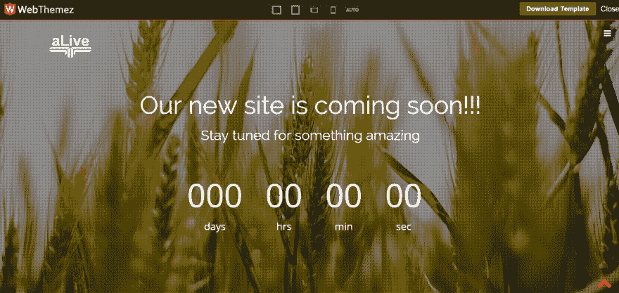T3】](https://res.cloudinary.com/practicaldev/image/fetch/s--CGqR9z4Z--/c_limit%2Cf_auto%2Cfl_progressive%2Cq_auto%2Cw_880/https://blog.creative-tim.com/wp-content/uploads/2015/10/csb10.png)

[下载](https://webthemez.com/alive-responsive-coming-soon-template) | [直播预告](https://webthemez.com/preview/?alive-Responsive-Coming-Soon-Template/) | [获取主持](https://m.do.co/c/276af09d9975)

### **10。趋势集**

趋势集是一个简单的即将到来的主题是一个响应网络兼容多种设备，带有无限的背景图片。
[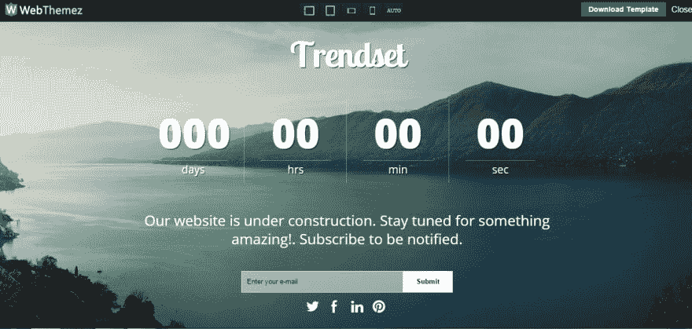T3】](https://res.cloudinary.com/practicaldev/image/fetch/s--zT6YYKee--/c_limit%2Cf_auto%2Cfl_progressive%2Cq_auto%2Cw_880/https://blog.creative-tim.com/wp-content/uploads/2015/10/csb11.png)

[下载](https://webthemez.com/coming-soon-responsive-web-template-trendset/) | [直播预告](https://webthemez.com/preview/?coming-soon-responsive-web-template-trendset/) | [获取主持](https://m.do.co/c/276af09d9975)

### **11。黑夜**

[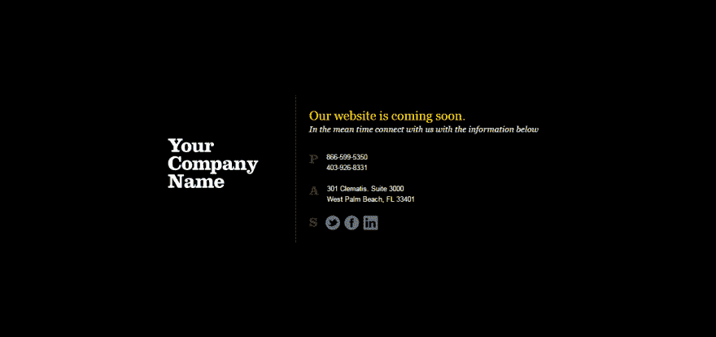](https://res.cloudinary.com/practicaldev/image/fetch/s--ebmDYRiQ--/c_limit%2Cf_auto%2Cfl_progressive%2Cq_auto%2Cw_880/https://blog.creative-tim.com/wp-content/uploads/2015/10/csb12.png)

[下载](https://successagency.com/di/coming-soon-demo/dark-night-2/) | [直播预告](https://successagency.com/di/coming-soon-demo/dark-night-2/) | [获取主持](https://m.do.co/c/276af09d9975)

### [t1**12 个儿子**](#12zoon)

Zoon 是一个反应灵敏、简单、干净、移动友好的网站模板。
[T3】](https://res.cloudinary.com/practicaldev/image/fetch/s--92_7KZU1--/c_limit%2Cf_auto%2Cfl_progressive%2Cq_auto%2Cw_880/https://blog.creative-tim.com/wp-content/uploads/2015/10/csb13.png)

[下载](https://www.styleshout.com/free-templates/zoon/) | [直播预告](https://www.styleshout.com/demo/?theme=zoon) | [获取主持](https://m.do.co/c/276af09d9975)

### **13。不久见**

see Soon-Coming Soon/Under Construction Template 是一个专业的、有创意的、由 Twitter Bootstrap3 框架支持的免费模板。
[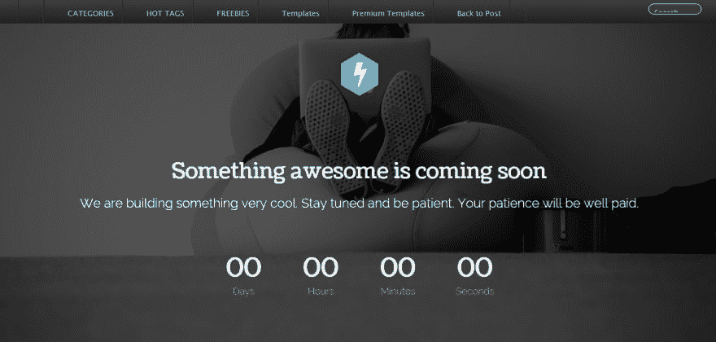T3】](https://res.cloudinary.com/practicaldev/image/fetch/s--9atWgIIw--/c_limit%2Cf_auto%2Cfl_progressive%2Cq_auto%2Cw_880/https://blog.creative-tim.com/wp-content/uploads/2015/10/csb14.png)

[下载](https://www.egrappler.com/free-template-coming-construction-responsive-template/) | [直播预告](https://www.egrappler.com/seesoon/index.html) | [获取主持](https://m.do.co/c/276af09d9975)

### **14。[创意蒂姆](https://www.creative-tim.com/product/coming-sssoon-page?ref=devto)T5】**

在真正开始您的项目之前，使用[即将到来的短期页面](https://demos.creative-tim.com/coming-sssoon-page/demo-image-background.html?ref=devto)创建一个以下用户组！它很轻，容易使用，有助于你和你的听众保持联系。
T3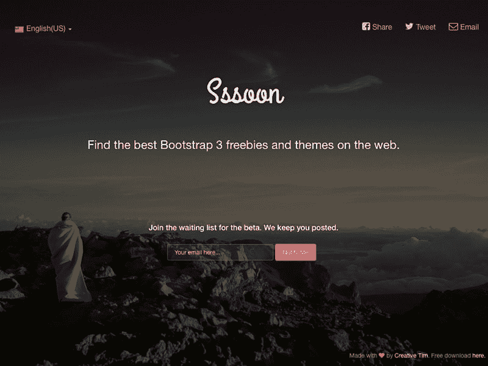T5】

[下载](https://www.creative-tim.com/product/coming-sssoon-page?ref=devto) | [直播预告](https://demos.creative-tim.com/coming-sssoon-page/demo-image-background.html?ref=devto) | [获取主持](https://m.do.co/c/276af09d9975)