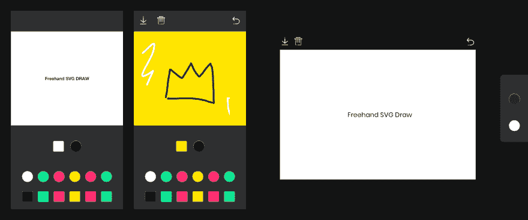

# Freehand SVG Draw

> 原文：<https://dev.to/dimazz/freehand-svg-draw-4jgd>

嗨 devs，

我想向大家介绍我的第一个开源 VueJS 产品。大约一周前，我想给我的宠物项目添加一些简单的绘画素材...没有为 VueJS 准备好任何东西。

我花了大约 2 天时间重写其他 js 解决方案来满足我的需求。现在想分享给 vuejs 社区。代码并不完美，有很多改进的空间，但希望它会有用。

用鼠标或手指绘制矢量 SVG 路径。最小的用户界面和功能。专为 VueJs 打造。

##### 演示:

[https://artrayd.com/freehand-svg/](https://artrayd.com/freehand-svg/)

##### GitHub:

[https://github . com/artrayd/vuej-freehand-SVG-draw](https://github.com/artrayd/vuejs-freehand-svg-draw)