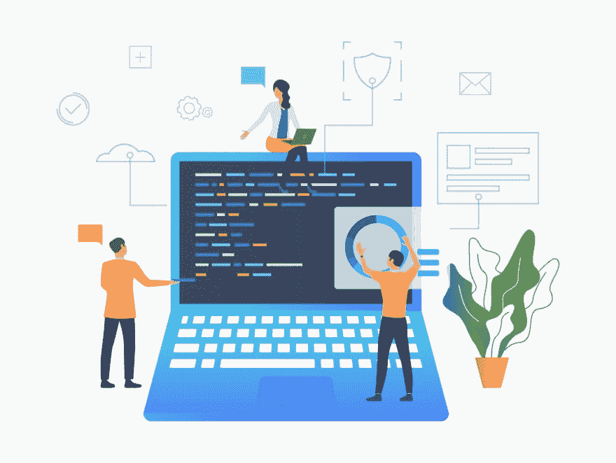

# 从 DevOps 到 DevSecOps:如何行动

> 原文：<https://dev.to/giladmaayan/from-devops-to-devsecops-how-to-make-the-move-2eio>

 

<figure>

<figcaption>图片来源:

<figure>[@ katemangostar](https://www.freepik.com/free-vector/business-people-working-laptop-development_4332351.htm)

<figcaption></figcaption>

</figure>

</figcaption>

</figure>

传统上，应用程序安全措施仅限于生命周期的最后一个软件开发阶段(SDLC)。如今，安全性已经成为每个开发阶段的核心特性和考虑因素。

在本文中，我们将看到 DevSecOps 如何将安全作为一项共同的责任来重视。我们还将讨论 DevSecOps 如何从一开始就考虑基础设施和软件安全性，以及如何最好地从 DevOps 迁移到 DevSecOps。

## 什么是 DevOps？

DevOps 是一种[信息技术(IT)](https://searchdatacenter.techtarget.com/definition/IT) 方法，旨在促进 IT 运营和软件开发人员之间的协作、沟通、自动化和集成。DevOps 的根本目标是提高软件交付的质量和速度，这使得持续、频繁的更新成为可能。

DevOps 团队致力于创建一致的开发环境，并自动化交付过程，以确保交付高效、可预测、可持续和安全。为此，团队可以利用[项目管理工具](https://project-management.com/top-10-project-management-software/)进行协作，利用机器学习实现自动化，以及任何其他有助于创建高效管道的工具。

DevOps 焦点使开发人员能够更好地控制生产基础设施，并更清楚地了解生产环境。它还通过为团队成员提供验证、构建和交付其应用程序的自由来增强他们的能力。

## 什么是 DevSecOps？

DevSecOps 在 DevOps 方法中集成了安全实践。DevSecOps 通过安全团队和发布工程师之间的合作培养了一种“安全即代码”的文化。像 DevOps 一样，DevSecOps 方法是面向为复杂的软件开发过程开发创新的解决方案。这是在敏捷框架的上下文中完成的。

DevSecOps 的目标是在维护代码的安全和快速交付的同时，弥合 IT 和安全团队之间传统上存在的鸿沟。竖井方法被一种思维方式所取代，这种思维方式确保在整个交付过程中分担安全任务的责任。

在 DevSecOps 中，两个明显对立的目标——安全代码和交付速度——被统一到一个高效的过程中。

## 您为什么应该迁移到 DevSecOps？

软件漏洞是大多数数据泄露的原因，因此，安全性必须是所有组织首要关注的问题。当一个应用程序功能在没有警告的情况下崩溃时，它肯定会惹恼用户。此外，为代价高昂的数据泄露提供机会的安全漏洞将对整个企业产生相当大的影响。

近年来，随着网络安全威胁的复杂性和数量的增加，安全技术有了长足的发展。安全措施现在在开发过程中被广泛采用，以确保每个变量都被考虑在内。如果在交付管道的末端隔离了一个 bug，那么处理起来成本很高，团队需要重新评估和重新运行他们的操作。这可能会导致交货延迟。一个安全漏洞甚至可能需要重新架构，这将要求对功能进行更严重的修改。

DevSecOps 是一种通过将这些过程集成到开发过程中来简化这些过程的方法。这有助于确保安全漏洞不会进入生产环境，也不会发生违规事件。DevSecOps，很像密切相关的 [SecOps](https://www.exabeam.com/siem-guide/siem-concepts/secops/) ，创建了更有效和更快速的方法来在敏捷框架内交付安全代码。它通过将安全性放在过程的中心，增强了操作团队和开发团队之间的协作。

## 采取行动时要考虑的 3 个关键因素

### 1。连续反馈回路

反馈是 DevSecOps 的核心。建立一个持续的反馈循环将有助于开发人员，并帮助机器了解平台或系统的漏洞。这种持续的实时反馈形式可以帮助企业创建有效的规则集和策略。

正确的规则可以保持应用程序安全测试工具的相关性和最新性，与组织的网络、软件和平台的安全状态保持一致。此外，他们可以让所有团队成员了解 DevOps 环境可能面临的威胁。

### 2。聚焦自动化

集中和持续的自动化是 DevSecOps 过程成功的关键。当组织将自动化整合到软件开发的生命周期中时，从一开始，他们就可以最小化安全和开发团队之间在平台和软件安全上的紧张关系。

自动化可以通过迅速关注现有的和可能的问题，同时产生最小的成本来做到这一点。市场上有几种开源工具可以帮助组织自动化其安全流程。

### 3。向左移动

组织必须[左移](https://www.cherwell.com/library/blog/7-experts-on-what-shift-left-means-for-it-departments/)才能成功实现 DevSecOps。通过这种方式，他们应该从一开始就应用测试和部署，并且这必须一直持续到过程结束，此时平台或软件没有漏洞。

这种“左移”哲学加速了新的发展，并有助于减少网络安全威胁的数量。它还可以帮助安全团队处理现有的威胁，而无需过多的资金投入，并且对平台或软件的损害最小。

## 成功实施 DevSecOps 的其他关键步骤

为了帮助您从 DevOps 迁移到 DevSecOps，您应该考虑建立一个清晰的采用计划。要在整个组织中实施这种方法，您必须:

*   为 [API 端点](https://smartbear.com/learn/performance-monitoring/api-endpoints/)保持严格的访问安全性。
*   扫描任何预构建容器映像中的已知漏洞，因为它们被合并到构建管道中。
*   将容器相互隔离，以防止任何依赖，并确保它们完全无状态。
*   使用审核日志自动进行安全更新，如针对已知漏洞的补丁。
*   通过采用安全的 API 网关来限制攻击面，该网关对敏感的 API 端点应用范围粒度和细粒度的访问。##总结一下几年前的 DevOps 是现在的 DevSecOps。越来越多的公司将安全性作为开发工作流程中不可或缺的一部分，这是一个进步的标志。在接下来的几个月和几年中，随着组织越来越多地采用 DevSecOps，看到安全工具如何对开发人员和 DevOps 团队变得更加有用将是非常有趣的，他们将不得不响应自动化的安全措施。