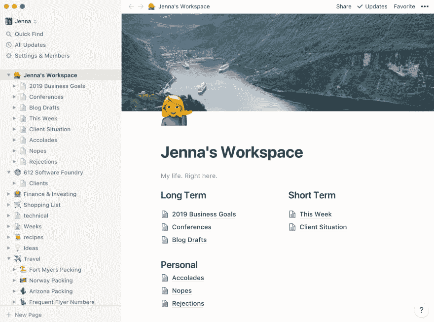

# 四周内从 Evernote 到 idea

> 原文：<https://dev.to/jennapederson/from-evernote-to-notion-in-four-weeks-5df0>

我用 Evernote 已经十年了。十年了。Evernote(结合一些其他工具)组织了我的整个生活。我用它来:

*   做会议笔记
*   通过 Alexa 和 IFTTT 自动化我的杂货/目标清单
*   收集客户特定的笔记和研究
*   保存食谱的照片，我的驾照和护照，以及 Skitch 截图
*   管理我的职业
*   经营多项业务
*   做我的商业规划
*   构建业务沟通模板
*   撰写博客文章草稿
*   收集想法
*   开始多本书(或者让我们现实一点...标题和大纲)
*   计划我的旅行
*   保存旅行打包清单
*   多了去了！

随着最近发生的一些组织变化和不太频繁的功能更新，以及无法真正以非 Evernote 格式导出我的数据，我一直在探索其他工具。

在过去的几年里，我也一直在记子弹日记，这是一个迫使我提前更有意识地计划我的日子的好方法。我没有使用 Evernote，而是使用了纸质笔记本(moleskine one [这里](https://www.amazon.com/gp/product/8883707222/ref=ppx_yo_dt_b_asin_title_o03_s00?ie=UTF8&psc=1))。我不一定想取代我的笔记本电脑，但我想知道我是否能更好地将这一过程融入我的数字生活。我刚创建了一个新笔记本，现在我需要访问上一个笔记本中的笔记。它被困在家里了。

在过去的 4 周里，我一直在探索[概念](https://www.notion.so/?r=fb43dcef55254b1bb764abc11bb56ef8)。在很大程度上，我喜欢它！我想知道有什么问题，我将会遇到什么(其他)挑战。有几件事我还没想好如何处理，还有几个怪癖我正在摸索。我仍然在使用免费版的概念，并等待升级，直到我最终决定切换。

注意:写这篇草稿的三个季度里，我达到了 1000 块的限制，不得不升级。我回到 Evernote 完成我的草稿，但 25 分钟后，我只是升级了概念，因为我很快就被惹恼了。

以下是我在过去四周所做的事情，我如何组织我的一些生活，以及迄今为止我对[观念](https://www.notion.so/?r=fb43dcef55254b1bb764abc11bb56ef8)的看法。

## 我是如何组织我的概念工作空间的

起初，当我看到“观念”时，我的目光变得呆滞。它有一些很棒的模板，但我不确定我需要什么，或者如何组织这一切。然后有人提到坐下来规划我的工作空间。就像我做新笔记本一样！这对我非常有帮助，也是我来到这里的原因。

与 Evernote 类似，我为每个客户都准备了一个笔记本或顶层页面，包括想法、技术笔记和指南、旅游、金融等。我的默认 Evernote 笔记本刚刚变成了一个垃圾场，所以在概念上，我已经把我的工作区变成了一个日常登陆区，用几个关键页面来保持我的注意力。其他所有内容都将放在顶级页面的下面。

### 我的工作区登陆页面是这样的

## 我如何使用这些页面

### 2019 年经营目标

这是我今年想在我的企业中做什么的登录页面。它本身可以是一篇博客文章，但它是按季度，然后按月来划分的，我在那里设定目标。我在这里跟踪它，并在每个季度和每年的结束时重温它。

### 会议

这是 CFP 及其截止日期的登录页面，列出了谈话想法和谈话草稿。

### 博客草稿

这是博客文章想法和草稿的登录页面。

### 本周

这个星期包含一个(或两个)每周焦点，个人，一般业务，和客户特定的待办事项列表，以及几个每日跟踪(膳食计划/跟踪等)。).

我每周要做的事情清单最好的部分是它们都在一个地方。它们曾经分散在 Trello 或 Asana 板上，在某种程度上，我仍然在那里记录工作项目，但我本周要做的事情住在这里，在一个地方。

### 客户端情况

我在这里记录我当前的客户情况，以及我有多少时间可以利用和为每个客户计划。这一点每周都在变化，所以这是一个很好的概述，我可以看到我需要开始计划更多的工作(或者更少，如果事情正在升级)。

### 赞誉

一张我为什么牛逼(我就是)的清单。这些是我的表扬，公众的认可，我从公园里弄出来的东西，当我的一天变得艰难或者我经历了一连串艰难的日子时的小提醒。当我需要与他人分享我的成就时，我也可以去那里抓一些来分享。

### Nopes

我拒绝过的一系列事情。我被允许说不，有时这对我来说超级难做到。我保留这个列表是为了提醒自己，如果我拒绝了另一个我知道不适合我的技术团队或客户项目中的女性，这没什么，世界也不会崩溃。

### 拒绝

这对我来说是一个新问题，但我想跟踪会议 CFP 的拒绝，并认为我也可以跟踪我被拒绝的所有事情。这是提醒自己被拒绝没关系，不完美也没关系的好方法。在大多数情况下，这可能只是意味着它不适合我。

## 我喜欢什么样的观念

*   一页又一页的嵌套。甚至更多的页面。实际上我不知道这里的极限，但是到目前为止我还没有达到。
*   一切都是概念中的一个模块——一段文字、一个要点、一张图片等等。区块的重新排列使得重新排列变得超级流畅。这一直是 Evernote 的难点。
*   嗯，是的，表情符号。它们照亮了我的一天，让我更容易识别特定的页面或页面类型(👯‍♀️像碧昂斯或✈️旅行)
*   我正在用我的手机写这篇文章。在手机上导航很棒，格式化和重新排列区块也很棒。
*   着陆空间。我大部分时间都花在我的主要工作区或本周页面上。
*   不同的文本和高亮颜色——超级容易应用，而不是默认的 Mac 颜色选择器，它看起来像一个蹩脚的蜡笔盒或色轮。至少现在我知道，如果我选择绿色，我每次都会得到相同的绿色，而不是树绿色、酸橙绿色和海绿色来表示“可以走了！”
*   能够公开共享页面(虽然我还没有使用过)
*   我可以从 Evernote 导入特定的笔记本和笔记，从 Asana 导入白板。一开始我每样都选了几个。还有对其他工具的支持。我认为这是我开始构思的关键。我可以从我已经建立的内容开始。
*   起初，我不喜欢底层页面没有按照修改日期自动排序。我喜欢随时可以看到我最近的变化。但我发现自己重新整理它们超级容易。例如，按日期对客户会议记录进行排序。我可以将它们命名为“☎️ 09-23-2019 -客户电话”，然后按照我自己的方式进行排序。然后在月末或年末，我可以将它们收集到自己的月或年顶级页面中。
*   对于我的一个用户工作区来说，一年中，year 的价格(48 美元)比 Evernote(69 美元)要低。我可以通过与我的朋友分享概念来获得免费积分。想注册并获得 10 美元的免费点数，同时也给我一些免费点数吗？[给你！](https://www.notion.so/?r=fb43dcef55254b1bb764abc11bb56ef8)

## 我不喜欢什么

*   我使用任务板来跟踪 CFP，但我不确定提醒功能是否正常工作。仍然需要在不太重要的事情上进行更多的测试。
*   不与 IFTTT 或 Zapier 集成。呃。这对我来说很难。我听说,[概念 API](https://www.notion.so/?r=fb43dcef55254b1bb764abc11bb56ef8) 已经“即将推出”几个月了。
*   我打字有些滞后，甚至当我在手机上打出来的时候也是滞后的。当我打字太快时，它死机了。在台式机上，在接听电话时，很难跟上会议笔记的进度。
*   我不喜欢不能(轻易地)一次查看多个页面。我觉得唯一的办法就是打开一个全新的观念窗口(CMD+SHIFT+n)，然后导航到我想查看的页面。我喜欢弹出式窗户。否则浏览器标签，但就我个人而言，我宁愿使用桌面应用程序。

## 我还在琢磨什么

*   我还没想好是用它来写子弹日记，还是只是改变我的过程(它可能需要一些充电)。
*   我仍然习惯于在旅途中(手机上)写一个快速笔记，然后不知道它在哪里，或者不得不在以后归档。
*   还在想怎么处理临时笔记。Evernote 的快速笔记非常棒，我只是用临时笔记填充它，这些临时笔记最终会落在某个地方或被删除。
*   我的购物清单现在完全是手动的，而在 Evernote 中，我可以像“Alexa 将胡萝卜添加到我的购物清单中”, IFTTT 会将它添加到我的 Evernote 购物清单中。
*   搜索。到目前为止，它是有效的，或者说我不需要它。但是在手机上使用 Evernote，这几乎是我使用它的唯一方式，所以我仍然需要在观念上解决这个问题，看看它是否能满足我的需求。

在我正式脱离 Evernote 之前，我很好奇其他人是如何使用 idea 来管理个人和工作笔记的。我错过了什么？什么对你不起作用？我需要注意什么？我怎样才能更进一步呢？再过十年，这个概念还会存在吗？Evernote 会再次提速吗？我想只有时间能证明一切。