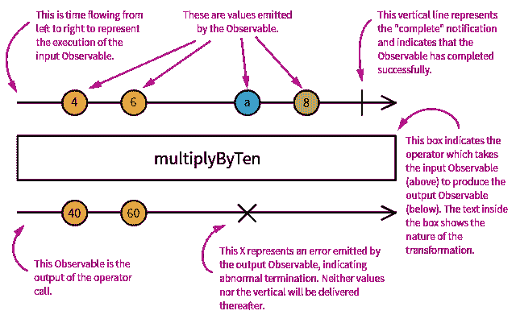
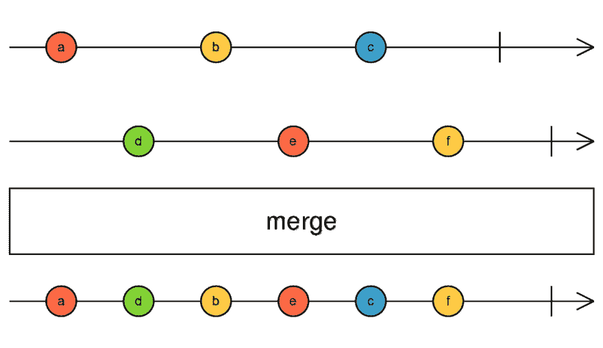
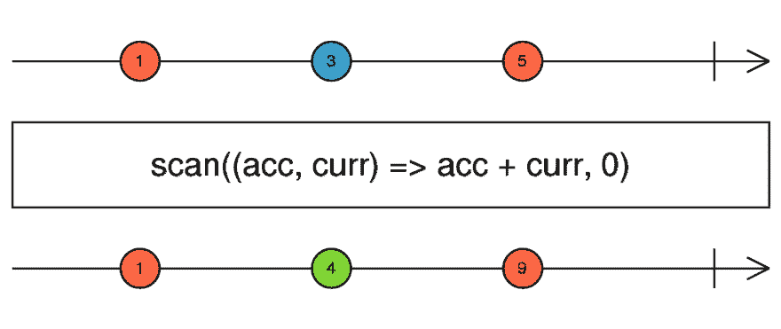

# 从承诺到观察

> 原文：<https://dev.to/rxjs/from-promises-to-observables-4bdk>

最近，我参加了在科罗拉多州丹佛市举行的 Angular Denver 会议。这是一次令人敬畏的经历，我带回家的最大收获之一是 RxJS 的力量。

在会议期间，我参加了由简-尼克拉斯·沃特曼和 T2 主持的 RxJS 研讨会。我以前在我的一些 Angular 项目中使用过 RxJS，但我想学习更多的基础知识，并真正理解这项技术是如何工作的。在研讨会期间，我学习了如何从流的角度思考，以及 RxJS 的基本原理是如何工作的。我还了解了高阶可观测量背后的概念，以及如何使用它们来提高应用程序的性能。

RxJS 给我留下了深刻的印象，以至于我回家后实际上使用 Observables 来提高我的网站上的一个页面的性能。

在这篇文章中，我将讲述我是如何使用 RxJS 来提高我的站点的性能的。具体来说，我将展示如何使用 RxJS 一次管理多个 HTTP 调用，以及这如何显著改善了我的用户体验。

我还将介绍一些基础知识，但我强烈推荐位于 [rxjs.dev](https://rxjs.dev) 的官方 RxJS 文档。

我创建了一个小角度应用程序来展示我所做的事情。可以在 [Stackblitz](https://stackblitz.com/edit/learning-rxjs-with-angular) 或者我的【GitHub repo([https://GitHub . com/andrewevans 0102/learning-rxjs-with-angular](https://github.com/andrewevans0102/learning-rxjs-with-angular))上查看。

这篇文章还假设你有 Angular 的工作知识。我将要展示的例子是传统的基于承诺的方法与使用 RxJS 的被动方法的比较。

## 祈使句 VS 陈述句

你经常在 RxJS 中看到的两个大词是**祈使句**和**陈述句**。

**命令式**指的是你要自己手动编写的代码。这是您专门编写的以特定方式执行的代码。对于同步任务来说，这是完美的，但是对于处理应用程序事件来说，这可能很麻烦。

**声明式**是指让 RxJS 替你做工作。基本上，通过利用库，您可以定义事件流。RxJS 使您能够使用**可观察值**和**操作符**为您完成工作，而不必专门构建处理不同事件的代码。

当我们阅读接下来的章节时，这一切都将变得更容易理解。我只是先介绍这些话题。

## 基础知识

RxJS 的核心是一个利用流来处理异步活动的库。RxJS 是一种通过预定义的行为和契约来处理代码中的事件的安全方式，这些行为和契约来自于**可观察对象**。

> 我知道我只是触及了这里的高点，但是为了更深入的解释，我强烈推荐位于 [rxjs.dev](https://rxjs.dev) 的文档。

RxJS 有[个可观测量](https://rxjs.dev/guide/observable)和[个操作符](https://rxjs.dev/guide/operators)。RxJS 还利用[主题](https://rxjs.dev/guide/subject)在您的应用程序中多播事件。

大多数人会通过可观物第一次接触 RxJS。一个可观测值通常看起来像这样:

```
import { Observable } from 'rxjs';

const observable = new Observable(function subscribe(subscriber) {
  try {
    subscriber.next(1);
    subscriber.complete();
  } catch (err) {
    subscriber.error(err);
  }
}); 
```

Enter fullscreen mode Exit fullscreen mode

如果您注意到有以下呼叫:

*   **下一个**
*   **完成**
*   **错误**

这些都是基于可观察的模型或合同。下一个处理流中的发射事件。 **Complete** 释放可观的资源，本质上结束流。**错误**将返回一个错误给任何有**订阅**的东西。

什么是订阅？RxJS 中的订阅是流执行的开始。一旦订阅开始，在**下一个**值中定义的任何内容都将被发出。当调用**完成**时，资源被释放，这个可观察的任务基本上完成了。

你也可以用**取消订阅**或**完成**来结束一个流。如果你使用**取消订阅**，你手动结束一个流，这意味着资源被释放，将不会有更多的事件。如果你使用 **complete** ，那么它将流标记为结束。要澄清的是，当想到**退订**和**完成**时只需记住:

*   **取消订阅**表示“流对新值不感兴趣”
*   **完成**表示“流结束”

当你看到**操作符**时，它们是静态函数，提供所有这些我们在**观察器**中看到的现成服务。操作员可能令人生畏，因为数量很大。然而，大多数都是围绕核心行为展开的。我强烈推荐我之前提到的与[扬-尼克拉斯·沃特曼](https://twitter.com/niklas_wortmann)和[迈克尔·赫拉迪克](https://twitter.com/Michael_Hladky)的研讨会，他们用他们所谓的“代数方法”对操作员进行了更深入的解释。

## 我的项目

在我的例子中，我将同时使用可观测量和运算符。

我想要解决的挑战是我的网站上的博客页面需要检索几个 RSS 提要。我最初用`promise.all()`方法对它进行编码，以接受所有对 RSS 提要的 HTTP 调用。这基本上是尝试并行运行所有的承诺，当请求完成时，我可以返回所有的数据。我的 API 端点中的代码如下所示:

```
const output = [];
// feed addresses to use in call to rss parser
let feedInput = [
  {
    sourceURL: 'https://medium.com/feed/@Andrew_Evans',
  },
  {
    sourceURL: 'https://rhythmandbinary.com/feed',
  },
  {
    sourceURL: 'https://dev.to/feed/andrewevans0102',
  },
];
const promises = [];
feedInput.forEach(feed => {
  // add all rss-parser calls as promises
  promises.push(
    parser
      .parseURL(feed.sourceURL)
      .then(response => {
        response.items.forEach(item => {
          let snippet = '';
          if (item.link.includes('dev.to')) {
            snippet = striptags(item['content']);
          } else {
            snippet = striptags(item['content:encoded']);
          }

          if (snippet !== undefined) {
            if (snippet.length > 200) {
              snippet = snippet.substring(0, 200);
            }
          }

          const outputItem = {
            sourceURL: feed.sourceURL,
            creator: item.creator,
            title: item.title,
            link: item.link,
            pubDate: item.pubDate,
            contentSnippet: snippet,
            categories: item.categories,
          };
          output.push(outputItem);
        });
      })
      .catch(error => console.log(error)),
  );
});

try {
  await Promise.all(promises);
} catch (error) {
  res.status(500).send(error);
} 
```

Enter fullscreen mode Exit fullscreen mode

如果您注意到这里的代码基本上包装了一组由`callRSS`函数调用的 URL。该函数只是使用 [rss 解析器](https://www.npmjs.com/package/rss-parser)来调用 rss 提要并解析值。这段代码如下所示:

这段代码带来的体验是(在 Angular 客户机中)我必须在页面上提供一个传统的微调器，直到所有的承诺完成。这实际上结束了几秒钟，不是最佳的。

在这个例子中，如果您转到`index.js`文件中的`functions`文件夹，您可以看到端点的代码包装了`traditional`端点中的承诺。

在同一个示例项目中，如果您转到`traditional` Angular 组件，您会看到客户端代码使用以下命令调用端点:

```
 async load() {
    // show spinner while fetching posts
    this.showSpinner = true;

    // retrieve the posts by calling the endpoint that uses promise.all for fetching
    // all of the rss feeds and waiting (synchronously) for them to complete
    this.posts = [];
    const response = await axios.get(environment.traditionalEndpoint);
    response.data.forEach((entry) => {
      const inputDate = new Date(entry.pubDate);
      entry.pubDate = inputDate.toLocaleDateString('en-us') + ' at ' + inputDate.toLocaleTimeString('en-us');

      this.posts.push({
        ...entry,
        sortDate: inputDate.getTime()
      });
    });
    this.posts = response.data;

    // retrieve the manual entries
    const manualEntries: any
      = await axios.get(environment.manualEntries);
    manualEntries.data.forEach((entry: any) => {
      const inputDate = new Date(entry.pubDate);
      entry.pubDate = inputDate.toLocaleDateString('en-us') + ' at ' + inputDate.toLocaleTimeString('en-us');
      if (entry.contentSnippet.length > 200) {
        entry.contentSnippet = entry.contentSnippet.substring(0, 200);
      }

      this.posts.push({
        ...entry,
        sortDate: inputDate.getTime()
      });
    });

    // sort by date here
    this.posts.sort((a: any, b: any) => {
      return b.sortDate - a.sortDate;
    });

    // stop showing spinner when fetch completes
    this.showSpinner = false;
  } 
```

Enter fullscreen mode Exit fullscreen mode

在这里，我创建了一个`load`方法，它使用 [axios](https://www.npmjs.com/package/axios) 进行 GET 调用来检索数据。我还为一组额外的手动条目调用一个端点。当两者都完成时，我停止显示微调。

## 输入 RxJS

因此，在我从 Angular Denver 的经历之后，我开始思考 RxJS 可以改善整个设置的方法。我真的不喜欢微调和几秒钟的等待时间，所以认为这是一个改善网站的好机会。

我决定，如果我能把 HTTP 调用分解成单独的流来处理，这将会有所帮助。然后，用户会立即在他们的页面上看到结果，并且会随着呼叫的完成而更新。因为这只是几秒钟的事情，所以这不会让页面跳得太多，而且会让网站感觉反应很快。

> 我应该注意到，通常对于前端工程来说，你不希望页面跳转。在这种情况下，这只是几秒钟的事情，而我构建流的方式使它几乎不明显。对我来说，更重要的是立即显示输出。在更大的应用程序中，这种方法可能需要重新设计以获得更好的体验。

我将 HTTP 调用重构为在一个端点中完成。如果您查看示例项目，您可以在 functions/index.js 文件中看到这个[。](https://github.com/andrewevans0102/learning-rxjs-with-angular/blob/master/functions/index.js)

这里的代码非常简单，基于“source”参数调用匹配的 RSS 提要。结果是从 HTTP 调用中收集的，并在输出值中返回。

现在对于 RxJS 实现，我将对这个端点的每个 HTTP 调用包装在一个单独的可观察对象中。这使得每个 HTTP 调用能够同时开始。一旦各个 HTTP 调用完成，它们的响应就会显示在页面上。

```
 load() {
    const medium =
      this.http.get(environment.reactiveEndpoint + '/medium')
      .pipe(
        catchError(err => {
          throw 'error in source observable. Message: ' + err.message;
        })
      );

    const wordpress =
      this.http.get(environment.reactiveEndpoint + '/wordpress')
      .pipe(
        catchError(err => {
          throw 'error in source observable. Message: ' + err.message;
        })
      );

    const devto =
      this.http.get(environment.reactiveEndpoint + '/devto')
      .pipe(
        catchError(err => {
          throw 'error in source observable. Message: ' + err.message;
        })
      );

    const manualEntries =
      this.http.get(environment.manualEntries)
      .pipe(
        catchError(err => {
          throw 'error in source observable. Message: ' + err.message;
        })
      );

    this.posts$ =
      merge(medium, wordpress, devto, manualEntries)
        .pipe(
          scan((output: Post[], response: []) => {
            response.forEach((post: Post) => {
              const inputDate = new Date(post.pubDate);
              post.pubDate = inputDate.toLocaleDateString('en-us') + ' at ' + inputDate.toLocaleTimeString('en-us');
              post.sortDate = inputDate.getTime();

              if (post.sourceURL === 'https://blog.angularindepth.com/feed') {
                post.sourceURL = 'Angular-In-Depth';
              } else if (post.sourceURL === 'https://itnext.io/feed') {
                post.sourceURL = 'ITNext';
              } else if (post.sourceURL === 'https://medium.com/feed/@Andrew_Evans') {
                post.sourceURL = 'Medium';
              } else if (post.sourceURL === 'https://rhythmandbinary.com/feed') {
                post.sourceURL = 'Rhythm and Binary';
              } else if (post.sourceURL === 'https://dev.to/feed/andrewevans0102') {
                post.sourceURL = 'DEV.TO';
              }
              output.push(post);
            })

            output.sort((a: any, b: any) => {
              return b.sortDate - a.sortDate;
            });

            return output;
        }, []),
        catchError(err => {
          throw 'error in source observable. Message: ' + err.message;
        }),
        takeUntil(this.unsubscribe)
      );
  } 
```

Enter fullscreen mode Exit fullscreen mode

这里我利用 Angular 的 [HttpClient](https://angular.io/guide/http) 将 HTTP 调用封装在一个可观察对象中。

然后，我使用 [merge](https://rxjs.dev/api/index/function/merge) 操作符来订阅所有的 HttpClient 调用，并将它们组合成一个输出。

然后, [scan](https://rxjs.dev/api/operators/scan) 操作符获取合并的可观测量，并将响应附加到一个公共输出中。

我包含了 [catchError](https://rxjs.dev/api/operators/catchError) 操作符来处理流中的任何错误，如果其中一个调用失败等等。

我还使用**管道**将一个可观察对象的输出传递给另一个可观察对象。这是 RxJS 的常见模式。

传入**管道**的最后一个操作符也引用了一个 [takeUntil](https://rxjs.dev/api/operators/takeUntil) 操作符。这是一个非常强大的 RxJS 操作符，它将根据您传入的事件取消订阅一个可观察对象。在这里，我创建了一个[主题](https://rxjs.dev/guide/subject)，它在代码运行结束时处理取消订阅这个主可观察对象。在处理可观测量时，这是一种相当常见的模式。RxJS **subjects** 也可以用于组播和做可观察的类似动作。我在这里使用它是因为它提供了我想要的行为，并通过一个简单的`unsubscribe`调用清除资源。如果我不这样做，可能会导致`memory leaks`并可能冻结我的浏览器会话。您可以在`reactive`组件的`clear`方法中看到这种行为:

```
 clear() {
    this.unsubscribe.next();
    this.unsubscribe.complete();
    this.posts$ = null;
  } 
```

Enter fullscreen mode Exit fullscreen mode

还要注意我做了可观察的`null`。这不是必须的，但是对于基本的示例应用程序，我想直观地显示数据在调用`clear`时消失。

> 作为一个免责声明，还有 100 多种其他方法来处理相同类型的事件。其他的实现包括使用来自的**来兑现承诺，使用`fetch` API 的**来自 Fetch** ，或者甚至使用`rxjs`的 ajax 实现。我选择这里的实现是因为它容易理解，而且我对输出很满意。RxJS 非常灵活，让您能够用(几乎)任何行为来控制流。**

你可以在我的项目中的`reactive` Angular 组件中看到这段代码。

`load`方法进行订阅并启动流。

`clear`方法停止流并清除屏幕上显示的数组。

## 大理石图

我在这里写的代码产生了一种对我进行的 RSS 调用的流方法。这使得我的应用程序响应更快，当应用程序等待响应时，我不需要显示微调器。

为了理解这种行为，有一个基本的大理石图可能会有所帮助。弹球图是图形化表示 RxJS 行为的好方法。

这里有一个大理石图解释说:

[](https://res.cloudinary.com/practicaldev/image/fetch/s--pZbKkX2D--/c_limit%2Cf_auto%2Cfl_progressive%2Cq_auto%2Cw_880/https://raw.githubusercontent.com/rxjs-blog/blog/master/blog-posts/from-promises-to-observables/assets/marble-diagram-anatomy.svg)

以下是 RxJS 文档中的`merge`大理石图副本:

[](https://res.cloudinary.com/practicaldev/image/fetch/s--z5BlcDrf--/c_limit%2Cf_auto%2Cfl_progressive%2Cq_auto%2Cw_880/https://raw.githubusercontent.com/rxjs-blog/blog/master/blog-posts/from-promises-to-observables/assets/merge.png)

以下是 RxJS 文档中的`scan`大理石图副本:

[](https://res.cloudinary.com/practicaldev/image/fetch/s--y-SWOKog--/c_limit%2Cf_auto%2Cfl_progressive%2Cq_auto%2Cw_880/https://raw.githubusercontent.com/rxjs-blog/blog/master/blog-posts/from-promises-to-observables/assets/scan.png)

要了解所有这些，请看我在 stackblitz 中的应用程序。申请流程非常直观。`traditional`选项卡以传统(命令式)方式进行 HTTP 调用，而`reactive`选项卡使用我已经讨论过的 RxJS 观察器和操作符进行 HTTP 调用。

[https://stackblitz.com/edit/learning-rxjs-with-angular?embed=1&&](https://stackblitz.com/edit/learning-rxjs-with-angular?embed=1&&)

## 关闭思绪

所以在这里，我介绍了一些 RxJS 概念，并展示了一个工作示例。

我已经展示了如何用 RxJS 把你的项目从使用承诺变成可观察的。

反应式扩展是传统软件开发中的一大转变。流使我们的应用程序响应更快，实际上也更容易构建。

我推荐查看 RxJS 文档和我的示例项目以获得更多信息。

希望你喜欢我的帖子！请在推特上留下评论并与我联系，地址是 [@AndrewEvans0102](https://twitter.com/AndrewEvans0102) 和 [andrewevans.dev](https://www.andrewevans.dev) 。