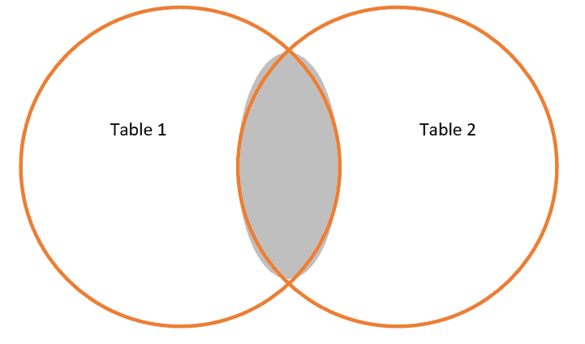

# 从编剧到程序员——学习之旅

> 原文：<https://dev.to/jeastham1993/from-scripter-to-programmer-a-learning-journey-5gih>

编写和理解软件是困难的。虽然与学习一门新语言不太相似，但成为一名优秀的开发人员肯定是一个漫长的过程。语法、措辞、“最佳实践”、性能、可扩展性……有很多东西需要考虑。这还是在你开始遵循好的设计原则之前。

对于我的第一篇文章，这是我想开始的地方。从我如何进入代码(我做过的最好的决定之一)和我遵循的开发路径，对我自己的旅程进行了一点深入的探讨。

# 一开始，有支持

我的 IT 生涯始于一线支持角色，支持运行在 SQL 后端的基于. NET windows 的应用程序。这是完全免费的开发，我进入这个角色时没有任何开发经验。

事实上，我被大学录取学习航空工程，在此之前，我想成为英国皇家空军的一名飞行员。这个梦想破灭了，但另一种激情很快又出现了。

我很快意识到，调试我在支持中遇到的 90%的问题的最简单的方法是直接在数据库中。在另一位精通技术的支持团队成员的帮助下，MS SQL 成了我调试的实际选择。现在，连接又是如何工作的…

内部连接返回在两个表中都匹配的记录——如果你感兴趣的话,
引导我走上了 SSRS/SSIS 之路，我转到了公司数据和报告团队。从那以后，我的高级 SQL 和性能调优技能继续发展，我也开始通过 SSIS 脚本学习一点 C#。

现在回想起来，这可能是我作为开发人员职业生涯中最大的失败之一；在 SSIS 写代码通常是纯粹用于操作数据的基本脚本。这完全是程序性的。

# 接着是 web 表单

当我在短暂的(如果你能把 12 个月算作短暂的休假的话)后转到下一份工作时，我的旅程转向了 web 开发。我加入的公司使用 ABBYY Flexicapture OCR 解决方案实施了业务自动化解决方案。这样，就有了大量的数据库管理(hello SQL)和围绕 OCR 软件本身的工具构建。

Web 表单很有趣，但是 MVC 让我对 web 应用产生了真正的兴趣。能够在编写 C#代码的同时编写原始 HTML 非常棒，整个模型视图控制器系统在我的脑海中有了很大的意义。

也就是说，我仍然讨厌网页设计。HTML 和 CSS 成了我一生的克星。

回顾我写的一些代码，它仍然是非常程序化的。除了使用对象存储数据，我没有真正遵循任何面向对象的编程实践。

我已经开始学习分层应用实践——前端、业务逻辑和数据层，并试图尽可能地将它们分离。回头看看一些代码，还有很多东西需要学习。

# 又一个公休假

在经历了 6 个月不同的旅程后(事实证明这种背包旅行的说辞其实挺有趣的)，我又换了家公司。这一次，敬一家创业公司。没有现有的代码，没有预先存在的策略，没有旧的遗留代码…一张白纸。

这仅仅是 12 个月前的事，在这段时间里，作为一名开发人员，我比过去 6 年中的任何一年都进步得多。

## 但是什么变了？

我开始对知识积累产生了更大的兴趣。以前，我经常使用堆栈溢出，只查找我当时需要知道的内容，然后立即忘记。没有“如何”编写代码的概念。

我的旅程带我看了大量的书。从基本的编程原则(实用的面向对象设计:使用 Ruby 的敏捷入门)一直到设计最佳实践(领域驱动设计:解决软件核心的复杂性)。

我追随播客(没有教条是我的最爱)，我追随。NET core 发行说明，我关心性能，我尽量遵循坚实的原则。

我甚至开始扩展自己，超越那种舒适的空白。网络堆栈。成为这个月的流行时尚。

我关心单元测试。CI/CD 和自动化管道几乎消除了我所有的“糟糕，我忘了在部署时复制文件 X”。在此基础上添加一个奇妙的分支和合并策略，我发布的任何版本现在几乎都是无缝的。

甚至不要让我开始使用 Docker、Kubernetes 和基于微服务的架构。这两个工具加上在巨型独石上构建小型微服务让我的工作效率大大提高了。它还有一个额外的好处，就是让我们的许多内部工具变得更加可重复。

# 那么外卖是什么？

我总是喜欢写一些文章，给人们一些启示和可行的建议。

虽然这篇文章深入探讨了我的个人经历，但我认为仍然有一个关键的收获。

绝不和解！永远精益求精！一旦你认为你是完美的，你就失败了！

当今科技发展速度如此之快。在 12 个月的时间里，谁知道人们会使用什么语言/部署策略。

Span 是最近几个月最大的发展之一，以我以前的发展方式，我可能会完全错过。现在，它已经成为我开发工具包的一个重要部分。

此外，了解 C# 8 即将推出的特性并能够马上测试它们是非常棒的。可空引用类型是我在特性方面的绝对选择。

有太多的东西需要学习，有太多的最佳实践，有太多不同的方法来实现软件中的相同目标。我在这个博客中试图描绘的是我自己的学习之旅。我的很多代码可能并不完美，或者说不是性能最好的(如果你看到任何狗屎，请评论)。但是我仍然在一个旅程中，一个成为更好的开发者的旅程。

就这样，我今天就到此为止了。

詹姆斯