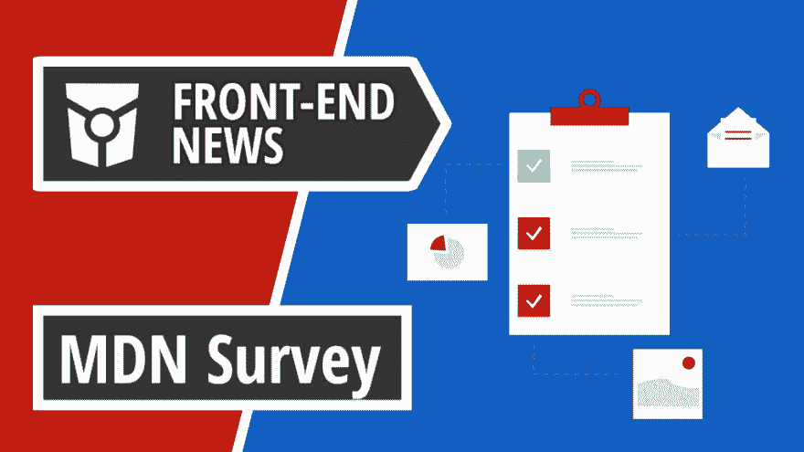
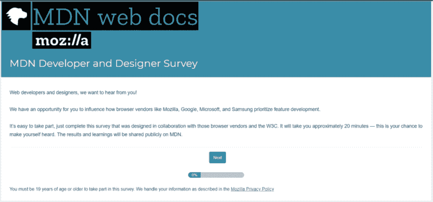

# 前端新闻#10: MDN 调查、View Source Conference 2019 和针对安全漏洞的更大奖励

> 原文：<https://dev.to/adriansandu/front-end-news-10-mdn-survey-view-source-conference-2019-and-bigger-rewards-for-security-bugs-4oem>

<figure> 

<figcaption>在 YouTube 上查看[https://youtu.be/wrM1pHm3-uY](https://youtu.be/wrM1pHm3-uY)</figcaption>

</figure>

大家好，欢迎收看新一轮的前端新闻。这是我今天为你们准备的:

*   Mozilla 发起首次开发者和设计者调查
*   View Source Conference 2019 门票现已发售
*   谷歌为发现安全漏洞提供更高的奖励

还有两个软件更新值得一提，还有一个全新的本周开发者。所以请陪我到最后，找出所有的细节。说了这么多，我们开始吧！

一如既往，我也为那些喜欢听而不是读的人准备了视频版本。如果你喜欢这种格式，如果你也能订阅 YouTube 频道，我将不胜感激。

[https://www.youtube.com/embed/wrM1pHm3-uY](https://www.youtube.com/embed/wrM1pHm3-uY)

### MDN 开发商和设计师调查

Mozilla 正在举行首次开发者和设计者调查。这是一个与所有其他主要浏览器供应商的联合项目，如谷歌、微软和三星。

该调查将是一项年度活动，有多个目标。首先是理解设计者和开发者的需求。第二个是根据这些需求帮助确定新特性开发的优先级。最后，但同样重要的是，它将建立一个基线读数，以评估社区的需求如何随着时间的推移而变化。

<figure> 

<figcaption>参加 [的调查 https://qsurvey . Mozilla . com/S3/Developer-Needs-Assessment-2019](https://qsurvey.mozilla.com/s3/Developer-Needs-Assessment-2019)</figcaption>

</figure>

这是你让浏览器供应商听到你的声音的机会。完成调查只需 20 分钟，调查结果及其解释将在 MDN 门户网站上发布。

来源和参考资料:

*   [https://hacks . Mozilla . org/2019/07/MDN-we B- developer-designer-survey/](https://hacks.mozilla.org/2019/07/mdn-web-developer-designer-survey/)
*   [https://qsurvey . Mozilla . com/S3/Developer-Needs-Assessment-2019](https://qsurvey.mozilla.com/s3/Developer-Needs-Assessment-2019)

### 获取 2019 年 View Source 大会门票

今天的第二个话题也与 Mozilla 和其他浏览器厂商有关。从本周开始，您可以购买 2019 年版 View Source 会议的门票。

这是一个为期两天的活动，将于 2019 年 9 月 30 日和 10 月 1 日在阿姆斯特丹举行。该会议由 Mozilla 与 Google、Microsoft、Samsung 和 W3C 共同组织，旨在提供创建 web 标准过程的内部视图，以及浏览器供应商如何实施这些标准。

完整的时间表和门票可从活动网站获取，网址为[https://2019.viewsourceconf.org](https://2019.viewsourceconf.org)

### 谷歌为发现安全漏洞提供更高的奖励

早在 2010 年，谷歌就发起了 Chrome 漏洞奖励计划，为发现和报告安全漏洞的研究人员提供现金奖励。到目前为止，该计划已经收到了 8500 多份报告，并支付了 500 多万美元！

<figure> 

<figcaption>插图承蒙[https://undraw.co](https://undraw.co)</figcaption>

</figure>

现在赌注变得更高了，因为谷歌提高了奖励水平。差很多。您现在可以获得比基准奖励多三倍的奖励，从 5000 美元到 15000 美元不等。高质量的报告现在可以获得 3 万美元，而不是以前的 1.5 万美元。

所有这些都伴随着一套新的程序规则，这样任何要求获得其中一个奖项的人都可以适当地记录他们的报告。更多细节可以在谷歌在线安全博客上找到。

来源:

*   [https://security . Google blog . com/2019/07/bigger-rewards-for-security-bugs . html](https://security.googleblog.com/2019/07/bigger-rewards-for-security-bugs.html)

### 软件更新和发布

今天，我有两个软件通知部分的项目。

**1。TypeScript 3.6 测试版**

该测试版旨在成为 TypeScript 3.6 的功能完整版本。接下来的几周将致力于修复错误，提高性能和稳定性，并发布最终版本。更多的细节可以在微软开发者博客上找到。

*   [https://dev blogs . Microsoft . com/typescript/announcing-typescript-3-6-beta/](https://devblogs.microsoft.com/typescript/announcing-typescript-3-6-beta/)

**2。外框架 5.0.0**

Exoframe 是一个自托管工具，允许使用 Docker 进行简单的单命令部署。下面的链接是 GitHub 上的项目页面和 Tim Ermilov 关于如何使用 Exoframe 最新版本中打包的功能的非常好的指南。

*   [https://dev . to/yama light/exo frame-V5-0-simpling-js-function-deployments-46l 7](https://dev.to/yamalight/exoframe-v5-0-simplifying-js-function-deployments-46l7)
*   [https://github.com/exoframejs/exoframe](https://github.com/exoframejs/exoframe)

### 本周新开发者

我们的第二位开发者是珍·西蒙斯。Jen 是 Mozilla 的一名设计师和开发人员，她倡导 web 标准并研究即将到来的 web 图形设计革命。她也是 CSS 工作组的成员，她喜欢教授 CSS Grid 如何改变我们在 web 上的布局。

Jen 曾在许多活动和会议上发言，包括一个单独的活动、SXSW、Fluent、Generate、Web 设计的未来和 Respond 等等。她在 Twitter 上非常活跃，她也有一个非常有教育意义的 YouTube 频道，名为 Layout Land。你应该在两个地方都跟着她。

> Jen Simmons[@ Jen Simmons](https://dev.to/jensimmons)如果你喜欢我在网上教 CSS 和平面设计的一个视频，你可能会喜欢这些其他的:[YouTube.com/LayoutLand](https://t.co/C34eKHkSEs)下午 12:13-2019 年 4 月 25 日53

谢谢你，Jen，你太棒了，继续努力吧！

*   [https://jensimmons.com/](https://jensimmons.com/)
*   [https://twitter.com/jensimmons](https://twitter.com/jensimmons)
*   [https://www.youtube.com/channel/UC7TizprGknbDalbHplROtag](https://www.youtube.com/channel/UC7TizprGknbDalbHplROtag)

### 今日问题

在我们新的“本周开发者”栏目中，你希望看到的下一个人是谁？请在评论区或在[https://twitter.com/frontendnexus.](https://twitter.com/frontendnexus.)上留下你的建议

这一版就这么多了。在 https://twitter.com/frontendnexus[的 Twitter 上关注 Front End Nexus](https://twitter.com/frontendnexus)，一旦有新的更新，我们将立即通知您。我还想鼓励你在 https://www.youtube.com/channel/UCgACtqiDmnSaskDIBsK54ww[的](https://www.youtube.com/channel/UCgACtqiDmnSaskDIBsK54ww)订阅 YouTube 频道。一旦该频道达到 100 名订户，我可以解锁更多的选项，因此非常感谢您的支持。

祝您度过愉快而富有成效的一周，我们下次再见！

* * *