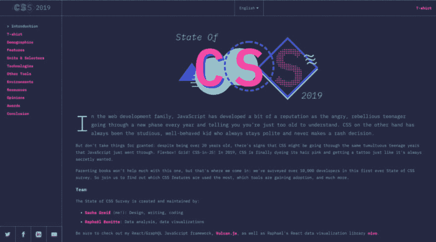
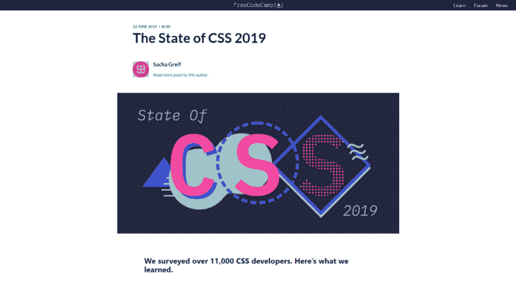
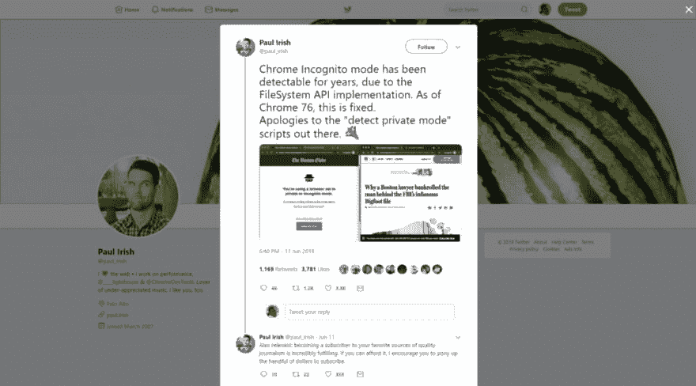

# 前端新闻# 5:CSS 2019 的状态，火狐生活品牌和 Chrome 隐姓埋名不再检测

> 原文：<https://dev.to/adriansandu/front-end-news-5-state-of-css-2019-firefox-living-brand-and-chrome-incognito-no-longer-detected-56cc>

大家好，欢迎来到另一个版本的前端新闻，这是唯一一个为您带来行业最新事件信息的节目。

让我们看看这周我为你准备了什么:

*   “2019 年 CSS 状况”调查的结果现已发布
*   火狐获得了一个闪亮的新品牌
*   铬隐姓埋名模式不再是可检测的

比往常少一点，但这是平静的一周。没有大的停机，没有大的发布，也没有大的丑闻…只是办公室里正常的一周。

就像上次一样，我也为那些喜欢听而不是读的人准备了一个视频版本。如果你喜欢这种格式，如果你也能订阅 YouTube 频道，我将不胜感激。

[https://www.youtube.com/embed/azmbxf1-PxM](https://www.youtube.com/embed/azmbxf1-PxM)

### CSS 2019 结果状态正在直播

你可能不知道 Sacha Greif 是谁，但很有可能，你完成了她在过去三年中创建的“JS 状态”调查之一。今年，她决定通过创建另一个以 CSS 为重点的调查来拓展这个领域。来自 135 个国家的 11，000 多名开发人员响应了号召。花了几个月的时间来分析数据和创建结果的可视化模型。现在等待终于结束了。

<figure> 

<figcaption>来源:[https://2019.stateofcss.com/](https://2019.stateofcss.com/)</figcaption>

</figure>

Sacha 在官方网站上对结果进行了非常深入的分析，互动图表是一种探索的乐趣。但她也在一篇关于 FreeCodeCamp.org 的文章中展示了一些亮点。

<figure> 

<figcaption>来源:[https://www . freecodecamp . org/news/the-state-of-CSS-2019-survey-results-are-live/](https://www.freecodecamp.org/news/the-state-of-css-2019-survey-results-are-live/)</figcaption>

</figure>

这些亮点如下:

*   Flexbox 是当前创建布局的领导者，Grid 后来居上。
*   每个人都知道 Bootstrap，但大多数开发人员对它不再感兴趣，并已转向其他领域。比如顺风、布尔玛或 PureCSS，它们也占据了“满意度类别”的前三名
*   在 CSS 世界中只有三个项目是“确定的”:BEM、Sass 和 Bootstrap。Bootstrap 正在衰落。其他一切都处于不断变化的状态，可能会带来意想不到的结果。

底线—我引用结果末尾的结论:

> 虽然 JavaScript 不会走向任何地方，但 CSS 也肯定不会很快被取代。CSS 变得越强大，掌握它就越有价值。

阿门！

### 火狐浏览器的新外观

<figure> 

<figcaption>来源:[https://blog . Mozilla . org/open design/Firefox-the-evolution-of-a-brand/](https://blog.mozilla.org/opendesign/firefox-the-evolution-of-a-brand/)</figcaption>

</figure>

我在上一集提到 Mozilla 对 Firefox 有很大的计划。本周，该公司在官方博客上发布了一则新公告。

作为扩大 Firefox 品牌下可用产品套件的一部分，Mozilla 不得不重新思考浏览器的形象。作为这一过程的一部分，Firefox 被提升为一个活品牌。它将随着时间的推移继续发展，以覆盖和集成当前和未来的产品。

<figure> 

<figcaption>来源:[https://blog . Mozilla . org/open design/Firefox-the-evolution-of-a-brand/](https://blog.mozilla.org/opendesign/firefox-the-evolution-of-a-brand/)</figcaption>

</figure>

关于这一举措，意见不一。有些人喜欢它。有些没有。有些人完全讨厌它。我们必须等着看事情会如何发展。

我盯着你呢，狐狸！

### 铬隐姓埋名模式不再可检测

从事 Lighthouse 和谷歌 Chrome 开发的谷歌开发人员之一保罗·爱尔兰(Paul Irish)在 Twitter 上宣布，Chrome 76 将推出一个补丁，使隐身模式不再被检测到。

到目前为止，网站可以检测访问者是否在私人或匿名模式下使用 Chrome 来检查对文件系统 API 的支持。一些主要的门户网站如《纽约时报》或《波士顿环球报》正在使用这样的脚本来阻止人们绕过他们的付费墙。这次更新会引起什么变化？我们只能等着瞧了。

### 今日问题

你是火狐用户吗？你对最新的品牌更新有什么看法？请在下面的评论区告诉我们。

这一版就这么多了。在 https://twitter.com/frontendnexus[的 Twitter 上关注 Front End Nexus](https://twitter.com/frontendnexus)，一旦有新的更新，我们将立即通知您。我还想鼓励你在 https://www.youtube.com/channel/UCgACtqiDmnSaskDIBsK54ww[的](https://www.youtube.com/channel/UCgACtqiDmnSaskDIBsK54ww)订阅 YouTube 频道。一旦该频道达到 100 名订户，我可以解锁更多的选项，因此非常感谢您的支持。

祝您度过愉快而富有成效的一周，我们下次再见！

* * *